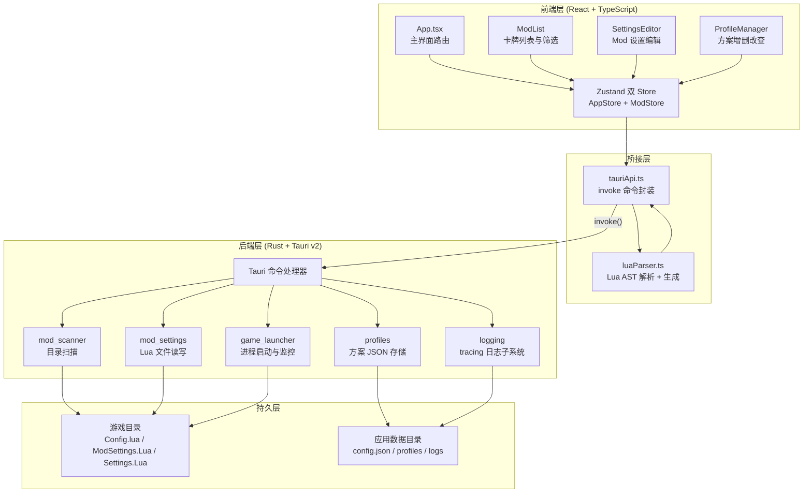
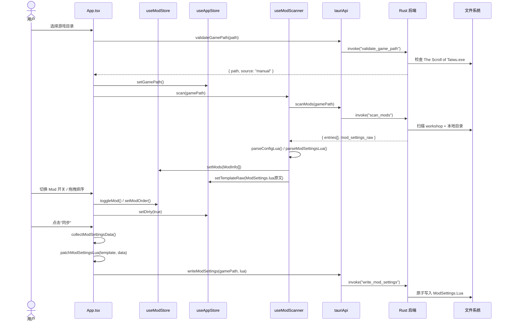

**TWModLauncher** 是一款基于 Tauri v2 构建的《太吾绘卷》Mod 管理桌面工具。它通过 Rust 后端处理文件扫描与进程管理，React 前端提供交互界面，帮助玩家在图形化界面中完成 Mod 的发现、启用、排序、配置编辑与方案管理，无需手动编辑 Lua 配置文件。

Sources: [README.md](README.md#L1-L10)

## 核心功能矩阵

TWModLauncher 围绕 Mod 的完整生命周期设计，覆盖从发现到运行的全流程操作：

| 功能分类 | 具体能力 | 对应页面 |
|---------|---------|---------|
| **Mod 扫描** | 自动识别 Steam 创意工坊订阅和本地 Mod，解析 Config.lua 中的元数据与设置定义 | [Rust 端 Mod 目录扫描](8-rust-duan-mod-mu-lu-sao-miao-workshop-yu-ben-di-shuang-yuan-jie-gou) |
| **启用/禁用** | 开关即时切换，内容落盘到 `ModSettings.Lua`，游戏内直接生效 | [ModSettings.Lua 的格式保留式补丁](10-modsettings-lua-de-ge-shi-bao-liu-shi-bu-ding-patchmodsettingslua) |
| **设置编辑** | 支持 Toggle / Slider / Dropdown 三种控件，修改每个 Mod 的 `Settings.Lua` | [SettingsEditor 分组导航与表单控件](16-settingseditor-fen-zu-dao-hang-yu-toggle-slider-dropdown-biao-dan-kong-jian) |
| **方案管理** | 保存/加载多套 Mod 组合，支持导入导出实现跨环境迁移 | [Profile 数据结构](18-profile-shu-ju-jie-gou-ban-ben-hua-json-fang-an-yu-mod-que-shi-jian-ce) |
| **分类筛选** | 工坊/本地 × 正常/残留多条件过滤，结合 Fuse.js 模糊搜索 | [筛选系统](14-shai-xuan-xi-tong-fuse-js-mo-hu-sou-suo-fen-lei-biao-qian-qi-yong-zhuang-tai-duo-tiao-jian-guo-lu) |
| **拖拽管理** | 三套拖拽系统：卡片排序、分组头部排序、创建分组 | [三套拖拽系统](13-san-tao-tuo-zhuai-xi-tong-qia-pian-tuo-zhuai-fen-zu-tou-bu-tuo-zhuai-yu-fen-zu-chuang-jian-tuo-zhuai) |
| **游戏启动** | 内置本地启动与 Steam 启动双通道，运行状态实时检测 | [游戏启动与进程监控](20-you-xi-qi-dong-yu-jin-cheng-jian-kong-pid-lun-xun-tauri-shi-jian-tui-song) |
| **数据安全** | 原子写入、自动备份、崩溃日志保护等多重保障 | [原子写入策略](25-yuan-zi-xie-ru-ce-lue-lin-shi-wen-jian-zhong-ming-ming-xie-ru-yan-zheng-zi-dong-bei-fen) |

Sources: [README.md](README.md#L5-L14) | [package.json](package.json#L12-L23)

## 系统架构概览

TWModLauncher 采用 Tauri v2 双端架构：Rust 后端负责所有文件 I/O、进程管理和系统级操作，React 前端负责 UI 渲染、状态管理与用户交互。两端通过 Tauri 的 `invoke` 命令机制进行通信。



Source: [src-tauri/src/lib.rs](src-tauri/src/lib.rs#L1-L55) | [src/App.tsx](src/App.tsx#L1-L38)

**架构关键决策说明**：

- **Lua 解析为什么在前端而不是 Rust？** 项目使用 `luaparse`（JavaScript 的 Lua AST 解析库）在浏览器环境中解析 Config.lua 和 ModSettings.Lua。这是因为 Lua 解析涉及复杂的语法树操作和代码生成，JavaScript 生态中已有成熟库，而 Rust 生态中 Lua AST 操作库不够完善。Rust 后端仅负责文件的原始读写，将字符串内容传给前端处理。

- **为什么用两个 Zustand Store？** `AppStore` 管理全局应用状态（游戏路径、脏标记、分组），`ModStore` 管理 Mod 列表状态（扫描结果、选中、拖动排序）。职责分离避免了单一巨型 Store 的耦合问题，且各自有独立的更新粒度。

Sources: [src/lib/luaParser.ts](src/lib/luaParser.ts#L1) | [src/store/useAppStore.ts](src/store/useAppStore.ts#L1-L8) | [src/store/useModStore.ts](src/store/useModStore.ts#L1-L3)

## 核心数据流

用户的操作通过以下主流程驱动：



Source: [src/hooks/useModScanner.ts](src/hooks/useModScanner.ts#L120-L155) | [src/App.tsx](src/App.tsx#L84-L106) | [src/App.tsx](src/App.tsx#L310-L360)

这个流程的核心设计理念是**延迟落盘 + 批量同步**：所有内存修改（开关、排序、设置）只标记脏状态，用户点击"同步"时一次性生成完整的 ModSettings.Lua 内容，通过原子写入策略安全落盘。这不仅减少了磁盘 I/O，也为用户提供了"修改 → 确认 → 提交"的安全操作模式。

Sources: [src/store/useAppStore.ts](src/store/useAppStore.ts#L64-L66) | [src/App.tsx](src/App.tsx#L310-L360)

## 项目结构

```
twm-launcher/
├── src/                          # 前端源代码
│   ├── main.tsx                  # React 入口，挂载根组件
│   ├── App.tsx                   # 主界面：路径选择 → Mod 列表 ⇄ 设置编辑
│   ├── index.css                 # Tailwind CSS 入口
│   │
│   ├── components/
│   │   ├── ErrorBoundary.tsx     # 全局异常边界，防止白屏
│   │   ├── ModList/              # Mod 列表组件（卡牌、筛选栏、拖拽）
│   │   │   ├── ModList.tsx       #   列表容器，加载更多 + 渲染模型
│   │   │   ├── ModCard.tsx       #   Mod 卡牌组件
│   │   │   ├── ModFilterBar.tsx  #   筛选栏（搜索 + 分类筛选）
│   │   │   ├── ModGroupHeader.tsx#   分组头部（折叠/展开/重命名）
│   │   │   ├── ContextMenu.tsx   #   通用右键菜单
│   │   │   ├── ModContextMenu.tsx#   单 Mod 右键菜单
│   │   │   ├── MultiContextMenu.tsx# 多选右键菜单
│   │   │   ├── GroupContextMenu.tsx# 分组右键菜单
│   │   │   ├── useCardDrag.ts    #   卡片拖拽逻辑
│   │   │   ├── useGroupHeaderDrag.ts#分组头部拖拽逻辑
│   │   │   ├── useGroupCreateDrag.ts#分组创建拖拽逻辑
│   │   │   ├── useModListState.ts#   列表状态（排序、分页）
│   │   │   └── utils.ts          #   渲染工具函数
│   │   ├── SettingsEditor/       # Mod 设置编辑组件
│   │   │   ├── SettingsEditor.tsx#   分组导航 + 表单面板
│   │   │   └── SettingField.tsx  #   Toggle / Slider / Dropdown 控件
│   │   └── ProfileManager/       # 方案管理组件
│   │       ├── ProfileManager.tsx#   方案列表 + 增删改查
│   │       └── MissingModsDialog.tsx# Mod 缺失检测弹窗
│   │
│   ├── hooks/
│   │   └── useModScanner.ts      # 扫描 Hook（初始扫描 + 增量刷新）
│   │
│   ├── lib/
│   │   ├── types.ts              # 全部 TypeScript 类型定义
│   │   ├── tauriApi.ts           # Tauri invoke 命令封装
│   │   ├── luaParser.ts          # Lua AST 解析（Config / ModSettings / Settings）
│   │   └── logger.ts             # 前端日志 → Rust tracing 桥接
│   │
│   ├── store/
│   │   ├── useAppStore.ts        # 全局状态（路径、分组、脏标记）
│   │   └── useModStore.ts        # Mod 列表状态（扫描、选中、排序）
│   │
│   ├── utils/
│   │   ├── generateModSettings.ts# ModSettings.Lua 生成与补丁
│   │   ├── renderColoredText.tsx # 颜色标签文本渲染
│   │   └── tagMapping.ts         # 标签中英文映射
│   │
│   └── types/
│       └── luaparse.d.ts         # luaparse 库类型声明
│
├── src-tauri/                    # Rust 后端源代码
│   ├── Cargo.toml                # Rust 依赖配置
│   ├── tauri.conf.json           # Tauri 应用配置（窗口、打包）
│   ├── capabilities/default.json # 权限能力声明
│   └── src/
│       ├── main.rs               # Rust 入口（隐藏控制台窗口）
│       ├── lib.rs                # Tauri Builder：注册命令 + 管理状态
│       ├── logging.rs            # tracing 日志（Ring Buffer + 崩溃保护）
│       └── commands/             # 命令模块
│           ├── mod.rs            #   模块声明
│           ├── game_path.rs      #   游戏路径验证
│           ├── mod_scanner.rs    #   Mod 目录扫描
│           ├── mod_settings.rs   #   Lua 配置文件读写
│           ├── game_launcher.rs  #   游戏启动 / 监控 / 强杀
│           ├── profiles.rs       #   方案 JSON 存取
│           ├── config.rs         #   启动器自身配置持久化
│           ├── file_io.rs        #   通用文件读写 + 资源管理器打开
│           └── logging.rs        #   日志事件接收 + 目录打开
│
├── public/                       # 静态资源
├── scripts/env.bat               # 开发环境脚本
├── package.json                  # Node 依赖与脚本
├── vite.config.ts                # Vite 构建配置
├── tsconfig.json                 # TypeScript 配置
├── eslint.config.js              # ESLint 规则
├── index.html                    # HTML 入口
├── README.md                     # 项目说明
└── CHANGELOG.md                  # 版本变更记录
```

Sources: [README.md](README.md#L31-L51) | [src-tauri/src/commands/mod.rs](src-tauri/src/commands/mod.rs#L1-L9)

## 技术栈总览

| 层 | 技术选型 | 版本 | 用途 |
|----|---------|------|------|
| 桌面框架 | Tauri v2 | 2.11.3 | 双端通信、原生窗口、NSIS 打包 |
| 前端框架 | React | 19.2.6 | 声明式 UI 组件 |
| 构建工具 | Vite | 8.0.12 | 开发服务器 + 生产打包 |
| 类型系统 | TypeScript | 6.0.2 | 全量类型覆盖 |
| 状态管理 | Zustand | 5.0.14 | 轻量响应式 Store |
| 样式方案 | Tailwind CSS | 4.3.1 | 原子化 CSS，深色主题 |
| Lua 解析 | luaparse | 0.3.1 | JavaScript 端 Lua AST 解析 |
| 模糊搜索 | Fuse.js | 7.4.2 | Mod 标题/作者模糊匹配 |
| 后端语言 | Rust | 1.77.2+ | 系统级安全操作 |
| 后端日志 | tracing | 0.1 | 结构化日志 + 崩溃保护 |
| 安装器 | NSIS | — | Windows 安装包生成 |

Sources: [package.json](package.json#L12-L23) | [src-tauri/Cargo.toml](src-tauri/Cargo.toml#L12-L34) | [src-tauri/tauri.conf.json](src-tauri/tauri.conf.json#L1-L44)

## 版本信息

当前版本 **v1.9.2.0**，历经多轮迭代逐步完善了交互体验与数据可靠性。关键里程碑：

- **v1.8.3.0**：引入统一同步按钮与原子写入策略，确立"延迟落盘 + 批量同步"的核心理念
- **v1.9.0.0**：新增多选操作（Ctrl/Shift 选择、批量拖拽、批量右键菜单）
- **v1.9.2.0**：修复跨分组拖拽导致的数据污染与空分组锚点错误

完整的版本变更记录见 [CHANGELOG.md](CHANGELOG.md#L1-L74)。

Source: [src-tauri/tauri.conf.json](src-tauri/tauri.conf.json#L4)

## 阅读指南

本文档库按照 **快速入门 → 深入探索** 的递进结构组织，建议按以下路径阅读：

1. **先读** [快速开始](2-kuai-su-kai-shi) — 了解开发环境搭建与启动流程
2. **再读** [项目技术栈总览](3-xiang-mu-ji-zhu-zhan-zong-lan) — 了解各技术选型的角色定位
3. **接着读** [应用主流程](4-ying-yong-zhu-liu-cheng-cong-lu-jing-xuan-ze-dao-mod-guan-li) — 理解用户操作驱动的完整数据流
4. **深入探索** — 按模块分类深入阅读架构设计与具体实现

若你关注某个具体领域：
- **前后端通信**：从 [Tauri v2 双端架构](5-tauri-v2-shuang-duan-jia-gou-rust-hou-duan-yu-react-qian-duan-de-zhi-ze-hua-fen) 开始
- **Mod 解析**：从 [Lua 配置解析](9-lua-pei-zhi-jie-xi-luaparse-qu-dong-de-config-lua-modsettings-lua-settings-lua-jie-xi) 开始
- **拖拽交互**：从 [三套拖拽系统](13-san-tao-tuo-zhuai-xi-tong-qia-pian-tuo-zhuai-fen-zu-tou-bu-tuo-zhuai-yu-fen-zu-chuang-jian-tuo-zhuai) 开始
- **数据安全**：从 [原子写入策略](25-yuan-zi-xie-ru-ce-lue-lin-shi-wen-jian-zhong-ming-ming-xie-ru-yan-zheng-zi-dong-bei-fen) 开始