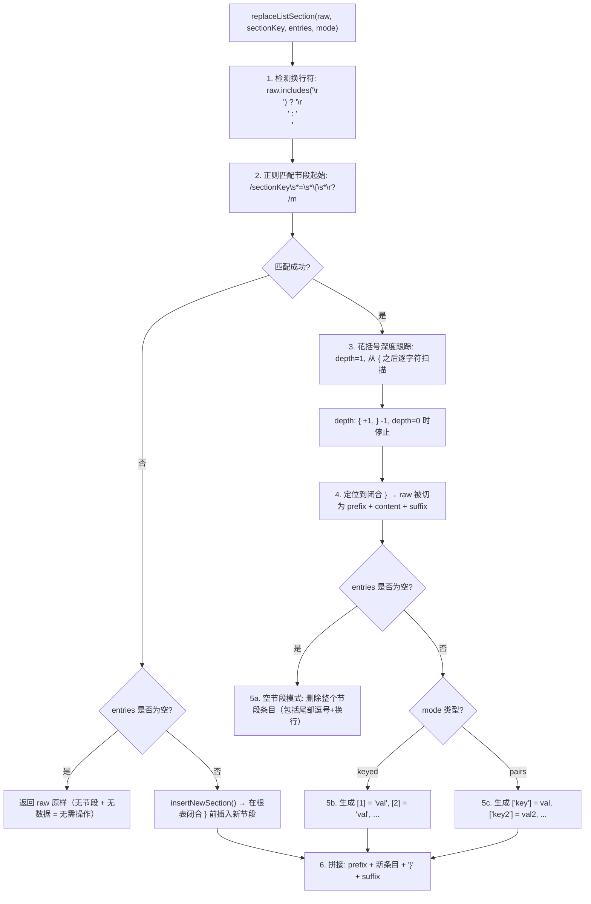
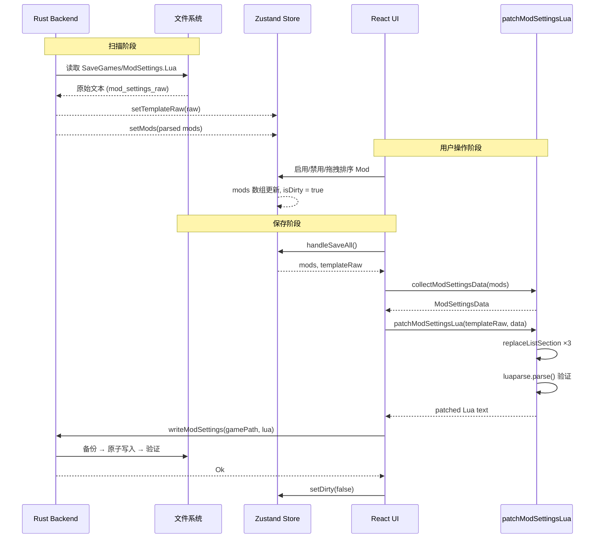

`patchModSettingsLua` 是该项目的核心数据持久化引擎之一。它的任务是在保留用户原始 `ModSettings.Lua` 文件格式（注释、空行、额外字段、缩进风格）的前提下，仅替换其中三个关键节段的内容——`EnabledWorkshopMods`、`EnabledLocalMods` 和 `ModOrder`。这使得多次保存操作后文件仍可被其他工具（如文本编辑器、游戏自身）正确识别，而不会因重新生成丢失手工维护的内容。

Sources: [generateModSettings.ts](src/utils/generateModSettings.ts#L1-L65)

## 架构定位：补丁 vs. 生成的双路径

在用户点击"同步保存"按钮时，`handleSaveAll` 回调会判断当前的 `templateRaw`（即扫描时缓存的原始 ModSettings.Lua 文本）是否存在，选择两条不同的路径：

| 条件 | 策略 | 函数 |
|---|---|---|
| `templateRaw` 非空（文件已存在） | 基于原始文本做**格式保留式补丁** | `patchModSettingsLua(templateRaw, data)` |
| `templateRaw` 为空（文件不存在） | 从零**生成**完整的 ModSettings.Lua | `generateModSettingsLua(data)` |

这个双路径设计体现了对现实场景的精准理解：绝大多数情况下 ModSettings.Lua 已存在且可能包含用户手工添加的配置项、Mod 特有注释等，补丁模式保留这一切；只有在文件完全不存在时才退回到生成模式。

Sources: [App.tsx](src/App.tsx#L314-L320)

```mermaid
flowchart TD
    A[用户点击"同步保存"] --> B{templateRaw 是否存在?}
    B -->|存在| C["collectModSettingsData(mods)<br/>→ 提取当前启用/排序状态"]
    B -->|不存在| D["collectModSettingsData(mods)<br/>→ 提取当前启用/排序状态"]
    C --> E["patchModSettingsLua(templateRaw, data)<br/>→ 正则定位三个节段 → 替换内部条目"]
    D --> F["generateModSettingsLua(data)<br/>→ 从零构建完整 Lua 文本"]
    E --> G["luaparse.parse() 语法验证"]
    F --> G
    G --> H["writeModSettings(gamePath, lua)<br/>→ Rust 原子写入 + 备份"]
    H --> I["setDirty(false) → 清除脏标记"]
```

`templateRaw` 的来源是扫描流程：Rust 端的 `scan_mods` 命令在读取 workshop 和本地 Mod 目录的同时，也会读取 `{gamePath}/SaveGames/ModSettings.Lua` 的完整原始文本，将其作为 `mod_settings_raw` 字段返回。前端在 `useModScanner.scan()` 中调用 `setTemplateRaw(result.mod_settings_raw)` 将其存入 Zustand AppStore。

Sources: [mod_scanner.rs](src-tauri/src/commands/mod_scanner.rs#L179-L185) | [useModScanner.ts](src/hooks/useModScanner.ts#L130-L131) | [useAppStore.ts](src/store/useAppStore.ts#L62)

## 核心算法：replaceListSection — 基于正则定位 + 花括号深度跟踪的节段替换

整个补丁操作的核心是 `replaceListSection` 函数。它不依赖 `luaparse` 生成的 AST 树，而是采用**正则匹配 + 手动花括号深度跟踪**的策略——这使得它可以处理任意格式的 Lua 文件，包括 luaparse 无法解析的边缘情况（如非标准注释、编码问题等）。

### 算法分步解析



Sources: [generateModSettings.ts](src/utils/generateModSettings.ts#L78-L137)

### 节段定位的细节

正则模式 `(\b${sectionKey}\s*=\s*\{\s*\r?\n)` 会捕获从节段键名到 `{` 加换行符的完整起头行。捕获组 `startMatch[1]` 被保留并用于最终拼接时的 prefix 构建，确保原始的键名写法、等号两侧空格、花括号位置完全不变。

花括号深度跟踪从 `{` 之后的换行符位置开始，逐字符扫描。遇到 `{` 深度加一，遇到 `}` 深度减一。当深度归零时，`pos` 指向闭合花括号的**下一个字符**——此时 `raw.slice(pos)` 即为闭合花括号之后的所有内容（包括可能的 `,\r\n}\r\n` 等尾部后缀）。

Sources: [generateModSettings.ts](src/utils/generateModSettings.ts#L93-L114)

### 两种条目模式（Entry Mode）

| 模式 | 适用节段 | 输出格式 | 示例 |
|---|---|---|---|
| `keyed` | `EnabledWorkshopMods`、`EnabledLocalMods` | `[索引] = "值",` | `[1] = "1_2868086245",` |
| `pairs` | `ModOrder` | `["键"] = 值,` | `["1_2868086245"] = 42,` |

`keyed` 模式下索引从 1 开始计数（Lua 数组惯例），`pairs` 模式下值不添加引号（因为 order 是数字类型）。

Sources: [generateModSettings.ts](src/utils/generateModSettings.ts#L116-L128)

### 空节段处理：删除而非留空

当某个节段的数据为空（例如没有任何已启用的 Workshop Mod），`replaceListSection` 不会保留一个空的 `EnabledWorkshopMods = { }`——它会**删除整个节段条目**。这是为了避免触发游戏的回退安全机制（游戏检测到空节段可能回退到默认配置）。

删除操作包含以下步骤：
1. 提取节段开始之前的内容 `beforeSection`
2. 去除 `beforeSection` 尾部的空白字符（避免留下空行）
3. 消费节段尾部后缀中的 `,` 和后续换行符
4. 将清理后的两部分拼接

Sources: [generateModSettings.ts](src/utils/generateModSettings.ts#L130-L137)

### 缺失节段处理：insertNewSection

当模板文件中不存在某个节段（例如老版本 ModSettings.Lua 没有 `ModOrder`），但需要写入数据时，`insertNewSection` 会在根表的闭合花括号 `}` 之前插入新节段。它使用 `raw.lastIndexOf("}")` 定位文件末尾的根表闭合花括号，如果连根表都不存在（空文件），则构建 `return { ... }` 结构。

Sources: [generateModSettings.ts](src/utils/generateModSettings.ts#L142-L174)

## 数据采集：collectModSettingsData

补丁之前需要将当前 Mod 列表的状态压缩为 `ModSettingsData` 结构：

```typescript
interface ModSettingsData {
  workshopIds: string[];     // 已启用的 Workshop Mod，格式: "1_fileId"
  localIds: string[];        // 已启用的本地 Mod，格式: "0_fileId"
  modOrder: Record<string, number>;  // 所有已启用 Mod 的排序映射
}
```

关键过滤规则：`isResidual` 为 true 的 Mod（`Config.lua` 缺失或为空的残留条目）会被**排除**，因为游戏读取 ModSettings.Lua 时，如果列表中出现一个无法找到对应 Config.lua 的条目，可能触发回退安全逻辑。

Sources: [generateModSettings.ts](src/utils/generateModSettings.ts#L14-L29)

## 语法验证：luaparse 作为安全网

补丁完成后，`patchModSettingsLua` 会调用 `luaparse.parse(result)` 对生成的 Lua 文本进行语法解析。这不是功能性的必要步骤——补丁算法本身不依赖 AST——而是一个**防御性校验**。如果生成的文本因某种原因语法错误，错误会被记录到日志中（`log.error`），但**不会阻止返回结果**。这种"尽力而为 + 事后报告"的策略避免了因验证失败而阻塞用户保存操作。

Sources: [generateModSettings.ts](src/utils/generateModSettings.ts#L52-L59)

## 完整数据流：从扫描到保存



Sources: [App.tsx](src/App.tsx#L310-L355) | [mod_settings.rs](src-tauri/src/commands/mod_settings.rs#L56-L75)

## 与 parseModSettingsLua 的对称关系

值得注意 `patchModSettingsLua`（写路径）与 `parseModSettingsLua`（读路径）之间的对称性：

| 维度 | parseModSettingsLua（读） | patchModSettingsLua（写） |
|---|---|---|
| 解析方式 | luaparse AST + `tableFromReturn` + 顶层赋值语句回退 | 正则 + 花括号深度跟踪 |
| 处理节段 | 从 AST 提取数组/对象 | 直接替换原始文本中的条目 |
| 格式感知 | 不感知（AST 剥离了所有格式信息） | 完全保留（只替换条目，其余不动） |
| 容错策略 | 解析失败 → 返回空结果，标记 `msParseFailed` | 验证失败 → 记录日志，仍返回结果 |

这种不对称设计是刻意的：读路径需要理解 Lua 语义来提取数据，AST 是正确的工具；写路径需要保留格式来维持文件可读性和兼容性，正则替换是正确的工具。

Sources: [luaParser.ts](src/lib/luaParser.ts#L227-L310) | [generateModSettings.ts](src/utils/generateModSettings.ts#L33-L60)

## 边界情况与防御设计

下表汇总了 `patchModSettingsLua` 和其辅助函数处理的各种边界情况：

| 边界情况 | 处理策略 | 位置 |
|---|---|---|
| 模板文件使用 `\r\n` 换行 | `replaceListSection` 自动检测并使用相同的换行符 | [generateModSettings.ts](src/utils/generateModSettings.ts#L87-L88) |
| 某节段在模板中不存在 | `insertNewSection` 在根表 `}` 前追加 | [generateModSettings.ts](src/utils/generateModSettings.ts#L96-L99) |
| 某节段数据为空 | 删除整个节段条目（含尾部逗号+换行） | [generateModSettings.ts](src/utils/generateModSettings.ts#L130-L137) |
| 模板文件完全为空 | `insertNewSection` → `lastIndexOf("}")` 返回 -1 → 构建 `return { ... }` | [generateModSettings.ts](src/utils/generateModSettings.ts#L168-L172) |
| 补丁后语法无效 | `luaparse.parse` 失败 → `log.error` 记录但继续返回 | [generateModSettings.ts](src/utils/generateModSettings.ts#L52-L57) |
| `isResidual` Mod | `collectModSettingsData` 过滤排除 | [generateModSettings.ts](src/utils/generateModSettings.ts#L16) |
| 模板文件无 `ModOrder` 但有数据 | `insertNewSection` 追加新节段 | [generateModSettings.ts](src/utils/generateModSettings.ts#L42-L44) |

## 与 generateModSettingsLua 的对比

当 `templateRaw` 为空时使用的 `generateModSettingsLua` 是一条完全不同的路径——它不依赖任何模板，从零构建 Lua 文本：

| 维度 | patchModSettingsLua | generateModSettingsLua |
|---|---|---|
| 输入 | 原始模板文本 + 数据 | 仅数据 |
| 格式保留 | 完全保留原始格式 | 统一使用 `\t` 缩进和 `\n` 换行 |
| 空节段行为 | 删除节段条目 | 不生成该节段（条件判断 `length > 0`） |
| 缺失节段 | `insertNewSection` 追加 | 自然生成 |
| 适用场景 | 文件已存在 → 增量更新 | 文件不存在 → 首次创建 |

两者的输出都会经过 `luaparse.parse()` 语法验证，确保生成的 Lua 在语法层面合法。

Sources: [generateModSettings.ts](src/utils/generateModSettings.ts#L180-L228)

## 后续阅读

理解 `patchModSettingsLua` 后，建议按以下路径深入探索相关模块：

- **[Lua 配置解析：luaparse 驱动的 Config.lua / ModSettings.Lua / Settings.Lua 解析](9-lua-pei-zhi-jie-xi-luaparse-qu-dong-de-config-lua-modsettings-lua-settings-lua-jie-xi)** — 了解读路径上的 `parseModSettingsLua` 如何将 ModSettings.Lua 解析为结构化数据
- **[原子写入策略：临时文件 + 重命名 + 写入验证 + 自动备份](25-yuan-zi-xie-ru-ce-lue-lin-shi-wen-jian-zhong-ming-ming-xie-ru-yan-zheng-zi-dong-bei-fen)** — 了解补丁结果写入磁盘时的安全保证
- **[即时脏状态跟踪：跨 Mod 的未保存变更检测](17-ji-shi-zang-zhuang-tai-gen-zong-kua-mod-de-wei-bao-cun-bian-geng-jian-ce)** — 了解触发 `handleSaveAll` 的 `isDirty` / `dirtyModSettings` 机制
- **[useModScanner 钩子：扫描、增量刷新与错误恢复](11-usemodscanner-gou-zi-sao-miao-zeng-liang-shua-xin-yu-cuo-wu-hui-fu)** — 了解 `templateRaw` 的初始来源与刷新更新