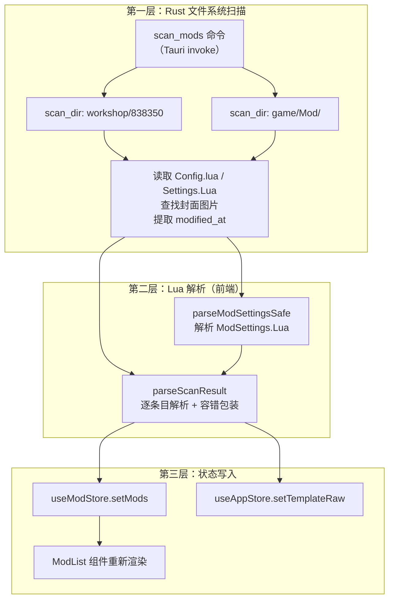
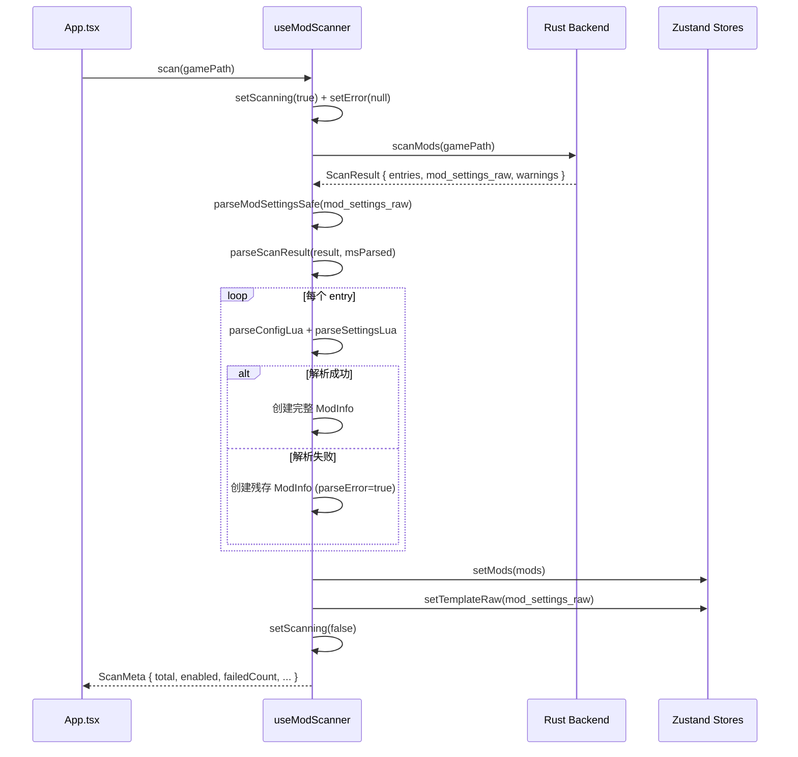
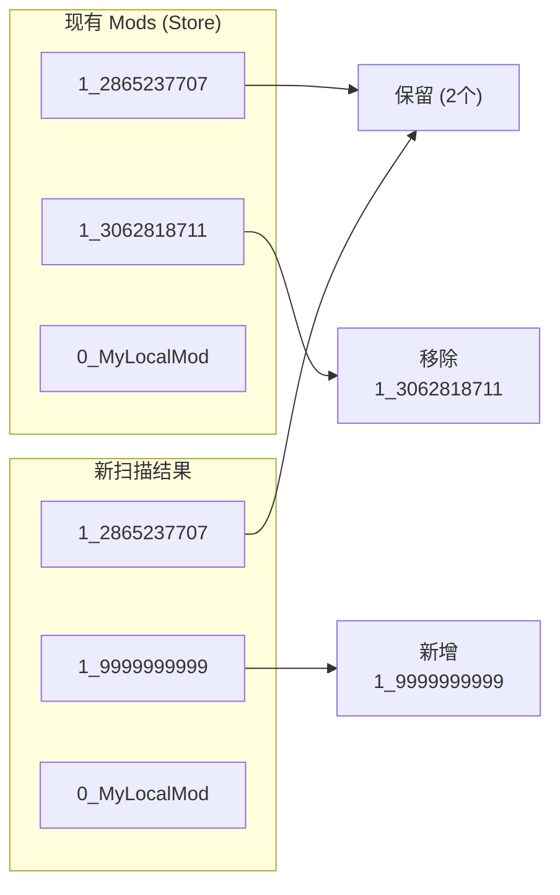
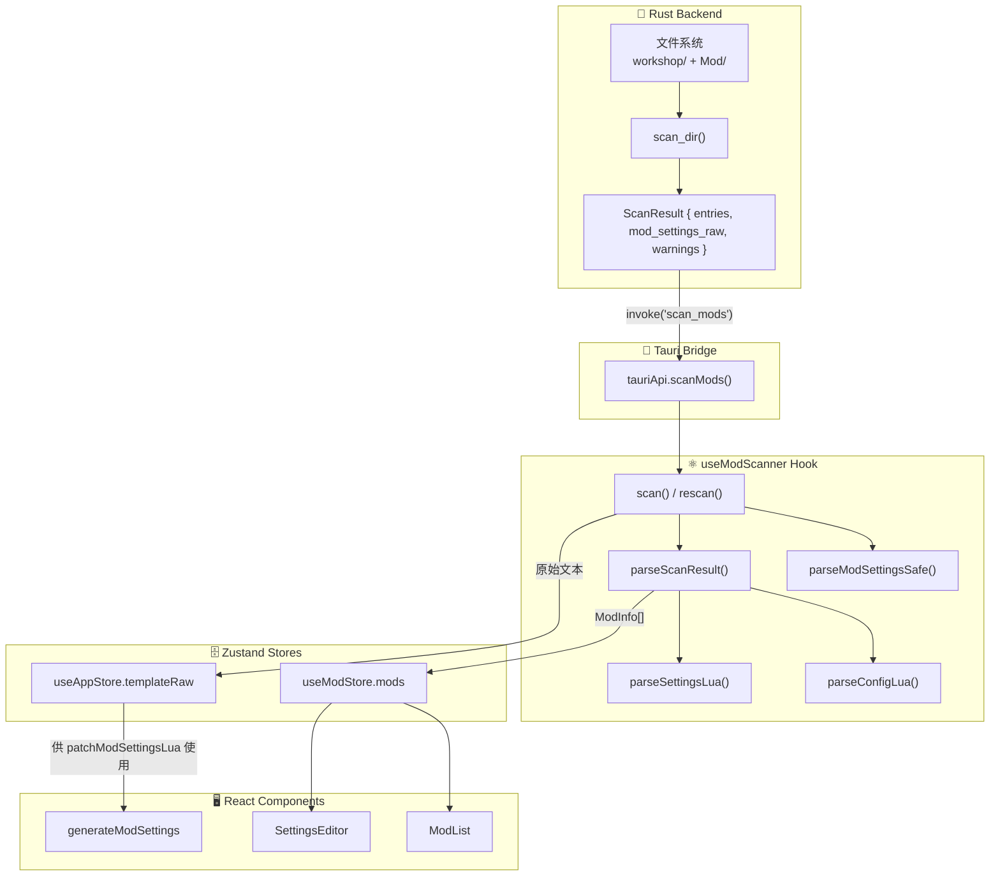

`useModScanner` 是 TWModLauncher 前端中负责 **Mod 发现与状态同步** 的核心自定义 Hook。它将 Rust 后端的文件系统扫描能力与前端 Lua 解析引擎桥接起来，提供「全量扫描」与「增量刷新」两条操作路径，并在解析失败的每一个层级实施优雅降级。该 Hook 通过 Zustand 双 Store（`useModStore` 与 `useAppStore`）将扫描结果写入全局状态，驱动整个 Mod 列表的渲染。

Sources: [useModScanner.ts](src/hooks/useModScanner.ts#L1-L13)

## 整体架构：三层流水线

从 Rust 后端到 React 组件，一次扫描经过三个清晰的层级。理解这个分层对于把握错误处理策略至关重要：



- **第一层**由 Rust 的 `scan_mods` Tauri 命令完成，返回原始文件内容与元数据。该层产生的 `warnings`（如权限不足、Config.lua 读取失败）以非致命警告的形式透传到前端。
- **第二层**在前端通过 `luaparse` 库解析 Lua 文本。这一层是容错设计的重点——单个 Mod 的解析失败不会阻断其余 Mod 的处理。
- **第三层**将解析后的 `ModInfo[]` 写入 Zustand Store，同时缓存 `ModSettings.Lua` 原始文本供后续「格式保留式补丁」使用。

Sources: [mod_scanner.rs](src-tauri/src/commands/mod_scanner.rs#L173-L215) | [useModScanner.ts](src/hooks/useModScanner.ts#L34-L114) | [useModScanner.ts](src/hooks/useModScanner.ts#L118-L155)

## 全量扫描：`scan` 函数

`scan` 是 Hook 对外暴露的第一操作原语，在用户首次选择游戏路径或切换游戏目录时触发。其执行流程完全遵循「请求 → 解析 → 写入 → 返回元数据」的单向数据流。

### 调用签名与返回值

| 参数 / 返回 | 类型 | 说明 |
|---|---|---|
| `gamePath` (入参) | `string` | 游戏根目录的绝对路径 |
| 返回值（成功） | `ScanMeta \| null` | 扫描汇总元数据，用于组装用户提示 |
| 返回值（致命失败） | `null` | 后端连接失败或权限不足等不可恢复错误 |

`ScanMeta` 包含六个字段：

| 字段 | 类型 | 含义 |
|---|---|---|
| `total` | `number` | 扫描到的 Mod 总数 |
| `enabled` | `number` | 其中已启用的数量 |
| `failedCount` | `number` | Config.lua 解析失败的 Mod 数量 |
| `msParseFailed` | `boolean` | ModSettings.Lua 是否解析失败 |
| `warnings` | `string[]` | Rust 端产生的非致命警告 |
| `failedModNames` | `string[]` | 解析失败的 Mod 名称列表（最多展示前 3 个） |

Sources: [types.ts](src/lib/types.ts#L27-L34) | [useModScanner.ts](src/hooks/useModScanner.ts#L124-L155)

### 执行流程



整个流程中最关键的容错节点是 `parseScanResult` 中的 `try/catch`：每个 entry 被独立包裹在异常捕获块中，任何一个 Mod 的 Config.lua 解析失败都不会中断循环。失败条目被替换为一个带有 `parseError: true`、`isResidual: true` 的「残存 Mod 对象」，标题显示为 `"Mod #fileId (解析失败)"`，确保扫描结果列表的完整性。

Sources: [useModScanner.ts](src/hooks/useModScanner.ts#L41-L112) | [App.tsx](src/App.tsx#L87-L108)

### 三层错误处理与用户可见性

`scan` 内部的错误处理遵循「由外向内」的渐进策略：

```
Fatal Error (useModScanner.scan catch)
  └─ 连接失败 / 权限不足 / 游戏路径无效
  └─ 结果：setError("扫描失败: ..."), return null

ModSettings.Lua 解析失败 (parseModSettingsSafe catch)
  └─ luaparse 抛出异常
  └─ 结果：回退为空 { enabledWorkshopMods:[], enabledLocalMods:[], modOrder:{} }
  └─ 标记 msParseFailed = true

单条 Config.lua 解析失败 (parseScanResult catch)
  └─ 单条 entry 解析异常或 parseConfigLua 返回 parseError:true
  └─ 结果：创建 isResidual 占位对象，failedCount++
```

在 App.tsx 的消费端，三种错误分别转化为用户可见的消息段：
- `msParseFailed` → "ModSettings.Lua 解析失败，启用状态可能不准确"
- `failedCount > 0` → "N 个解析失败（名称1、名称2、名称3等N个）"（名称截断至 3 个）
- Rust warnings → 直接拼接到消息末尾

Sources: [useModScanner.ts](src/hooks/useModScanner.ts#L225-L232) | [App.tsx](src/App.tsx#L90-L105)

## 增量刷新：`rescan` 函数

`rescan` 是 Hook 对外暴露的第二操作原语，用于在用户手动点击「刷新」时检测 Mod 目录的变化，并**就地合并**差异，避免全量替换导致的 UI 闪烁（如滚动位置丢失、选中状态清除）。

### diff 算法核心：基于 source_fileId 的集合运算

增量刷新的关键在于识别「新增」「移除」「保留」三类 Mod。算法使用 source + fileId 组合键（形如 `1_2865237707`）作为 Mod 的唯一标识，通过 Set 运算完成分类：



实现代码采用两阶段 Set 过滤：

1. **构建键集合**：对现有列表和新列表分别提取 `source_fileId` 键，生成 `existingKeys` 和 `freshKeys` 两个 `Set<string>`。
2. **分类过滤**：`added` = 新列表中不存在于 `existingKeys` 的条目；`removed` = 现有键集合中不存在于 `freshKeys` 的条目。

当且仅当 `added.length > 0 || removed.length > 0` 时才更新 Store，避免无变化时的无效渲染。

Sources: [useModScanner.ts](src/hooks/useModScanner.ts#L159-L202)

### 合并策略：保留现有状态 × 同步关键字段

对于「保留」的 Mod，`rescan` 不是简单地用新扫描结果替换——那样会丢失用户在当前会话中的运行时状态（如展开的 settingGroups、拖拽后的临时 order）。合并逻辑的策略是：**保留现有对象的全部字段，仅覆盖 `enabled` 和 `order` 这两个来源于 ModSettings.Lua 的字段**。

```typescript
// 核心合并逻辑（简化）
const merged = existing
  .filter((m) => freshKeys.has(`${m.source}_${m.fileId}`))
  .map((m) => {
    const key = `${m.source}_${m.fileId}`;
    const fresh = freshMods.find((f) => `${f.source}_${f.fileId}` === key);
    if (fresh) {
      return { ...m, enabled: fresh.enabled, order: fresh.order };
    }
    return m;
  });
merged.push(...added);  // 追加新增 Mod
```

注意：虽然 `enabled` 和 `order` 被覆盖，但它们来源于**磁盘上 ModSettings.Lua 的最新内容**（因为 `rescan` 重新读取了 ModSettings.Lua）。这意味着如果用户在两次刷新之间通过游戏内或其他工具修改了 ModSettings.Lua，刷新后的状态将反映磁盘上的真实状态。

Sources: [useModScanner.ts](src/hooks/useModScanner.ts#L186-L202)

### 调用方降级路径

在 App.tsx 中，`handleRefresh` 对 `rescan` 返回 `null`（致命错误）的情况实现了降级逻辑：

| 场景 | 动作 |
|---|---|
| `rescan` 返回 `null` | 尝试验证游戏路径是否仍然有效 |
| 路径有效但扫描失败 | 仅显示"刷新失败，请检查游戏目录是否可用" |
| 路径已失效 | 清空 Mods + 清空路径 + 提示重新选择 |
| 所有 Mod 消失（removed > 0 且 mods.length === 0） | 再次验证路径，若失效则清空全部状态 |

这套降级策略确保在游戏目录被移动、卸载或磁盘断开等异常情况下，应用状态不会残留无效数据。

Sources: [App.tsx](src/App.tsx#L241-L302)

## 辅助函数：扫描管线中的独立模块

### `formatDate`：时间戳格式化

将 Rust 端通过 `fs::metadata().modified()` 获取的 Unix 秒级时间戳转换为 `YYYY-MM-DD` 格式的显示字符串。空字符串或无效数字返回空字符串。该值最终写入 `ModInfo.updatedAt` 字段。

Sources: [useModScanner.ts](src/hooks/useModScanner.ts#L16-L21)

### `hashStr`：非数字目录名的 ID 生成

Steam Workshop Mod 的目录名通常是纯数字（Steam 的 `file_id`），但本地 Mod 目录可能是任意名称。当 `file_id` 无法通过 `Number()` 解析时，使用 djb2 变体算法生成一个非零正整数作为后备标识符。

```typescript
function hashStr(s: string): number {
  let hash = 0;
  for (let i = 0; i < s.length; i++) {
    hash = ((hash << 5) - hash) + s.charCodeAt(i);  // hash * 31 + charCode
    hash |= 0;  // 截断为 32 位整数
  }
  return Math.abs(hash) || 1;  // 确保非零
}
```

Sources: [useModScanner.ts](src/hooks/useModScanner.ts#L23-L31)

### `parseModSettingsSafe`：带降级的全局配置解析

这是一个薄包装函数：尝试调用 `parseModSettingsLua` 解析 ModSettings.Lua，若 luaparse 抛出异常则捕获并返回空白的默认值 `{ enabledWorkshopMods: [], enabledLocalMods: [], modOrder: {} }`，同时标记 `failed: true`。这个降级值意味着所有 Mod 的 `enabled` 都为 `false`——这是一个保守的安全假设。

`scan` 和 `rescan` 都通过此函数解析 ModSettings.Lua，因此两者共享相同的降级行为。

Sources: [useModScanner.ts](src/hooks/useModScanner.ts#L225-L232)

## 数据流总结：从磁盘到 UI 的完整路径



这条流水线的设计哲学是：**每一层只处理自己能处理的错误，无法处理的以一致的降级值向上传递**。Rust 端处理文件 I/O 错误（转为 warnings），前端解析层处理 Lua 语法错误（转为残存对象），Hook 层处理 Tauri 通信错误（转为 null 返回值）。没有一层会因单点故障而中断整个流程。

Sources: [mod_scanner.rs](src-tauri/src/commands/mod_scanner.rs#L95-L169) | [useModScanner.ts](src/hooks/useModScanner.ts#L34-L155) | [tauriApi.ts](src/lib/tauriApi.ts#L17-L21)

## 与 Zustand Store 的交互契约

`useModScanner` 与两个 Zustand Store 存在写入关系，理解这些交互有助于追踪状态变更的完整链路：

| Store | Action | 写入时机 | 写入内容 |
|---|---|---|---|
| `useModStore` | `setMods(mods)` | scan / rescan 解析完成后 | 完整的 `ModInfo[]` 数组 |
| `useModStore` | `setScanning(bool)` | 扫描开始（true）与结束（false） | 布尔标志 |
| `useModStore` | `setError(msg)` | scan 发生致命错误时 | 用户可读的错误消息 |
| `useAppStore` | `setTemplateRaw(raw)` | scan / rescan 获取 ModSettings.Lua 后 | 原始 Lua 文本 |

`setTemplateRaw` 的写入在 `rescan` 中尤为关键——它确保 `patchModSettingsLua`（格式保留式补丁函数）始终基于最新的磁盘内容生成输出，避免基于过期模板导致的冲突。

Sources: [useModScanner.ts](src/hooks/useModScanner.ts#L118-L155) | [useModStore.ts](src/store/useModStore.ts#L41-L53) | [useAppStore.ts](src/store/useAppStore.ts#L83-L100)

## 相关页面

- [Rust 端 Mod 目录扫描：workshop 与本地双源结构](8-rust-duan-mod-mu-lu-sao-miao-workshop-yu-ben-di-shuang-yuan-jie-gou) — 了解 Rust 端 `scan_dir` 的详细实现
- [Lua 配置解析：luaparse 驱动的 Config.lua / ModSettings.Lua / Settings.Lua 解析](9-lua-pei-zhi-jie-xi-luaparse-qu-dong-de-config-lua-modsettings-lua-settings-lua-jie-xi) — 深入 `parseConfigLua`、`parseModSettingsLua`、`parseSettingsLua` 的 AST 处理细节
- [状态管理：Zustand 双 Store 设计（AppStore 与 ModStore）](7-zhuang-tai-guan-li-zustand-shuang-store-she-ji-appstore-yu-modstore) — 理解 `setMods`、`setTemplateRaw` 写入后对全局状态的影响
- [应用主流程：从路径选择到 Mod 管理](4-ying-yong-zhu-liu-cheng-cong-lu-jing-xuan-ze-dao-mod-guan-li) — 了解 `scan` 和 `rescan` 在 App.tsx 中的调用时机与完整上下文
- [ModSettings.Lua 的格式保留式补丁（patchModSettingsLua）](10-modsettings-lua-de-ge-shi-bao-liu-shi-bu-ding-patchmodsettingslua) — 理解 `templateRaw` 被如何用于生成输出