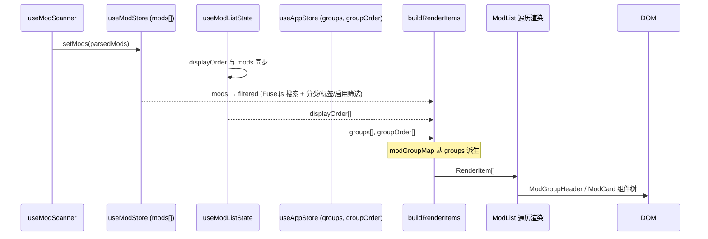

本文档深入解析 TWM Launcher 的 Mod 列表渲染模型：从原始 Mod 数据出发，如何通过 **displayOrder**（用户自定义排序）和 **ModGroup**（虚拟分组）这两层抽象，经由 `buildRenderItems` 算法生成可供 React 直接遍历的扁平 `RenderItem[]` 数组，最终驱动带有分组折叠、拖拽插入线与空分组锚定等完整交互的视觉列表。

## 核心概念与数据结构

渲染模型建立在三个互相独立的数据层之上，它们各司其职，在 `buildRenderItems` 中交汇融合。

```mermaid
graph TD
    subgraph 数据层
        A[ModInfo[]<br/>mods] -->|过滤| B[filtered: ModInfo[]<br/>经筛选后的 Mod 列表]
        C[displayOrder: string[]<br/>用户自定义排序] 
        D[groups: ModGroup[]<br/>虚拟分组]
        E[groupOrder: string[]<br/>分组显示顺序]
    end

    subgraph 派生层
        D -->|派生| F[modGroupMap<br/>Map modKey → groupId]
    end

    subgraph 算法层
        B --> G[buildRenderItems]
        C --> G
        D --> G
        E --> G
        F --> G
        H[groupCreateState] --> G
    end

    subgraph 输出层
        G --> I[RenderItem[]]
        I -->|遍历渲染| J[ModGroupHeader<br/>ModCard<br/>拖拽插入线]
    end
```

### displayOrder：用户定义的全量 Mod 排序

`displayOrder` 是一个 `string[]`，每个元素为格式 `"{source}_{fileId}"` 的 Mod 键。它是用户通过拖拽排序产生的**全量有序列表**——所有 Mod（无论归属哪个分组）都在此列表中拥有唯一位置。该数组通过 `useModListState` Hook 管理，初始从 localStorage 恢复，并随 Mod 扫描结果自动同步：新增 Mod 追加至末尾，已删除 Mod 自动移除。

```typescript
// 同步逻辑：新 Mod 追加，旧 Mod 保留原位
const allKeys = mods.map((m) => `${m.source}_${m.fileId}`);
const filtered = prev.filter((k) => allKeys.includes(k));
const existing = new Set(filtered);
for (const k of allKeys) {
  if (!existing.has(k)) filtered.push(k); // 新增 Mod 追加到末尾
}
```

Sources: [useModListState.ts](src/components/ModList/useModListState.ts#L88-L99)

### ModGroup：虚拟分组结构

`ModGroup` 是纯粹的前端虚拟概念——它不修改任何文件系统数据，仅在 UI 层面组织 Mod 卡片。每个分组的核心属性：

| 属性 | 类型 | 用途 |
|------|------|------|
| `id` | `string` (UUID) | 唯一标识 |
| `name` | `string` | 分组显示名称 |
| `collapsed` | `boolean` | 折叠状态——折叠时成员卡片不渲染但标记为"已渲染"以避免重复出现 |
| `modKeys` | `string[]` | 该分组内 Mod 键的有序列表 |
| `anchorBefore` | `string?` | 空分组定位锚：插入到指定卡片**之前** |
| `anchorAfter` | `string?` | 空分组定位锚：插入到指定卡片**之后** |

空分组（`modKeys` 为空）的定位是渲染模型中最复杂的部分。当分组内最后一个 Mod 被移出时，系统会捕获该分组在 displayOrder 中的原始位置，找到其**紧邻前方**的非本组卡片作为 `anchorAfter`，使空分组在视觉上停留在原地而不发生跳跃。

Sources: [types.ts](src/lib/types.ts#L86-L96), [ModList.tsx](src/components/ModList/ModList.tsx#L34-L58)

### modGroupMap：Mod→Group 快速查找表

`modGroupMap` 是 `Map<string, string>` 类型，将每个 Mod 键映射到其所属分组 ID。它通过 `useMemo` 从 `groups` 数组派生，是 `buildRenderItems` 中判断某个 Mod 是否属于分组的关键基础设施：

```typescript
const modGroupMap = useMemo(() => {
  const map = new Map<string, string>();
  groups.forEach((g) => g.modKeys.forEach((k) => map.set(k, g.id)));
  return map;
}, [groups]);
```

此外，系统内建了**跨分组去重保护机制**：若同一 Mod 键意外出现在多个分组中，`useEffect` 会按 `groupOrder` 优先级规则将其保留在最先出现的分组内，从其余分组中移除。

Sources: [ModList.tsx](src/components/ModList/ModList.tsx#L406-L410), [ModList.tsx](src/components/ModList/ModList.tsx#L429-L476)

### RenderItem：扁平渲染单元

`RenderItem` 是联合类型，定义了三种可渲染项：

```typescript
type RenderItem =
  | { type: "group-header"; group: ModGroup }           // 分组头部
  | { type: "mod"; mod: ModInfo; key: string; indented: boolean }  // Mod 卡片
  | { type: "group-creation-placeholder"; group: null }; // 分组创建拖拽占位线
```

`indented` 字段控制视觉缩进——分组内的 Mod 卡片通过 `ml-6` CSS 类实现偏移，形成清晰的视觉层级。

Sources: [utils.ts](src/components/ModList/utils.ts#L7-L10)

---

## buildRenderItems 算法：四阶段流水线

`buildRenderItems` 是整个渲染模型的核心，接收六个输入参数，输出扁平 `RenderItem[]`。算法分为四个顺序执行、互不干扰的阶段。

```mermaid
flowchart TD
    A[输入参数] --> B[阶段一：遍历 displayOrder]
    B -->|遇到分组第一个成员| C[emitGroup<br/>发射分组头部+所有成员]
    B -->|未分组 Mod| D[发射未分组卡片]
    
    B --> E[阶段二：处理遗漏 Mod]
    E -->|未渲染的 Mod| F{在分组中?}
    F -->|是且分组未渲染| C
    F -->|否| D
    
    E --> G[阶段三：插值空分组]
    G -->|锚点定位| H[interpolateUnrenderedGroups]
    G -->|兄弟分组定位| H
    G -->|绝对回退| H
    
    H --> I[阶段四：拖拽创建占位]
    I -->|groupCreateState.active| J[insertGroupCreationPlaceholder]
    
    I --> K[输出 RenderItem[]]
```

### 阶段一：遍历 displayOrder ——"首个成员触发整组发射"

这是算法最核心的不变量：**当 displayOrder 中首次遇到某个分组的成员时，该分组的头部及其所有成员被连续发射到输出数组中**。这意味着分组内的所有 Mod 在视觉上始终紧密相邻（contiguous），无论它们在 displayOrder 中是否分散。

```typescript
for (const key of displayOrder) {
  if (renderedModKeys.has(key)) continue;  // 已渲染（可能被分组批量发射）→ 跳过
  const gid = modGroupMap.get(key);
  if (gid && !renderedGroupIds.has(gid)) {
    emitGroup(gid, ...);  // 整个分组一次性发射
    continue;
  }
  // 未分组卡片单独发射
  if (!renderedModKeys.has(key)) {
    const mod = filtered.find((m) => `${m.source}_${m.fileId}` === key);
    if (mod) items.push({ type: "mod", mod, key, indented: false });
  }
}
```

这里有两个 `renderedModKeys` 的守卫：`continue` 跳过已被分组批量标记的键，`if (!renderedModKeys.has(key))` 二次检查防止同一 Mod 重复发射。

Sources: [utils.ts](src/components/ModList/utils.ts#L87-L107)

### emitGroup：分组内容的排序发射

`emitGroup` 函数负责一个分组的完整发射，包含两个关键分支：

**展开状态**（`!collapsed`）：先推入 `group-header` 项，然后按 `displayOrder` 的位置排序分组内的 Mod 键，依次发射为 `{ type: "mod", indented: true }` 项。排序使用 `displayOrder.indexOf` 作为排序键——未在 displayOrder 中的键排在末尾。

**折叠状态**（`collapsed`）：仅推入 `group-header`，然后将所有 `modKeys` 标记为 `renderedModKeys`（**不发射卡片**）。这是折叠功能的实现基石——卡片被"隐藏"但键被标记为已渲染，防止阶段二中它们以未分组形式重复出现。

```typescript
if (!group.collapsed) {
  const sorted = group.modKeys
    .map((k) => ({ key: k, mod: filtered.find(...) }))
    .filter((x): x is { key: string; mod: ModInfo } => x.mod != null)
    .sort((a, b) => (displayOrder.indexOf(a.key) - displayOrder.indexOf(b.key)));
  for (const { key: mk, mod } of sorted) {
    items.push({ type: "mod", mod, key: mk, indented: true });
    renderedModKeys.add(mk);
  }
} else {
  for (const mk of group.modKeys) renderedModKeys.add(mk);
}
```

Sources: [utils.ts](src/components/ModList/utils.ts#L138-L172)

### 阶段二：处理遗漏 Mod

此阶段遍历 `filtered` 数组（已经过搜索、分类、标签、启用状态筛选），处理未在阶段一中渲染的 Mod。这些通常是新扫描到的 Mod（尚未被用户拖入 displayOrder）或 displayOrder 中不存在的键。处理逻辑与阶段一相同：先检查是否属于未渲染的分组（`emitGroup`），再作为未分组卡片发射。

Sources: [utils.ts](src/components/ModList/utils.ts#L109-L120)

### 阶段三：interpolateUnrenderedGroups ——空分组的智能定位

这是算法中最复杂的部分。当某个分组的 `modKeys` 全部指向的 Mod 都被过滤掉（例如当前筛选条件排除了所有成员），该分组不会在前两个阶段中被渲染——它成为一个"不可见"的空分组，需要通过 `interpolateUnrenderedGroups` 按照 `groupOrder` 的顺序插值到正确位置。

定位策略分四个优先级：

| 优先级 | 策略 | 说明 |
|--------|------|------|
| 1 | **锚点定位** | 尝试 `anchorBefore`（插入到指定卡片前）或 `anchorAfter`（插入后），仅当锚点卡片存在且**非缩进**（不在其他分组内）时有效 |
| 2 | **后向兄弟定位** | 在 `groupOrder` 中寻找下一个已渲染的兄弟分组，插入到其之前 |
| 3 | **前向兄弟定位** | 寻找前一个已渲染的兄弟分组，扫描其展开内容（跳过 `group-header` 和未缩进卡片），插入到其**最后一个成员之后**——这避免了空分组出现在兄弟分组的头部和成员之间 |
| 4 | **绝对回退** | 若有 `anchorAfter` 则插入到列表末尾，否则插入到列表开头 |

```typescript
// 前向兄弟定位的关键逻辑：扫描过兄弟分组的展开内容
if (prevGroup && !prevGroup.collapsed && prevGroup.modKeys.length > 0) {
  const prevKeySet = new Set(prevGroup.modKeys);
  for (let k = prevHeaderIdx + 1; k < items.length; k++) {
    const it = items[k];
    if (it.type === "group-header") break;      // 遇到下一个分组头 → 停止
    if (it.type === "mod" && !it.indented) break; // 遇到未缩进卡片 → 停止
    if (it.type === "mod" && prevKeySet.has(it.key)) {
      endIdx = k;  // 记录最后一个本组卡片位置
    }
  }
}
insertAt = endIdx + 1;  // 插入到兄弟分组的最后一个成员之后
```

Sources: [utils.ts](src/components/ModList/utils.ts#L175-L261)

### 阶段四：分组创建拖拽占位

当用户按住分组创建手柄进行拖拽时，`groupCreateState.active` 为 `true`。此时在目标位置插入一个 `{ type: "group-creation-placeholder" }` 项。渲染层将其转换为一条黄色高亮插入线，指示新分组将创建在何处。插入位置由 `insertBefore`/`insertAfter` 锚定到特定 Mod 卡片。

Sources: [utils.ts](src/components/ModList/utils.ts#L263-L285)

---

## 渲染消费：从 RenderItem[] 到 DOM

`buildRenderItems` 的输出在 `ModList` 组件中被直接映射为 React 元素：

```typescript
const renderItems = buildRenderItems(
  filter.displayOrder, groups, groupOrder, filtered, modGroupMap, groupCreateState
);
```

遍历时根据 `item.type` 分发：

- **`"group-header"`** → 渲染 `ModGroupHeader` 组件，同时插入分组拖拽线和卡片拖拽线（若当前位置有插入线）
- **`"mod"`** → 渲染 `ModCard` 组件，应用 `item.indented ? "ml-6" : ""` 缩进样式，附加拖拽源状态
- **`"group-creation-placeholder"`** → 渲染一条绝对定位的黄色插入线

插入线的计算由独立的 `computeCardInsertLineIdx`、`computeGroupInsertLineIdx` 和 `computeGroupDragCardInsertLineIdx` 函数完成——它们根据拖拽状态在 RenderItem 数组中定位，而**不**修改 renderItems 本身。这保持了渲染列表的纯净性：插入线在遍历时通过 `index === cardInsertLineIdx` 条件判断就地注入。

Sources: [ModList.tsx](src/components/ModList/ModList.tsx#L755-L758), [ModList.tsx](src/components/ModList/ModList.tsx#L830-L930)

---

## 数据流全貌：从扫描到渲染

整个数据管线的端到端流程如下：



关键同步点：`displayOrder` 的持久化在 `useModListState` 中通过 `useEffect` 写入 localStorage（键名 `"twm-filter-prefs"`），与 `groups` 和 `groupOrder` 共享同一个存储键。ModList 组件中还有一个独立的 `useEffect` 负责将完整的 filter prefs（包含 groups 和 groupOrder）写回同一 localStorage 条目，确保分组数据在页面刷新后完整恢复。

Sources: [useModListState.ts](src/components/ModList/useModListState.ts#L138-L154), [ModList.tsx](src/components/ModList/ModList.tsx#L478-L498)

---

## 阅读下一步

渲染模型是 Mod 列表交互的基础层。理解此算法后，建议按以下顺序深入：

- **[三套拖拽系统：卡片拖拽、分组头部拖拽与分组创建拖拽](13-san-tao-tuo-zhuai-xi-tong-qia-pian-tuo-zhuai-fen-zu-tou-bu-tuo-zhuai-yu-fen-zu-chuang-jian-tuo-zhuai)** —— 了解 displayOrder 如何被用户拖拽修改，以及分组创建如何触发 `groupCreateState`
- **[筛选系统：Fuse.js 模糊搜索 + 分类/标签/启用状态多条件过滤](14-shai-xuan-xi-tong-fuse-js-mo-hu-sou-suo-fen-lei-biao-qian-qi-yong-zhuang-tai-duo-tiao-jian-guo-lu)** —— 了解 `filtered` 数组的生成逻辑，以及空分组出现的场景
- **[筛选状态持久化：localStorage 缓存与启动恢复](15-shai-xuan-zhuang-tai-chi-jiu-hua-localstorage-huan-cun-yu-qi-dong-hui-fu)** —— 深入 displayOrder 和 groups 的持久化机制