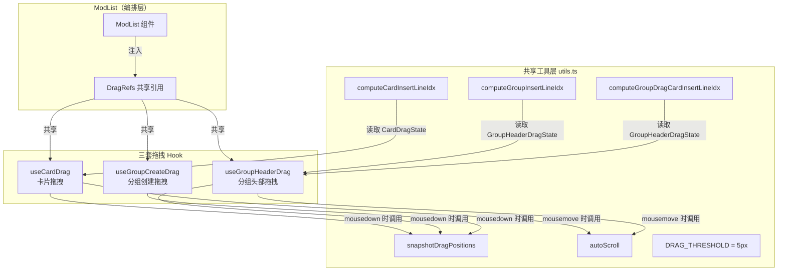

Mod 列表的拖拽交互由三套独立但共享底层基础设施的拖拽系统组成：**卡片拖拽**（`useCardDrag`）负责单个或多选 Mod 卡片的排序与跨分组移动，**分组头部拖拽**（`useGroupHeaderDrag`）负责分组整体重排序以及将组内卡片批量移出分组，**分组创建拖拽**（`useGroupCreateDrag`）允许用户从工具栏按钮拖拽出一条插入线，在未分组卡片之间精准创建空分组。三套系统通过共享的 `DragRefs` 引用集合和位置快照机制协同工作，公用一套滚动容器检测、边缘自动滚动和插入线渲染管线。

Sources: [ModList.tsx](src/components/ModList/ModList.tsx#L1-L33)

## 共享基础设施：DragRefs 与位置快照

三套拖拽系统共享同一套 DOM 引用和位置缓存，定义在 `utils.ts` 的 `DragRefs` 接口中。在 `ModList` 组件挂载时通过 `createDragRefs()` 工厂函数一次性创建，然后分别注入三个拖拽 Hook。

`DragRefs` 包含七个关键引用：`listRef`（渲染容器 DOM 引用）、`scrollContainerRef`（滚动容器引用，通过向上遍历 DOM 查找首个 `overflow-y: auto/scroll` 的父元素来定位）、`scrollSnapshotRef`（mousedown 时的 `scrollTop` 快照）、`containerRectSnapshotRef`（滚动容器的 `getBoundingClientRect`）、`cardPositionsRef`（所有 `[data-mod-key]` 元素的 top/midY/height 映射）、`groupHeaderPositionsRef`（所有 `[data-folder-id]` 元素的 top/bottom 映射）、`preventClickRef`（阻止拖拽后的 click 事件冒泡，防止拖拽结束时意外触发选中操作）。

Sources: [utils.ts](src/components/ModList/utils.ts#L47-L73) [utils.ts](src/components/ModList/utils.ts#L432-L528)

### 位置快照：snapshotDragPositions

每次 mousedown 时，对应的拖拽 Hook 都会调用 `snapshotDragPositions()` 来一次性冻结当前 DOM 中所有卡片和分组头部的位置信息。这是拖拽系统最关键的时序保证——快照必须在 React 状态更新导致重渲染位移之前完成，因此调用时机严格限定在 mousedown 事件处理器中。函数同时负责定位滚动容器（向上遍历 `parentElement` 直到找到 `overflow-y: auto/scroll`），并记录当前 `scrollTop` 和容器边界矩形。

对于分组头部拖拽场景，`snapshotDragPositions` 额外接收 `SnapshotExtras` 参数：`draggedGroupId` 用于捕获被拖拽分组的头部高度和整体可视高度（头部 + 所有卡片），这决定了拖拽过程中占位槽的尺寸，防止其他元素因布局塌陷而跳动。

Sources: [utils.ts](src/components/ModList/utils.ts#L457-L528)

### 自动滚动：autoScroll

卡片拖拽和分组头部拖拽的 mousemove 处理器中都会调用 `autoScroll()`。其原理是在滚动容器顶部和底部各设 80px 的滚动触发区域（`SCROLL_ZONE`），当鼠标进入该区域时，以距离边缘的远近比例计算滚动速度（最大 12px/帧）。滚动量通过修改容器的 `scrollBy` 实现，同时每个 mousemove 周期都会重新计算 `scrollDelta`（当前 `scrollTop` 与快照值的差值），并在所有位置比较中扣除该差值，以修正因自动滚动产生的坐标偏移。

Sources: [utils.ts](src/components/ModList/utils.ts#L423-L455)

---

## 卡片拖拽：useCardDrag

卡片拖拽是三套系统中逻辑最复杂的一套，因为它同时处理单卡片拖拽和多选批量拖拽，并且涉及分组内/分组间/退出分组三种维度的操作。其状态类型 `CardDragState` 包含源卡片 key、源索引、当前目标索引、是否已启动（越过阈值）、源分组 ID（`sourceGroupId`）、是否正在退出分组（`exitingGroup`）、多选拖拽标识及多选块边界索引。

Sources: [utils.ts](src/components/ModList/utils.ts#L23-L42)

### 拖拽启动与多选检测

`handleDragMouseDown` 在 ModCard 的 mousedown 事件中被调用（经过交互元素过滤——按钮、输入框等 `INTERACTIVE_SELECTOR` 不会触发拖拽）。启动流程如下：

1. 校验目标 key 在 `displayOrder` 中存在
2. 设置 `preventClickRef = true`，阻止 mouseup 后的 click 事件
3. 调用 `snapshotDragPositions` 冻结 DOM 位置
4. 检测多选拖拽：从 Zustand store 读取 `selectedModKeys`，如果当前拖拽的卡属于多选集合（`selection.length > 1` 且集合包含该 key），则开启 `multiDrag` 模式，同时计算多选块在 `displayOrder` 中的 `multiDragMinIdx` 和 `multiDragMaxIdx` 边界
5. 设置 `dragState`，此时 `started = false`，等待 mousemove 中越过 `DRAG_THRESHOLD`（5px）才真正激活拖拽

Sources: [useCardDrag.ts](src/components/ModList/useCardDrag.ts#L33-L90) [ModCard.tsx](src/components/ModList/ModCard.tsx#L55-L67)

### 拖拽过程中的目标计算

mousemove 处理器是整个系统的核心。当 `started` 为 true 后，每个 mousemove 事件执行以下流程：

**第 1 步——光标所在分组检测**：遍历 `groupHeaderPositionsRef` 中所有分组头部，对每个分组计算其完整可视区域（头部 + 所有组内卡片），若光标位于该区域内则设置 `dragOverGroupId`。对于相邻分组之间无可见间隙的情况，使用 8px 阈值检测光标是否紧贴目标分组的头部顶部——这是"退出分组"与"进入相邻分组"的边界条件。

**第 2 步——候选目标卡片收集**：根据拖拽卡片的归属状态筛选有效的候选目标：
- 已分组卡片（`draggedGroupId` 存在）：只包含同组卡片和未分组卡片
- 未分组卡片悬停在分组上方（`hoveringOverGroup` 存在）：包含该分组的卡片和未分组卡片
- 未分组卡片不在任何分组上方：只包含未分组卡片

**第 3 步——插入位置计算**：使用基于区间的方法（range-based），将光标位置与候选卡的 top/bottom/midY 进行比较：
- 光标在首张目标卡上方 → 插入到首张卡之前
- 光标在末张目标卡下方 → 插入到末张卡之后
- 光标在某张卡内部 → 比较 midY 决定插入前还是后
- 光标在两张卡之间的间隙 → 比较间隙中点决定归属

**第 4 步——分组边界检测**：对于已分组的卡片，检测是否即将退出源分组。退出条件有两个规则：
- **规则 A**：光标直接悬停在非本组成员卡片上 → 立即退出
- **规则 B**：`targetDisplayIdx` 超出源分组成员在 `displayOrder` 中的索引范围（小于 `minIdx` 或大于 `maxIdx + 1`）→ 退出

同时设置 `exitingGroup: 'top' | 'bottom'` 方向，影响插入线的渲染位置。

**第 5 步——边界吸附**：对于未分组卡片，防止其插入到其他分组的成员之间（interleaving），自动吸附到分组边界（`slotBeforeGroupId`）。

Sources: [useCardDrag.ts](src/components/ModList/useCardDrag.ts#L95-L210)

### 拖拽释放：mouseup 处理

mouseup 时分为单卡和多选两种路径：

**多选拖拽路径**：将所有选中卡从 `displayOrder` 中移除，在目标位置整体插入。插入位置的调整逻辑为：如果目标索引大于原多选块的最大索引，需要减去块大小（因为移除操作使数组缩短了）；如果目标索引在原多选块的 min/max 之间，则锁定在 min 位置。之后依次处理分组归属变更（移动到目标分组或退出分组）。

**单卡拖拽路径**：如果设置了 `slotBeforeGroupId`（光标吸附到分组边界），则计算在该分组前的最小索引作为插入位置。否则直接使用 `currentIdx`。从 `displayOrder` 中 splice 移除源卡，在调整后的索引处插入。然后处理分组归属：如果进入了不同分组（`targetGroupId !== sourceGroupId` 且无 `slotBeforeGroupId`），调用 `handleMoveToGroup` 将卡移入；如果设置了 `exitingGroup`，将卡移出分组。

`handleMoveToGroup` 在分组间移动卡片时，会处理一个关键边界情况：如果源分组因最后一张卡被移出而变为空分组，会自动设置 `anchorAfter` 指向源位置前的卡片，确保空分组不会因位置丢失而在下次渲染时跳变。

Sources: [useCardDrag.ts](src/components/ModList/useCardDrag.ts#L399-L539) [ModList.tsx](src/components/ModList/ModList.tsx#L127-L155)

### 插入线计算：computeCardInsertLineIdx

`computeCardInsertLineIdx` 负责将 `CardDragState` 中的 `currentIdx` 转换为 `RenderItem` 数组中的具体索引。关键逻辑包括：

- **抑制规则**：当 `dragOverGroupId` 存在且既不是退出分组也不是边界吸附时，抑制插入线渲染（表示用户意图是进入分组，而非在分组前插入）
- **slotBeforeGroupId 优先**：直接返回该分组头部在 renderItems 中的索引
- **退出分组处理**：当 `exitingGroup === 'top'` 时，插入线显示在源分组头部之前，而非被拖拽卡片之前
- **No-op 抑制**：当 `currentIdx === sourceIdx` 或 `currentIdx === sourceIdx + 1` 时（splice 后位置不变），不渲染插入线，除非正在退出分组

Sources: [utils.ts](src/components/ModList/utils.ts#L293-L355)

### 多选拖拽的批量分组操作

当多选卡被拖入一个分组时，`handleMoveToGroup` 为每个 key 分别调用。displayOrder 的重新计算需要考虑移除所有选中卡后的索引偏移：`insertAt = currentIdx - blockSize`（当目标在块之后），或 `insertAt = minIdx`（当目标在块之内）。分组归属变更使用**移动前**的 displayOrder（`displayOrderRef.current`），以确保空分组的 `anchorAfter` 指向源分组的原始位置附近而非目标分组附近。

Sources: [useCardDrag.ts](src/components/ModList/useCardDrag.ts#L400-L470)

---

## 分组头部拖拽：useGroupHeaderDrag

分组头部拖拽实现的是分组整体的重新排序，以及将分组内所有卡片批量移动到未分组区域的"解散式移动"。其状态类型 `GroupHeaderDragState` 包含源分组 ID、源索引、当前目标索引，以及用于卡片级定位的 `slotBeforeKey` 和 `insertAfter`。

Sources: [utils.ts](src/components/ModList/utils.ts#L44-L52) [useGroupHeaderDrag.ts](src/components/ModList/useGroupHeaderDrag.ts#L1-L27)

### 最近目标选择策略

mousemove 中同时计算两类候选目标，然后选择距离光标更近的一个：

**分组头部目标**：遍历所有分组头部的中间点（排除自身），计算距离光标的绝对距离。

**卡片目标**：遍历所有卡片的 midY（排除自身分组内的卡片），计算距离。

比较逻辑：`useGroupTarget` 和 `useCardTarget` 互斥，选择距离更小的目标类型。当光标仍在源分组头部范围内时（`withinSource` 判断），抑制定位更新，防止分组在原地闪烁。

Sources: [useGroupHeaderDrag.ts](src/components/ModList/useGroupHeaderDrag.ts#L76-L130)

### 两种释放模式

mouseup 时根据 `slotBeforeKey` 是否被设置，区分两种模式：

**分组重排序模式**（`slotBeforeKey` 未设置）：直接对 `groupOrder` 数组执行 splice 移除和插入。这是最直观的分组顺序调整。

**卡片批量移动模式**（`slotBeforeKey` 已设置）：将源分组的所有 `modKeys` 从 `displayOrder` 中批量移除，然后以 `slotBeforeKey` 为锚点重新插入到未分组区域。空分组的处理方式不同：如果分组原本有卡片，移出后变为空分组并在原位置保留（通过 handleMoveToGroup 的锚点机制）；如果分组本来就是空的，则直接设置其 `anchorBefore`/`anchorAfter` 到新位置。

Sources: [useGroupHeaderDrag.ts](src/components/ModList/useGroupHeaderDrag.ts#L156-L240)

### 双线渲染

分组头部拖拽在渲染层产生两条可能的插入线：

| 插入线类型 | 计算函数 | 含义 | 渲染样式 |
|-----------|---------|------|---------|
| 分组级插入线 | `computeGroupInsertLineIdx` | 分组在 groupOrder 中的重排序位置 | 蓝色发光线，渲染在目标分组头部之前 |
| 卡片级插入线 | `computeGroupDragCardInsertLineIdx` | 分组卡片被批量移出时在未分组卡片间的插入位置 | 蓝色发光线，渲染在目标卡片之前 |

`computeGroupInsertLineIdx` 有 no-op 抑制：当 `sourceIdx === currentIdx` 或 `sourceIdx + 1 === currentIdx`（splice 后位置不变），不渲染插入线。

Sources: [utils.ts](src/components/ModList/utils.ts#L357-L412) [ModList.tsx](src/components/ModList/ModList.tsx#L838-L920)

---

## 分组创建拖拽：useGroupCreateDrag

分组创建拖拽是三个系统中逻辑最轻量但交互最独特的一套。它不从已有元素拖拽，而是从 `ModFilterBar` 中的"新建分组"按钮按下鼠标，在列表中拖出一条黄色的插入线，松手时在插入位置创建一个空分组。

Sources: [useGroupCreateDrag.ts](src/components/ModList/useGroupCreateDrag.ts#L1-L166)

### 状态模型

`GroupCreateDragState` 包含：
- `active`：是否已越过阈值（`GROUP_DRAG_THRESHOLD = 5px`）
- `slotY`：插入线的 Y 坐标
- `insertAfter` / `insertBefore`：锚定到最近的未分组卡片（互斥）
- `groupOrderIdx`：插入到 groupOrder 数组中的索引位置

Sources: [utils.ts](src/components/ModList/utils.ts#L15-L22)

### 位置计算：只在未分组卡片间定位

mousemove 中只遍历**未分组**的卡片（`currentGroupMap.has(k)` 检查），找到距离光标最近的一张。如果光标在卡片的 midY 上方，`insertAfter = null` 且 `insertBefore = 该卡`；反之则 `insertAfter = 该卡`。`slotY` 设置为卡片的 adjustedTop 或 adjustedBottom，用于渲染插入线。

同时计算 `groupOrderIdx`：遍历所有分组头部，找到第一个底部在光标下方的分组，将 `groupOrderIdx` 设为该分组的索引。如果光标在所有分组下方，则设为 `groupOrder.length`（追加到末尾）。

Sources: [useGroupCreateDrag.ts](src/components/ModList/useGroupCreateDrag.ts#L53-L102)

### 释放时创建分组

mouseup 时创建一个新的 `ModGroup` 对象：
- `id` 使用 `crypto.randomUUID()`
- `name` 默认 `"新建分组"`
- `modKeys` 为空数组
- `anchorBefore` / `anchorAfter` 根据释放位置设置

如果拖拽已激活（越过了阈值），新分组插入到计算出的 `groupOrderIdx` 位置；否则插入到 `groupOrder` 开头。创建后通过 `setTimeout` 触发该分组的重命名模式（`setEditingGroupId`），实现"创建即编辑"的流畅体验。

Sources: [useGroupCreateDrag.ts](src/components/ModList/useGroupCreateDrag.ts#L104-L138)

### 插入线渲染

在 `buildRenderItems` 中，当 `groupCreateState.active` 为 true 时，通过 `insertGroupCreationPlaceholder` 将 `{ type: "group-creation-placeholder" }` 插入到 renderItems 数组的对应位置。渲染层检测到此类型后输出一条**黄色发光线**（`bg-yellow-500`，带 `shadow-[0_0_6px_rgba(234,179,8,0.7)]`），与卡片拖拽的蓝色线形成视觉区分。

Sources: [utils.ts](src/components/ModList/utils.ts#L276-L291) [ModList.tsx](src/components/ModList/ModList.tsx#L838-L845)

---

## 三系统对比总览

| 维度 | 卡片拖拽 | 分组头部拖拽 | 分组创建拖拽 |
|------|---------|------------|------------|
| Hook 文件 | `useCardDrag.ts` | `useGroupHeaderDrag.ts` | `useGroupCreateDrag.ts` |
| 触发元素 | ModCard mousedown | ModGroupHeader mousedown | ModFilterBar 新建按钮 mousedown |
| 状态类型 | `CardDragState` | `GroupHeaderDragState` | `GroupCreateDragState` |
| 阈值 | `DRAG_THRESHOLD = 5` | `DRAG_THRESHOLD = 5` | `GROUP_DRAG_THRESHOLD = 5` |
| 自动滚动 | ✅ 支持 | ✅ 支持 | ❌ 不支持 |
| 多选支持 | ✅ 批量拖拽 | ❌ | ❌ |
| 主要数据操作 | `displayOrder` 重排 + 分组归属变更 | `groupOrder` 重排 + 卡片批量移出 | 创建新 `ModGroup` + `groupOrder` 插入 |
| 插入线颜色 | 蓝色发光 | 蓝色发光（分组级 + 卡片级两条） | 黄色发光 |
| 插入线函数 | `computeCardInsertLineIdx` | `computeGroupInsertLineIdx` + `computeGroupDragCardInsertLineIdx` | 由 `buildRenderItems` 内联处理 |
| 分组边界吸附 | ✅ 自动吸附 | ❌ | ❌（只在未分组卡片间） |
| 退出分组检测 | ✅ `exitingGroup: 'top'\|'bottom'` | N/A | N/A |

---

## 与渲染模型的集成

三套拖拽系统都与 `buildRenderItems` 算法（详见 [渲染模型：displayOrder + ModGroup 驱动的 buildRenderItems 算法](12-xuan-ran-mo-xing-displayorder-modgroup-qu-dong-de-buildrenderitems-suan-fa)）紧密协作。拖拽状态通过以下路径影响渲染：

1. `dragState.started` 为 true 时，被拖拽的卡片渲染为 `scale-[0.98] opacity-40`，产生"提起"的视觉效果
2. `dragOverGroupId` 匹配时，分组头部边框变为绿色（`border-green-500 bg-green-950/40`），提示可放入
3. `groupHeaderDragState.started` 且 `sourceGroupId` 匹配时，分组头部变为 `opacity-30`
4. `groupCreateState.active` 为 true 时，`buildRenderItems` 在未分组卡片间插入占位项

拖拽结束后，数据变更通过 Zustand store 的 `setDisplayOrder` / `setGroups` / `setGroupOrder` 写入，触发 React 重渲染和 `buildRenderItems` 重新计算，使拖拽结果即时反映在列表中。

Sources: [ModList.tsx](src/components/ModList/ModList.tsx#L774-L920) [ModGroupHeader.tsx](src/components/ModList/ModGroupHeader.tsx#L39-L53)

---

## 阅读建议

在理解拖拽系统后，建议按以下路径深入：
- 上游：[渲染模型：displayOrder + ModGroup 驱动的 buildRenderItems 算法](12-xuan-ran-mo-xing-displayorder-modgroup-qu-dong-de-buildrenderitems-suan-fa) — 拖拽系统的数据操作最终通过 renderItems 反映到 UI
- 下游：[筛选系统：Fuse.js 模糊搜索 + 分类/标签/启用状态多条件过滤](14-shai-xuan-xi-tong-fuse-js-mo-hu-sou-suo-fen-lei-biao-qian-qi-yong-zhuang-tai-duo-tiao-jian-guo-lu) — 理解筛选如何影响 displayOrder 和拖拽目标可见性
- 状态管理：[状态管理：Zustand 双 Store 设计（AppStore 与 ModStore）](7-zhuang-tai-guan-li-zustand-shuang-store-she-ji-appstore-yu-modstore) — 拖拽操作写入的 store 结构