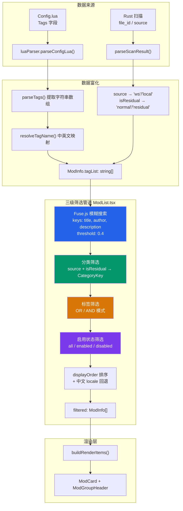
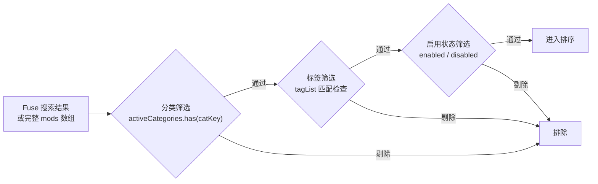

Mod 列表筛选系统是整个启动器最核心的交互层之一，它允许用户在数十甚至上百个 Mod 中快速定位目标。系统采用**三级管道架构**：模糊搜索作为第一级过滤器，分类/标签/启用状态作为第二级精确筛选，displayOrder 排序作为第三级输出整形。三级管道依次串联，每一级缩小结果集，最终输出视觉渲染所需的 `filtered` 数组。

Sources: [ModList.tsx](src/components/ModList/ModList.tsx#L669-L701)

## 整体数据流

在深入细节之前，先理解筛选数据从何而来、经过哪些变换、最终流向何处。



Sources: [luaParser.ts](src/lib/luaParser.ts#L168-L208), [useModScanner.ts](src/hooks/useModScanner.ts#L73-L74), [ModList.tsx](src/components/ModList/ModList.tsx#L669-L701)

## 第一级：Fuse.js 模糊搜索引擎

Fuse.js 是整个筛选的第一道关口，负责将用户输入的搜索文本与 Mod 的三个关键字段进行模糊匹配。与简单的 `String.includes()` 不同，Fuse.js 使用 **Bitap 算法**进行近似字符串匹配，能容忍拼写错误和部分匹配。

### 实例化与配置

Fuse 实例通过 `useMemo` 惰性创建，仅在 `mods` 数组变化时重建索引。配置极为精简但精准：

| 参数 | 值 | 作用 |
|------|-----|------|
| `keys` | `["title", "author", "description"]` | 搜索权重按数组顺序排列，title 优先级最高 |
| `threshold` | `0.4` | 匹配阈值（0=完美匹配，1=全部匹配）。0.4 在精确性和容错性之间取得平衡 |

```typescript
const fuse = useMemo(
  () => new Fuse(mods, { keys: ["title", "author", "description"], threshold: 0.4 }),
  [mods],
);
```

当搜索框为空时，Fuse 被完全绕过，直接返回完整的 `[...mods]` 副本，避免不必要的计算开销。当搜索文本非空时，`fuse.search()` 返回按匹配分数排序的结果，取 `.item` 还原为 `ModInfo` 对象。

Sources: [ModList.tsx](src/components/ModList/ModList.tsx#L666-L669)

### threshold=0.4 的设计考量

阈值的选择经过了场景化的权衡。阈值过高（如 0.6+）会返回过多无关结果，降低筛选的"信号噪声比"；阈值过低（如 0.2-）则过于严格，用户输入稍有偏差就匹配不到目标。0.4 允许用户输入"工坊"匹配到标题含"创意工坊"的 Mod，也允许"author"近似匹配到实际作者名。同时，由于三个 key 按数组顺序有权重差异（title 优先于 author 优先于 description），同名不同作者的 Mod 也能被正确区分。

Sources: [ModList.tsx](src/components/ModList/ModList.tsx#L668-L668)

## 第二级：多维度精确筛选

模糊搜索之后，结果集进入三个独立的过滤器，它们串联执行，逐步收窄范围。

### 筛选执行顺序（串联管道，非并行）



所有筛选条件同时生效时的实际效果是**交集运算**：一个 Mod 必须同时满足分类、标签、启用状态三个维度的条件才会出现在最终列表中。

Sources: [ModList.tsx](src/components/ModList/ModList.tsx#L670-L691)

### 分类筛选：source × isResidual 四象限

分类系统基于两个正交维度——`source`（来源）和 `isResidual`（残留状态）——交叉产生四个类别：

| CategoryKey | 标签 | source | isResidual | 默认选中 |
|-------------|------|--------|------------|---------|
| `ws-normal` | 创意工坊 正常 | 1 (Workshop) | false | ✅ |
| `ws-residual` | 创意工坊 残留 | 1 (Workshop) | true | ❌ |
| `local-normal` | 本地 正常 | 0 (Local) | false | ✅ |
| `local-residual` | 本地 残留 | 0 (Local) | true | ❌ |

分类 Key 的构造逻辑遵循 `{source_prefix}-{residual_flag}` 模式：

```typescript
const catKey = `${m.source === 1 ? "ws" : "local"}-${m.isResidual ? "residual" : "normal"}` as CategoryKey;
```

**残留 Mod** 是指 Config.lua 解析失败或文件为空的 Mod——通常对应创意工坊取消订阅后残留的空目录，或本地未正确配置的 Mod。默认情况下，两类残留均被排除在视图外，用户需要主动勾选才能看到。这一设计避免了无效条目污染正常浏览体验。

Sources: [useModListState.ts](src/components/ModList/useModListState.ts#L6-L12), [ModList.tsx](src/components/ModList/ModList.tsx#L675-L678)

分类常量 `FILTER_CATEGORIES` 定义在 `useModListState.ts` 中，使用 `as const` 断言为只读元组，衍生出的 `CategoryKey` 类型确保类型安全。

Sources: [useModListState.ts](src/components/ModList/useModListState.ts#L6-L14)

### 标签筛选：OR/AND 双模式

标签是 Mod 作者在 Config.lua 中通过 `Tags` 字段声明的分类元数据，原始值为英文（如 `Arts`、`Frameworks`），经 `tagMapping.ts` 映射为中文后存入 `ModInfo.tagList`。

标签筛选支持两种匹配逻辑：

| 模式 | 逻辑 | 语义 | UI 颜色 |
|------|------|------|---------|
| OR（或） | `tagList.some(t => activeTags.has(t))` | 只要匹配任意一个选中标签即通过 | 蓝色 |
| AND（与） | `[...activeTags].every(t => tagList.includes(t))` | 必须同时包含所有选中标签才通过 | 琥珀色 |

OR 模式（默认）适用于"我想看所有美化类或框架类 Mod"的宽泛浏览场景；AND 模式适用于"我需要同时是框架且是优化的 Mod"的精确定位场景。模式切换按钮仅在至少选中一个标签时显示，避免无意义的空状态操作。

Sources: [ModList.tsx](src/components/ModList/ModList.tsx#L680-L685), [ModFilterBar.tsx](src/components/ModList/ModFilterBar.tsx#L148-L175)

### 启用状态筛选：三态循环

启用状态过滤器是一个简单的三态循环开关，通过 `cycleEnabledFilter()` 函数在三种状态间轮转：

```typescript
const cycleEnabledFilter = () => {
  setEnabledFilter((prev) => {
    if (prev === "all") return "enabled";
    if (prev === "enabled") return "disabled";
    return "all";
  });
};
```

三种状态下按钮的颜色反馈各不相同——全部为灰色中性色，已启用为绿色积极色，已禁用为琥珀色警告色——让用户无需阅读文字即可感知当前过滤模式。

Sources: [useModListState.ts](src/components/ModList/useModListState.ts#L37-L42), [ModList.tsx](src/components/ModList/ModList.tsx#L687-L689)

## 第三级：displayOrder 排序整形

筛选完成后，结果集按 `displayOrder` 数组排序。`displayOrder` 是一个由用户通过拖拽操作动态维护的 `string[]`，每个元素格式为 `"{source}_{fileId}"`（如 `"1_123456789"`）。排序逻辑如下：

```typescript
result.sort((a, b) => {
  const idxA = filter.displayOrder.indexOf(`${a.source}_${a.fileId}`);
  const idxB = filter.displayOrder.indexOf(`${b.source}_${b.fileId}`);
  const rankA = idxA === -1 ? Infinity : idxA;
  const rankB = idxB === -1 ? Infinity : idxB;
  return rankA - rankB || a.title.localeCompare(b.title, "zh");
});
```

排序分为两层：第一层按 `displayOrder` 中的索引位置排列，不在数组中的条目（新扫描到的 Mod）获得 `Infinity` 排名被推到末尾；第二层回退使用 `title.localeCompare(b.title, "zh")` 进行中文拼音排序，确保在同等优先级下中文标题按拼音顺序排列而非 Unicode 码点排列。

Sources: [ModList.tsx](src/components/ModList/ModList.tsx#L691-L699)

## 状态管理：useModListState Hook

所有筛选状态集中由 `useModListState` 自定义 Hook 管理，返回一组状态和操作函数。这种设计将过滤逻辑与渲染逻辑解耦，使 ModList 组件保持关注点单一。

### 状态一览

| 状态 | 类型 | 初始值 | 持久化 |
|------|------|--------|--------|
| `search` | `string` | `""` | ❌ |
| `enabledFilter` | `"all" \| "enabled" \| "disabled"` | `"all"` | ❌ |
| `activeCategories` | `Set<CategoryKey>` | 只含非残留类别 | ✅ |
| `activeTags` | `Set<string>` | 空 Set | ❌ |
| `tagMode` | `"or" \| "and"` | `"or"` | ✅ |
| `viewMode` | `"detailed" \| "compact"` | `"detailed"` | ✅ |
| `displayOrder` | `string[]` | `[]` | ✅ |

**持久化策略**：`activeCategories`、`tagMode`、`viewMode`、`displayOrder` 四个状态通过 `localStorage` 的 `"twm-filter-prefs"` 键进行持久化。搜索文本和启用筛选器属于临时性操作意图，不持久化；标签选中属于高度上下文相关的临时筛选，也不持久化。

Sources: [useModListState.ts](src/components/ModList/useModListState.ts#L19-L169)

### allTags 派生逻辑

`allTags` 通过 `useMemo` 从所有 Mod 的 `tagList` 中提取并排序：

```typescript
const allTags = useMemo(() => {
  const set = new Set<string>();
  mods.forEach((m) => m.tagList.forEach((t) => set.add(t)));
  return [...set].sort();
}, [mods]);
```

只有当 `mods` 数组引用变化时（即新扫描完成后），这个计算才会重新执行，确保标签下拉列表与实际可用标签保持同步。

Sources: [useModListState.ts](src/components/ModList/useModListState.ts#L105-L109)

### 下拉菜单的外部点击关闭

分类和标签两个下拉菜单通过同一个 `useEffect` 监听全局 `mousedown` 事件。当点击发生在下拉容器外部时关闭菜单，这是标准的"点击外部关闭"模式（click outside pattern）。两个 `RefObject` 分别绑定到各自的容器 DOM 元素上，事件处理器检查 `e.target` 是否在容器子树中。

Sources: [useModListState.ts](src/components/ModList/useModListState.ts#L111-L125)

## UI 层：ModFilterBar 组件

`ModFilterBar` 是一个纯展示组件，接收所有状态和回调作为 props，不持有任何内部状态。它位于 Mod 列表顶部，以水平工具栏形式排列所有筛选控件。

### 控件布局（从左到右）

```
[🔍 搜索框] [全部/已启用/已禁用] [分类 ▼] [标签 ▼] [应用顺序] [紧凑/详细] [+ 分组]
```

**搜索框**：占剩余空间（`flex-1 min-w-48`），带搜索图标，placeholder 提示搜索范围（名称、作者、描述）。

**启用状态按钮**：三态循环，颜色随状态变化——灰色（全部）、绿色（已启用）、琥珀色（已禁用）。

**分类下拉**：居中定位的弹出面板（`left-1/2 -translate-x-1/2`），每个选项带复选框。当前选中的分类数量无外部视觉指示（与标签下拉不同）。

**标签下拉**：当有标签被选中时，按钮边框变为蓝色并显示选中数量徽章 `(N)`。弹出面板顶部有 OR/AND 模式切换栏，仅在至少选中一个标签时显示。空标签时显示"暂无标签"提示。

**应用顺序按钮**：将当前已启用 Mod 的加载顺序从 0 开始重新编号，琥珀色边框表示这是一个有副作用的操作。

**视图切换按钮**：在"详细"和"紧凑"之间切换，显示的是切换目标的名称（当前详细→显示"紧凑"）。

**分组创建按钮**：蓝色按钮，支持拖拽到列表中创建分组（触发 `onGroupCreateMouseDown`）。

Sources: [ModFilterBar.tsx](src/components/ModFilterBar/ModFilterBar.tsx#L58-L249)

## 标签数据管道：从 Lua 到 UI

标签的完整生命周期展示了系统的数据溯源能力：

```mermaid
flowchart LR
    A["Config.lua<br/>Tags = { 'Arts', 'Frameworks' }"] 
    --> B["luaParser.parseConfigLua()"]
    --> C["parseTags() 处理<br/>数组/对象两种格式"]
    --> D["ParsedConfig.tags: string[]"]
    --> E["useModScanner.parseScanResult()<br/>tags.map(resolveTagName)"]
    --> F["resolveTagName()<br/>Arts→美化, Frameworks→框架"]
    --> G["ModInfo.tagList"]
    --> H["useModListState.allTags<br/>Set 去重 + 排序"]
    --> I["ModFilterBar 标签下拉"]
    --> J["filtered 筛选<br/>OR/AND 匹配"]
```



**parseTags 的容错设计**：`parseTags()` 同时处理数组格式 `{ "Arts", "Frameworks" }` 和键值对象格式 `{ [1] = "Arts", [2] = "Frameworks" }`，后者是 Lua 中常见的表数组表示形式。这种兼容性确保不同 Mod 作者的写法差异不会导致标签丢失。

Sources: [luaParser.ts](src/lib/luaParser.ts#L321-L327), [useModScanner.ts](src/hooks/useModScanner.ts#L74), [tagMapping.ts](src/utils/tagMapping.ts#L1-L18)

**tagMapping 回退策略**：`resolveTagName()` 在映射表中找不到对应中文时，直接返回原始英文值，确保未映射的标签仍能正常显示和筛选，只是以英文形式呈现。

Sources: [tagMapping.ts](src/utils/tagMapping.ts#L15-L17)

## 筛选与渲染的桥接：buildRenderItems

筛选结果 `filtered` 并非直接渲染，而是作为 `buildRenderItems()` 的参数之一，与 `displayOrder`、`groups`、`groupOrder` 等协同计算出最终的 `RenderItem[]` 数组。`buildRenderItems` 中的 `emitGroup()` 函数在发射分组内 Mod 卡片时，会检查每个 Mod 是否存在于 `filtered` 中：

```typescript
const sorted = group.modKeys
  .map((k) => ({
    key: k,
    mod: filtered.find((m) => `${m.source}_${m.fileId}` === k),
  }))
  .filter((x): x is { key: string; mod: ModInfo } => x.mod != null)
```

这意味着被筛选掉的 Mod 会在分组内部也消失——如果一个分组内的所有 Mod 都被筛掉了，分组头部仍然显示（因为它是独立于筛选的），但内部为空。

Sources: [utils.ts](src/components/ModList/utils.ts#L148-L157)

## 筛选状态持久化与恢复

虽然完整的持久化机制将在下一页 [筛选状态持久化：localStorage 缓存与启动恢复](15-shai-xuan-zhuang-tai-chi-jiu-hua-localstorage-huan-cun-yu-qi-dong-hui-fu) 中详述，但本页需要指出持久化的触发点：`useModListState` 中的 `useEffect` 以 `activeCategories`、`tagMode`、`viewMode`、`displayOrder` 为依赖，在任一值变化时写入 `localStorage`。此外，`ModList.tsx` 中还有一个独立的持久化 `useEffect`，额外保存 `groups` 和 `groupOrder`。

Sources: [useModListState.ts](src/components/ModList/useModListState.ts#L127-L145), [ModList.tsx](src/components/ModList/ModList.tsx#L485-L501)

## 页脚统计信息

筛选工具栏下方、列表底部的统计栏提供实时反馈：

```
共 N 个 Mod | M 已启用 | 显示 K 个
```

其中 `显示 K 个` 仅在筛选后结果少于总数时出现，是一种非侵入式的筛选状态提示。当保存操作进行中时，右侧额外显示"保存中..."指示器。

Sources: [ModList.tsx](src/components/ModList/ModList.tsx#L963-L971)

## 架构要点总结

| 维度 | 设计决策 | 理由 |
|------|---------|------|
| Fuse.js 阈值 | 0.4 | 平衡精确性与容错性 |
| 搜索 keys 顺序 | title → author → description | title 权重最高，匹配更精准 |
| 筛选管道 | 串联（非并行） | 每一步缩小数据集，后续计算更快 |
| 残留 Mod 默认隐藏 | 初始只选中 normal 类别 | 避免无效条目干扰正常浏览 |
| 标签默认模式 | OR | 浏览场景比精确定位更常见 |
| 搜索文本不持久化 | 每次启动清空 | 搜索是瞬时意图，跨会话无意义 |
| 分类/视图/排序持久化 | localStorage | 用户偏好应跨会话保留 |

Sources: [ModList.tsx](src/components/ModList/ModList.tsx#L666-L701), [useModListState.ts](src/components/ModList/useModListState.ts#L50-L58)

## 阅读下一步

筛选系统是所有 Mod 列表交互的基石。理解了筛选的数据流后，建议继续阅读：

- **[筛选状态持久化：localStorage 缓存与启动恢复](15-shai-xuan-zhuang-tai-chi-jiu-hua-localstorage-huan-cun-yu-qi-dong-hui-fu)** — 了解筛选偏好的跨会话保持机制
- **[渲染模型：displayOrder + ModGroup 驱动的 buildRenderItems 算法](12-xuan-ran-mo-xing-displayorder-modgroup-qu-dong-de-buildrenderitems-suan-fa)** — 理解筛选结果如何与分组系统结合生成最终渲染列表
- **[标签中英文映射：tagMapping 国际化适配](28-biao-qian-zhong-ying-wen-ying-she-tagmapping-guo-ji-hua-gua-pei)** — 深入标签名称的本地化映射机制