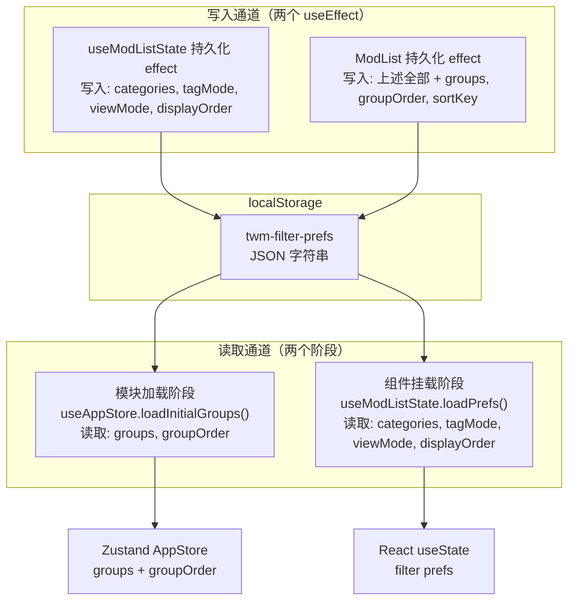
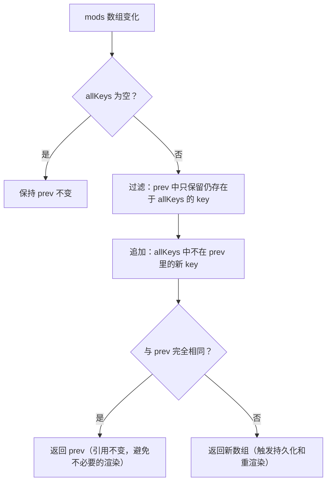
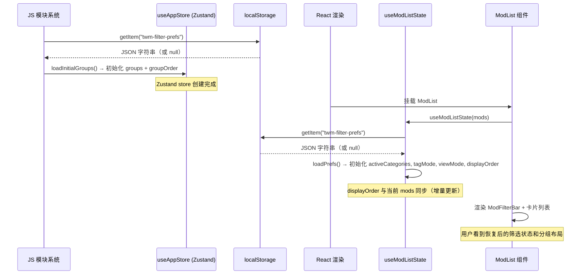

本文档剖析筛选偏好（分类、标签模式、视图模式、卡片排序、分组结构）在 `localStorage` 中的持久化机制，以及应用启动时如何从缓存中恢复这些状态。该机制确保了用户在关闭并重新打开启动器后，无需重新配置筛选条件和分组布局。

## 架构总览：单一缓存键 + 双通道读写

整个持久化系统围绕一个 `localStorage` 键 `twm-filter-prefs` 运转。它的设计核心是**一份 JSON 承载多类偏好**——筛选条件、视图偏好、自定义排序、虚拟分组——全部序列化到同一个键下，由两个独立的写入通道和一个分阶段的读取通道协作维护。



这个双重写入设计并非冗余——`useModListState` 的 effect 在筛选偏好变化时立即触发，提供低延迟的独立持久化；`ModList` 的 effect 在分组或排序变化时写入完整快照，始终携带最全的数据集。由于两者写入同一键，后者（拥有超集数据）天然成为权威写入源。

Sources: [useModListState.ts](src/components/ModList/useModListState.ts#L136-L149) | [ModList.tsx](src/components/ModList/ModList.tsx#L480-L498)

## 持久化内容：选择性缓存策略

并非所有筛选状态都被持久化。设计上有意区分了**结构性偏好**（跨会话有价值）与**瞬时交互状态**（仅当次会话有意义）。

| 状态字段 | 类型 | 是否持久化 | 默认值（无缓存时） | 设计理由 |
|---|---|---|---|---|
| `activeCategories` | `Set<CategoryKey>` | ✅ 是 | 排除残留分类（`ws-normal`, `local-normal`） | 用户对 Mod 来源的偏好是稳定的 |
| `tagMode` | `"or" \| "and"` | ✅ 是 | `"or"` | 标签匹配逻辑影响筛选结果，值得保留 |
| `viewMode` | `"detailed" \| "compact"` | ✅ 是 | `"detailed"` | 视图密度是持久的显示偏好 |
| `displayOrder` | `string[]` | ✅ 是 | `[]`（空数组） | 卡片自定义排序是核心用户数据 |
| `groups` | `ModGroup[]` | ✅ 是 | `[]` | 虚拟分组是用户投入精力创建的结构 |
| `groupOrder` | `string[]` | ✅ 是 | `[]` | 分组显示顺序需要保持 |
| `search` | `string` | ❌ 否 | `""` | 搜索词是临时的，重启后应为空 |
| `enabledFilter` | `"all" \| "enabled" \| "disabled"` | ❌ 否 | `"all"` | 快速切换，无持久必要 |
| `activeTags` | `Set<string>` | ❌ 否 | `new Set()` | 标签选择高度依赖当次浏览上下文 |

这种选择性策略确保缓存体积可控，同时避免给用户"上次的搜索词还在输入框里"的困惑体验。**搜索框**、**启用状态切换按钮**和**标签多选**在每次启动时干净重置，而分类筛选、标签匹配模式、视图密度、自定义排序和分组结构则无缝恢复。

Sources: [useModListState.ts](src/components/ModList/useModListState.ts#L43-L73)

## 写入通道：双 Effect 协作模型

### 通道一：useModListState 内部持久化

`useModListState` hook 内部包含一个 `useEffect`，监听 `[activeCategories, tagMode, viewMode, displayOrder]` 四个依赖项。当任一依赖变化时，它将这四个字段序列化为 JSON 写入 `twm-filter-prefs`。这个 effect 的触发频率较高——用户切换一个分类复选框、切换标签模式、切换视图密度、或通过拖拽改变卡片顺序时都会触发。

```typescript
// useModListState.ts 中的持久化 effect
useEffect(() => {
    try {
      localStorage.setItem(
        PREFS_KEY,  // "twm-filter-prefs"
        JSON.stringify({
          activeCategories: [...activeCategories],
          tagMode,
          viewMode,
          displayOrder,
        }),
      );
    } catch {
      /* quota exceeded — ignore */
    }
}, [activeCategories, tagMode, viewMode, displayOrder]);
```

Sources: [useModListState.ts](src/components/ModList/useModListState.ts#L136-L149)

### 通道二：ModList 组件级持久化（权威写入）

`ModList` 组件在渲染层持有来自 Zustand 的 `groups` 和 `groupOrder`，以及来自 `useModListState` 返回的 `filter` 对象。它的持久化 effect 监听了 `[filter.activeCategories, filter.tagMode, filter.viewMode, groups, filter.displayOrder, groupOrder]` 六个依赖项，写入的数据是通道一的**超集**——额外包含 `sortKey`（固定为 `"custom"`）、`groups` 和 `groupOrder`。

```typescript
// ModList.tsx 中的持久化 effect
useEffect(() => {
    try {
      localStorage.setItem(
        "twm-filter-prefs",
        JSON.stringify({
          sortKey: "custom",
          activeCategories: [...filter.activeCategories],
          tagMode: filter.tagMode,
          viewMode: filter.viewMode,
          groups,
          displayOrder: filter.displayOrder,
          groupOrder,
        }),
      );
    } catch {
      /* ignore */
    }
}, [filter.activeCategories, filter.tagMode, filter.viewMode, groups, filter.displayOrder, groupOrder]);
```

由于两个 effect 写入同一键且通道二的依赖项覆盖了通道一的依赖项，每当分组或排序变化时通道二触发；当仅筛选偏好变化时两个通道几乎同时触发，通道二（在组件树中层级更高、渲染顺序靠后）的写入最终覆盖通道一的写入，从而保证了数据的完整性和一致性。

Sources: [ModList.tsx](src/components/ModList/ModList.tsx#L480-L498)

## 读取通道：模块加载与组件挂载的分阶段恢复

启动恢复分为两个时间点，这是因为数据消费者分布在不同层级——Zustand store 在模块求值时即初始化，而 React 状态在组件挂载时才初始化。

### 阶段一：模块加载时恢复分组（useAppStore 初始化）

`useAppStore.ts` 在模块顶层调用 `loadInitialGroups()`，该函数在 Zustand store 创建之前同步执行。它从 `twm-filter-prefs` 中读取 `groups` 和 `groupOrder`，并执行两层去重保护：

1. **组内去重**：对每个 group 的 `modKeys` 数组应用 `new Set()`，消除可能的重复条目。
2. **跨组去重**：按 `groupOrder` 优先级排序所有分组，然后依次遍历——如果某个 modKey 已出现在更高优先级的分组中，则从后续分组的 `modKeys` 中移除。这确保了每个 mod 只属于一个分组。

```typescript
function loadInitialGroups(): { groups: ModGroup[]; groupOrder: string[] } {
  try {
    const raw = localStorage.getItem("twm-filter-prefs");
    if (raw) {
      const prefs = JSON.parse(raw);
      // 组内去重 + 跨组去重（按 groupOrder 优先级）
      // ...返回清洗后的 groups 和 groupOrder
    }
  } catch { /* 解析失败 → 返回空数组 */ }
  return { groups: [], groupOrder: [] };
}
```

这种去重是防御性的——正常操作流程不会产生重复数据，但如果 localStorage 被外部修改或之前的版本有 bug 导致数据损坏，去重逻辑确保应用不会因此崩溃。

Sources: [useAppStore.ts](src/store/useAppStore.ts#L4-L44)

### 阶段二：组件挂载时恢复筛选偏好（useModListState 初始化）

当 `ModList` 组件挂载时，`useModListState(mods)` 被调用。在 hook 内部，`loadPrefs()` 从 `twm-filter-prefs` 读取缓存，用于初始化四个 `useState`：

| 状态 | 初始化逻辑 |
|---|---|
| `activeCategories` | 有缓存 → `new Set(cached.activeCategories)`；无缓存 → 默认排除残留分类 |
| `tagMode` | `cached?.tagMode ?? "or"` |
| `viewMode` | `cached?.viewMode ?? "detailed"` |
| `displayOrder` | `cached?.displayOrder ?? []` |

注意 `search`、`enabledFilter`、`activeTags` 不使用缓存，始终以默认值初始化——它们属于前文所述的瞬时交互状态。

Sources: [useModListState.ts](src/components/ModList/useModListState.ts#L43-L73)

## displayOrder 的自动同步：增量更新算法

`displayOrder` 是持久化体系中最关键的字段——它直接驱动 `buildRenderItems` 算法决定卡片的视觉排列。当 Mod 列表发生变化时（新增或移除 Mod），必须同步更新 `displayOrder`，否则会出现"幽灵卡片"（已删除的 Mod 仍在排序中）或"隐形卡片"（新 Mod 在排序中缺失）。

`useModListState` 中的 `useEffect` 实现了这个同步逻辑：



这个算法保证了两个关键行为：**已删除 Mod 的 key 被自动清理**，**新发现的 Mod 被追加到排序末尾**。同时，它通过引用相等性检查避免了在无变化时触发不必要的重渲染和持久化写入。

Sources: [useModListState.ts](src/components/ModList/useModListState.ts#L85-L103)

## groupOrder 的自动同步：与 groups 的联动维护

`ModList` 组件中还有一个专门的 `useEffect` 负责维护 `groupOrder` 与 `groups` 的一致性：当分组被删除时，对应的 ID 从 `groupOrder` 中移除；当新增分组时，其 ID 被追加到 `groupOrder` 末尾。这个 effect 确保 `groupOrder` 始终是 `groups` 中所有 ID 的一个排列。

```typescript
useEffect(() => {
    const groupIdSet = new Set(groups.map((g) => g.id));
    let changed = false;
    const filtered = groupOrder.filter((id) => {
      const ok = groupIdSet.has(id);
      if (!ok) changed = true;
      return ok;
    });
    for (const g of groups) {
      if (!filtered.includes(g.id)) {
        filtered.push(g.id);
        changed = true;
      }
    }
    if (changed) setGroupOrder(filtered);
}, [groups, groupOrder, setGroupOrder]);
```

Sources: [ModList.tsx](src/components/ModList/ModList.tsx#L500-L515)

## 错误处理：静默降级策略

整个持久化系统采用**静默降级**策略——所有 `localStorage` 读写操作都包裹在 `try/catch` 中，失败时不会向用户展示错误，而是回退到安全默认值。

| 操作 | 失败场景 | 降级行为 |
|---|---|---|
| `loadPrefs()` 读取 | JSON 解析失败、数据结构不符预期 | 返回 `null`，调用方使用默认值 |
| `loadInitialGroups()` 读取 | JSON 解析失败 | 返回 `{ groups: [], groupOrder: [] }` |
| 两个 effect 写入 | `localStorage` 配额超限、隐私模式禁止写入 | 静默忽略，本次会话的筛选/分组状态仅在内存中保留 |

这种策略的取舍是明确的：筛选和分组偏好是**增强体验**的数据，不是**关键业务**数据。即使 localStorage 完全不可用（例如浏览器隐私模式），应用的核心功能——Mod 扫描、启用/禁用、保存——仍然可以正常工作，只是用户每次启动需要重新配置筛选条件。

Sources: [useModListState.ts](src/components/ModList/useModListState.ts#L23-L29) | [useModListState.ts](src/components/ModList/useModListState.ts#L143-L148) | [useAppStore.ts](src/store/useAppStore.ts#L4-L7) | [ModList.tsx](src/components/ModList/ModList.tsx#L495-L497)

## 完整启动恢复时序

下图汇总了从应用启动到筛选状态完全恢复的完整时序：



关键时序要点：`useAppStore` 中 `groups`/`groupOrder` 的恢复发生在 **React 渲染之前**（模块求值阶段），这意味着 `ModList` 首次渲染时，`groups` 已经是可用状态——不存在"先渲染空分组再闪现填充"的问题。筛选偏好的恢复发生在组件挂载时，但由于 React 的同步渲染特性，用户看到的初始 UI 已经包含了缓存中的分类、标签模式和视图密度设置。

Sources: [useAppStore.ts](src/store/useAppStore.ts#L4-L45) | [useModListState.ts](src/components/ModList/useModListState.ts#L19-L73) | [ModList.tsx](src/components/ModList/ModList.tsx#L56-L83)

## 与相关系统的交互

筛选状态持久化与多个子系统存在数据流关系：

- **[筛选系统：Fuse.js 模糊搜索 + 分类/标签/启用状态多条件过滤](14-shai-xuan-xi-tong-fuse-js-mo-hu-sou-suo-fen-lei-biao-qian-qi-yong-zhuang-tai-duo-tiao-jian-guo-lu)**：持久化的 `activeCategories`、`tagMode` 直接作为筛选管线的输入参数；未持久化的 `search`、`enabledFilter`、`activeTags` 则每次启动重置。
- **[渲染模型：displayOrder + ModGroup 驱动的 buildRenderItems 算法](12-xuan-ran-mo-xing-displayorder-modgroup-qu-dong-de-buildrenderitems-suan-fa)**：持久化的 `displayOrder`、`groups`、`groupOrder` 是 `buildRenderItems` 的三个核心输入，决定了卡片的视觉排列。
- **[状态管理：Zustand 双 Store 设计](7-zhuang-tai-guan-li-zustand-shuang-store-she-ji-appstore-yu-modstore)**：`useAppStore` 在模块加载时从 localStorage 恢复 `groups` 和 `groupOrder`，之后由 `ModList` 的持久化 effect 负责写回。
- **[三套拖拽系统](13-san-tao-tuo-zhuai-xi-tong-qia-pian-tuo-zhuai-fen-zu-tou-bu-tuo-zhuai-yu-fen-zu-chuang-jian-tuo-zhuai)**：拖拽操作直接修改 `displayOrder`、`groups`、`groupOrder`，其变更通过持久化 effect 自动同步到 localStorage。