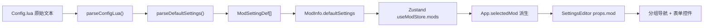

当用户点击 Mod 列表中的某个 Mod 卡片时，主视图从 ModList 切换为 SettingsEditor——一个**左导航右表单**的双栏设置编辑器。它根据 Mod 的 `defaultSettings`（从 Config.lua 解析而来）动态渲染三种表单控件：Toggle 开关、Slider 滑块和 Dropdown 下拉菜单，支持按分组筛选并即时跟踪脏状态。

Sources: [SettingsEditor.tsx](src/components/SettingsEditor/SettingsEditor.tsx#L1-L118) [SettingField.tsx](src/components/SettingsEditor/SettingField.tsx#L1-L139)

## 数据流全景：从 Lua 到 UI

SettingsEditor 的渲染数据来自一条完整的解析管线。首先，Rust 端扫描 Mod 目录时读取 Config.lua 原始文本，前端 `parseConfigLua()` 使用 luaparse 将其解析为 `ParsedConfig` 结构，其中的 `defaultSettings` 字段由 `parseDefaultSettings()` 递归构造。该函数遍历 Lua 表数组，调用 `parseOneSetting()` 将每个条目映射为 `ModSettingDef` 对象，包含 `settingType`、`key`、`displayName`、`description`、`groupName`、`defaultValue` 等字段以及 Slider 专属的 `minValue`/`maxValue`/`stepSize` 和 Dropdown 专属的 `options` 数字-标签映射。

Sources: [luaParser.ts](src/lib/luaParser.ts#L170-L211) [luaParser.ts](src/lib/luaParser.ts#L325-L373)

解析后的 `ModSettingDef[]` 存储在 `ModInfo.defaultSettings` 中，而 `ModInfo.currentSettings` 则保存当前生效的值（初始等于从 Mod 的 Settings.Lua 中解析出的 `Record<string, unknown>`）。这两个字段随整个 Mod 数组一起存入 Zustand 的 `useModStore.mods`。

Sources: [types.ts](src/lib/types.ts#L36-L75) [useModStore.ts](src/store/useModStore.ts#L4-L12)

当用户在 ModList 中点击一个 Mod 卡片时，调用链为 `handleSelectMod(key)` → `selectMod(key)`，将 `selectedModKey` 设为 `"source_fileId"` 格式的字符串。随后 `selectedMod` 通过 `mods.find()` 派生出来，作为 props 传给 SettingsEditor。

Sources: [App.tsx](src/App.tsx#L397-L408) [App.tsx](src/App.tsx#L589-L601)

下图展示完整的数据流：

## 组件架构

### SettingsEditor：容器与分组路由

`SettingsEditor` 是一个纯展示组件，接收三个 props：

| Prop | 类型 | 用途 |
|------|------|------|
| `mod` | `ModInfo` | 包含 `defaultSettings`（定义）、`currentSettings`（当前值）、`title`、`author` 的完整 Mod 对象 |
| `onClose` | `() => void` | 关闭编辑器，实际调用 `selectMod(null)` 清除选中状态 |
| `onSettingsSaved` | `(settings: Record<string, unknown>) => void` | 每次值变更时回调，触发 Zustand 更新与脏标记 |

Sources: [SettingsEditor.tsx](src/components/SettingsEditor/SettingsEditor.tsx#L5-L9)

组件内部维护两个关键 state：

- **`values`**：以 `mod.currentSettings` 的浅拷贝初始化，作为编辑器内部的局部状态副本。每次 `handleChange` 触发时更新此副本，确保 UI 响应即时。
- **`activeGroup`**：当前选中的分组名，默认空字符串。在 `groups` 的 `useMemo` 中，若分组列表非空且 `activeGroup` 为空，则自动设为第一个分组。

Sources: [SettingsEditor.tsx](src/components/SettingsEditor/SettingsEditor.tsx#L12-L15) [SettingsEditor.tsx](src/components/SettingsEditor/SettingsEditor.tsx#L28-L30)

**分组推导逻辑**：`groups` 数组通过遍历 `mod.defaultSettings` 的所有项，提取每个 `ModSettingDef.groupName`（若为空则回退为 `"其他"`），去重后生成唯一的排序分组列表。`filteredSettings` 则根据 `activeGroup` 筛选出当前分组下的设置项，传递给 `SettingField` 组件逐条渲染。

Sources: [SettingsEditor.tsx](src/components/SettingsEditor/SettingsEditor.tsx#L18-L40)

**即时脏状态传播**：`handleChange` 回调的设计是理解整个"跨 Mod 未保存检测"机制的关键。每次表单值变更时，它同步执行两步：先更新本地 `values` state（通过函数式 setState 避免闭包过期），然后立即调用 `onSettingsSaved(next)`。在 App 层，`onSettingsSaved` 的实现依次调用 `updateModSettings`（写入 Zustand 中的 `mod.currentSettings`）、`addDirtyModSetting`（将当前 mod key 加入 `dirtyModSettings` 数组）、`setDirty(true)`（标记全局脏状态）。这使得工具栏的"未保存"指示灯在主线程的任何渲染帧中都能感知到变更，无需等待编辑器关闭。

Sources: [SettingsEditor.tsx](src/components/SettingsEditor/SettingsEditor.tsx#L44-L53) [App.tsx](src/App.tsx#L594-L598) [useAppStore.ts](src/store/useAppStore.ts#L106-L111)

### SettingField：控件分发器

`SettingField` 是表单控件的统一入口。它接收一个 `ModSettingDef`（定义）、当前 `value` 和 `onChange` 回调，然后根据 `setting.settingType` 分发到三个内部子组件之一。

Sources: [SettingField.tsx](src/components/SettingsEditor/SettingField.tsx#L9-L49)

每个 SettingField 行由两个区域构成：左侧是 `displayName`（粗体标签）和可选的 `description`（灰色辅助文字），右侧是对应的表单控件。行与行之间以 `border-b border-slate-700/50` 分隔，最后一行移除底部边框。

Sources: [SettingField.tsx](src/components/SettingsEditor/SettingField.tsx#L15-L24)

## 三种表单控件详解

### ToggleField：纯 CSS 开关

ToggleField 使用原生 `<input type="checkbox">` 配合 `sr-only` 隐藏，视觉表现完全由 CSS 驱动。外层 `<label>` 设为 `inline-flex` 和 `cursor-pointer`，内部 `
` 通过 Tailwind 的 `peer` 选择器实现状态联动：未选中时为灰色圆角条 (`bg-slate-600 rounded-full`)，选中后通过 `peer-checked:after:translate-x-full` 使内部圆形滑块平移到右侧。

值类型为 `boolean`，通过 `!!value` 转换为确定的布尔值传递给 checkbox 的 `checked` 属性，确保了来自 Lua 解析的 `true`/`false`、`1`/`0`、`nil` 等所有可能值都能正确映射。

Sources: [SettingField.tsx](src/components/SettingsEditor/SettingField.tsx#L51-L70)

### SliderField：范围输入 + 数值回显

SliderField 使用原生 `<input type="range">` 并配合三个数值约束参数——`min`（默认 0）、`max`（默认 100）、`step`（默认 1）——这些参数来自 `ModSettingDef` 中对应的可选字段。滑块右侧显示当前数值的只读文本 (`w-10 text-right tabular-nums`)，使用等宽数字字体确保个位与十位对齐。

值的类型安全处理值得注意：`rawValue` 先检查是否为 `number`，否则尝试 `Number(value)` 转换，失败时降级为 `min`。然后通过 `Math.min(Math.max(rawValue, min), max)` 将值钳制在合法范围内，防止 Lua 配置中的越界值导致滑块显示异常。

Sources: [SettingField.tsx](src/components/SettingsEditor/SettingField.tsx#L72-L103)

### DropdownField：数字键选项映射

DropdownField 使用原生 `<select>` 元素。其 `options` 来自 Lua 表中的 `Record<number, string>` 映射（如 `{0="关闭", 1="开启", 2="自动"}`），在渲染前转换为 `[number, string][]` 数组并按数字键升序排列。值同样经历类型转换：先检查是否为 `number`，否则尝试 `Number(value)` 转换，失败时降级为 `0`。

当 `options` 为空对象时，渲染一个禁用的占位 `<option>` 显示"无可用选项"，防止空白下拉框导致的可用性困惑。

Sources: [SettingField.tsx](src/components/SettingsEditor/SettingField.tsx#L105-L138)

### 三种控件的对照总结

| 特性 | Toggle | Slider | Dropdown |
|------|--------|--------|----------|
| Lua settingType | `"Toggle"` | `"Slider"` | `"Dropdown"` |
| 值类型 | `boolean` | `number` | `number` |
| 原生元素 | `<input type="checkbox">` | `<input type="range">` | `<select>` |
| 额外参数 | 无 | `minValue`, `maxValue`, `stepSize` | `options: Record<number, string>` |
| 非法值处理 | `!!value` 强制转布尔 | 钳制在 `[min, max]` 范围 | `Number(value) \|\| 0` |

## 布局与视觉设计

SettingsEditor 采用全高弹性布局 (`flex flex-col h-full bg-slate-900`)，分为三个区域：

1. **Header**（`shrink-0`）：展示 Mod 标题（`text-sm font-semibold`）和作者（`text-xs text-slate-500`），右侧提供"关闭"按钮。标题和作者文本均设置 `truncate` 防止溢出。

2. **Body**（`flex-1 flex overflow-hidden`）：水平分栏——左侧 36 单位宽度的分组导航栏 (`w-36`)，右侧弹性填充的设置表单区。导航栏内每个分组按钮在选中时呈现蓝色高亮效果：`bg-blue-600/30 text-blue-300 border-r-2 border-blue-500`，未选中时为灰色基调带悬停高亮。

3. **空状态处理**：当 `filteredSettings.length === 0` 时，右侧内容区显示"此分组暂无设置项"的提示文字。

Sources: [SettingsEditor.tsx](src/components/SettingsEditor/SettingsEditor.tsx#L56-L114)

## 与保存流程的集成

SettingsEditor 本身不负责持久化——它只负责编辑和即时标记脏状态。实际的保存由 App 层的 `handleSaveAll` 统一执行。保存时遍历 `dirtyModSettings` 数组中的每个 mod key，找到对应的 Mod 对象，调用 `generateSettingsLua(mod.currentSettings)` 生成 Settings.Lua 内容，再通过 Tauri 命令 `writeSettingsFile` 写入每个 Mod 目录。保存成功后调用 `removeDirtyModSettings` 清除对应的脏标记。

Sources: [App.tsx](src/App.tsx#L304-L353) [useAppStore.ts](src/store/useAppStore.ts#L113-L116)

## 阅读建议

本文档覆盖了 SettingsEditor 组件内部的渲染与交互逻辑。关于脏状态跟踪的完整机制（包括 `dirtyModSettings` 的增删周期、`isDirty` 全局标记与工具栏联动、关闭窗口前未保存提示），请参阅 [即时脏状态跟踪：跨 Mod 的未保存变更检测](17-ji-shi-zang-zhuang-tai-gen-zong-kua-mod-de-wei-bao-cun-bian-geng-jian-ce)。关于 Config.lua 的解析如何生成 `ModSettingDef` 的完整细节（包括 `defaultValue`、`options` 表的递归提取），请参阅 [Lua 配置解析：luaparse 驱动的 Config.lua / ModSettings.Lua / Settings.Lua 解析](9-lua-pei-zhi-jie-xi-luaparse-qu-dong-de-config-lua-modsettings-lua-settings-lua-jie-xi)。关于保存阶段 Settings.Lua 的生成算法（`generateSettingsLua`），请参阅上述即时脏状态跟踪文档。