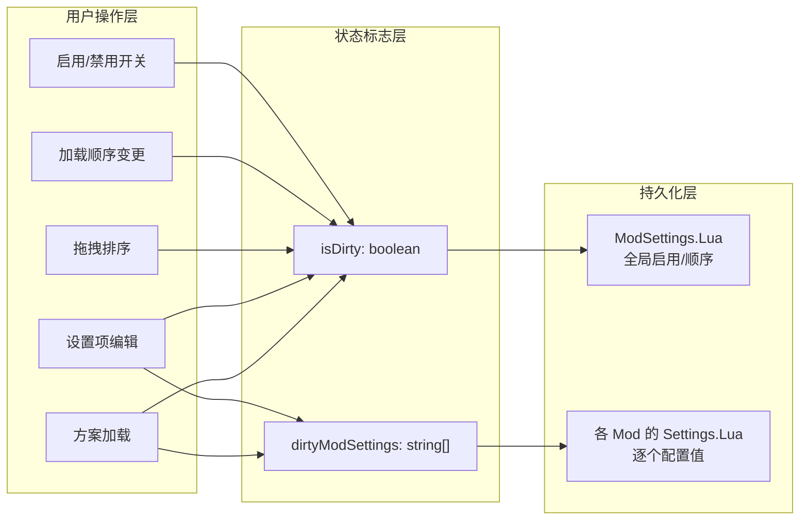
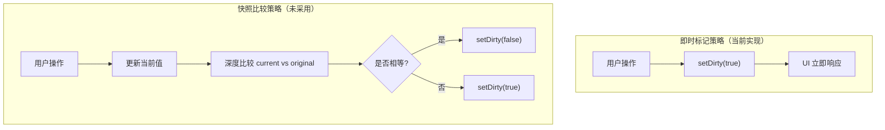
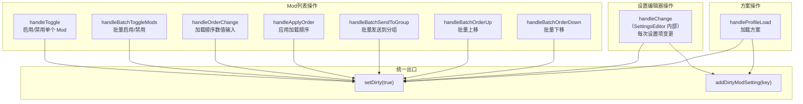
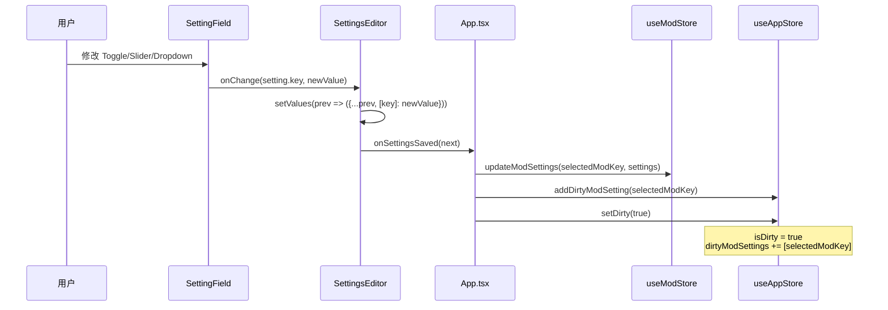
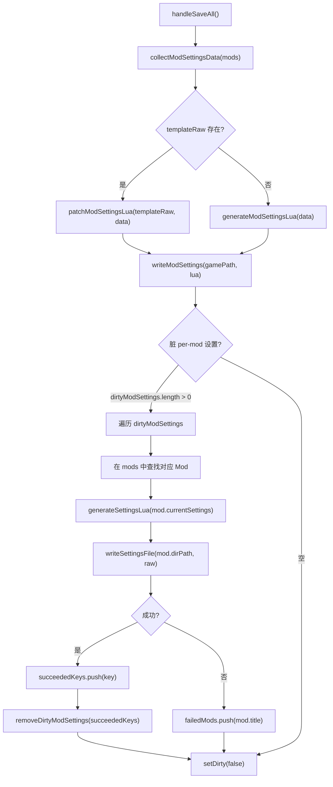
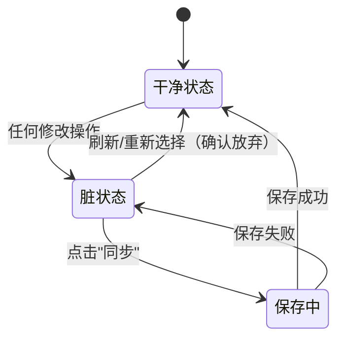

本文档深入解析 TWM Launcher 的脏状态跟踪机制——一个横跨全局 Mod 启用状态、加载顺序、分组操作和逐个 Mod 的 Settings.Lua 配置变更的统一变更检测系统。与传统的"原始值 vs 当前值"差异比较模式不同，本项目采用**即时标记策略**，以极简的布尔值+数组双标志设计，在任何用户操作发生瞬间即标记为"脏"，从而在整个应用生命周期内提供零延迟的未保存变更感知。

## 脏状态的双维度设计

脏状态跟踪的核心理念是将"需要同步到磁盘的变更"划分为两个正交维度：**全局 ModSettings.Lua 变更**和**逐个 Mod 的 Settings.Lua 配置变更**。这两类变更在存储介质上对应不同的文件，因此需要独立追踪，但在用户体验层面统一收敛为一个"同步"按钮。



| 维度 | 标志 | 数据类型 | 追踪内容 | 对应磁盘文件 |
|------|------|----------|----------|-------------|
| 全局变更 | `isDirty` | `boolean` | 启用状态、加载顺序、分组归属 | `ModSettings.Lua` |
| 逐个配置变更 | `dirtyModSettings` | `string[]` | 每个 Mod 的设置项值变更 | 各 Mod 目录下的 `Settings.Lua` |

Sources: [useAppStore.ts](src/store/useAppStore.ts#L64-L69)

这两个标志均定义在 `useAppStore`（Zustand 的 App Store）中，而非 `useModStore`。这是因为脏状态本质上是"应用级工作流状态"（需要保存、需要警告用户），而非"Mod 数据本身"。

## 即时标记策略：为什么不做差异比较

本系统选择了**无条件即时标记**而非传统的"快照-比较"模式。每当用户执行任何修改操作，`setDirty(true)` 被直接调用，不与任何原始值进行比对。



**设计取舍分析**：

| 维度 | 即时标记 | 快照比较 |
|------|---------|---------|
| 实现复杂度 | 极低：单一 setter 调用 | 高：需维护初始快照 + 深度比较逻辑 |
| 正确性风险 | 零：无比较即无比较错误 | 中等：`Record<string, unknown>` 深度相等判断容易出错 |
| "假阳性"代价 | 用户改回原值后仍标记为脏 | 无假阳性 |
| 实际影响 | 微不足道：写入操作本质上幂等 | — |

在 TWM Launcher 的场景中，"假阳性"（用户修改后改回原值，仍被标记为脏）的代价几乎为零——保存操作只是将相同内容重新写入磁盘，Lua 文件的写入开销可忽略不计，且原子写入策略确保了即使写入相同的值也不会损坏数据。

Sources: [useAppStore.ts](src/store/useAppStore.ts#L78-L79)

## 脏标记的触发源全景

脏状态由 App.tsx（顶层组件）和 ModList.tsx（Mod 列表组件）中分布的多个回调函数触发。每个触发点都精确对应一种用户意图明确的修改操作。

### 触发源分类



**关键观察**：Mod 列表中的拖拽排序操作（`useCardDrag` / `useGroupHeaderDrag` / `useGroupCreateDrag`）**不直接触发** `setDirty(true)`。拖拽仅改变前端的 `displayOrder`（本地状态），实际的加载顺序需要通过"应用加载顺序"按钮（`handleApplyOrder`）来显式提交，此时才标记脏状态。这种两阶段设计允许用户在拖拽实验中自由调整而不产生脏标记，只有明确"确认"后才进入待保存状态。

Sources: [ModList.tsx](src/components/ModList/ModList.tsx#L64)

### Mod 列表中的触发点详解

以最常用的 `handleToggle` 为例——启用/禁用开关被点击时：

```
handleToggle(fileId, enabled)
  ├── toggleMod(fileId, enabled)    // ModStore: 更新 mods 数组中对应 mod 的 enabled 字段
  └── setDirty(true)                // AppStore: 标记全局脏状态
```

`toggleMod` 是 ModStore 中的一个不可变更新操作，它通过 `set((s) => ({ mods: s.mods.map(...) }))` 在 Zustand 中创建新的 mods 数组引用，确保 React 的引用相等性检测能够触发重渲染。而 `setDirty(true)` 则驱动工具栏中"同步"按钮的样式切换——从灰暗的 `border-slate-600` 变为琥珀色发光的 `border-amber-500 shadow-[0_0_8px_rgba(245,158,11,0.5)]`。

Sources: [ModList.tsx](src/components/ModList/ModList.tsx#L615-L620) | [useModStore.ts](src/store/useModStore.ts#L64-L68)

### 批量操作中的脏标记

批量操作（多选 Mod 后右键操作）使用 Zustand 的 `getState()` 直接读取和修改 store，避免依赖 React 渲染周期：

```
handleBatchToggleMods()
  ├── useModStore.getState().mods          // 读取当前全部 Mod
  ├── 计算 newEnabled = !allEnabled       // 切换方向：全部启用→禁用，否则→启用
  ├── 对每个选中 Mod 调用 getState().toggleMod()
  └── setDirty(true)                       // 单次标记（而非每次 toggle 都标记）
```

注意这里使用 `getState()` 而非 hook 返回值——在回调闭包中直接读取最新状态，避免闭包过期问题。所有批量操作都以单次 `setDirty(true)` 收尾，而非在每个迭代中重复调用。

Sources: [ModList.tsx](src/components/ModList/ModList.tsx#L329-L338)

## SettingsEditor 中的即时脏标记：每键击即传播

SettingsEditor 的脏标记机制是本系统最具特色的部分。与常见的"表单关闭时批量提交"模式不同，SettingsEditor 中的**每一次**设置项变更都会立即向上传播。

### 完整数据流



在 `SettingsEditor` 内部的 `handleChange` 中：

```
handleChange(key, newValue)
  └── setValues(prev => {
        const next = { ...prev, [key]: newValue };
        onSettingsSaved(next);  // ← 立即调用，不等用户关闭编辑器
        return next;
      });
```

这种设计意味着 SettingsEditor **没有"取消"按钮**（只有"关闭"按钮）——因为每一帧的状态都已同步到全局 store，关闭编辑器不会丢弃任何变更。用户若想"撤销"某个设置项，只能手动改回原值，而这会再次触发 `setDirty(true)`（即时标记策略的"假阳性"代价）。

Sources: [SettingsEditor.tsx](src/components/SettingsEditor/SettingsEditor.tsx#L48-L55)

### 为什么"关闭"而非"取消"

SettingsEditor 不需要取消按钮的原因：

1. **无需暂存区**：修改直接写入 ModStore，没有临时副本
2. **脏标记即时生效**：工具栏的"同步"按钮已在用户编辑第一个设置项时亮起
3. **跨 Mod 一致性**：如果用户在 Mod A 编辑到一半，切换到 Mod B 编辑，Mod A 的变更仍然保留在 ModStore 和 dirtyModSettings 中

## 保存路径：从脏标记到磁盘写入

当用户点击工具栏的"同步"按钮时，`handleSaveAll` 负责将所有脏状态持久化到磁盘。该函数分为两个阶段：**全局 ModSettings.Lua 写入**和**逐个 Settings.Lua 写入**。



### 阶段一：ModSettings.Lua 写入

`collectModSettingsData` 从当前 mods 数组中提取启用状态和加载顺序，过滤掉 `isResidual` 的 Mod（缺失/空 Config.lua 的残留目录）。然后根据是否存在原始模板文件选择策略：

- **模板存在**：调用 `patchModSettingsLua`，基于正则匹配定位 `EnabledWorkshopMods`、`EnabledLocalMods`、`ModOrder` 三个 Lua table 段落，仅替换列表内容，100% 保留原文件格式（缩进、换行符、注释）
- **模板不存在**：调用 `generateModSettingsLua`，从零生成完整的 Lua 文件

Sources: [App.tsx](src/App.tsx#L315-L340) | [generateModSettings.ts](src/utils/generateModSettings.ts#L16-L29)

### 阶段二：逐个 Settings.Lua 写入

只有出现在 `dirtyModSettings` 数组中的 Mod 才会触发 per-mod 写入。这是一个去重数组——`addDirtyModSetting` 在添加前检查是否已存在：

```
addDirtyModSetting: (key) =>
  set((s) => ({
    dirtyModSettings: s.dirtyModSettings.includes(key)
      ? s.dirtyModSettings          // 已存在，不重复添加
      : [...s.dirtyModSettings, key],
  })),
```

写入完成后，成功的 key 从数组中移除（`removeDirtyModSettings`），失败的 Mod 标题被收集到错误消息中展示给用户。无论 per-mod 写入是否全部成功，`setDirty(false)` 最终都会被调用——这意味着**全局 ModSettings.Lua 保存失败会阻塞整个保存流程**（抛出异常 → catch 块），而**单个 Settings.Lua 保存失败不会阻塞**。

Sources: [useAppStore.ts](src/store/useAppStore.ts#L106-L110) | [App.tsx](src/App.tsx#L340-L360)

## 脏状态的清除路径

脏状态需要在对应用户操作后清除，避免"假脏"状态困扰用户：

| 清除场景 | 触发操作 | 位置 |
|----------|---------|------|
| 初始扫描完成 | `setDirty(false)` | App.tsx — scan useEffect |
| 刷新完成 | `setDirty(false)` | App.tsx — handleRefresh |
| 同步保存成功 | `setDirty(false)` + `removeDirtyModSettings` | App.tsx — handleSaveAll |
| 重新选择游戏目录 | `setDirty(false)`（确认放弃后） | App.tsx — handleReselect |
| 窗口关闭确认 | `setDirty(false)`（确认退出后） | App.tsx — onCloseRequested |
| 路径清除 | `clearDirtyModSettings`（在 clearPath 中批量清空） | useAppStore — clearPath |

值得注意的是，`clearPath` 操作会同时清空 `dirtyModSettings` 数组：

```
clearPath: () =>
  set({ gamePath: null, pathSource: "none", error: null, dirtyModSettings: [] }),
```

这是因为游戏路径变更后，所有之前的 Mod 数据都将失效，per-mod 脏标记也随之失去意义。

Sources: [useAppStore.ts](src/store/useAppStore.ts#L104) | [App.tsx](src/App.tsx#L230-L237)

## 窗口关闭保护：脏状态的安全网

在 Tauri 环境中，窗口关闭事件通过 `getCurrentWindow().onCloseRequested` 拦截。如果 `isDirty` 为 `true`，关闭操作被 `event.preventDefault()` 阻止，弹出原生确认对话框：

```
onCloseRequested(async (event) => {
  if (useAppStore.getState().isDirty) {
    event.preventDefault();
    const confirmed = await ask(
      "有未保存的更改，确定要退出程序吗？",
      { title: "未保存的更改", kind: "warning" },
    );
    if (confirmed) {
      useAppStore.getState().setDirty(false);
      await getCurrentWindow().destroy();
    }
  }
})
```

这里使用 `getState()` 而非 hook 读取 `isDirty`，因为 `onCloseRequested` 回调注册时机在 `useEffect` 中，需要读取的是事件触发时刻的最新状态而非闭包捕获的初始值。同样地，"重新选择"和"刷新"操作也会在检测到脏状态时弹出确认对话框。

Sources: [App.tsx](src/App.tsx#L138-L156)

## 工具栏视觉反馈：脏状态的 UI 表达

脏状态在工具栏中有双重视觉表达：

1. **"同步"按钮样式切换**：干净时使用 `border-slate-600 text-slate-400`（灰暗），脏时使用 `border-amber-500 bg-amber-500/20 text-amber-300 shadow-[0_0_8px_rgba(245,158,11,0.5)]`（琥珀色发光）
2. **"未保存"脉冲文字**：仅当 `isDirty && !saving` 时显示，带 `animate-pulse` 动画



Sources: [App.tsx](src/App.tsx#L465-L480)

## 架构总结

即时脏状态跟踪系统的核心设计原则：

- **双标志分离关注点**：`isDirty` 管全局，`dirtyModSettings[]` 管逐个 Mod，两者独立更新但统一在保存流程中处理
- **无条件即时标记**：放弃值比较，拥抱简单性和零延迟的 UI 响应
- **单向数据流**：所有变更从子组件向上传播到 App.tsx，再分发到 Zustand store，不存在反向或交叉更新路径
- **失败隔离**：全局 ModSettings.Lua 写入失败会阻塞并报错，但单个 Settings.Lua 失败不会影响整体保存结果
- **安全防护**：窗口关闭、路径切换、刷新操作均在脏状态下触发原生确认对话框

**下一步阅读**：脏状态中的 `dirtyModSettings` 最终驱动了逐个 Mod 的 Settings.Lua 写入——这部分与 [ModSettings.Lua 的格式保留式补丁（patchModSettingsLua）](10-modsettings-lua-de-ge-shi-bao-liu-shi-bu-ding-patchmodsettingslua) 紧密相关。而保存操作本身的文件安全性由 [原子写入策略：临时文件 + 重命名 + 写入验证 + 自动备份](25-yuan-zi-xie-ru-ce-lue-lin-shi-wen-jian-zhong-ming-ming-xie-ru-yan-zheng-zi-dong-bei-fen) 保障。