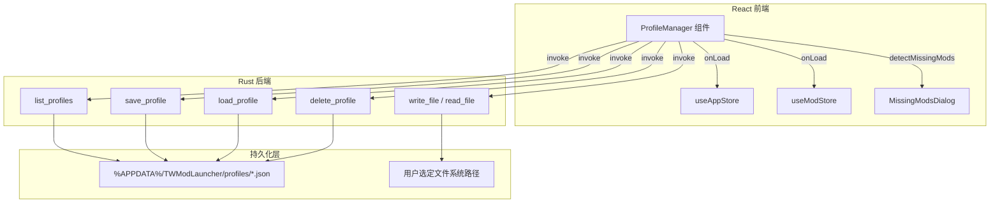
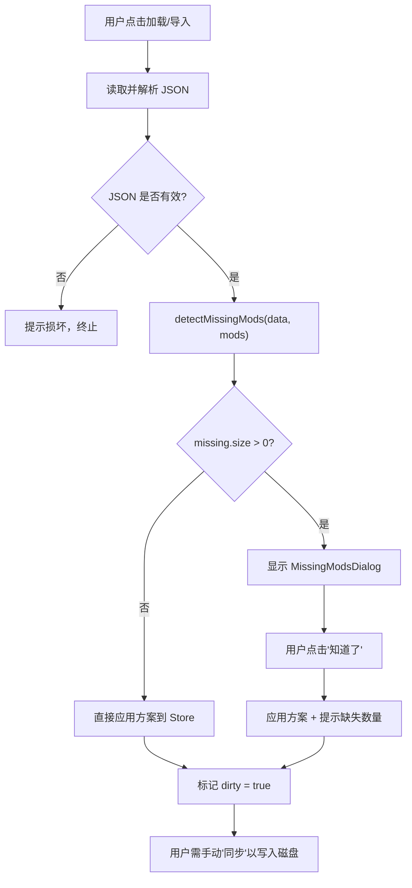
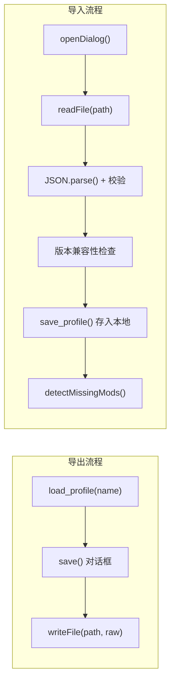

本文档剖析 TWModLauncher 中"方案"（Profile）系统的完整技术实现，涵盖 **ProfileData JSON 结构设计、版本化兼容策略、原子化文件 I/O、缺失 Mod 检测算法** 以及 **方案导入/导出的校验流程**。方案机制允许用户将当前 Mod 启用状态、排序、分组配置和个性化设置保存为可切换的快照，是实现多套 Mod 配置管理的核心基础设施。

## 方案概述与数据流架构

方案系统的本质是一个"配置快照层"，位于瞬时 UI 状态与持久化文件之间。当用户触发保存时，前端从 Zustand Store 中提取当前所有 Mod 的状态信息，组装为 `ProfileData` 结构体，通过 Tauri `invoke` 桥接至 Rust 后端完成原子写入。加载过程相反：从磁盘读取 JSON → 反序列化 → 缺失 Mod 检测 → 注入 Store → 标记脏状态。



**核心职责划分**：

| 层级 | 模块 | 职责 |
|------|------|------|
| 前端类型定义 | `src/lib/types.ts` | `ProfileData`、`ProfileMeta`、`ModMeta` 接口定义 |
| 前端方案管理 | `src/components/ProfileManager/ProfileManager.tsx` | UI 交互、保存/加载/导入/导出编排、缺失检测 |
| 前端缺失提示 | `src/components/ProfileManager/MissingModsDialog.tsx` | 分类展示缺失 Mod，提供工坊访问入口 |
| 前端状态消费 | `src/App.tsx` → `handleProfileLoad` | 将 ProfileData 反注入 Store，标记脏状态 |
| 后端 CRUD | `src-tauri/src/commands/profiles.rs` | 目录管理、原子写入、JSON 解析提取元数据 |
| 后端文件 I/O | `src-tauri/src/commands/file_io.rs` | 导入/导出的跨文件系统读写 |

Sources: [types.ts](src/lib/types.ts#L96-L124), [ProfileManager.tsx](src/components/ProfileManager/ProfileManager.tsx#L1-L18), [profiles.rs](src-tauri/src/commands/profiles.rs#L1-L97), [file_io.rs](src-tauri/src/commands/file_io.rs#L1-L44)

## ProfileData：版本化方案快照的数据结构

`ProfileData` 是方案系统的核心数据载体，定义了保存到磁盘的完整 JSON Schema。其设计遵循 **自描述（self-describing）** 原则——通过 `version` 字段实现前向兼容守卫，通过 `modMeta` 字段实现跨环境迁移的元数据可追溯性。

```typescript
export interface ProfileData {
  version: number;                                        // 方案格式版本号，当前为 1
  name: string;                                           // 方案显示名称（同时用作文件名）
  createdAt: string;                                      // ISO 8601 创建时间戳
  gamePath: string;                                       // 创建时的游戏目录路径
  enabledMods: string[];                                  // 已启用 Mod 的 key 数组
  modOrder: Record<string, number>;                        // key → load order 映射
  modSettings: Record<string, Record<string, unknown>>;    // key → 各 Mod 的自定义设置
  groups: ModGroup[];                                      // 虚拟分组定义
  groupOrder: string[];                                    // 分组排序
  modMeta: Record<string, ModMeta>;                        // key → Mod 元数据（用于缺失检测）
}
```

Sources: [types.ts](src/lib/types.ts#L105-L124)

### 各字段的设计意图

| 字段 | 类型 | 设计目的 |
|------|------|----------|
| `version` | `number` | 前向兼容守卫：导入时检测版本号，拒绝高于当前支持的版本 |
| `name` | `string` | 双重用途：既是 UI 展示名，也是磁盘文件名（`{name}.json`） |
| `createdAt` | `string` | ISO 时间戳，在方案列表中展示创建时间，用于排序和区分同名快照 |
| `gamePath` | `string` | 方案关联的游戏目录，记录创建上下文（当前不强制校验路径一致性） |
| `enabledMods` | `string[]` | 核心字段：加载时直接决定哪些 Mod 被勾选启用 |
| `modOrder` | `Record<string, number>` | 仅存储 `order > 0` 的 Mod，避免冗余；加载时与现有 order 合并 |
| `modSettings` | `Record<string, Record<string, unknown>>` | 仅存储 `currentSettings` 非空的 Mod；值为任意键值对，与 Toggle/Slider/Dropdown 控件的输出一致 |
| `groups` | `ModGroup[]` | 虚拟分组结构，导入时清除 `anchorBefore`/`anchorAfter`（跨客户端无意义） |
| `groupOrder` | `string[]` | 分组 ID 的展示顺序 |
| `modMeta` | `Record<string, ModMeta>` | **缺失检测的基础设施**：保存每个 Mod 的 title、author、source、fileId、version，使得在未安装该 Mod 的环境中也能展示可识别的缺失信息 |

Sources: [ProfileManager.tsx](src/components/ProfileManager/ProfileManager.tsx#L85-L112), [App.tsx](src/App.tsx#L344-L393)

### modKey 命名约定

贯穿整个方案系统，Mod 的唯一标识采用 `{source}_{fileId}` 格式：

- `source` = `1` 表示 Workshop Mod，`0` 表示本地 Mod
- `fileId` 来自 Rust 端扫描产出的 `ModScanEntry.file_id`

这一约定同时应用于 `enabledMods`、`modOrder`、`modSettings`、`groups.modKeys` 和 `modMeta` 的键名，确保了跨结构的引用一致性。

Sources: [types.ts](src/lib/types.ts#L6-L7), [ProfileManager.tsx](src/components/ProfileManager/ProfileManager.tsx#L91-L92)

## 版本化策略：前向兼容守卫

方案的版本管理采用 **"最低支持版本递增"** 策略，而非语义化版本。核心思想简洁明确：

1. **当前版本**：硬编码为 `1`，保存在每个新创建方案的 `version` 字段
2. **导入校验**：读取外部方案时检查 `data.version`，若 `> 1` 则拒绝导入并提示不兼容
3. **向后兼容**：未携带 `version` 字段的旧方案（`undefined`）会被接受，因为条件 `data.version !== undefined && data.version > 1` 中 `undefined > 1` 为 `false`
4. **向前兼容**：未来若协议变化，只需递增硬编码版本号并调整校验逻辑；旧客户端自动拒绝新版本方案

```typescript
// 版本校验逻辑（handleImport 中）
if (data.version !== undefined && data.version > 1) {
  flash(
    `导入失败: 方案版本不兼容（文件版本 ${data.version}，当前支持版本 1）`,
  );
  return;
}
```

这种设计避免了 JSON 膨胀——无需维护 `minVersion`、`maxVersion` 等复杂字段，仅一个数字即可完成版本守卫。

Sources: [ProfileManager.tsx](src/components/ProfileManager/ProfileManager.tsx#L210-L225)

### 版本对 groups 加载的影响

在 `handleProfileLoad` 中，`version >= 1` 是恢复分组的必要条件：

```typescript
if (data.version >= 1 && data.groups) {
  const cleanedGroups = data.groups.map((g) => ({
    ...g,
    anchorBefore: undefined,
    anchorAfter: undefined,
  }));
  useAppStore.getState().setGroups(cleanedGroups);
  if (data.groupOrder) useAppStore.getState().setGroupOrder(data.groupOrder);
}
```

导入时清除 `anchorBefore`/`anchorAfter` 的原因是：这两个锚点引用的是创建方案的客户端上的卡片 key，在另一个客户端上这些 key 对应的 DOM 次序可能完全不同，保留锚点会导致分组位置错乱。

Sources: [App.tsx](src/App.tsx#L370-L380)

## 缺失 Mod 检测：detectMissingMods 算法

缺失 Mod 检测是方案跨环境迁移的核心可靠性机制。当用户加载或导入一个方案时，方案中引用的每个 Mod 都必须与当前已安装的 Mod 进行比对。

### 算法实现

```typescript
function detectMissingMods(data: ProfileData, mods: ModInfo[]): Map<string, ModMeta> {
  // 1. 构建已安装 Mod 的 key 集合
  const installedKeys = new Set(
    mods.map((m) => `${m.source}_${m.fileId}`)
  );
  
  // 2. 收集方案中所有引用的 Mod key
  const referencedKeys = new Set<string>();
  data.enabledMods.forEach((k) => referencedKeys.add(k));
  Object.keys(data.modOrder ?? {}).forEach((k) => referencedKeys.add(k));
  Object.keys(data.modSettings ?? {}).forEach((k) => referencedKeys.add(k));
  (data.groups ?? []).forEach((g) => g.modKeys.forEach((k) => referencedKeys.add(k)));

  // 3. 差集计算：引用但未安装的 Mod
  const missing = new Map<string, ModMeta>();
  for (const key of referencedKeys) {
    if (!installedKeys.has(key) && data.modMeta?.[key]) {
      missing.set(key, data.modMeta[key]);
    }
  }
  return missing;
}
```

算法复杂度为 O(n + m)，其中 n 为已安装 Mod 数量，m 为方案引用总数。

Sources: [ProfileManager.tsx](src/components/ProfileManager/ProfileManager.tsx#L22-L38)

### 引用来源的全面覆盖

算法遍历方案中五个独立的 Mod 引用来源，确保无一遗漏：

| 引用来源 | 含义 | 为什么需要检查 |
|----------|------|----------------|
| `enabledMods` | 已启用 Mod 列表 | 核心引用，加载时必须还原 |
| `modOrder` | 排序映射 | 即使未启用的 Mod 也可能有排序记录 |
| `modSettings` | 个性化设置 | 已配置但可能禁用的 Mod |
| `groups[].modKeys` | 分组内的 Mod | 分组可能包含未启用的 Mod |

这种全覆盖策略防止了"幽灵引用"——即一个 Mod 仅存在于 `modOrder` 或 `groups` 中而没有出现在 `enabledMods` 中时，仍能被正确检测。

Sources: [ProfileManager.tsx](src/components/ProfileManager/ProfileManager.tsx#L26-L31)

### modMeta 的角色：缺失时的信息展示

即便 Mod 未安装，`modMeta` 仍保留了足够的元数据来向用户展示有意义的信息。`MissingModsDialog` 据此将缺失 Mod 分为两类：

- **工坊 Mod**（`source === 1`）：展示名称、作者、版本号，并提供"浏览器"和"创意工坊"两个快速访问入口，分别调用 `openWorkshopUrl` 和 `openSteamWorkshop` 命令
- **本地 Mod**（`source === 0`）：展示名称并提示"此 Mod 为本地 Mod，请手动复制安装"

用户关闭对话框后，方案仍然会被加载——缺失检测的目的并非阻止加载，而是向用户提供透明度。

Sources: [MissingModsDialog.tsx](src/components/ProfileManager/MissingModsDialog.tsx#L1-L124), [tauriApi.ts](src/lib/tauriApi.ts#L118-L124)

### 缺失检测的触发时机与流程



注意加载流程中的一个关键设计：当检测到缺失 Mod 时，方案数据被暂存在 `pendingLoad` 状态中，直到用户关闭 `MissingModsDialog` 后才真正调用 `onLoad` 应用方案。这确保了对话框的展示不会被状态变更打断。

Sources: [ProfileManager.tsx](src/components/ProfileManager/ProfileManager.tsx#L139-L162), [ProfileManager.tsx](src/components/ProfileManager/ProfileManager.tsx#L283-L298)

## Rust 后端：方案的 CRUD 与原子写入

方案文件存储在系统应用数据目录下：`{data_dir}/TWModLauncher/profiles/{name}.json`。Rust 端通过 `dirs::data_dir()` 获取平台标准路径（Windows 上为 `%APPDATA%`）。

```rust
fn profiles_dir() -> PathBuf {
    let dir = dirs::data_dir()
        .unwrap_or_else(|| PathBuf::from("."))
        .join("TWModLauncher")
        .join("profiles");
    fs::create_dir_all(&dir).ok();
    dir
}
```

在首次访问时自动创建目录，确保后续操作无路径错误。

Sources: [profiles.rs](src-tauri/src/commands/profiles.rs#L12-L17)

### 四个 Tauri 命令

| 命令 | 签名 | 核心逻辑 |
|------|------|----------|
| `list_profiles` | `() → Vec<ProfileMeta>` | 遍历目录中所有 `.json` 文件，解析 `enabledMods` 数组长度作为 `modCount`，解析 `createdAt` 字段 |
| `save_profile` | `(name, data) → ()` | JSON 校验 → 写入 `{name}.tmp` → `rename` 到 `{name}.json`（原子操作） |
| `load_profile` | `(name) → String` | 直接 `read_to_string` 返回原始 JSON |
| `delete_profile` | `(name) → ()` | `remove_file` 删除 |

Sources: [profiles.rs](src-tauri/src/commands/profiles.rs#L22-L97)

### 原子写入策略

`save_profile` 采用了与项目整体一致的两阶段原子写入模式：

```rust
let tmp = path.with_extension("tmp");
fs::write(&tmp, &data).map_err(|e| format!("保存失败: {e}"))?;
fs::rename(&tmp, &path).map_err(|e| {
    let _ = fs::remove_file(&tmp);
    format!("保存失败: {e}")
})
```

1. **阶段一**：将完整数据写入 `{name}.tmp` 临时文件
2. **阶段二**：通过 `rename` 将临时文件原子性地替换为目标文件
3. **失败处理**：若 `rename` 失败，清理残留的 `.tmp` 文件

此策略保证了在写入过程中发生崩溃或断电时，原方案文件不会受损——要么完整的新内容生效，要么旧内容保持不变。

Sources: [profiles.rs](src-tauri/src/commands/profiles.rs#L72-L80)

### ProfileMeta 的提取策略

`list_profiles` 不会完整反序列化每个方案的 `ProfileData`，而是仅提取列表展示所需的三个字段：

```rust
// 主路径：从 enabledMods 数组直接取长度
let mod_count = serde_json::from_str::<serde_json::Value>(&raw)
    .ok()
    .and_then(|v| v.get("enabledMods").cloned())
    .and_then(|v| v.as_array().map(|a| a.len() as u32))
    // 回退路径：兼容旧格式（计数 fileId 出现次数）
    .unwrap_or_else(|| raw.matches("\"fileId\"").count() as u32);
```

这种轻量解析策略避免了为列表视图加载全部方案数据的性能开销。回退路径的存在保证了与早期版本方案的兼容性——那些方案可能在 JSON 中直接内嵌了完整的 Mod 对象。

Sources: [profiles.rs](src-tauri/src/commands/profiles.rs#L40-L49)

## 方案加载：ProfileData → Store 的状态注入

`handleProfileLoad`（定义在 `App.tsx` 中，作为 `onLoad` 回调传入 `ProfileManager`）是将方案数据反注入运行时状态的核心函数。其处理逻辑体现了"逐字段映射"的设计模式：

```typescript
const handleProfileLoad = async (data: ProfileData) => {
  const enabledSet = new Set(data.enabledMods);
  const orderMap = data.modOrder ?? {};
  const settingsMap = data.modSettings ?? {};

  const updated = mods.map((m) => {
    const key = `${m.source}_${m.fileId}`;
    return {
      ...m,
      enabled: enabledSet.has(key),
      order: orderMap[key] ?? m.order,
      currentSettings: settingsMap[key] ?? m.currentSettings,
    };
  });
  setMods(updated);
  // ... groups restoration, dirty tracking
};
```

### 关键设计决策

**合并而非替换**：方案中的 `modOrder` 和 `modSettings` 仅包含有值的条目，加载时使用 `??` 运算符保留现有值作为默认。这意味着方案中没有记录的 Mod 保持其加载前的状态不变。

**显式脏标记**：加载完成后强制设置 `isDirty = true`，要求用户手动"同步"才能将方案配置写入 `ModSettings.Lua`。这种设计防止了用户误加载方案后自动覆盖磁盘配置的风险。

**分组锚点清洗**：`anchorBefore`/`anchorAfter` 在导入时被清除，因为它们是创建客户端特有的卡片排序快照，在另一个客户端上无意义。

Sources: [App.tsx](src/App.tsx#L344-L393)

## 导入/导出：跨环境迁移

导入和导出共享底层的 `writeFile`/`readFile` 命令，但存在关键的流程差异：



导出是单向直通操作：从内部存储读取 → 写入用户指定路径。导入则逆向而行：从外部路径读取 → 校验 → 存入内部存储 → 检测缺失。

导入校验的三个关卡：

1. **JSON 有效性**：`JSON.parse` 失败 → "文件格式无效"
2. **结构完整性**：缺少 `name` 或 `enabledMods` 非数组 → "无效的方案文件"
3. **版本兼容性**：`version > 1` → "方案版本不兼容"

导入时若方案名与现有方案冲突，会弹出覆盖确认对话框。

Sources: [ProfileManager.tsx](src/components/ProfileManager/ProfileManager.tsx#L168-L199), [ProfileManager.tsx](src/components/ProfileManager/ProfileManager.tsx#L200-L253)

## 方案保存：从 UI 状态到 JSON 快照

`handleSave` 函数构造 `ProfileData` 的过程实质上是对当前应用状态的一次"选择性快照"：

```typescript
const data: ProfileData = {
  version: 1,
  name,
  createdAt: new Date().toISOString(),
  gamePath,
  enabledMods: mods.filter((m) => m.enabled).map((m) => `${m.source}_${m.fileId}`),
  modOrder: Object.fromEntries(
    mods.filter((m) => m.order > 0).map((m) => [`${m.source}_${m.fileId}`, m.order])
  ),
  modSettings: Object.fromEntries(
    mods.filter((m) => Object.keys(m.currentSettings).length > 0)
      .map((m) => [`${m.source}_${m.fileId}`, m.currentSettings])
  ),
  groups: appStore.groups,
  groupOrder: appStore.groupOrder,
  modMeta: Object.fromEntries(
    mods.map((m) => {
      const key = `${m.source}_${m.fileId}`;
      const meta: ModMeta = { title: m.title, author: m.author, source: m.source, fileId: m.fileId };
      if (m.version) meta.version = m.version;
      return [key, meta];
    })
  ),
};
```

**选择性序列化原则**：

- `enabledMods` 仅包含启用的 Mod（而非全部），缩减数组长度
- `modOrder` 仅包含 `order > 0` 的条目（默认 0 不存储），避免膨胀
- `modSettings` 仅包含有设置的 Mod（`currentSettings` 非空），不存储空对象
- `modMeta` 始终存储所有 Mod 的元数据，因为这是缺失检测的基础

保存时支持名称冲突检测：若方案名已存在，先弹出覆盖确认（`confirmOverwriteName`），用户确认后以 `forceOverwrite = true` 重新调用 `handleSave`。

Sources: [ProfileManager.tsx](src/components/ProfileManager/ProfileManager.tsx#L80-L124)

## 方案系统的完整交互状态机

方案管理的 UI 状态由五个布尔/字符串状态变量控制：

| 状态变量 | 类型 | 触发条件 | 效果 |
|----------|------|----------|------|
| `open` | `boolean` | 点击"方案管理"按钮 | 展开/收起下拉面板 |
| `showSave` | `boolean` | 点击"+ 新建"按钮 | 显示名称输入框与保存按钮 |
| `confirmOverwriteName` | `string \| null` | 保存时检测到同名方案 | 显示覆盖确认 UI |
| `message` | `{text, type} \| null` | 操作成功/失败 | 顶部浮动提示条（3-4 秒自动消失） |
| `missingMods` | `Map \| null` | 加载/导入时检测到缺失 | 弹出 MissingModsDialog |
| `pendingLoad` | `ProfileData \| null` | 缺失检测时暂存待加载数据 | 在对话框关闭后触发实际加载 |

这些状态的组合构成了方案管理的完整交互流。`missingMods` 和 `pendingLoad` 的协同尤其关键：当缺失检测返回非空结果时，下拉面板立即关闭（`setOpen(false)`），方案数据暂存至 `pendingLoad`，缺口对话框弹出；用户确认后，`pendingLoad` 被消费并清空。

Sources: [ProfileManager.tsx](src/components/ProfileManager/ProfileManager.tsx#L44-L50), [ProfileManager.tsx](src/components/ProfileManager/ProfileManager.tsx#L283-L298)

---

**相关文档**：

- 方案导入/导出的文件级操作细节，参见 [方案导入/导出：文件级读写与跨环境迁移](19-fang-an-dao-ru-dao-chu-wen-jian-ji-du-xie-yu-kua-huan-jing-qian-yi)
- 方案保存到磁盘后的 ModSettings.Lua 同步逻辑，参见 [ModSettings.Lua 的格式保留式补丁（patchModSettingsLua）](10-modsettings-lua-de-ge-shi-bao-liu-shi-bu-ding-patchmodsettingslua)
- Zustand Store 的结构与 groups/groupOrder 的持久化，参见 [状态管理：Zustand 双 Store 设计（AppStore 与 ModStore）](7-zhuang-tai-guan-li-zustand-shuang-store-she-ji-appstore-yu-modstore)
- 原子写入的通用策略，参见 [原子写入策略：临时文件 + 重命名 + 写入验证 + 自动备份](25-yuan-zi-xie-ru-ce-lue-lin-shi-wen-jian-zhong-ming-ming-xie-ru-yan-zheng-zi-dong-bei-fen)