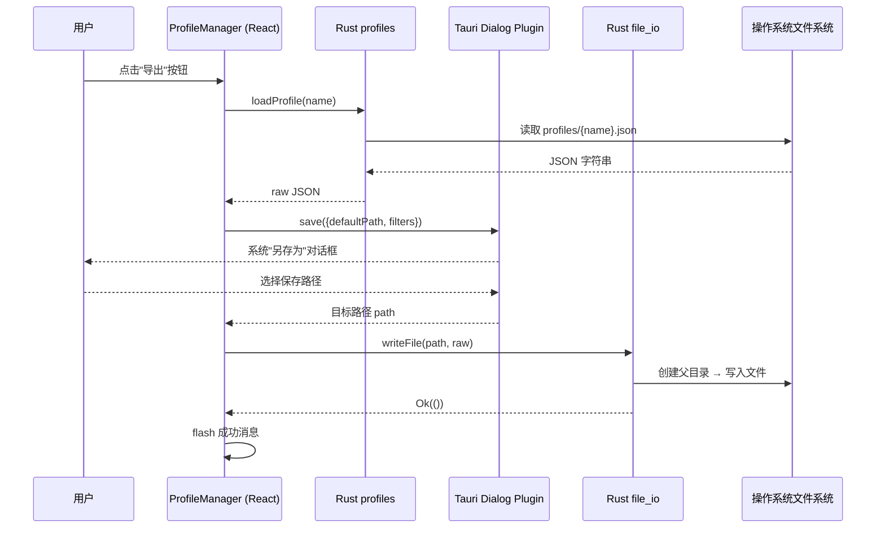
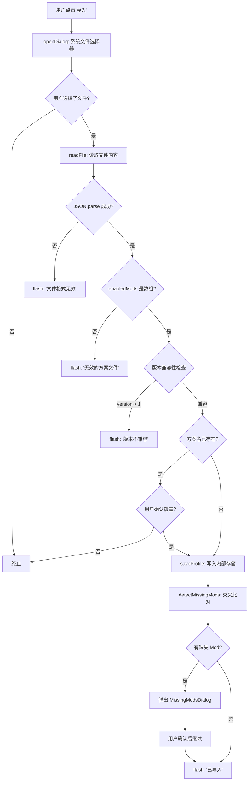
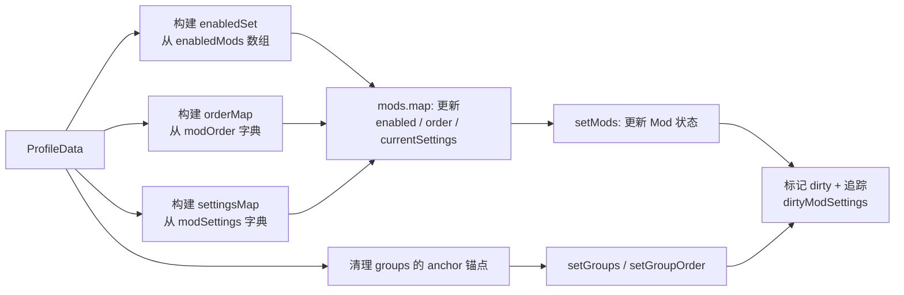

方案（Profile）的导入与导出机制是 TWModLauncher 跨环境迁移能力的核心——它让用户可以将精心编排的 Mod 启用状态、加载顺序、分组结构和参数设置完整地打包为 JSON 文件，在不同机器或不同游戏安装之间自由传递。本节深入分析从前端对话到 Rust 后端文件 I/O 的完整数据流，以及为跨环境兼容性所做的设计决策。

## 方案数据存储架构

在理解导入导出之前，必须先厘清方案文件的存储位置与读写机制。所有方案以独立 JSON 文件形式保存在应用数据目录下的 `TWModLauncher/profiles/` 子目录中，文件名为 `{方案名}.json`。目录的确定逻辑位于 Rust 端：

```
{系统数据目录}/TWModLauncher/profiles/{name}.json
```

其中 `{系统数据目录}` 通过 `dirs::data_dir()` 获取——Windows 下指向 `%APPDATA%`，且带容错回退到当前目录。首次访问时自动创建目录结构。

Sources: [profiles.rs](src-tauri/src/commands/profiles.rs#L14-L21)

**方案元数据（ProfileMeta）** 在前端列表展示中使用，由 Rust 端从磁盘 JSON 文件中解析生成——无需遍历整个 Mod 列表，仅提取 `enabledMods` 数组长度和 `createdAt` 字段，同时兼容旧版方案（通过匹配 `"fileId"` 字符串出现次数作为 fallback）：

| 字段 | 来源 | 用途 |
|------|------|------|
| `name` | JSON 文件名（去 `.json` 后缀） | 方案唯一标识 |
| `createdAt` | JSON 中 `createdAt` 字段 | 列表展示创建时间 |
| `modCount` | JSON 中 `enabledMods` 数组长度 | 快速展示已启用 Mod 数量 |

Sources: [profiles.rs](src-tauri/src/commands/profiles.rs#L27-L67)

## 导出流程：从本地方案到外部文件

导出操作本质上是"从应用内部存储读出 → 写入用户任意选定路径"的桥接过程，涉及两个独立的 Tauri 命令：



**步骤拆解**：

第一步，`handleExport` 调用 `loadProfile(name)` 从应用内部方案目录读出完整 JSON 字符串——这一步复用了方案加载命令，确保导出的内容与内存中方案完全一致。

Sources: [ProfileManager.tsx](src/components/ProfileManager/ProfileManager.tsx#L185-L198)

第二步，调用 Tauri Dialog 插件的 `save()` 函数弹出系统原生"另存为"对话框，预设文件名为 `{方案名}.json`，扩展名过滤器限定为 `.json`。用户取消则终止流程。

第三步，通过 `writeFile` 命令将 JSON 原始字符串写入用户选定路径。该命令位于 `file_io.rs`，负责创建目标路径的所有父目录（通过 `create_dir_all`），然后执行 `fs::write`：

```rust
// 关键：自动创建父目录，确保跨盘符/跨目录导出成功
let p = Path::new(&path);
if let Some(parent) = p.parent() {
    fs::create_dir_all(parent).map_err(|e| format!("创建目录失败: {}", e))?;
}
fs::write(p, &content).map_err(|e| format!("写入文件失败: {}", e))
```

Sources: [file_io.rs](src-tauri/src/commands/file_io.rs#L4-L19)

值得注意的是，导出使用 `writeFile` 而非 `saveProfile`——`saveProfile` 带有 JSON 格式验证和原子写入策略（临时文件 + 重命名），而 `writeFile` 设计为通用文件写入，不附加额外验证逻辑，直接透传方案数据。导出不修改内部存储，因此无需原子性保护。

## 导入流程：从外部文件到本地方案

导入是导出更复杂的反向操作，因为它必须处理文件格式验证、版本兼容性检查、命名冲突和 Mod 缺失检测等多个关键路径：



Sources: [ProfileManager.tsx](src/components/ProfileManager/ProfileManager.tsx#L200-L255)

### 版本兼容性检查

这是跨环境迁移的第一道防线。`ProfileData` 接口定义了 `version` 字段，当前支持版本为 `1`：

```typescript
export interface ProfileData {
  version: number;   // 方案格式版本，用于前向兼容
  name: string;
  createdAt: string;
  gamePath: string;
  enabledMods: string[];
  modOrder: Record<string, number>;
  modSettings: Record<string, Record<string, unknown>>;
  groups: ModGroup[];
  groupOrder: string[];
  modMeta: Record<string, ModMeta>;
}
```

Sources: [types.ts](src/lib/types.ts#L107-L123)

导入时的版本检查逻辑为严格的向上不兼容策略——仅接受 `version` 为 `undefined`（旧版无版本字段，视为兼容）或 `version <= 1` 的方案。若文件版本大于当前支持版本，直接拒绝导入并给出明确提示。这一设计为未来的方案格式演进预留了空间：当 `ProfileData` 增加新字段时，可通过提升版本号来防止旧版客户端误解析。

Sources: [ProfileManager.tsx](src/components/ProfileManager/ProfileManager.tsx#L223-L229)

### 文件有效性验证

导入执行两层结构校验：

1. **JSON 语法校验**：`JSON.parse` 失败则提示"文件格式无效"——这意味着非 JSON 文件或已损坏的文件会被直接拒绝
2. **结构校验**：检查 `data.name` 存在且 `data.enabledMods` 为数组——缺少这两个核心字段的方案被视为无效

Sources: [ProfileManager.tsx](src/components/ProfileManager/ProfileManager.tsx#L210-L221)

### 命名冲突处理

导入前检查方案名是否与已有方案冲突。若同名方案已存在，弹出 Tauri 原生确认对话框（`ask`），仅在用户确认后才执行覆盖写入。覆盖操作通过 `saveProfile` 执行，享受其原子写入保护。

Sources: [ProfileManager.tsx](src/components/ProfileManager/ProfileManager.tsx#L231-L239)

## 跨环境 Mod 缺失检测

这是方案跨环境迁移中最核心的用户体验问题——方案中引用了当前机器上不存在的 Mod。`detectMissingMods` 函数通过构建"引用集合"与"安装集合"的差集来实现检测：

```typescript
function detectMissingMods(data: ProfileData, mods: ModInfo[]): Map<string, ModMeta> {
  // 1. 从当前安装的所有 Mod 构建 key 集合
  const installedKeys = new Set(mods.map((m) => `${m.source}_${m.fileId}`));

  // 2. 从方案中收集所有被引用的 modKey
  const referencedKeys = new Set<string>();
  data.enabledMods.forEach((k) => referencedKeys.add(k));
  Object.keys(data.modOrder ?? {}).forEach((k) => referencedKeys.add(k));
  Object.keys(data.modSettings ?? {}).forEach((k) => referencedKeys.add(k));
  (data.groups ?? []).forEach((g) => g.modKeys.forEach((k) => referencedKeys.add(k)));

  // 3. 交叉比对：在引用集合中但不在安装集合中的 key 即为缺失
  const missing = new Map<string, ModMeta>();
  for (const key of referencedKeys) {
    if (!installedKeys.has(key) && data.modMeta?.[key]) {
      missing.set(key, data.modMeta[key]);
    }
  }
  return missing;
}
```

Sources: [ProfileManager.tsx](src/components/ProfileManager/ProfileManager.tsx#L22-L41)

该算法从四个维度收集所有被方案引用的 Mod 标识符：`enabledMods`（启用列表）、`modOrder`（排序映射）、`modSettings`（参数设置映射）和 `groups`（分组结构中的 modKeys）。这一全面扫描确保即使某个 Mod 未被启用但存在于分组中，也会被纳入检测范围。

**modMeta 的关键作用**：方案保存时将每个 Mod 的 `ModMeta`（标题、作者、来源、fileId、版本）打包进 `modMeta` 字段。当目标环境缺失某个 Mod 时，`modMeta` 提供了足够的信息来告知用户缺失了什么——否则只能看到一个无意义的 key 字符串。

Sources: [ProfileManager.tsx](src/components/ProfileManager/ProfileManager.tsx#L116-L128)

### 缺失 Mod 对话框（MissingModsDialog）

当检测到缺失 Mod 时，不会阻断导入/加载流程，而是弹出信息型对话框，区分两类缺失：

| Mod 来源 | source 值 | 对话框中提供的能力 |
|----------|-----------|-------------------|
| 创意工坊 | 1 | 提供"浏览器"和"创意工坊"两个快捷访问按钮，分别通过 `openWorkshopUrl`（系统浏览器打开 Steam 工坊页面）和 `openSteamWorkshop`（Steam 客户端协议）跳转 |
| 本地 Mod | 0 | 仅显示提示"此 Mod 为本地 Mod，请手动复制安装"，无快捷操作 |

Sources: [MissingModsDialog.tsx](src/components/ProfileManager/MissingModsDialog.tsx#L1-L123)

对话框在用户确认后关闭，同时方案数据——包括缺失 Mod 的引用——完整加载到内存中。这意味着用户可以部分应用方案（只影响已安装的 Mod），缺失的 Mod 设置会保留在 `currentSettings` 中，等待 Mod 被安装后自动生效。

## 方案加载：从数据到应用

无论是内置方案的"加载"还是导入后触发的加载，最终都通过 `handleProfileLoad` 将 `ProfileData` 应用于当前运行状态：



Sources: [App.tsx](src/App.tsx#L355-L395)

### 锚点剥离：跨环境兼容的关键

方案中的分组（`groups`）在创建时可能携带 `anchorBefore` 或 `anchorAfter` 字段——这些锚点记录了分组在特定客户端 `displayOrder` 中的位置。由于不同环境（不同 Mod 集合、不同排序）的 `displayOrder` 完全不同，这些锚点在跨环境加载时不仅无用，还可能导致分组定位错误。

因此 `handleProfileLoad` 在恢复分组前执行锚点清理：

```typescript
const cleanedGroups = data.groups.map((g) => ({
  ...g,
  anchorBefore: undefined,
  anchorAfter: undefined,
}));
```

这使得分组在目标环境中以无锚点状态呈现，等待用户通过拖拽重新定位。

Sources: [App.tsx](src/App.tsx#L377-L381)

### 脏状态标记与保存提示

方案加载后立即将 `isDirty` 设为 `true`，并逐一遍历 `modSettings` 中的所有 key 调用 `addDirtyModSetting`——这使得每个被方案修改了设置的 Mod 都被标记为"需要同步到磁盘"。由于方案加载仅修改内存中的状态（Zustand Store），实际的磁盘写入需要用户手动点击"同步"按钮来触发 `handleSaveAll` 将变更写入 `ModSettings.Lua` 和各 Mod 的 `Settings.Lua` 文件。

最后的提示信息也精确传达了这一点："方案已加载，请点击同步保存"。

Sources: [App.tsx](src/App.tsx#L386-L394)

## 原子写入在方案存储中的应用

虽然导出使用简单的 `fs::write`，但方案在内部存储的写入（`saveProfile`）采用了与 ModSettings 写入相同的原子写入策略：

```rust
// 步骤：
// 1. JSON 格式验证（拒绝无效数据）
serde_json::from_str::<serde_json::Value>(&data)
    .map_err(|e| format!("JSON格式错误: {e}"))?;

// 2. 写入临时文件
let tmp = path.with_extension("tmp");
fs::write(&tmp, &data).map_err(|e| format!("保存失败: {e}"))?;

// 3. 原子重命名
fs::rename(&tmp, &path).map_err(|e| {
    let _ = fs::remove_file(&tmp);  // 清理临时文件
    format!("保存失败: {e}")
})
```

Sources: [profiles.rs](src-tauri/src/commands/profiles.rs#L69-L84)

这一设计在导入覆盖已有方案时尤为重要——如果写入过程中发生崩溃或断电，临时文件损坏不会影响原有方案文件，因为 `rename` 是原子操作（在大多数文件系统中）。

## 完整数据流总览

```mermaid
graph TB
    subgraph "导出 Export"
        E1["本地方案<br/>profiles/{name}.json"] -->|loadProfile| E2["内存 JSON 字符串"]
        E2 -->|save dialog| E3["用户指定路径"]
        E3 -->|writeFile| E4["外部 .json 文件"]
    end

    subgraph "导入 Import"
        I1["外部 .json 文件"] -->|open dialog + readFile| I2["内存 JSON 字符串"]
        I2 -->|JSON.parse| I3["ProfileData 对象"]
        I3 -->|版本检查 + 结构校验| I4["有效数据"]
        I4 -->|saveProfile| I5["本地方案<br/>profiles/{name}.json"]
        I4 -->|detectMissingMods| I6["缺失 Mod 对话框"]
    end

    subgraph "加载 Load"
        L1["本地方案 / 导入数据"] -->|handleProfileLoad| L2["更新 ModStore<br/>enabled / order / settings"]
        L1 -->|handleProfileLoad| L3["更新 AppStore<br/>groups / groupOrder"]
        L2 --> L4["标记 dirty + dirtyModSettings"]
        L3 --> L4
        L4 --> L5["用户点击'同步'→ 写入磁盘"]
    end

    style E3 fill:#1a365d,stroke:#4299e1
    style I1 fill:#1a365d,stroke:#4299e1
    style L5 fill:#744210,stroke:#f6ad55
```



## 命令注册体系

导入导出涉及的所有 Tauri 命令均在 `lib.rs` 的 `invoke_handler` 中统一注册：

| 命令 | 所属模块 | 用途 |
|------|----------|------|
| `list_profiles` | `commands::profiles` | 列出所有本地方案元数据 |
| `save_profile` | `commands::profiles` | 保存方案到内部存储（原子写入） |
| `load_profile` | `commands::profiles` | 从内部存储加载方案 JSON |
| `delete_profile` | `commands::profiles` | 删除指定方案文件 |
| `write_file` | `commands::file_io` | 导出：写入任意路径 |
| `read_file` | `commands::file_io` | 导入：读取任意路径 |

同时需要 Tauri Dialog 插件（`tauri_plugin_dialog`）提供原生文件选择对话框，权限声明在 `capabilities/default.json` 中：

```json
"permissions": [
  "core:default",
  "dialog:default",
  "core:window:allow-destroy"
]
```

Sources: [lib.rs](src-tauri/src/lib.rs#L26-L51), [default.json](src-tauri/capabilities/default.json#L1-L13)

前后端 API 桥接封装在 `tauriApi.ts` 中，通过 `invoke` 函数完成调用：

Sources: [tauriApi.ts](src/lib/tauriApi.ts#L68-L102)

## 相关页面

- 方案数据结构的完整定义：参见 [Profile 数据结构：版本化 JSON 方案与 Mod 缺失检测](18-profile-shu-ju-jie-gou-ban-ben-hua-json-fang-an-yu-mod-que-shi-jian-ce)
- 原子写入策略的通用实现：参见 [原子写入策略：临时文件 + 重命名 + 写入验证 + 自动备份](25-yuan-zi-xie-ru-ce-lue-lin-shi-wen-jian-zhong-ming-ming-xie-ru-yan-zheng-zi-dong-bei-fen)
- 方案加载后的磁盘同步流程：参见 [即时脏状态跟踪：跨 Mod 的未保存变更检测](17-ji-shi-zang-zhuang-tai-gen-zong-kua-mod-de-wei-bao-cun-bian-geng-jian-ce)
- Tauri 命令注册体系：参见 [Tauri 命令注册体系：invoke_handler 与前后端通信](6-tauri-ming-ling-zhu-ce-ti-xi-invoke_handler-yu-qian-hou-duan-tong-xin)
- 分组系统的锚点机制：参见 [三套拖拽系统：卡片拖拽、分组头部拖拽与分组创建拖拽](13-san-tao-tuo-zhuai-xi-tong-qia-pian-tuo-zhuai-fen-zu-tou-bu-tuo-zhuai-yu-fen-zu-chuang-jian-tuo-zhuai)