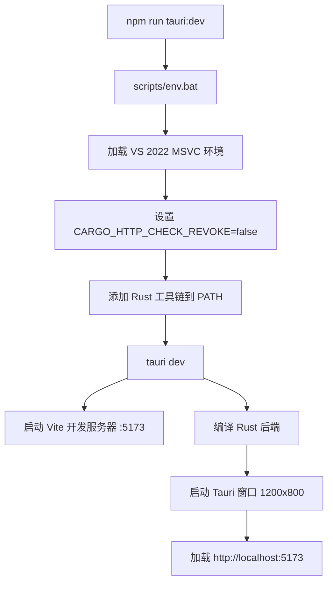
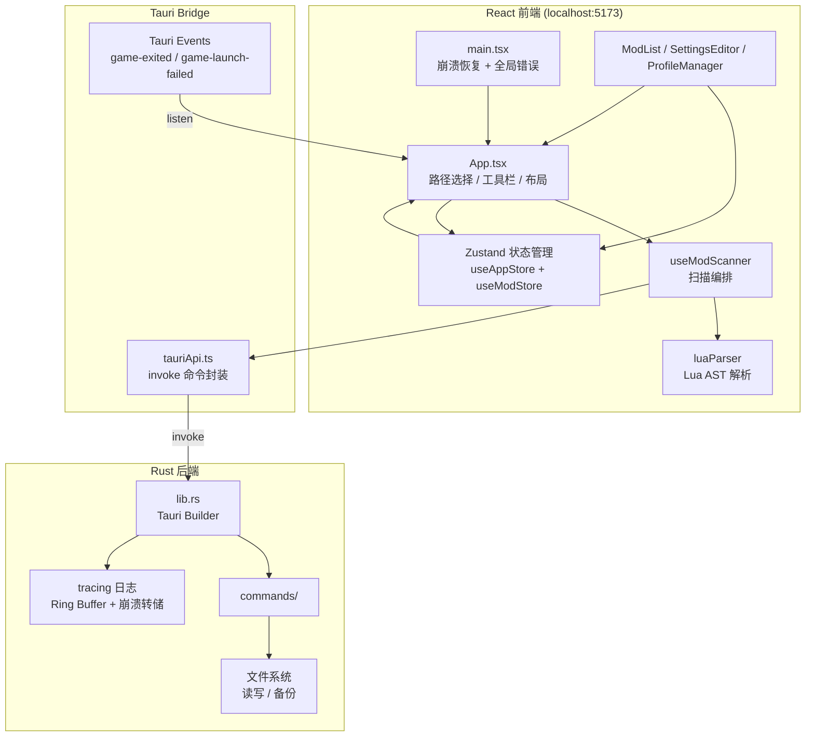
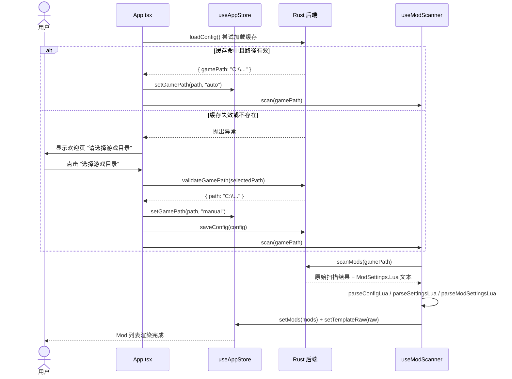

本章为开发者提供从零搭建 TWModLauncher 开发环境的完整步骤，涵盖环境准备、依赖安装、构建运行以及项目的目录结构总览。无论是希望提交代码贡献，还是自行定制 Mod 管理功能，你都能在 15 分钟内让项目在本地跑起来。

## 环境与前置要求

TWModLauncher 是一个 **Tauri v2** 桌面应用，由 Rust 后端和 React 前端两部分构成。根据构建目标的选择（仅前端开发 or 完整桌面应用），你需要准备以下工具链：

| 工具 | 版本要求 | 用途 | 验证命令 |
|------|----------|------|----------|
| Node.js | 20+ | 前端依赖管理、Vite 开发服务器 | `node -v` |
| Rust | stable（≥1.77.2） | Tauri 后端编译 | `rustc --version` |
| Visual Studio 2022 | Community+ | Windows 原生编译（MSVC 工具链） | 需安装"使用 C++ 的桌面开发"工作负载 |
| npm | 随 Node.js 附送 | 包管理 | `npm -v` |

> **注意**：Windows 编译时必须安装 Visual Studio 2022 的 **"使用 C++ 的桌面开发"** 工作负载（包括 Windows SDK）。项目通过 `scripts/env.bat` 自动加载 MSVC 构建环境，如果 VS 安装在非默认路径，需修改该脚本中的 `vcvars64.bat` 路径。

Sources: [package.json](package.json#L32-L38), [src-tauri/Cargo.toml](src-tauri/Cargo.toml#L10), [scripts/env.bat](scripts/env.bat#L1-L19)

## 克隆与安装

从仓库拉取代码后，安装前端依赖即可。Rust 依赖会在首次构建时由 Cargo 自动获取。

```bash
# 克隆仓库
git clone <仓库地址> twm-launcher
cd twm-launcher

# 安装前端依赖
npm install
```

`npm install` 完成后，Node.js 依赖（React 19、Zustand、Fuse.js、luaparse 等）和 Tauri CLI（`@tauri-apps/cli`）都会被安装到 `node_modules` 目录。Rust 端的依赖（Tauri 框架、tracing 日志、serde 序列化等）定义在 `src-tauri/Cargo.toml` 中，无需手动安装。

Sources: [package.json](package.json#L12-L24), [src-tauri/Cargo.toml](src-tauri/Cargo.toml#L22-L33)

## 开发模式运行

项目提供两条主要命令用于开发：

```bash
# 启动完整的 Tauri 桌面应用（前端 + Rust 后端）
npm run tauri:dev
```

这条命令的实际执行流程如下：



> 开发模式下后端以 debug 模式编译（体积较大），前端使用 Vite HMR（热模块替换），修改 React 代码后界面实时刷新。Rust 代码的修改则需要重新编译后端。

如果你只需要调试前端 UI（不涉及 Rust 命令），也可以直接启动 Vite 开发服务器：

```bash
npm run dev
```

这会在 `http://localhost:5173` 启动纯前端开发服务器，但此时无法调用任何 Tauri 后端命令（如路径验证、Mod 扫描等），适合快速调整样式或组件布局。

Sources: [package.json](package.json#L6-L9), [scripts/env.bat](scripts/env.bat#L1-L19), [src-tauri/tauri.conf.json](src-tauri/tauri.conf.json#L7-L9), [vite.config.ts](vite.config.ts#L1-L17)

## 生产构建

要生成可分发的安装包，执行：

```bash
npm run tauri:build
```

构建流程分为两步：

1. **前端打包**：TypeScript 编译（`tsc -b`）→ Vite 构建 → 输出到 `../dist` 目录
2. **后端编译 + 封装**：Cargo release 编译 Rust 代码 → NSIS 打包 → 输出 `.exe` 安装器

构建产物位于 `src-tauri/target/release/bundle/nsis/` 目录，文件名格式为 `TWModLauncher_<version>_x64-setup.exe`。当前版本为 **v1.9.2**（应用窗口标题和安装包均使用此版本号）。

Sources: [package.json](package.json#L7-L8), [src-tauri/tauri.conf.json](src-tauri/tauri.conf.json#L3-L4)

## 项目结构速览

以下展示项目的一级目录树并标注每个模块的核心职责：

```
twm-launcher/
├── index.html                  # HTML 入口（挂载 #root）
├── package.json                # 前端依赖与脚本定义
├── vite.config.ts              # Vite 构建配置（React + Tailwind）
├── tsconfig.json               # TypeScript 项目引用配置
│
├── scripts/
│   └── env.bat                 # MSVC 环境加载脚本
│
├── public/                     # 静态资源（未版本化）
│
├── src/                        # ── React 前端源码 ──
│   ├── main.tsx                # 应用入口：崩溃日志恢复 + 全局错误捕获
│   ├── App.tsx                 # 主界面组件：路径选择 / 工具栏 / 布局
│   ├── index.css               # Tailwind CSS 入口
│   ├── components/             # UI 组件
│   │   ├── ErrorBoundary.tsx   # React 错误边界
│   │   ├── ModList/            # Mod 卡片列表 + 筛选 + 拖拽
│   │   ├── SettingsEditor/     # Mod 配置表单编辑器
│   │   └── ProfileManager/     # 方案保存 / 加载 / 删除
│   ├── hooks/
│   │   └── useModScanner.ts    # Mod 扫描主 Hook
│   ├── lib/
│   │   ├── logger.ts           # 前端日志（桥接至 Rust tracing）
│   │   ├── luaParser.ts        # Lua AST 解析
│   │   ├── tauriApi.ts         # Tauri invoke 命令桥接
│   │   └── types.ts            # 共享类型定义
│   ├── store/
│   │   ├── useAppStore.ts      # 全局状态（路径、脏标记、分组）
│   │   └── useModStore.ts      # Mod 列表状态
│   ├── utils/
│   │   ├── generateModSettings.ts  # ModSettings.Lua 生成与格式保留式补丁
│   │   ├── renderColoredText.tsx   # 颜色标签文本渲染
│   │   └── tagMapping.ts       # 标签中英文映射
│   └── types/
│       └── luaparse.d.ts       # luaparse 库类型声明
│
└── src-tauri/                  # ── Rust 后端源码 ──
    ├── Cargo.toml              # Rust 依赖与 crate 配置
    ├── tauri.conf.json         # Tauri 应用配置（窗口、打包、安全）
    ├── build.rs                # Tauri 构建脚本
    ├── capabilities/
    │   └── default.json        # 权限清单（core + dialog）
    ├── icons/                  # 应用图标（多尺寸）
    └── src/
        ├── main.rs             # Rust 入口（windows_subsystem）
        ├── lib.rs              # Tauri Builder：插件注册 + 命令挂载 + 日志初始化
        ├── logging.rs          # tracing 日志子系统 + 崩溃日志保护
        └── commands/           # Tauri 命令实现
            ├── game_path.rs    # 游戏路径验证
            ├── game_launcher.rs # 游戏启动 / 强杀
            ├── mod_scanner.rs  # workshop + 本地目录扫描
            ├── mod_settings.rs # Lua 文件读写
            ├── profiles.rs     # 方案 JSON 存储
            ├── config.rs       # 配置持久化
            ├── file_io.rs      # 通用文件 I/O
            └── logging.rs      # 日志事件接收
```

Sources: [src/main.tsx](src/main.tsx#L1-L34), [src/App.tsx](src/App.tsx#L1-L55), [src-tauri/src/main.rs](src-tauri/src/main.rs#L1-L7), [src-tauri/src/lib.rs](src-tauri/src/lib.rs#L1-L55), [README.md](README.md#L37-L68)

## 核心架构概览

理解 TWModLauncher 的运行时结构是高效开发的起点。下图展示了前后端分层架构与核心数据流：



关键通信路径：
- **前端 → 后端**：通过 `tauriApi.ts` 中的 `invoke()` 调用 Rust `#[tauri::command]` 函数
- **后端 → 前端**：通过 Tauri Event 系统推送（如 `game-exited` 事件通知进程状态变更）
- **状态同步**：Zustand 双 Store（AppStore 管理全局状态，ModStore 管理 Mod 列表）通过 React 响应式驱动 UI 更新

Sources: [src/App.tsx](src/App.tsx#L1-L55), [src/lib/tauriApi.ts](src/lib/tauriApi.ts#L1-L133), [src-tauri/src/lib.rs](src-tauri/src/lib.rs#L1-L55)

## 应用首次启动流程

当应用启动并首次运行时，以下流程描述了从路径选择到 Mod 列表显示的全过程：



Sources: [src/App.tsx](src/App.tsx#L67-L103), [src/hooks/useModScanner.ts](src/hooks/useModScanner.ts#L113-L146), [src-tauri/src/commands/game_path.rs](src-tauri/src/commands/game_path.rs#L1-L56)

## 关键配置说明

| 配置项 | 文件位置 | 说明 |
|--------|----------|------|
| 应用版本号 | `src-tauri/tauri.conf.json` → `version` | 同时影响窗口标题和安装包文件名 |
| 窗口尺寸 | `src-tauri/tauri.conf.json` → `app.windows` | 默认 1200×800，可调整 |
| 开发服务器端口 | `vite.config.ts` → `server.strictPort` | Tauri 要求固定端口（默认 5173） |
| 前端构建输出 | `src-tauri/tauri.conf.json` → `build.frontendDist` | 指向 `../dist` |
| NSIS 安装语言 | `src-tauri/tauri.conf.json` → `bundle.windows.nsis.languages` | 简体中文 + 英文 |
| 权限清单 | `src-tauri/capabilities/default.json` | 控制前端可调用的 Tauri API |

Sources: [src-tauri/tauri.conf.json](src-tauri/tauri.conf.json#L1-L44), [vite.config.ts](vite.config.ts#L7-L16), [src-tauri/capabilities/default.json](src-tauri/capabilities/default.json#L1-L14)

## 常见问题排查

| 症状 | 可能原因 | 解决方案 |
|------|----------|----------|
| `npm run tauri:dev` 报错找不到 vcvars64.bat | VS 2022 未安装或路径非默认 | 修改 `scripts/env.bat` 中的 VS 安装路径 |
| 启动后窗口空白 | Vite 开发服务器未就绪 | 等待终端提示 Vite 启动完成后再连接 |
| Rust 编译失败 | Rust 工具链版本过低 | 运行 `rustup update stable` |
| 前端调用 invoke 报 `command not found` | Rust 命令未在 `invoke_handler` 注册 | 检查 `src-tauri/src/lib.rs` 中的 `generate_handler!` 宏 |
| 构建成功但 Mod 列表为空 | 未选择游戏目录或路径无效 | 确保游戏目录包含 `The Scroll of Taiwu.exe` |

## 继续阅读

完成环境搭建后，建议按以下顺序深入理解项目：

1. **[项目技术栈总览](3-xiang-mu-ji-zhu-zhan-zong-lan)** — 掌握 TypeScript + Rust + Lua 三语言协作的全景图
2. **[应用主流程：从路径选择到 Mod 管理](4-ying-yong-zhu-liu-cheng-cong-lu-jing-xuan-ze-dao-mod-guan-li)** — 理解从启动到 Mod 就绪的完整数据流
3. **[Tauri v2 双端架构](5-tauri-v2-shuang-duan-jia-gou-rust-hou-duan-yu-react-qian-duan-de-zhi-ze-hua-fen)** — 深入理解前后端职责划分
4. **[状态管理：Zustand 双 Store 设计](7-zhuang-tai-guan-li-zustand-shuang-store-she-ji-appstore-yu-modstore)** — 学习全局状态与 Mod 状态的组织方式