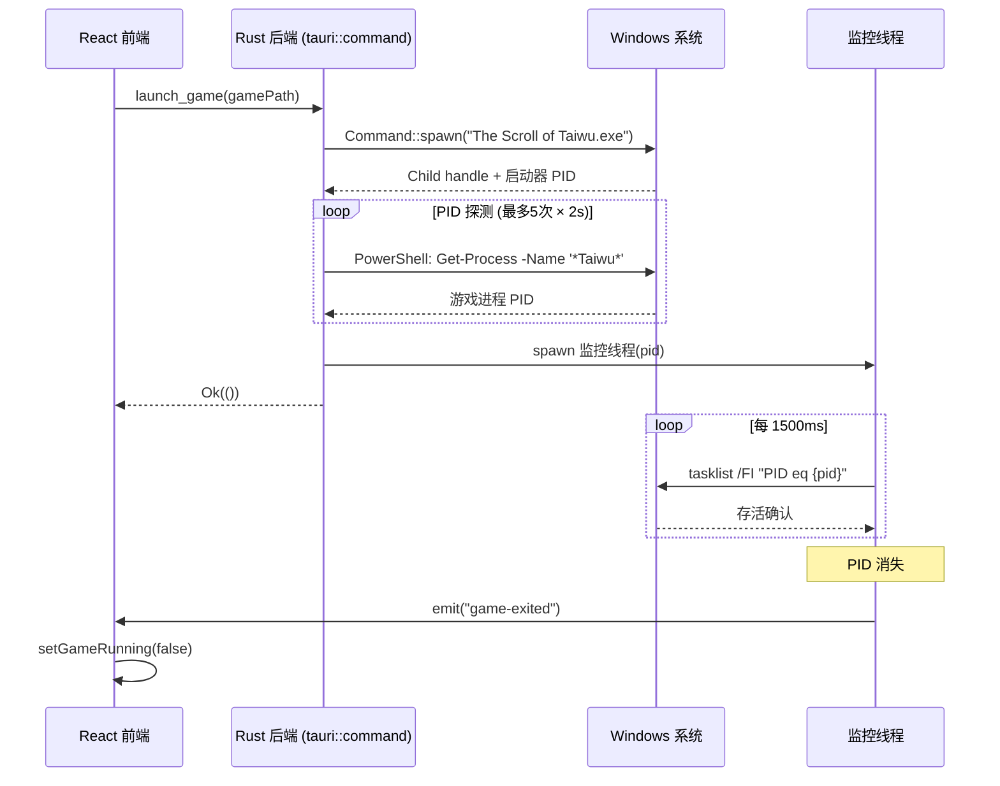

本文档深入剖析 TWModLauncher 中游戏进程的完整生命周期管理——从进程启动、PID 探测、后台轮询监控到 Tauri 事件驱动的跨进程状态同步。整个系统以 Rust 端为控制核心，React 前端仅作为被动的事件消费者，实现了零前端轮询的实时状态感知。

Sources: [game_launcher.rs](src-tauri/src/commands/game_launcher.rs#L1-L251)

## 架构总览

游戏进程管理系统由三条关键路径构成：**本地直接启动**（`launch_game`）、**Steam 协议启动**（`launch_game_steam`）和**强制终止**（`kill_game`）。前两条路径共享相同的 PID 轮询监控模式，但在 PID 发现策略上有根本差异。整个系统的状态同步完全依赖 Tauri 的事件推送机制——Rust 后端在独立线程中轮询进程存活状态，一旦检测到退出即通过 `app_handle.emit()` 向前端推送事件，前端通过 `listen()` 注册被动监听器，无需任何 `setInterval` 轮询。



Sources: [game_launcher.rs](src-tauri/src/commands/game_launcher.rs#L48-L73), [App.tsx](src/App.tsx#L104-L116)

## 核心数据结构：GameProcess

Rust 后端通过 Tauri 的 `.manage()` 机制将 `GameProcess` 注入为全局托管状态，所有 game_launcher 命令通过 `tauri::State<GameProcess>` 参数获取访问权。该结构用两个独立的 `Mutex<Option<T>>` 分别保护子进程句柄和 PID，避免了对整个结构体的锁竞争——`kill_game` 需要同时访问两者，而 `check_game_running` 只需要 PID。

```rust
pub struct GameProcess {
    pub child: Mutex<Option<Child>>,
    pub pid: Mutex<Option<u32>>,
}
```

| 字段 | 类型 | 用途 | 生命周期 |
|------|------|------|----------|
| `child` | `Mutex<Option<Child>>` | 持有子进程句柄，用于 `child.kill()` 优雅终止 | 从 `launch_game` 返回到 `kill_game` 清理 |
| `pid` | `Mutex<Option<u32>>` | 缓存游戏进程 PID，避免重复 PowerShell 查询 | 从 PID 探测成功到进程退出或被 kill |

`child` 仅在本地启动路径中可用——Steam 启动的游戏进程并非由启动器直接 spawn，因此 `GameProcess.child` 在 Steam 路径下始终为 `None`。这意味着 `kill_game` 的双阶段终止策略中，`child.kill()` 只是辅助手段，核心依赖仍是对 PID 的 `taskkill` 操作。

Sources: [game_launcher.rs](src-tauri/src/commands/game_launcher.rs#L28-L31), [lib.rs](src-tauri/src/lib.rs#L11-L14)

## 进程存活检测原语

系统构建在两个低层 Windows 工具之上：

### find_game_pid()：PowerShell 模糊匹配

```rust
fn find_game_pid() -> Option<u32> {
    let output = bg_cmd("powershell")
        .args(["-NoProfile", "-Command",
            "Get-Process -Name '*Taiwu*' -ErrorAction SilentlyContinue |
             Select-Object -First 1 -ExpandProperty Id"])
        .output().ok()?;
    stdout.trim().parse::<u32>().ok()
}
```

使用通配符 `*Taiwu*` 而非精确进程名是刻意为之——太吾绘卷的进程名在不同版本/启动方式下可能存在变体。`-First 1` 确保即使因异常情况出现多个匹配进程时也只取一个。此函数同时服务于：PID 探测阶段（启动后确认游戏进程已出现）、`check_game_running` 的兜底逻辑（存储 PID 失效时）、`kill_game` 的模糊强杀（`/IM "The Scroll of Taiwu.exe"`）。

Sources: [game_launcher.rs](src-tauri/src/commands/game_launcher.rs#L34-L44)

### pid_alive()：tasklist 精确过滤

```rust
fn pid_alive(pid: u32) -> bool {
    match bg_cmd("tasklist")
        .args(["/FI", &format!("PID eq {}", pid), "/NH"])
        .output()
    {
        Ok(o) => String::from_utf8_lossy(&o.stdout).contains(&pid.to_string()),
        Err(_) => false,
    }
}
```

`/FI` 过滤器精确匹配 PID，`/NH` 去除表头。通过检查 stdout 中是否包含 PID 字符串来判断进程存活。注意这里有一个微妙的健壮性设计：当 `tasklist` 本身执行失败时（如权限不足、系统异常），函数返回 `false`，监控线程将此视为进程已退出，触发 `game-exited` 事件——这是一种安全的"fail-closed"策略，宁可误报退出也不让前端永远卡在"运行中"状态。

Sources: [game_launcher.rs](src-tauri/src/commands/game_launcher.rs#L47-L55)

### bg_cmd()：无窗口子进程

所有系统工具调用（PowerShell、tasklist、taskkill、reg、cmd）都通过 `bg_cmd()` 构造，该函数在 Windows 上设置 `CREATE_NO_WINDOW` 标志（`0x08000000`），禁止弹出控制台黑窗。这是启动器类工具的关键 UX 细节——用户在游戏过程中不应被闪烁的命令行窗口干扰。

Sources: [game_launcher.rs](src-tauri/src/commands/game_launcher.rs#L16-L26)

## 本地启动路径：launch_game

本地启动是两条启动路径中更复杂的一条，因为它直接管理子进程句柄并需要分阶段 PID 探测。

### 阶段 1：可执行文件验证与进程 Spawn

```
let exe = PathBuf::from(&game_path).join("The Scroll of Taiwu.exe");
if !exe.exists() { return Err("未找到游戏程序"); }
let child = Command::new(&exe).current_dir(&game_path).spawn()?;
```

在 spawn 之前显式检查 `.exists()` 而非依赖 spawn 的 io::Error，是为了向用户提供中文错误信息。`current_dir(&game_path)` 的设置至关重要——太吾绘卷的可执行文件依赖相对路径加载游戏资源，不设置工作目录会导致游戏启动后立即崩溃。

Sources: [game_launcher.rs](src-tauri/src/commands/game_launcher.rs#L109-L120)

### 阶段 2：PID 探测与重试

游戏启动器（launcher）和实际游戏进程是分离的——`Command::spawn` 返回的 PID 可能是启动器进程而非游戏本体。因此系统在 spawn 后进入重试循环：

```
for _ in 0..5 {
    thread::sleep(Duration::from_secs(2));
    if let Some(pid) = find_game_pid() { ... }
}
```

每次迭代间隔 2 秒，最多 5 次重试（总计约 10 秒的探测窗口）。这个时间窗口足以覆盖大多数情况——游戏启动器通常在 2-6 秒内完成 Steamworks 初始化并拉起游戏主进程。如果 5 次探测均失败，返回 `"游戏进程未启动，可能被杀软拦截"`，这是对用户常见问题的针对性提示。

Sources: [game_launcher.rs](src-tauri/src/commands/game_launcher.rs#L128-L137)

### 阶段 3：监控线程启动

PID 确认后，系统执行三个原子操作：将 PID 写入 `GameProcess.pid`、将 Child 句柄写入 `GameProcess.child`、启动监控线程。监控线程的轮询间隔固定在 **1500ms**——这是一个工程权衡：1.5 秒对用户感知几乎无延迟（游戏退出后 0-1.5 秒内前端按钮状态更新），同时避免过于频繁的 `tasklist` 调用带来不必要的系统负载。

Sources: [game_launcher.rs](src-tauri/src/commands/game_launcher.rs#L58-L65), [game_launcher.rs](src-tauri/src/commands/game_launcher.rs#L132-L137)

## Steam 启动路径：launch_game_steam

Steam 启动路径与本地启动有本质差异——游戏进程由 Steam 客户端创建，启动器无法持有 Child 句柄。因此这条路径有独立的监控策略。

### 启动协议

```
bg_cmd("cmd").args(["/C", "start", "steam://rungameid/838350"]).spawn()?;
```

`838350` 是《太吾绘卷》在 Steam 上的 App ID。使用 `cmd /C start` 而非直接调用 Steam 可执行文件，是为了利用 Windows 的协议注册机制自动定位 Steam 安装路径。在 spawn 之前，`steam_installed()` 检查 `HKEY_CLASSES_ROOT\steam\shell\open\command` 注册表项以验证 Steam 协议是否已注册。

Sources: [game_launcher.rs](src-tauri/src/commands/game_launcher.rs#L203-L214), [game_launcher.rs](src-tauri/src/commands/game_launcher.rs#L77-L84)

### start_steam_monitor：两阶段等待策略

```rust
fn start_steam_monitor(app_handle: tauri::AppHandle) {
    thread::spawn(move || {
        thread::sleep(Duration::from_secs(6));          // 阶段1：初始等待
        for _ in 0..12 {                                 // 阶段2：PID 重试发现
            if let Some(pid) = find_game_pid() {
                loop {                                    // 阶段3：标准轮询
                    thread::sleep(Duration::from_millis(1500));
                    if !pid_alive(pid) { emit("game-exited"); return; }
                }
            }
            thread::sleep(Duration::from_secs(2));
        }
        emit("game-launch-failed", "Steam 启动超时，游戏进程未检测到");
    });
}
```

这个监控器的独特之处在于其**前导等待 + 重试**策略：

| 阶段 | 时长 | 行为 | 设计意图 |
|------|------|------|----------|
| 初始等待 | 固定 6 秒 | 不做任何检查 | Steam 客户端需要时间处理协议请求并拉起游戏启动器 |
| PID 重试发现 | 最多 12 次 × 2 秒 = 24 秒 | 每次间隔 2 秒调用 `find_game_pid()` | 容忍 Steamworks 初始化、DRM 验证等延迟 |
| 标准轮询 | 无限 | 每 1500ms 调用 `pid_alive()` | 与本地启动路径相同的稳定监控模式 |

总计约 30 秒的容忍窗口。超时后发射的不是 `game-exited` 而是 **`game-launch-failed`**，这是一个语义更精确的事件——告诉前端"游戏根本没启动起来"，前端据此显示错误信息而非仅仅恢复按钮状态。

Sources: [game_launcher.rs](src-tauri/src/commands/game_launcher.rs#L87-L106)

## 前端事件监听与状态同步

前端在 `useEffect` 中一次性建立两个事件监听器，贯穿整个组件生命周期：

```typescript
useEffect(() => {
    checkGameRunning().then((running) => {
        if (running) setGameRunning(true);
    });
    const p = listen("game-exited", () => { setGameRunning(false); });
    const p2 = listen<string>("game-launch-failed", (event) => {
        setGameRunning(false);
        setLaunchError(event.payload);
    });
    return () => { p.then((unlisten) => unlisten()); p2.then((unlisten) => unlisten()); };
}, []);
```

关键设计细节：

1. **启动时的主动检查**：`checkGameRunning()` 在组件挂载时立即调用，处理"用户在启动器外已运行游戏"的场景。此命令优先检查缓存的 PID（`GameProcess.pid`），若状态为空或缓存 PID 已失效则回退到 `find_game_pid()` 模糊搜索。

2. **事件驱动的被动更新**：后续的状态变更完全由 Rust 端推送，前端不做任何主动轮询。`game-exited` 事件不需要 payload（事件本身即是信号），而 `game-launch-failed` 携带错误描述字符串。

3. **清理函数**：`return` 中的 `unlisten()` 调用确保组件卸载时移除监听器，防止内存泄漏和重复回调。

Sources: [App.tsx](src/App.tsx#L104-L116), [game_launcher.rs](src-tauri/src/commands/game_launcher.rs#L142-L151)

### 启动与终止的用户交互流

前端的 `gameRunning` 状态驱动三个按钮状态：

- **`gameRunning === false`**：显示"启动游戏"按钮（hover 展开"本地启动"和"Steam 启动"双按钮）
- **`gameRunning === true`**：显示"游戏运行中"按钮（hover 变为"停止游戏"）

这种 hover 展开的设计避免了在界面上同时展示两个启动按钮造成的视觉噪音——大多数用户每次只会选择一种启动方式。

```typescript
const handleLaunch = async () => {
    if (!gamePath || gameRunning) return;
    setLaunchError(null);
    try {
        await launchGame(gamePath);
        setGameRunning(true);          // 乐观更新
    } catch (e) {
        setLaunchError(`启动失败: ${String(e)}`);
    }
};
```

注意 `setGameRunning(true)` 在 `launchGame` 成功后立即执行——这是一种**乐观更新**。如果游戏进程随后崩溃（监控线程检测到退出），`game-exited` 事件会将状态恢复为 `false`。如果 PID 探测阶段失败（5 次重试耗尽），`launchGame` 本身返回 Err，`gameRunning` 不会被设置为 `true`。

Steam 启动路径同样使用乐观更新——`setGameRunning(true)` 在 `launchGameSteam` 成功后执行，而后台 `start_steam_monitor` 可能在最多 30 秒后检测到超时并发射 `game-launch-failed`，届时前端再次将状态恢复。

Sources: [App.tsx](src/App.tsx#L130-L150)

## check_game_running：双路径存活检测

```rust
pub fn check_game_running(state: tauri::State<GameProcess>) -> bool {
    if let Ok(guard) = state.pid.lock() {
        if let Some(pid) = *guard {
            if pid_alive(pid) { return true; }
        }
    }
    find_game_pid().is_some()
}
```

该命令采用两层检测策略：

| 优先级 | 检测方式 | 适用场景 |
|--------|----------|----------|
| 1 | 缓存 PID → `pid_alive()` | 通过本启动器启动的游戏（本地或 Steam），PID 已知 |
| 2 | `find_game_pid()` 模糊搜索 | 启动器外部启动的游戏（如用户直接双击 exe），无缓存 PID |

缓存 PID 优先是因为它避免了 PowerShell 调用的额外开销。但如果 `state.pid` 锁获取失败、值为 `None`、或缓存 PID 已失效（`pid_alive` 返回 false），系统无缝回退到模糊搜索。这个 fallback 机制也处理了启动器重启后 `GameProcess` 状态清空但游戏仍在运行的场景。

Sources: [game_launcher.rs](src-tauri/src/commands/game_launcher.rs#L142-L151)

## 进程存活检测对比

| 维度 | 本地启动 (launch_game) | Steam 启动 (launch_game_steam) |
|------|------------------------|-------------------------------|
| 进程创建者 | 启动器直接 spawn | Steam 客户端 |
| Child 句柄 | 持有，可用于 `child.kill()` | 无，仅能通过 PID/taskkill |
| PID 发现 | spawn 后立即重试（5 次 × 2s） | 初始 6s 等待 + 重试（12 次 × 2s） |
| 总探测窗口 | ~10 秒 | ~30 秒 |
| 失败事件 | 同步返回 Err | 异步 `game-launch-failed` 事件 |
| 监控线程 | `start_pid_monitor` | `start_steam_monitor`（内嵌同一模式） |
| 轮询间隔 | 1500ms | 1500ms |
| Steam 检测 | 不涉及 | `steam_installed()` 注册表检查 |

两条路径的监控线程最终收敛到相同的 `pid_alive()` 轮询模式——区别仅在于 PID 发现阶段的时间预算。

Sources: [game_launcher.rs](src-tauri/src/commands/game_launcher.rs#L109-L137), [game_launcher.rs](src-tauri/src/commands/game_launcher.rs#L203-L214), [game_launcher.rs](src-tauri/src/commands/game_launcher.rs#L87-L106)

## 设计权衡与边界条件

**为什么用 PID 轮询而非进程句柄等待？** `Child::wait()` 是阻塞式 API，在异步命令处理器中会独占线程。独立监控线程 + PID 轮询允许轮询间隔可调、可随时发送 Tauri 事件、且对 Steam 启动路径（无 Child 句柄）同样适用。统一使用 PID 轮询模式降低了两条路径的维护成本。

**1500ms 轮询间隔的工程依据**：Windows 的 `tasklist` 命令属于轻量操作（查询内核进程列表），1500ms 间隔在用户体验（退出后快速感知）和系统资源（CPU/IO）之间取得平衡。1.5 秒也是人眼可察觉但不会感到迟钝的延迟上限。

**PID 复用的理论风险**：Windows 在进程退出后会回收 PID，理论上新进程可能复用同一 PID。但在太吾绘卷这类长时间运行的游戏场景中，从监控线程检测到退出到用户重新启动之间通常有足够的时间窗口使此风险可忽略。此外，`pid_alive()` 不仅检查 PID 存在性——`tasklist` 输出还隐含了进程名匹配（通过 `/FI` 过滤），如果 PID 被完全不相关的进程复用，名称不匹配将导致 `tasklist` 返回空结果。

Sources: [game_launcher.rs](src-tauri/src/commands/game_launcher.rs#L58-L65)

## 阅读后续

本文档聚焦于游戏进程的启动与存活监控机制。强制终止策略（`kill_game` 的双阶段 WM_CLOSE + taskkill 策略）是进程生命周期管理的另一个关键组成部分，详见 [强制终止的双阶段策略：WM_CLOSE 优雅关闭 + taskkill 强杀](21-qiang-zhi-zhong-zhi-de-shuang-jie-duan-ce-lue-wm_close-you-ya-guan-bi-taskkill-qiang-sha)。

对于 Rust 命令的整体注册体系，可回溯至 [Tauri 命令注册体系：invoke_handler 与前后端通信](6-tauri-ming-ling-zhu-ce-ti-xi-invoke_handler-yu-qian-hou-duan-tong-xin)。日志子系统和崩溃保护机制则分别记录在 [前后端统一日志管线](22-qian-hou-duan-tong-ri-zhi-guan-xian-qian-duan-ri-zhi-qiao-jie-zhi-rust-tracing-zi-xi-tong) 和 [崩溃日志保护](23-beng-kui-ri-zhi-bao-hu-ring-buffer-nei-cun-huan-chong-cuo-wu-hong-fa-ci-pan-xie-ru)。