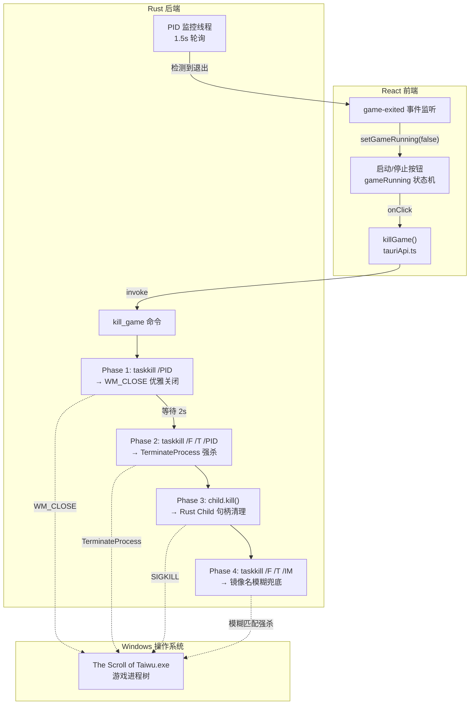

本文档剖析 TWModLauncher 中 `kill_game` 命令的完整终止管线：从 Rust 后端层层递进的四步清除策略，到前端 `gameRunning` 状态机的事件驱动同步。核心设计原则是「先礼后兵」——优先请求游戏进程自行清理（Steamworks 反初始化、存档落盘），仅在超时无响应后才转入操作系统级强杀。

## 架构全景

终止管线横跨 Rust 后端与 React 前端两层，由以下组件协作完成：



四阶段终止策略并不孤立存在，它依托于 `GameProcess` 状态管理、`bg_cmd` 控制台抑制工具函数、以及 `pid_alive` 存活检测三者形成的支撑层。

Sources: [game_launcher.rs](src-tauri/src/commands/game_launcher.rs#L1-L200)

## GameProcess 状态管理：child 与 pid 的双 Mutex 设计

`GameProcess` 是 Tauri 托管状态（managed state），在应用启动时注入，贯穿整个生命周期。其结构揭示了进程管理的核心挑战：Rust 的 `std::process::Child` 句柄与实际游戏进程 PID 之间存在间接关系。

```rust
pub struct GameProcess {
    pub child: Mutex<Option<Child>>,
    pub pid: Mutex<Option<u32>>,
}
```

`child` 字段持有直接 spawn 的子进程句柄，用于 `Child::kill()` 调用。但太吾绘卷的启动流程存在一个间接层：游戏启动器（launcher）先被 spawn，随后启动器再拉起真正的游戏进程。因此 `child` 持有的 PID 可能与实际游戏进程 PID 不同——这就是需要独立的 `pid` 字段的原因。

`pid` 通过 `find_game_pid()` 的模糊搜索获得：该函数调用 PowerShell 的 `Get-Process -Name '*Taiwu*'`，按进程名模式匹配获取第一个匹配进程的 ID。启动时重试最多 5 次（每次间隔 2 秒），以适应启动器的延迟拉起。

两个字段各自使用独立的 `Mutex<Option<T>>` 包裹，允许并发访问时分别加锁，避免不必要的锁争用。在终止流程中，`pid` 被优先用于 taskkill 定位，`child` 作为补充手段兜底。

Sources: [game_launcher.rs](src-tauri/src/commands/game_launcher.rs#L23-L27) | [lib.rs](src-tauri/src/lib.rs#L12-L15)

## 终止四阶段详解

`kill_game` 命令的注释将其描述为双阶段策略，但实际执行流程包含四个递进的终止层级，每一层都有明确的职责和失败包容性。

### Phase 1：taskkill 无 /F 标志 —— WM_CLOSE 优雅关闭

```rust
let _ = bg_cmd("taskkill")
    .args(["/PID", &pid.to_string()])
    .output();
thread::sleep(Duration::from_secs(2));
```

这是「先礼」阶段。Windows 的 `taskkill` 在不带 `/F` 参数时，向目标进程发送 `WM_CLOSE` 窗口消息——等同于用户点击窗口的关闭按钮。对于正确实现了 `WM_CLOSE` 处理的消息循环（包括 Unity 引擎游戏），这会触发正常的关闭流程：Steamworks SDK 反初始化、存档写入、配置文件落盘。命令执行后阻塞等待 2 秒，给游戏充足的时间完成清理。

关键细节：此阶段使用 `let _ =` 显式忽略 Result，即使 taskkill 失败（例如进程已自然退出）也不会中断后续流程。这是一种防御性设计——优雅关闭是「尽力而为」而非「必须成功」。

Sources: [game_launcher.rs](src-tauri/src/commands/game_launcher.rs#L158-L166)

### Phase 2：taskkill /F /T —— 进程树强制终止

```rust
if let Some(pid) = target_pid {
    if pid_alive(pid) {
        let _ = bg_cmd("taskkill")
            .args(["/F", "/T", "/PID", &pid.to_string()])
            .output();
    }
}
```

「后兵」阶段。在 2 秒等待后，通过 `pid_alive()` 检查进程是否仍然存活。若存活，发送带 `/F`（强制）和 `/T`（进程树）标志的 taskkill 命令。

`/F` 标志将机制从 WM_CLOSE 升级为 `TerminateProcess`——操作系统内核级强制终止，不给予进程任何清理机会。`/T` 标志将终止范围从单一进程扩展到整个进程树，包括该 PID 的所有子进程。这对应太吾绘卷可能通过 Steam 启动器产生的多进程结构。

| 参数 | 机制 | 进程清理机会 | 适用范围 |
|------|------|-------------|---------|
| 无 `/F` | WM_CLOSE 窗口消息 | 有（Steamworks 反初始化、存档） | 单一 PID |
| `/F` | TerminateProcess 内核调用 | 无 | 单一 PID |
| `/F` + `/T` | TerminateProcess + 进程树遍历 | 无 | PID 及其所有子进程 |

Sources: [game_launcher.rs](src/twari/src/commands/game_launcher.rs#L169-L175)

### Phase 3：Rust Child::kill() —— 直接句柄清理

```rust
if let Ok(mut guard) = state.child.lock() {
    if let Some(ref mut child) = *guard {
        let _ = child.kill();
    }
    *guard = None;
}
```

此阶段针对直接 spawn 的子进程句柄（即启动器进程）。Rust 标准库的 `Child::kill()` 在 Windows 平台上调用 `TerminateProcess`，是跨平台统一的强杀接口。即使 Phase 1/2 已经终止了游戏进程，启动器进程可能仍然存活——此步骤确保其被清理。

执行后将 `child` 置为 `None`，释放句柄资源。

Sources: [game_launcher.rs](src/tauri/src/commands/game_launcher.rs#L178-L183)

### Phase 4：镜像名模糊兜底

```rust
let _ = bg_cmd("taskkill")
    .args(["/F", "/T", "/IM", "The Scroll of Taiwu.exe"])
    .output();
```

这是最后一道防线。它不依赖存储的 PID，而是按进程镜像名称 `The Scroll of Taiwu.exe` 进行模糊匹配。此步骤覆盖了以下边界场景：

- 游戏进程以不同于记录的 PID 重新生成了自身
- `find_game_pid()` 捕获的 PID 与实际运行的进程 PID 不同
- Phase 2 执行后仍有残留的子进程未被覆盖

使用 `/F /T` 组合确保最大杀伤力。与前面各阶段一样，Result 被显式忽略——到了这一步，无论 taskkill 成功与否，清理工作都已完成。

Sources: [game_launcher.rs](src/tauri/src/commands/game_launcher.rs#L186-L188)

### 状态清理收尾

```rust
if let Ok(mut guard) = state.pid.lock() {
    *guard = None;
}
```

所有终止尝试完成后，将存储的 PID 归零。这确保后续的 `check_game_running` 调用不会误判已终止的进程为活跃状态。

Sources: [game_launcher.rs](src/tauri/src/commands/game_launcher.rs#L191-L193)

## 支撑工具函数

### bg_cmd：后台命令构建器

```rust
#[cfg(windows)]
const CREATE_NO_WINDOW: u32 = 0x08000000;

fn bg_cmd(program: &str) -> Command {
    let mut cmd = Command::new(program);
    #[cfg(windows)]
    {
        let _ = cmd.creation_flags(CREATE_NO_WINDOW);
    }
    cmd
}
```

所有 taskkill、tasklist、PowerShell 调用均通过 `bg_cmd` 构建。在 Windows 平台上，`CREATE_NO_WINDOW`（`0x08000000`）标志抑制控制台窗口弹出示。这对用户体验至关重要——终止过程中如果弹出多个 cmd 窗口闪烁，会严重破坏桌面应用的质感。该标志仅影响控制台窗口创建，不影响进程的实际执行。

Sources: [game_launcher.rs](src/tauri/src/commands/game_launcher.rs#L12-L21)

### pid_alive：存活检测

```rust
fn pid_alive(pid: u32) -> bool {
    match bg_cmd("tasklist")
        .args(["/FI", &format!("PID eq {}", pid), "/NH"])
        .output()
    {
        Ok(o) => String::from_utf8_lossy(&o.stdout).contains(&pid.to_string()),
        Err(_) => false,
    }
}
```

通过 `tasklist /FI "PID eq <pid>" /NH` 查询进程是否仍在运行。`/FI` 指定过滤器，`/NH` 去除表头仅返回匹配行。该函数不仅服务于终止流程的 Phase 2 存活判断，也是 PID 监控线程的核心检测手段——每 1.5 秒轮询一次，检测到进程退出后通过 Tauri 事件系统向 React 前端推送 `game-exited`。

Sources: [game_launcher.rs](src/tauri/src/commands/game_launcher.rs#L42-L50) | [game_launcher.rs](src/tauri/src/commands/game_launcher.rs#L54-L60)

## 前端状态同步：gameRunning 状态机

前端不直接管理进程生命周期，而是通过两个渠道感知游戏运行状态：

| 渠道 | 方向 | 触发条件 |
|------|------|---------|
| `killGame()` 返回值 | 前端 → 后端 → 前端 | 用户点击停止按钮，命令执行完毕 |
| `game-exited` 事件 | 后端 → 前端 | PID 监控线程检测到进程退出 |
| `game-launch-failed` 事件 | 后端 → 前端 | Steam 启动超时（30 秒内未检测到进程） |
| `checkGameRunning()` | 前端 → 后端 | 应用启动时检测是否已有游戏实例在运行 |

`handleKill` 函数主动将 `gameRunning` 设为 `false`，事件监听器作为被动同步补充——当游戏自行退出（非通过启动器强制终止）时，事件监听器确保 UI 状态正确收敛。

```typescript
const handleKill = async () => {
    try {
      await killGame();
      setGameRunning(false);
    } catch (e) {
      setLaunchError(`停止失败: ${String(e)}`);
    }
};
```

UI 表现上，`gameRunning === true` 时按钮显示琥珀色「游戏运行中」，鼠标悬停时切换为红色「停止游戏」——这是典型的防御性交互设计：避免用户误触停止按钮，通过颜色变化（红色 = 危险操作）增加操作确认的心理成本。

Sources: [App.tsx](src/App.tsx#L175-L182) | [App.tsx](src/App.tsx#L500-L515)

## 设计权衡与边界条件

### 2 秒等待的工程考量

Phase 1 与 Phase 2 之间的 `thread::sleep(Duration::from_secs(2))` 是一个同步阻塞调用。在 Tauri 命令处理器中，这意味着该命令会阻塞一个异步工作线程 2 秒。对于「强制终止」这一用户明确触发的低频操作，这是可接受的权衡——用户此时等待的是游戏进程清理，而非 UI 响应。但如果未来需要支持批量终止多个进程，应考虑将等待逻辑改为异步轮询。

### 为什么不用 EnumWindows + SendMessage 直接发送 WM_CLOSE

理论上可以通过 Windows API 直接 `FindWindow` + `SendMessage(WM_CLOSE)` 实现更精确的窗口级关闭。`taskkill` 方案的优势在于：

- **无需 unsafe 代码**：`taskkill` 是操作系统内置命令，避免引入 `windows-sys` 依赖和 unsafe 块
- **隐式进程树感知**：`/T` 标志自动处理子进程，手动实现需要 `CreateToolhelp32Snapshot` 遍历
- **错误容忍**：taskkill 对已退出进程仅返回警告，不会中断流程

代价是失去对「哪个窗口收到 WM_CLOSE」的精确控制，但太吾绘卷作为单窗口 Unity 游戏，此限制无实际影响。

### Steam 启动路径的终止差异

通过 `launch_game_steam` 命令启动游戏时，`GameProcess.pid` 不会被填充——因为 Rust 端只是通过 `cmd /C start steam://rungameid/838350` 触发 Steam 协议，并不持有进程句柄。这种情况下，`kill_game` 的 Phase 1-3 均会在 `target_pid` 为 `None` 时被跳过，仅 Phase 4 的镜像名模糊兜底生效。这是设计上的已知限制：Steam 启动的游戏进程不属于启动器进程树，只能通过镜像名匹配强杀。

Sources: [game_launcher.rs](src/tauri/src/commands/game_launcher.rs#L206-L218)

## 与相关系统的接口

终止策略是游戏进程管理子系统的组成部分，与以下系统存在接口关系：

- **[游戏启动与进程监控](20-you-xi-qi-dong-yu-jin-cheng-jian-kong-pid-lun-xun-tauri-shi-jian-tui-song)**：`launch_game` 负责填充 `GameProcess` 状态并启动监控线程；`kill_game` 负责清空状态。两者共享 `GameProcess` 托管状态和 `pid_alive` 检测函数。
- **[Tauri 命令注册体系](6-tauri-ming-ling-zhu-ce-ti-xi-invoke_handler-yu-qian-hou-duan-tong-xin)**：`kill_game` 通过 `invoke_handler` 注册为 Tauri 命令，前端通过 `invoke("kill_game")` 调用。
- **[前后端统一日志管线](22-qian-hou-duan-tong-ri-zhi-guan-xian-qian-duan-ri-zhi-qiao-jie-zhi-rust-tracing-zi-xi-tong)**：终止过程中的 taskkill 输出目前被静默丢弃（`let _ =`），未来可考虑将 stderr 输出接入 tracing 子系统用于问题诊断。