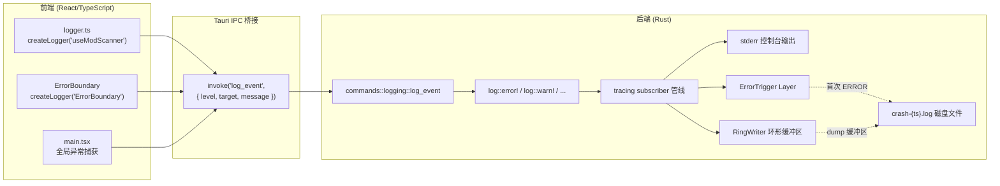
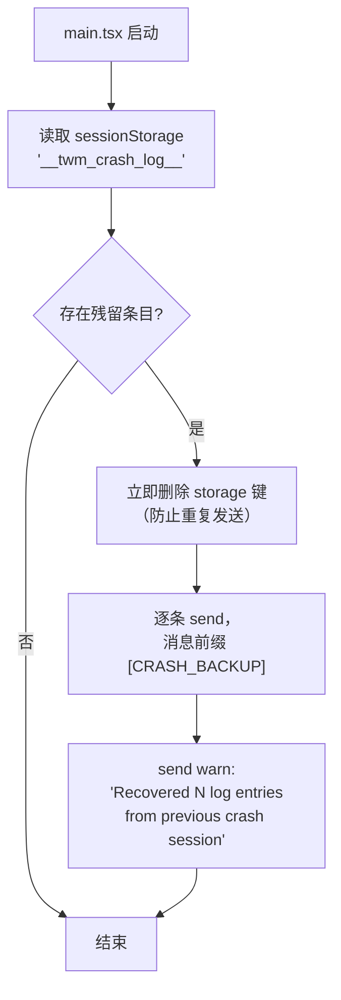
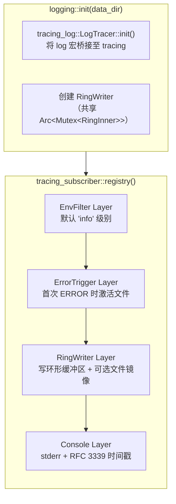
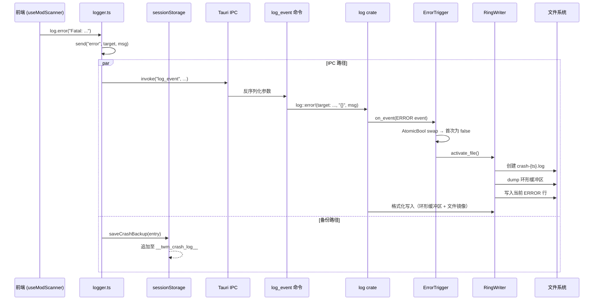

本文档剖析 TWModLauncher 中前端（React/TypeScript）日志如何无缝桥接至 Rust 后端的 `tracing` 子系统，实现全栈日志的统一收集、缓冲与崩溃保护。阅读本文可理解 fire-and-forget 调用模式、模块级 Logger 工厂、以及 Rust 端三层 subscriber 架构的协同机制。

## 架构全景：一条管线，两个入口

整个日志系统的核心设计原则是：**前端不拥有独立的日志存储或输出通道，所有日志事件最终都汇入 Rust 端的 `tracing` subscriber 管线**。这意味着无论是 `useModScanner` 中的 `log.debug(...)`，还是 Rust 端 `game_launcher` 模块中的 `log::info!(...)`，都流经同一套格式化、缓冲、过滤与持久化逻辑。



桥接的关键在于 Tauri 的 `invoke` 机制：前端通过 `@tauri-apps/api/core` 的 `invoke` 函数调用后端注册的 `log_event` 命令，将日志级别、模块目标、消息文本三个字段传递至 Rust 端。随后，Rust 端使用 `log` crate 的宏将事件注入 `tracing` 管线——这与后端自身代码写日志的方式完全一致。

Sources: [logger.ts](src/lib/logger.ts#L1-L92), [logging.rs](src-tauri/src/commands/logging.rs#L1-L12), [logging.rs](src-tauri/src/logging.rs#L1-L11)

## 前端日志工厂：模块级 Logger 的创建与调用

前端日志系统的入口是 `src/lib/logger.ts`，它导出了一个工厂函数 `createLogger(target: string)` 和一个默认的单例 `logger`。`createLogger` 返回一个 `Logger` 接口对象，包含 `debug`、`info`、`warn`、`error` 四个方法。调用方通过传入模块名称（如 `"useModScanner"`、`"ErrorBoundary"`）来创建带命名空间的日志器，这使得日志输出中的 `target` 字段能明确标识日志来源。

| 函数/变量 | 类型 | 用途 |
|---|---|---|
| `createLogger(target)` | 工厂函数 | 创建绑定到指定 target 名称的 Logger 实例 |
| `logger` | `Logger` 单例 | 默认的 `"app"` 目标日志器，用于全局/非模块级日志 |
| `flushCrashBackup()` | 导出函数 | 启动时恢复上一会话的崩溃备份日志 |
| `send(level, target, message)` | 内部函数 | fire-and-forget 调用 `invoke("log_event", ...)` |
| `saveCrashBackup(entry)` | 内部函数 | 将 ERROR 日志写入 `sessionStorage` 作为崩溃保护 |

`send` 函数是整个前端日志系统的核心执行单元。它采用 **fire-and-forget** 模式——调用 `invoke` 后不 `await`，直接附加一个空的 `.catch(() => {})` 吞掉可能的 IPC 错误。这种设计确保日志记录永远不会阻塞 UI 线程：即使 Rust 后端尚未就绪或 IPC 通道暂时不可用，前端也不会因写日志而卡顿。

Sources: [logger.ts](src/lib/logger.ts#L27-L30)

### ERROR 级别的双重保障

当调用 `logger.error(msg)` 时，前端执行**两条独立的路径**：

1. **IPC 路径**：通过 `send("error", target, msg)` 将日志事件发往后端——与其他级别完全一致。
2. **sessionStorage 路径**：立即调用 `saveCrashBackup(entry)`，将格式为 `{ ts, level, target, message }` 的 `LogEntry` 追加到 `sessionStorage` 中以 `__twm_crash_log__` 为键的数组中。

`saveCrashBackup` 维护一个上限为 50 条的滑动窗口。其存在理由是：如果 WebView 在 `invoke` 完成前发生崩溃（例如 Rust 端 panic 导致进程终止），IPC 路径上的日志事件将永远丢失。sessionStorage 中的备份提供了崩溃后的恢复能力——下次启动时由 `flushCrashBackup()` 读取并重新发送。

Sources: [logger.ts](src/lib/logger.ts#L32-L43), [logger.ts](src/lib/logger.ts#L83-L87)

### 启动时的崩溃日志恢复

`flushCrashBackup()` 在 `main.tsx` 的顶层同步调用（早于 React 渲染），负责读取 sessionStorage 中的残留崩溃日志。恢复流程为：



这个恢复机制的精妙之处在于：它在**启动时序的最早期**执行，甚至在 React 根节点挂载之前。这意味着即使应用在初始化阶段再次崩溃，上一会话的日志也已经被安全地发送至 Rust 端（并进入环形缓冲区保护）。

Sources: [logger.ts](src/lib/logger.ts#L46-L62), [main.tsx](src/main.tsx#L8-L9)

### 前端日志使用点全景

当前代码库中 `createLogger` 的调用分布在三个关键位置：

| 使用位置 | Target 名称 | 日志级别 | 场景 |
|---|---|---|---|
| `src/main.tsx` | `"app"`（通过默认 `logger`） | error | 全局 `window.onerror` 和 `window.onunhandledrejection` |
| `src/components/ErrorBoundary.tsx` | `"ErrorBoundary"` | error | React 组件树崩溃捕获 |
| `src/hooks/useModScanner.ts` | `"useModScanner"` | debug / error | Mod 扫描流程跟踪与异常记录 |

`main.tsx` 中的全局异常处理器是整个前端的最后一道防线。`window.onerror` 捕获同步抛出的未处理异常（返回 `false` 允许浏览器默认的 `console.error` 也执行），`window.onunhandledrejection` 捕获未处理的 Promise 拒绝。两者都将完整的错误消息、堆栈跟踪和发生位置发送至后端日志系统。

Sources: [main.tsx](src/main.tsx#L11-L25), [ErrorBoundary.tsx](src/components/ErrorBoundary.tsx#L1-L27), [useModScanner.ts](src/hooks/useModScanner.ts#L116-L117)

## 桥接命令：`log_event` 的类型路由

Rust 端的 `commands::logging::log_event` 是前端与 tracing 子系统之间的**唯一桥梁**。它是一个标准的 Tauri 命令（标记 `#[tauri::command]`），接收三个 `String` 参数，并通过简单的 `match` 分发将前端日志级别映射到 Rust `log` crate 的五个宏之一。

```rust
#[tauri::command]
pub fn log_event(level: String, target: String, message: String) {
    match level.as_str() {
        "error" => log::error!(target: &target, "{}", message),
        "warn"  => log::warn!(target: &target, "{}", message),
        "info"  => log::info!(target: &target, "{}", message),
        "debug" => log::debug!(target: &target, "{}", message),
        _       => log::trace!(target: &target, "{}", message),
    }
}
```

这里的关键细节是 `target:` 参数的传递方式。`log` crate 的宏支持 `target:` 命名参数，它会被 `tracing-subscriber` 的格式化层输出为日志的 target 字段。因此，前端传入的模块名称（如 `"useModScanner"`）会原样出现在最终的日志输出中，与 Rust 端自身的模块 target（如 `"game_launcher"`）在格式上完全一致。

另外值得注意的是，未知的 level 值会被降级为 `trace`——这既是一种防御性编程，也确保了前端即使传入非预期值也不会导致 panic。

Sources: [logging.rs](src-tauri/src/commands/logging.rs#L1-L12)

### 命令注册

`log_event` 命令在 `lib.rs` 的 `invoke_handler` 中与所有其他业务命令一同注册。此外还注册了 `open_log_dir` 命令，允许用户通过系统文件管理器打开日志目录——该功能在前端 `tauriApi.ts` 中通过 `openLogDir()` 暴露。

Sources: [lib.rs](src-tauri/src/lib.rs#L49-L50), [logging.rs](src-tauri/src/commands/logging.rs#L14-L29)

## Rust 端三层 Subscriber 架构

`logging::init(data_dir)` 构建了一个由三个 Layer 组成的 tracing subscriber 管线。这三个 Layer 以特定的顺序注册到 `tracing_subscriber::registry()` 中，顺序决定了事件处理的优先级。



关键初始化步骤中，`tracing_log::LogTracer::init()` 是桥接的**Rust 侧入口**：它将 `log` crate 的宏调用（包括前端的 `log_event` 命令所触发的那些）转发到 tracing 事件系统。没有这一步，`log::info!` 等调用将不会出现在 tracing subscriber 的输出中。

Sources: [logging.rs](src-tauri/src/logging.rs#L157-L195)

### Layer 1: EnvFilter —— 级别过滤

第一个注册的是 `EnvFilter`，它决定了哪些级别的日志事件能够穿透到后续的 Layer。默认过滤器为 `"info"`（即允许 info、warn、error），但可通过环境变量 `RUST_LOG` 覆盖。例如，设置 `RUST_LOG=debug` 即可在开发时启用所有 `log.debug!` 调用（包括来自前端的 debug 日志）。

Sources: [logging.rs](src-tauri/src/logging.rs#L182-L184)

### Layer 2: ErrorTrigger —— 崩溃文件激活器

`ErrorTrigger` 是一个自定义的 tracing Layer，其唯一职责是：**在第一个 ERROR 级别事件到来时，激活 RingWriter 的文件写入通道**。它内部维护一个 `AtomicBool` 标志 `triggered`，通过 `swap(true, Ordering::SeqCst)` 确保激活操作仅执行一次。

```rust
impl<S: tracing::Subscriber> Layer<S> for ErrorTrigger {
    fn on_event(&self, event: &Event<'_>, _ctx: Context<'_, S>) {
        if *event.metadata().level() <= tracing::Level::ERROR
            && !self.triggered.swap(true, Ordering::SeqCst)
        {
            self.writer.activate_file();
        }
    }
}
```

这里 `event.metadata().level() <= tracing::Level::ERROR` 使用了 tracing 内部的级别序数比较（ERROR 的序数值最小，最为严重），这意味着 ERROR 级别的事件会触发此 Layer。注意 **ErrorTrigger 注册在 RingWriter Layer 之前**，这确保了：当 ERROR 事件到达时，文件先被激活，然后 RingWriter Layer 才格式化并写入该事件（包括其环形缓冲区中积累的历史日志）。

Sources: [logging.rs](src-tauri/src/logging.rs#L131-L144)

### Layer 3: RingWriter —— 环形缓冲区 + 可选文件镜像

`RingWriter` 是整个系统中最复杂的组件，它同时实现了 `Write`、`MakeWriter` 和 `Clone` trait。其核心数据结构是：

```rust
struct RingInner {
    buf: Vec<u8>,          // 环形缓冲区（128KB 上限）
    file: Option<fs::File>, // 激活后的崩溃日志文件句柄
    log_dir: PathBuf,       // 日志目录路径
}
```

**Write 实现**的双重行为：

| 状态 | 行为 |
|---|---|
| 文件未激活（正常运行时） | 仅写入内存环形缓冲区，按行边界裁剪以维持 128KB 上限 |
| 文件已激活（触发 ERROR 后） | 同时写入环形缓冲区 **和** 磁盘文件 |

环形缓冲区的裁剪策略是按**行边界**进行的：当缓冲区超过 `RING_MAX_BYTES`（128KB）时，寻找第一个换行符并删除该行之前的所有内容。如果找不到换行符（极端情况），则清空整个缓冲区。这种设计保证了缓冲区始终包含完整的日志行，不会出现半行截断。

Sources: [logging.rs](src-tauri/src/logging.rs#L18-L118)

### `activate_file()` 的完整流程

当 ErrorTrigger 调用 `activate_file()` 时，RingWriter 执行以下步骤：

1. 创建日志目录 `{app_data}/TWModLauncher/logs/`（如果不存在）
2. 以当前时间戳生成文件名 `crash-{yyyy-MM-ddTHH-MM-SS}.log`
3. 打开文件（append 模式），先将环形缓冲区中的已有内容以 `=== 崩溃前上下文 (N 字节) ===` 头写入
4. 写入 `=== 崩溃时刻 ===` 分隔标记
5. 将文件句柄存入 `inner.file`，后续所有日志同步写入此文件
6. 清理超过 `MAX_CRASH_FILES`（15 个）限制的旧崩溃日志文件

这意味着崩溃日志文件包含 **错误发生前最后约 300-500 行的上下文**——这正是诊断间歇性崩溃最需要的信息。

Sources: [logging.rs](src-tauri/src/logging.rs#L37-L86)

### Layer 4: Console Layer —— 开发可见性

最末层是标准 stderr 输出，使用 RFC 3339 时间格式并显示 target 字段。在开发模式下（`npm run tauri dev`），这些输出直接显示在终端中；在生产构建中，由于 `main.rs` 中设置了 `#![cfg_attr(not(debug_assertions), windows_subsystem = "windows")]`，没有控制台窗口，stderr 输出不可见——这正是期望的行为：生产环境中日志仅通过环形缓冲区和崩溃文件机制管理。

Sources: [logging.rs](src-tauri/src/logging.rs#L164-L167), [main.rs](src-tauri/src/main.rs#L1-L2)

## Panic Hook：Rust 端崩溃的最后防线

除了 ErrorTrigger Layer 的运行时错误检测，日志系统还注册了一个自定义 panic hook：

```rust
pub fn set_panic_hook() {
    let old_hook = std::panic::take_hook();
    std::panic::set_hook(Box::new(move |info| {
        if let Some(ref w) = *TRIGGER.lock().unwrap() {
            w.activate_file();
        }
        log::error!("!!! PANIC !!! {}", info);
        old_hook(info);
    }));
}
```

`TRIGGER` 是一个 `LazyLock<Mutex<Option<RingWriter>>>` 全局静态变量，在 `init()` 结束时被赋值。Panic hook 通过它获取 `RingWriter` 引用并激活文件写入，然后记录 panic 信息，最后调用原始的 panic hook（默认会打印到 stderr 并触发进程退出）。

此设计与 ErrorTrigger Layer 形成**双重保障**：
- ErrorTrigger 捕获通过 `log`/`tracing` 渠道的 ERROR 事件
- Panic hook 捕获 Rust 线程的 unwind panic（即使在 panic 时没有日志调用，也能确保缓冲区内容被保存）

Sources: [logging.rs](src-tauri/src/logging.rs#L148-L210)

## 数据流时序：从前端 ERROR 到磁盘文件

以下时序图展示了一条前端 ERROR 日志从产生到落盘的完整路径：



注意两条路径是**并行执行**的：IPC 路径和 sessionStorage 备份路径之间没有阻塞依赖。这保证了即使后端响应缓慢，前端日志操作也能在微秒级完成。

Sources: [logger.ts](src/lib/logger.ts#L83-L87), [logging.rs](src-tauri/src/commands/logging.rs#L4-L12), [logging.rs](src-tauri/src/logging.rs#L136-L144)

## 依赖全景

日志系统涉及跨越前后端的多个 crate 和包：

| 依赖 | 所在端 | 版本 | 角色 |
|---|---|---|---|
| `@tauri-apps/api/core` | 前端 | — | `invoke` 函数，发起 IPC 调用 |
| `log` | Rust | 0.4 | Rust 端日志宏（`log::info!` 等） |
| `tracing` | Rust | 0.1 | 结构化事件收集框架 |
| `tracing-subscriber` | Rust | 0.3 | Layer 组装、格式化、EnvFilter |
| `tracing-log` | Rust | 0.2 | 将 `log` 宏调用桥接至 `tracing` |
| `tracing-appender` | Rust | 0.2 | （声明为依赖，当前未直接使用） |
| `chrono` | Rust | 0.4 | 崩溃日志文件名时间戳 |
| `dirs` | Rust | 6.0 | `open_log_dir` 命令中使用 |

Sources: [Cargo.toml](src-tauri/Cargo.toml#L23-L33), [logger.ts](src/lib/logger.ts#L10)

## 设计决策与权衡

**为什么选择 fire-and-forget 而非 await？**
日志记录属于基础设施关注点，不应成为业务逻辑的性能瓶颈。`invoke` 是异步 IPC 调用，如果 await 它，每次 `log.info(...)` 都会产生一个微任务调度延迟。对于高频日志场景（如扫描上百个 Mod 时的 debug 输出），累积延迟可能显著拖慢 UI 响应。fire-and-forget 的代价是可能丢失 IPC 失败时的日志——这正是 sessionStorage 备份机制存在的理由。

**为什么前端不直接写文件？**
Tauri 的安全模型限制 WebView 对文件系统的直接访问。所有文件 I/O 必须通过 Tauri 命令进行。如果前端直接写文件，将需要绕开这些安全限制，且无法与 Rust 端的 tracing 管线共享格式、缓冲和崩溃保护机制。

**为什么使用 `log` crate 而非直接使用 `tracing` 宏？**
`log` crate 是 Rust 生态系统中最轻量的日志门面（facade），它允许库代码发出日志而不依赖特定的日志实现。在 `log_event` 命令中使用 `log::error!` 而非 `tracing::error!` 保持了与 Rust 端其他模块的一致性——这些模块也使用 `log` crate 的宏。

Sources: [logger.ts](src/lib/logger.ts#L27-L29)

## 与邻近系统的关系

本日志管线是日志基础设施的核心，它与以下同级系统紧密协作：

- **[崩溃日志保护：Ring Buffer 内存缓冲 + 错误触发磁盘写入](23-beng-kui-ri-zhi-bao-hu-ring-buffer-nei-cun-huan-chong-cuo-wu-hong-fa-ci-pan-xie-ru)**：深入剖析 `RingWriter` 的环形缓冲区算法与 `activate_file()` 的崩溃文件生成策略——本文的 Layer 3 部分仅概述其接口，详细实现请参阅该文档。
- **[ErrorBoundary 与全局未捕获异常处理](24-errorboundary-yu-quan-ju-wei-bu-huo-yi-chang-chu-li)**：阐述 ErrorBoundary 组件与 `window.onerror`/`onunhandledrejection` 的异常捕获层级——这些处理器是前端日志的主要**生产者**，本文档关注的是它们产生的日志如何被传输和持久化。
- **[Tauri 命令注册体系：invoke_handler 与前后端通信](6-tauri-ming-ling-zhu-ce-ti-xi-invoke_handler-yu-qian-hou-duan-tong-xin)**：说明 `log_event` 命令在 `invoke_handler` 中的注册位置及 Tauri IPC 的底层通信机制。

建议阅读顺序：先理解本文的管线全景，再深入 Ring Buffer 实现细节，最后回顾 ErrorBoundary 的异常捕获层级以建立从"异常产生"到"日志落盘"的完整心智模型。