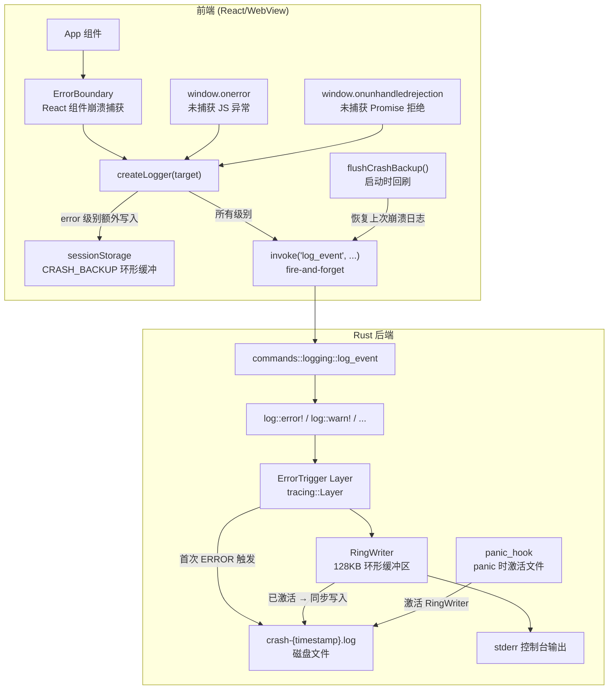

本系统采用**双端分层保护策略**，确保无论是 Rust 后端 panic、WebView 崩溃还是 React 组件异常，关键日志都能被完整保留。核心思想是"常态零磁盘 I/O，异常时全量写入"——正常运行期间日志仅驻留于内存环形缓冲区，仅在检测到 ERROR 级别事件或 panic 时，才将缓冲区内容连同后续日志一次性转储到磁盘。

Sources: [logger.ts](src/lib/logger.ts#L1-L92), [logging.rs](src-tauri/src/logging.rs#L1-L210)

## 系统架构总览

整个崩溃日志保护系统由三个独立但协同工作的组件构成：Rust 端的 **RingWriter + ErrorTrigger** 负责后端日志的内存驻留与错误触发写入，前端的 **sessionStorage 后备缓冲** 负责 WebView 崩溃前的日志抢救，以及 **全局异常处理器**（`window.onerror`、`window.onunhandledrejection` 和 `ErrorBoundary`）负责将 JS 层所有未捕获异常统一路由到日志管线。



Sources: [main.rs](src/main.tsx#L1-L33), [logger.ts](src/lib/logger.ts#L1-L92), [logging.rs](src-tauri/src/logging.rs#L1-L210), [ErrorBoundary.tsx](src/components/ErrorBoundary.tsx#L1-L59)

## 第一层：Rust 端 RingWriter — 内存环形缓冲区

RingWriter 是整个后端的核心数据结构。它是一个实现了 `Write` trait 和 `MakeWriter` trait 的自定义写入器，内部由 `Arc<Mutex<RingInner>>` 保护共享状态。`RingInner` 包含三个字段：`buf: Vec<u8>`（环形缓冲区）、`file: Option<fs::File>`（惰性打开的文件句柄）和 `log_dir: PathBuf`（日志输出目录）。

环形缓冲区的容量由常量 `RING_MAX_BYTES` 控制，设定为 `128 * 1024`（128KB），约可容纳 300-500 行格式化日志。当新数据写入导致缓冲区超出容量时，系统按行（以 `\n` 为边界）从头部逐行丢弃最旧的内容，确保内存占用始终有上界。

```rust
// RingWriter 的 Write 实现 — 环形缓冲区核心逻辑
fn write(&mut self, buf: &[u8]) -> io::Result<usize> {
    let mut inner = self.0.lock().unwrap();
    inner.buf.extend_from_slice(buf);
    while inner.buf.len() > RING_MAX_BYTES {
        if let Some(pos) = inner.buf.iter().position(|&b| b == b'\n') {
            inner.buf.drain(..=pos);  // 按行丢弃最旧内容
        } else {
            inner.buf.clear();
            break;
        }
    }
    // 如果文件已激活，同步写入
    if let Some(ref mut f) = inner.file {
        f.write_all(buf)?;
    }
    Ok(buf.len())
}
```

RingWriter 同时实现了 `MakeWriter<'a>` trait，这意味着 tracing-subscriber 的 `fmt::layer().with_writer(writer.clone())` 可以直接使用它。每次 `make_writer()` 返回一个新的 clone，但所有 clone 共享同一个 `Arc<Mutex<RingInner>>`，实现了多线程安全的共享缓冲区。

Sources: [logging.rs](src-tauri/src/logging.rs#L18-L127)

## 第二层：ErrorTrigger — 错误触发层

`ErrorTrigger` 是实现"常态零 I/O"的关键。它是一个自定义的 `tracing::Layer`，内部持有一个 `RingWriter` 引用和一个 `AtomicBool` 触发器。当订阅器处理事件时，`ErrorTrigger` 的 `on_event` 方法会检测事件的日志级别：

```rust
fn on_event(&self, event: &Event<'_>, _ctx: Context<'_, S>) {
    if *event.metadata().level() <= tracing::LEVEL::ERROR
        && !self.triggered.swap(true, Ordering::SeqCst)
    {
        self.writer.activate_file();
    }
}
```

这里有两个精妙的设计细节：

**CAS（Compare-And-Swap）防重入**：`AtomicBool::swap` 是原子操作，确保即使多个线程同时产生 ERROR 级别日志，`activate_file()` 也只会被调用一次。`triggered` 一旦置为 `true` 就永不回退。

**Layer 注册顺序决定触发时序**：在 `init()` 函数中，三层 subscriber 的注册顺序是 **trigger → ring_layer → console_layer**。tracing-subscriber 保证按注册顺序调用各层，这意味着当 ERROR 事件到来时，`ErrorTrigger.on_event` 先于 `ring_layer` 处理该事件，从而在 ERROR 日志本身被写入环形缓冲区之前，文件就已经被激活。这确保了**触发日志本身也会被写入磁盘文件**。

Sources: [logging.rs](src-tauri/src/logging.rs#L129-L144), [logging.rs](src-tauri/src/logging.rs#L180-L188)

## 第三层：activate_file — 缓冲区转储与文件激活

当 `activate_file()` 被调用时，系统执行以下操作：

1. **创建日志目录**：`fs::create_dir_all(&log_dir)` 确保 `{app_data}/TWModLauncher/logs/` 存在。
2. **生成带时间戳的文件名**：格式为 `crash-{YYYY-MM-DDTHH-MM-SS}.log`，使用 ISO 8601 时间戳确保唯一性和可排序性。
3. **写入崩溃前上下文头**：将内存中环形缓冲区的全部内容写入文件，前面冠以 `"=== 崩溃前上下文 ({N} 字节) ==="` 头信息，后面追加 `"=== 崩溃时刻 ==="` 分隔线。此后所有新的日志行都将追加到该文件。
4. **清理过期崩溃日志**：扫描 `logs/` 目录下所有 `crash-*.log` 文件，按文件名排序（最旧的在前），若文件数量超过 `MAX_CRASH_FILES`（15 个），则从最旧的开始删除。

```rust
fn activate_file(&self) {
    let mut inner = self.0.lock().unwrap();
    if inner.file.is_some() { return; }  // 已激活，幂等返回

    fs::create_dir_all(&inner.log_dir).ok();
    let ts = chrono::Local::now().format("%Y-%m-%dT%H-%M-%S");
    let path = inner.log_dir.join(format!("crash-{}.log", ts));

    if let Ok(mut f) = fs::OpenOptions::new().create(true).append(true).open(&path) {
        if !inner.buf.is_empty() {
            // 将崩溃前的所有上下文写入文件
            let header = format!("=== 崩溃前上下文 ({} 字节) ===\n", inner.buf.len());
            f.write_all(header.as_bytes()).ok();
            f.write_all(&inner.buf).ok();
            f.write_all("\n=== 崩溃时刻 ===\n".as_bytes()).ok();
            f.flush().ok();
        }
        inner.file = Some(f);
    }
    // 清理超过 15 个的历史崩溃日志
    ...
}
```

Sources: [logging.rs](src-tauri/src/logging.rs#L37-L86)

## 第四层：Panic Hook — Rust panic 的日志抢救

Rust 的 `panic!` 宏不会通过 tracing 管线——它直接展开栈帧并终止线程，tracing subscriber 不会收到任何事件。因此需要单独注册 panic hook：

```rust
pub fn set_panic_hook() {
    let old_hook = std::panic::take_hook();
    std::panic::set_hook(Box::new(move |info| {
        if let Some(ref w) = *TRIGGER.lock().unwrap() {
            w.activate_file();           // 先激活文件
        }
        log::error!("!!! PANIC !!! {}", info);  // 再通过 log 宏写入
        old_hook(info);                  // 最后调用默认 hook
    }));
}
```

这里的关键设计是 `TRIGGER` 全局静态变量——一个 `LazyLock<Mutex<Option<RingWriter>>>`。它在 `init()` 结束时被赋值，使 panic hook 能够访问到同一个 `RingWriter` 实例。Panic hook 的三步执行顺序是经过精心设计的：

1. **先激活文件**：确保 panic 日志有地方写入。
2. **再调用 `log::error!`**：`tracing-log` 的 `LogTracer` 会将 `log` crate 的宏调用桥接到 tracing subscriber，从而写入已激活的文件。
3. **最后调用原始 hook**：保留 Rust 默认的 panic 行为（打印回溯等）。

Sources: [logging.rs](src-tauri/src/logging.rs#L146-L209), [lib.rs](src-tauri/src/lib.rs#L21-L22)

## 第五层：前端 sessionStorage 后备缓冲

前端的日志保护针对的是 WebView 进程崩溃的场景——当 WebView 崩溃时，`invoke("log_event", ...)` 的 IPC 调用可能尚未完成，Rust 端根本无法收到日志。为此，前端 logger 在每次 `error` 级别日志时，额外将日志条目保存到 `sessionStorage` 中：

```typescript
const CRASH_LOG_KEY = "__twm_crash_log__";

function saveCrashBackup(entry: LogEntry) {
  try {
    const stored = sessionStorage.getItem(CRASH_LOG_KEY);
    const entries: LogEntry[] = stored ? JSON.parse(stored) : [];
    entries.push(entry);
    if (entries.length > 50) entries.shift();  // FIFO 环形缓冲
    sessionStorage.setItem(CRASH_LOG_KEY, JSON.stringify(entries));
  } catch { /* sessionStorage may be unavailable */ }
}
```

这里 `50` 条上限构成了前端侧的第二个环形缓冲区，确保不会因为长时间运行而产生过量的 `sessionStorage` 写入。

应用启动时，`main.tsx` 在 React 渲染之前调用 `flushCrashBackup()`：从 `sessionStorage` 中取出所有备份日志，清空存储，然后逐条通过 `invoke("log_event", ...)` 发送到 Rust 后端（每条消息添加 `[CRASH_BACKUP]` 前缀标识），最后发送一条汇总警告日志。由于 `invoke` 是 fire-and-forget 调用（`.catch(() => {})`），回刷过程不会阻塞应用启动。

```typescript
export function flushCrashBackup() {
  try {
    const stored = sessionStorage.getItem(CRASH_LOG_KEY);
    if (stored) {
      const entries: LogEntry[] = JSON.parse(stored);
      sessionStorage.removeItem(CRASH_LOG_KEY);
      for (const e of entries) {
        send(e.level, e.target, `[CRASH_BACKUP] ${e.message}`);
      }
      if (entries.length > 0) {
        send("warn", "logger", `Recovered ${entries.length} log entries from previous crash session`);
      }
    }
  } catch { /* Ignore */ }
}
```

**重要限制**：`sessionStorage` 的生命周期与浏览器会话绑定——如果用户关闭了窗口而非 WebView 崩溃，`sessionStorage` 会被正常清空，不会触发虚假的崩溃恢复。但如果用户通过任务管理器强制结束整个应用进程，`sessionStorage` 可能无法被持久化（取决于 WebView 实现）。

Sources: [logger.ts](src/lib/logger.ts#L21-L62), [main.tsx](src/main.tsx#L8-L9)

## 第六层：全局异常捕获 — 三条路径汇聚

所有前端异常都有三条路径汇聚到日志管线：

| 捕获机制 | 覆盖范围 | 日志目标 |
|---------|---------|---------|
| `ErrorBoundary` (React 组件) | React 渲染树中抛出的异常 | `createLogger("ErrorBoundary")` |
| `window.onerror` | 未被 ErrorBoundary 捕获的同步 JS 异常 | `logger (target: "app")` |
| `window.onunhandledrejection` | 未带 `.catch()` 的 Promise 拒绝 | `logger (target: "app")` |

它们的执行顺序是：React ErrorBoundary 先捕获组件树中的异常并调用 `componentDidCatch`；如果异常逃逸了 ErrorBoundary（例如在事件处理器或异步回调中），则由 `window.onerror` 或 `window.onunhandledrejection` 兜底。两个全局处理器均返回 `false`（`onerror`）或不做 `preventDefault`（`onunhandledrejection`），保留浏览器默认的控制台输出行为。

```typescript
// main.tsx — 全局异常捕获注册
window.onerror = (_msg, _src, _line, _col, error) => {
  logger.error(
    `Unhandled error: ${error?.message ?? String(_msg)} at ${_src}:${_line}:${_col}\n${error?.stack ?? ""}`,
  );
  return false;
};

window.onunhandledrejection = (event) => {
  const reason = event.reason;
  logger.error(
    `Unhandled rejection: ${reason?.message ?? String(reason)}\n${reason?.stack ?? ""}`,
  );
};
```

每当 `logger.error()` 被调用，前端侧会同时执行两条路径：fire-and-forget `invoke("log_event", { level: "error", ... })` 发送至 Rust 后端，以及 `saveCrashBackup()` 写入 `sessionStorage`。这意味着即使 WebView 在 invoke 完成前崩溃，错误日志也会在下一次启动时通过 `flushCrashBackup()` 恢复。

Sources: [main.tsx](src/main.tsx#L12-L25), [ErrorBoundary.tsx](src/components/ErrorBoundary.tsx#L16-L27)

## 数据流完整路径

以下是 ERROR 级别日志从产生到持久化的完整路径：

```
前端 logger.error(msg)
  ├─→ saveCrashBackup(entry)         // 写入 sessionStorage (最多 50 条)
  └─→ invoke("log_event", {error,...}) // fire-and-forget IPC
        └─→ commands::logging::log_event
              └─→ log::error!(target, message)
                    └─→ tracing-log::LogTracer 桥接
                          └─→ tracing subscriber (三层):
                                ├─→ ErrorTrigger.on_event: 检测到 ERROR, swap 触发器
                                │     └─→ RingWriter.activate_file()
                                │           ├─→ 创建 crash-{ts}.log
                                │           ├─→ 写入 "=== 崩溃前上下文 ===" + 缓冲区全部内容
                                │           └─→ 设置 inner.file = Some(f)
                                ├─→ ring_layer: 格式化并写入 RingWriter
                                │     └─→ RingWriter.write()
                                │           ├─→ 追加到环形缓冲区 buf
                                │           └─→ 如果 file 已激活, 同步写入磁盘
                                └─→ console_layer: 格式化并写入 stderr
```

对于 `panic!`，路径更短：panic hook 直接调用 `activate_file()` 然后通过 `log::error!` 写入。

Sources: [logging.rs](src-tauri/src/logging.rs#L1-L210), [logger.ts](src/lib/logger.ts#L27-L88), [commands/logging.rs](src-tauri/src/commands/logging.rs#L1-L12)

## 关键设计决策与权衡

| 设计决策 | 选择 | 原因 | 代价 |
|---------|------|------|------|
| 不使用 `tracing-appender` 的 RollingFileAppender | 自实现 RingWriter | 需要常态零 I/O 和按错误触发的惰性写入，tracing-appender 的轮转文件写入器不满足此模式 | 需要手动管理文件句柄生命周期 |
| 文件激活后永不关闭 | `inner.file` 保持 `Some` | 避免重复打开文件的开销；一旦触发说明应用已进入异常状态，保持文件打开是合理的 | 极端情况下可能占用文件句柄 |
| sessionStorage 而非 localStorage | `sessionStorage` | 崩溃恢复日志不应跨会话持久化——正常关闭窗口时 sessionStorage 自动清空，避免"幽灵日志" | 强制结束进程时可能丢失 |
| `AtomicBool` 而非 `Mutex<bool>` | CAS 原子操作 | `on_event` 在多线程下被频繁调用，无锁设计避免竞争 | 一旦触发就永远触发，无法"重置" |
| fire-and-forget invoke | `.catch(() => {})` | 日志不应阻塞 UI 线程，也不应在日志失败时抛出额外异常 | 日志可能在静默中丢失 |

Sources: [logging.rs](src-tauri/src/logging.rs#L13-L14), [logger.ts](src/lib/logger.ts#L27-L30), [Cargo.toml](src-tauri/Cargo.toml#L31)

## 配置常量总览

| 常量 | 位置 | 值 | 含义 |
|------|------|-----|------|
| `RING_MAX_BYTES` | `logging.rs#L13` | 128 × 1024 (128KB) | 环形缓冲区最大容量，约 300-500 行 |
| `MAX_CRASH_FILES` | `logging.rs#L14` | 15 | 最多保留的历史崩溃日志文件数 |
| `CRASH_LOG_KEY` | `logger.ts#L21` | `"__twm_crash_log__"` | sessionStorage 键名 |
| 前端缓冲区上限 | `logger.ts#L38` | 50 | sessionStorage 中最多保留的日志条目数 |

Sources: [logging.rs](src-tauri/src/logging.rs#L13-L14), [logger.ts](src/lib/logger.ts#L21), [logger.ts](src/lib/logger.ts#L38)

## 与相邻系统的关系

本系统是整个日志管线的一个子集。正常运行时，所有日志（包括 debug/info/warn）通过 `[前后端统一日志管线](22-qian-hou-duan-tong-ri-zhi-guan-xian-qian-duan-ri-zhi-qiao-jie-zhi-rust-tracing-zi-xi-tong)` 中的日常日志文件输出；崩溃日志保护仅负责"异常时刻的上下文保存"。前端异常捕获层 `ErrorBoundary` 与 `window.onerror` 的详细机制请参阅 `[ErrorBoundary 与全局未捕获异常处理](24-errorboundary-yu-quan-ju-wei-bu-huo-yi-chang-chu-li)`。日志目录的打开命令 `open_log_dir` 由 `commands::logging` 模块提供，支持用户手动查看崩溃日志文件。