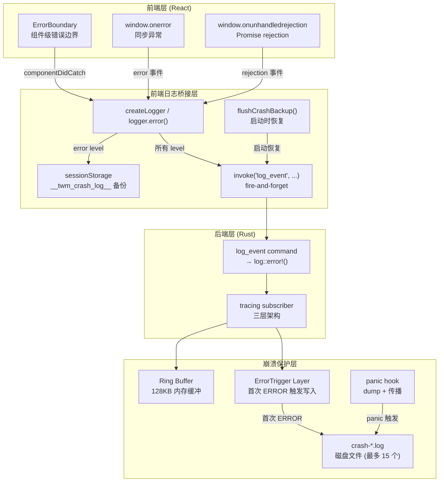
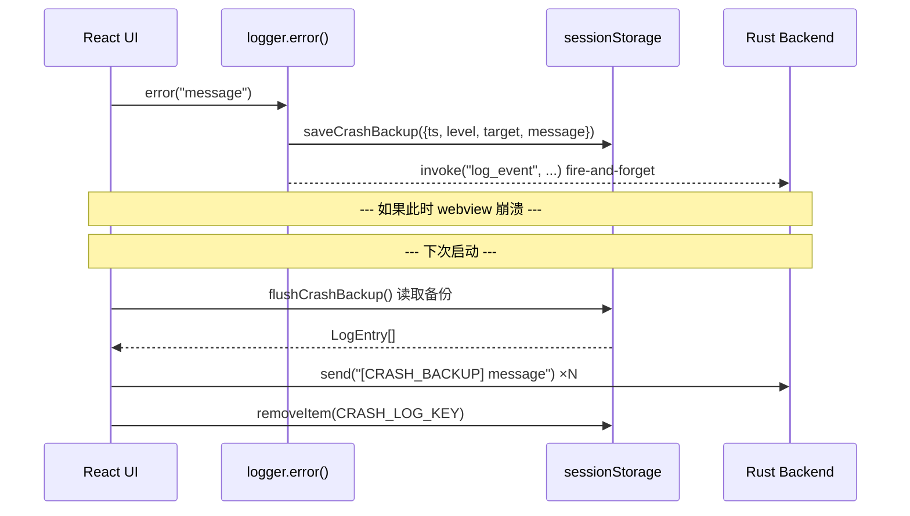
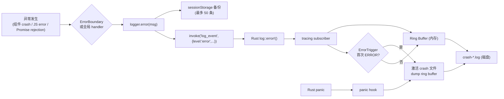

本文档阐述 TWModLauncher 的异常处理体系——涵盖 React 组件级错误边界、全局未捕获异常捕获、前端日志 crash 备份恢复，以及 Rust 端 panic hook 与 ring buffer 崩溃日志保护。这四个层次的防护机制协同工作，确保任何异常都能被捕获、记录并在重启后追溯。

## 整体架构：四层异常防护

项目的异常处理体系按"前端 → 前端桥接 → 后端日志 → 后端崩溃保护"四层递进。下面这张图展示了各组件之间的协作关系：

四个层次的分工：**前端层**负责捕获异常并阻止 UI 白屏；**前端桥接层**负责将异常转化为结构化日志并保留 crash 现场；**后端层**负责将日志统一路由到 tracing 子系统；**崩溃保护层**确保即使进程崩溃，崩溃前的日志也能落盘。

Sources: [ErrorBoundary.tsx](src/components/ErrorBoundary.tsx#L1-L60), [main.tsx](src/main.tsx#L1-L34), [logger.ts](src/lib/logger.ts#L1-L92), [logging.rs](src-tauri/src/logging.rs#L1-L210), [lib.rs](src-tauri/src/lib.rs#L1-L55), [commands/logging.rs](src-tauri/src/commands/logging.rs#L1-L30)

## ErrorBoundary：React 组件级错误边界

`ErrorBoundary` 是一个基于 React class component 实现的错误边界，包裹 `<App />` 根组件。它捕获子树中所有渲染阶段、生命周期方法和构造函数中抛出的错误——但**不捕获**事件处理器中的异步错误和 Promise rejection（这两者由全局 handler 兜底）。

**工作机制**：

| 生命周期方法 | 作用 | 调用时机 |
|---|---|---|
| `getDerivedStateFromError(error)` | 将 `hasError` 置为 `true`，保存 `error` 对象 | 子组件抛出错误后、re-render 前 |
| `componentDidCatch(error, info)` | 通过 logger 输出完整堆栈（含 componentStack） | re-render 完成后 |

`componentDidCatch` 中记录的日志格式包含三个部分：错误消息、JavaScript 堆栈、React 组件堆栈（`info.componentStack`），后者能精确定位到出错的组件层级。

Sources: [ErrorBoundary.tsx](src/components/ErrorBoundary.tsx#L16-L26)

**降级 UI 策略**：ErrorBoundary 支持两种降级模式：

| 模式 | 条件 | 行为 |
|---|---|---|
| 自定义降级 | `props.fallback` 不为空 | 渲染调用方传入的自定义 ReactNode |
| 默认降级 | `props.fallback` 为空 | 渲染内置错误卡片（深色主题、居中布局） |

默认降级卡片包含三个信息层次：**告知用户发生了什么**（"程序遇到了意外错误"）、**指导用户如何操作**（"重启应用后即可恢复正常"）、**提供反馈路径**（"将日志目录中的最新日志文件反馈给开发者"）。卡片底部展示 `error.message` 原始文本和"重新加载"按钮，该按钮执行 `window.location.reload()` 即可恢复。

Sources: [ErrorBoundary.tsx](src/components/ErrorBoundary.tsx#L28-L56)

## 全局未捕获异常处理

在 `main.tsx` 中，应用入口注册了两个全局事件监听器，用于捕获 ErrorBoundary 无法覆盖的异常场景：

**`window.onerror`** 捕获同步执行中的未处理异常。回调接收五个参数 `(_msg, _src, _line, _col, error)`，优先使用 `error?.message` 和 `error?.stack`（现代浏览器会在第五个参数传递 Error 对象），并返回 `false` 以保留浏览器默认的 `console.error` 行为——这样开发者也能在 DevTools 中看到原始输出。

**`window.onunhandledrejection`** 捕获所有未被 `.catch()` 处理的 Promise rejection。从 `event.reason` 中提取 `message` 和 `stack`，同样通过 `logger.error()` 输出。

这两个 handler 都通过 `logger.error()` 记录，这意味着它们会自动走两条路径：fire-and-forget invoke 到 Rust 后端写入日志文件，同时备份到 `sessionStorage` 中（见下一节）。

Sources: [main.tsx](src/main.tsx#L9-L24)

## 前端日志 Crash 备份：sessionStorage 保护

前端日志管线（详见 [前后端统一日志管线](22-qian-hou-duan-tong-ri-zhi-guan-xian-qian-duan-ri-zhi-qiao-jie-zhi-rust-tracing-zi-xi-tong)）的一个内在风险是：`invoke("log_event", ...)` 是异步的 IPC 调用，如果 webview 在 invoke 返回之前崩溃，该条 error 日志就会丢失。`logger.ts` 中的 `saveCrashBackup` 机制解决了这个问题。

**触发条件**：仅对 `level === "error"` 的日志启用 crash 备份。这是有意为之——避免 sessionStorage 被低级别日志淹没。

**存储格式**：`sessionStorage` 中的 key 为 `__twm_crash_log__`，value 为 `LogEntry[]` 的 JSON 数组，每个 entry 包含 `ts`（ISO 时间戳）、`level`、`target`、`message`。最多保留 50 条，超出时 shift 最旧的条目。

Sources: [logger.ts](src/lib/logger.ts#L29-L39)

**启动恢复**：`flushCrashBackup()` 在 `main.tsx` 顶层同步调用（在 React 渲染之前）。它从 `sessionStorage` 中读取备份日志，逐条加上 `[CRASH_BACKUP]` 前缀后通过 `send()` 发送到 Rust 后端，然后清空 `sessionStorage`。如果有恢复的日志，还会额外写入一条汇总 warn 日志：`"Recovered {N} log entries from previous crash session"`。

Sources: [logger.ts](src/lib/logger.ts#L42-L57), [main.tsx](src/main.tsx#L9)

这种设计确保了"宁可重复记录（如果上次没崩溃），绝不遗漏（如果上次崩溃了）"的语义。

## Rust 端的崩溃日志保护

Rust 后端实现了与前端 crash 备份对称但更底层的保护机制。详细设计可参考 [崩溃日志保护：Ring Buffer 内存缓冲 + 错误触发磁盘写入](23-beng-kui-ri-zhi-bao-hu-ring-buffer-nei-cun-huan-chong-cuo-wu-hong-fa-ci-pan-xie-ru)，这里重点描述与异常处理体系的连接点。

**两层触发机制**：

| 触发路径 | 触发条件 | 行为 |
|---|---|---|
| `ErrorTrigger` Layer | tracing 事件的 level ≤ ERROR | 首次触发时调用 `activate_file()`，将 ring buffer 已有内容 + 此后所有日志写入 `crash-{timestamp}.log` |
| `set_panic_hook()` | Rust panic | 强制调用 `activate_file()`，通过 `log::error!` 写入 panic 信息，然后调用旧的 panic hook（打印 stderr + 终止进程） |

两个路径共享同一个 `RingWriter`，确保无论错误来自前端（经由 `log_event` → `log::error!`）还是后端（Rust 内部 panic），最终都写入同一个 crash 文件。

Sources: [logging.rs](src-tauri/src/logging.rs#L112-L155), [logging.rs](src-tauri/src/logging.rs#L200-L210)

**panic hook 注册时机**：在 `lib.rs` 的 `setup` 闭包中，`logging::init(data_dir)` 初始化 tracing subscriber 后立即调用 `logging::set_panic_hook()`。这个顺序很重要——panic hook 需要 `TRIGGER` 静态变量中已存储 `RingWriter` 句柄，而 `init()` 的最后一步正是将该句柄写入 `TRIGGER`。

Sources: [lib.rs](src-tauri/src/lib.rs#L17-L21), [logging.rs](src/tari/src/logging.rs#L159-L161)

## 异常处理的完整生命周期

将前端和后端的异常处理串联起来，一条错误日志的完整生命周期如下：

关键设计决策：

- **前端 fire-and-forget**：`invoke` 不 await，确保日志调用从不阻塞 UI 渲染线程
- **sessionStorage 而非 localStorage**：crash 备份只在当前会话（tab）有效，避免跨标签页污染
- **Rust 端仅首次 ERROR 触发**：`AtomicBool` 确保 `triggered.swap(true)` 只执行一次，避免每次 error 都创建新文件
- **crash 文件上限 15 个**：防止日志目录无限膨胀

Sources: [logger.ts](src/lib/logger.ts#L23-L27), [logging.rs](src-tauri/src/logging.rs#L112-L137)

## 启动顺序与初始化

异常处理体系的初始化有严格的时序要求，在 `main.tsx` 中体现为：

1. **`flushCrashBackup()`** 最先执行——在任何 React 渲染之前恢复上轮 crash 日志
2. **`window.onerror` 和 `window.onunhandledrejection`** 注册——在 `createRoot` 之前绑定，确保即使 React 初始化过程中出错也能捕获
3. **`<ErrorBoundary>` 包裹 `<App />`**——作为最后一个防线

对应的 Rust 端在 `lib.rs` 的 `setup` 中：
1. `logging::init(data_dir)` 设置 tracing subscriber
2. `logging::set_panic_hook()` 注册 panic hook
3. 后续任何 `log::*` 调用都会被 subscriber 处理

Sources: [main.tsx](src/main.tsx#L9-L33), [lib.rs](src-tauri/src/lib.rs#L17-L21)

## 相关文档

- [前后端统一日志管线：前端日志桥接至 Rust tracing 子系统](22-qian-hou-duan-tong-ri-zhi-guan-xian-qian-duan-ri-zhi-qiao-jie-zhi-rust-tracing-zi-xi-tong)——了解 `logger.ts` 如何将前端日志发送到 Rust 后端
- [崩溃日志保护：Ring Buffer 内存缓冲 + 错误触发磁盘写入](23-beng-kui-ri-zhi-bao-hu-ring-buffer-nei-cun-huan-chong-cuo-wu-hong-fa-ci-pan-xie-ru)——深入了解 Rust 端 ring buffer 和错误触发机制的实现细节
- [应用主流程：从路径选择到 Mod 管理](4-ying-yong-zhu-liu-cheng-cong-lu-jing-xuan-ze-dao-mod-guan-li)——了解 ErrorBoundary 包裹的 `<App />` 组件的完整业务流程