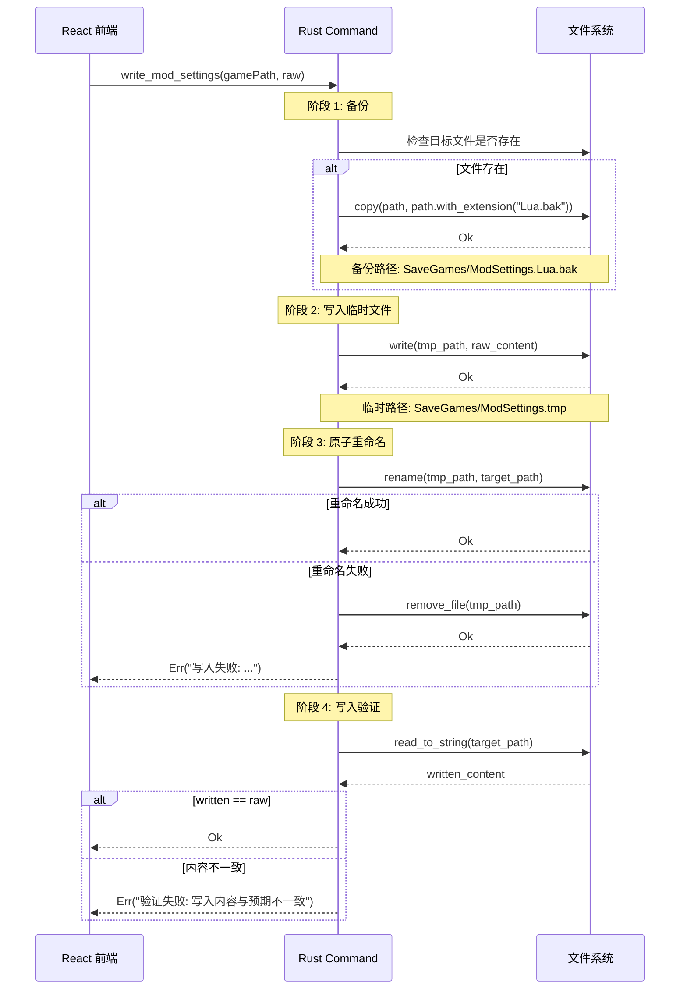
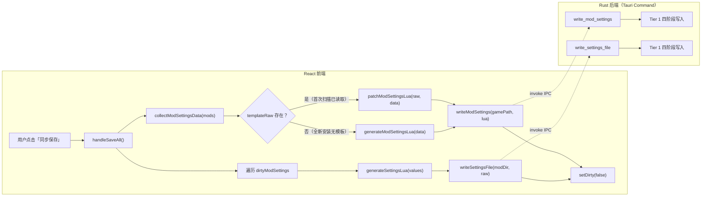

本文档深入剖析 TWModLauncher 如何保护关键配置文件在写入过程中不受系统崩溃、磁盘满、进程中断等异常事件破坏。该策略横跨三个 Rust 命令模块，根据文件关键性划分为三个保护等级，分别应用于 ModSettings.Lua / Settings.Lua、config.json / Profile JSON、以及方案导出文件。

## 架构总览：三层保护等级

TWModLauncher 并未对所有文件 I/O 一视同仁。项目根据被写入文件的重要性和写入场景，划分出三个清晰的安全等级。下图展示了三个等级之间的差异与递进关系：

```mermaid
flowchart TD
    subgraph Tier1["Tier 1：完整保护（ModSettings.Lua / Settings.Lua）"]
        B1["备份原文件 → .bak"] --> T1["写入临时文件 .tmp"]
        T1 --> R1["rename .tmp → 正式文件"]
        R1 --> V1["逐字节验证写入内容"]
        V1 --> C1["验证失败时 .bak 可用于恢复"]
    end

    subgraph Tier2["Tier 2：标准原子写（config.json / Profile JSON）"]
        V2["JSON 结构校验"] --> T2["写入临时文件 .tmp"]
        T2 --> R2["rename .tmp → 正式文件"]
        R2 --> E2["失败时清理 .tmp 残留"]
    end

    subgraph Tier3["Tier 3：无保护（方案导出）"]
        D3["直接 fs::write 写入目标路径"]
    end
```



**Tier 1** 为 Mod 配置文件提供了最高级别的保护——自动备份、原子替换、以及写入后逐字节验证。**Tier 2** 提供了标准原子写入保证——崩溃后要么是旧文件、要么是完整新文件，不存在半写状态——但不保留历史备份也不做写入验证。**Tier 3** 完全不提供任何原子保证，仅用于用户主动触发的导出操作。

Sources: [mod_settings.rs](src-tauri/src/commands/mod_settings.rs#L1-L74) [config.rs](src-tauri/src/commands/config.rs#L1-L33) [profiles.rs](src-tauri/src/commands/profiles.rs#L1-L97) [file_io.rs](src-tauri/src/commands/file_io.rs#L1-L44)

| 维度 | Tier 1：ModSettings / Settings | Tier 2：Config / Profile | Tier 3：导出 |
|---|---|---|---|
| 原子替换（rename） | ✅ | ✅ | ❌ |
| 自动备份（.bak） | ✅ | ❌ | ❌ |
| 写入验证（回读比对） | ✅ | ❌ | ❌ |
| 预写入校验 | N/A（Lua） | ✅（JSON） | ❌ |
| 临时文件清理 | ✅ | ✅ | ❌ |
| 父目录自动创建 | ❌ | ✅（config） | ✅ |
| 典型文件大小 | 数 KB ~ 数十 KB | 数百字节 ~ 数 KB | 数 KB |

---

## Tier 1：完整保护——ModSettings.Lua 与单 Mod Settings.Lua

### 为什么需要最高级别保护？

ModSettings.Lua 和单个 Mod 的 Settings.Lua 是用户操作频率最高的写入目标。用户每一次点击「同步保存」按钮都会触发这两类文件的写入。更重要的是，游戏在启动时会读取这些文件，一个损坏的 ModSettings.Lua 可能导致游戏回退到默认配置、丢失所有启用状态和加载顺序。因此这两类文件采用了最严格的写入保护策略，将写入流程分解为四个独立阶段：



**阶段 1 — 自动备份**：在修改任何内容之前，先将当前存在的正式文件复制为 `.bak` 后缀的备份。如果原始文件不存在（如首次安装）则跳过备份步骤。备份文件始终保留在上次成功写入的状态，为用户提供手动恢复途径。备份路径与正式文件位于同一目录，便于用户定位和恢复。

Sources: [mod_settings.rs](src-tauri/src/commands/mod_settings.rs#L10-L16)

**阶段 2 — 写入临时文件**：将新内容写入 `.tmp` 后缀的临时文件。此阶段如果失败——例如磁盘空间不足——原始正式文件完全不受影响，因为写入目标是与正式文件无关的独立路径。临时文件的扩展名由 `path.with_extension("tmp")` 生成，与原始文件的扩展名无关。

Sources: [mod_settings.rs](src-tauri/src/commands/mod_settings.rs#L29-L37)

**阶段 3 — 原子重命名**：调用操作系统的 `rename` 系统调用将临时文件替换为正式文件。在大多数现代文件系统（NTFS、ext4、APFS）上，`rename` 在同一文件系统内是原子操作——崩溃后要么看到完整的旧文件，要么看到完整的新文件，绝不可能出现半写状态。如果 `rename` 失败（例如跨文件系统重命名或权限不足），代码会主动删除临时文件以避免残留 `.tmp` 污染文件系统，并将带有上下文的错误信息返回给前端。

Sources: [mod_settings.rs](src-tauri/src/commands/mod_settings.rs#L38-L43)

**阶段 4 — 写入验证**：重命名成功后立即回读写入目标，通过 `fs::read_to_string` 将磁盘内容与原始输入字符串逐字节比对。这能捕获极端情况下的静默数据损坏——例如文件系统缓存未正确刷新、存储介质出现坏块、或中间件（杀毒软件、云同步客户端）在重命名后修改了文件内容。验证失败时返回中文错误信息 `"验证失败: 写入内容与预期不一致"`，此时 `.bak` 备份文件仍然存在且包含上次成功写入的完整内容。

Sources: [mod_settings.rs](src-tauri/src/commands/mod_settings.rs#L44-L48)

### 两个实现的双重覆盖

`write_mod_settings` 和 `write_settings_file` 实现了完全相同的四阶段逻辑，分别服务于两个不同的写入目标：

- **`write_mod_settings`**：目标路径为 `<gamePath>/SaveGames/ModSettings.Lua`，备份路径为同目录下的 `ModSettings.Lua.bak`，负责全局启用状态（EnabledWorkshopMods、EnabledLocalMods）和加载顺序（ModOrder）的持久化。每次「同步保存」操作都会调用此命令。

Sources: [mod_settings.rs](src-tauri/src/commands/mod_settings.rs#L52-L74)

- **`write_settings_file`**：目标路径为 `<modDir>/Settings.Lua`，备份路径为同目录下的 `Settings.Lua.bak`，负责单个 Mod 配置参数（Toggle、Slider、Dropdown 等控件值）的持久化。仅在用户修改过某 Mod 的设置项后（即该 Mod 的 key 出现在 `dirtyModSettings` 列表中）才会被调用。

Sources: [mod_settings.rs](src-tauri/src/commands/mod_settings.rs#L19-L48)

两个函数共享相同的 `backup` 辅助函数但独立实现写入逻辑——这种「有意重复」而非抽取出公共原子写入工具函数的做法，使得每个命令的失败语义更加明确、错误信息更加精准（如 `"备份失败"` vs `"写入失败"` vs `"验证失败"`），同时避免了额外的抽象层引入的调用开销和理解成本。

---

## Tier 2：标准原子写——config.json 与 Profile JSON

### 保护强度递减的合理边界

config.json 存储应用级配置（当前仅包含 `gamePath` 字段），Profile JSON 存储用户手动保存的方案数据（Mod 启用状态、加载顺序、分组信息、Mod 设置）。这两类文件的数据丢失不会导致游戏回退到默认配置，且在大多数场景下可通过用户操作重新生成。因此，它们省略了备份和验证步骤，但保留了原子重命名的核心保证——任何系统崩溃都不会产生损坏的半写文件。

```mermaid
sequenceDiagram
    participant Frontend as React 前端
    participant Cmd as Rust Command
    participant FS as 文件系统

    Frontend->>Cmd: save_config / save_profile(data)
    Note over Cmd: 阶段 1: 预写入校验
    Cmd->>Cmd: serde_json::from_str::&lt;Value&gt;(&data)
    alt JSON 格式错误
        Cmd-->>Frontend: Err("JSON格式错误: ...")
    end

    Note over Cmd: 阶段 2: 原子写入
    Cmd->>FS: write(tmp_path, data)
    FS-->>Cmd: Ok
    Cmd->>FS: rename(tmp_path, target_path)
    alt rename 失败
        Cmd->>FS: remove_file(tmp_path)
        Cmd-->>Frontend: Err("保存失败: ...")
    end
    Cmd-->>Frontend: Ok
```

**预写入校验**是 Tier 2 独有的安全措施。在触碰文件系统之前，先用 `serde_json::from_str::<serde_json::Value>(&data)` 解析 JSON 字符串，确保数据在结构上是合法的 JSON。此步骤在临时文件写入之前执行，因此格式错误的输入不会产生任何文件系统副作用——这对于 `save_profile` 尤其重要，因为方案数据可能来自外部导入，其格式完整性不可假设。

Sources: [config.rs](src-tauri/src/commands/config.rs#L20-L22) [profiles.rs](src-tauri/src/commands/profiles.rs#L76-L78)

**目录自动创建**：`save_config` 在写入前通过 `fs::create_dir_all(parent)` 检查并创建父目录（`dirs::data_dir()/TWModLauncher/`），确保应用数据目录即使被用户手动删除也能自动恢复。`save_profile` 依赖 `profiles_dir()` 函数在每次获取路径时已隐式执行的 `fs::create_dir_all` 调用，因此无需在写入时重复检查。

Sources: [config.rs](src-tauri/src/commands/config.rs#L16-L18) [profiles.rs](src-tauri/src/commands/profiles.rs#L17-L21)

**失败清理**：与 Tier 1 一致，`rename` 失败时主动通过 `let _ = fs::remove_file(&tmp)` 删除临时文件，忽略删除本身的错误（因为此时主要错误是 rename 失败，临时文件清理是尽力而为的辅助操作），防止 `.tmp` 残留在应用数据目录中。

Sources: [config.rs](src-tauri/src/commands/config.rs#L25-L27) [profiles.rs](src-tauri/src/commands/profiles.rs#L81-L84)

---

## Tier 3：无保护写入——方案导出

`write_file` 是唯一不提供任何原子保证的写入路径。它使用 Rust 标准库的 `fs::write` 直接将内容写入用户通过 Tauri 文件对话框选择的路径，用于方案的跨环境迁移导出。此命令同时支持创建不存在的父目录，以便用户将文件保存到深层路径。

Sources: [file_io.rs](src-tauri/src/commands/file_io.rs#L6-L12)

这不提供原子保护的设计决策是合理的：导出目标是用户明确选择的任意路径，而非应用运行时依赖的关键配置文件；如果导出因磁盘满或权限问题失败，用户可以释放空间或更改路径后重新操作；导出操作频率极低（用户主动触发，通常仅在换设备前执行一次），不值得引入与 Tier 1 或 Tier 2 同等复杂度的保护机制。

---

## 前端调用链路：从用户点击到原子写入

整个保存流程由 `App.tsx` 中的 `handleSaveAll` 函数编排，将前端生成的内容通过 Tauri invoke IPC 桥接到 Rust 端的原子写入命令。理解这条链路有助于开发者定位写入失败时的问题所在层：



Sources: [App.tsx](src/App.tsx#L306-L345)

关键设计决策：前端在调用写入命令之前已经通过 `luaparse.parse(result)` 完成 Lua 语法校验，因此 Rust 端接收到的内容在语法层面已经被验证过。如果语法校验失败，前端日志会通过 `createLogger("generateModSettings")` 记录错误但**不会阻止写入**——这是一个有意的防御性设计，允许用户在某些极端情况下仍然保存（例如 Lua 解析器版本与游戏引擎语法不完全兼容时）。

Sources: [generateModSettings.ts](src/utils/generateModSettings.ts#L53-L60)

**`templateRaw` 的来源**：在每次扫描完成后，`useModScanner` 钩子通过 `setTemplateRaw(result.mod_settings_raw)` 将 Rust 端读取的原始 ModSettings.Lua 内容存入 Zustand AppStore。`handleSaveAll` 据此判断使用哪种生成策略：有模板时使用 `patchModSettingsLua`（格式保留式补丁，保护用户手动编辑的注释和格式），无模板时使用 `generateModSettingsLua`（从零构建完整的 Lua 返回表）。

Sources: [useModScanner.ts](src/hooks/useModScanner.ts#L134)

**单 Mod 设置的保存隔离**：`handleSaveAll` 遍历 `dirtyModSettings` 列表（由 SettingsEditor 在用户每次修改设置项时通过 `addDirtyModSetting` 标记），为每个脏 Mod 单独调用 `writeSettingsFile`。每个 Mod 的写入成败独立处理——某个 Mod 的 Settings.Lua 写入失败不会影响其他 Mod 的写入，也不会回滚已成功写入的 ModSettings.Lua。失败 Mod 的名称会被收集并展示在最终的消息提示中。

Sources: [App.tsx](src/App.tsx#L318-L341)

---

## 设计决策与权衡分析

### 为什么不使用文件锁？

TWModLauncher 是一个单用户桌面工具，不存在并发写入冲突的场景。引入文件锁（如 Unix 的 `flock` 或 Windows 的 `LockFileEx`）会增加操作系统兼容性代码——两种平台的锁语义和行为差异显著（Windows 默认排他锁、Unix  advisory lock 可被绕过）——但不会带来实际收益。临时文件 + 重命名的模式已经覆盖了单进程下的所有故障场景：写入中途崩溃、磁盘空间耗尽、权限变更等。

### 为什么不在所有路径上都做写入验证？

写入验证带来一次额外的磁盘读取操作。对于小型文件（config.json 通常 < 1KB）影响可忽略，但对于大型 Profile JSON（包含大量 Mod 设置时可能达到数十 KB），验证读取的时间成本开始显现。更重要的是，写入验证只能检测「内容不匹配」但无法自动修复——其价值主要体现在 ModSettings.Lua 这类「损坏会导致游戏行为异常」的文件上。对于可通过用户操作重新生成的数据（config、profile），验证的边际收益不足以覆盖时间和代码复杂度成本。

### 临时文件扩展名策略

所有原子写入统一使用 `.tmp` 作为临时文件扩展名（通过 `path.with_extension("tmp")` 生成）。以 `ModSettings.Lua` 为例，临时文件为 `ModSettings.tmp`。这建立在以下假设之上：TWModLauncher 的工作目录中不存在其他以 `.tmp` 为扩展名的有效文件。如果两个 Tauri 命令实例同时操作同一文件（虽然当前架构不会出现），它们会竞争同一个 `.tmp` 路径而导致数据覆盖。由于 Tauri 命令在 Rust 端是串行执行的（单线程异步运行时通过 `invoke_handler` 逐条处理），此假设在当前架构下成立。

Sources: [lib.rs](src-tauri/src/lib.rs#L26-L52)

### 备份文件的恢复路径

备份文件（`.bak`）由代码自动生成但不自动恢复。如果用户发现 ModSettings.Lua 或单 Mod 的 Settings.Lua 损坏，需要手动将对应的 `.bak` 文件重命名为原始文件名。这一设计选择是刻意的：自动恢复会掩盖底层问题（如磁盘故障的早期信号），而手动恢复允许用户在恢复前先诊断原因。同时，备份文件与原文件位于同一目录，用户无需记忆备份位置即可找到。

### 跨文件系统 rename 的边缘情况

`rename` 的原子性保证仅在源和目标位于同一文件系统挂载点时成立。在 TWModLauncher 的典型使用场景中：ModSettings.Lua 的 `.tmp` 和正式文件都在游戏目录的 `SaveGames` 子目录下，config.json 和 Profile JSON 的 `.tmp` 和正式文件都在应用数据目录下——均满足同一文件系统的条件。唯一的例外是方案导出（Tier 3），但该路径不使用 rename，因此不受影响。

---

## 相关文档

- [ModSettings.Lua 的格式保留式补丁（patchModSettingsLua）](10-modsettings-lua-de-ge-shi-bao-liu-shi-bu-ding-patchmodsettingslua) — 前端如何生成即将通过原子策略写入的内容
- [配置持久化：config.json 的自动缓存与失效恢复](26-pei-zhi-chi-jiu-hua-config-json-de-zi-dong-huan-cun-yu-shi-xiao-hui-fu) — 原子写入策略在应用配置场景的具体表现
- [方案数据结构：版本化 JSON 方案与 Mod 缺失检测](18-profile-shu-ju-jie-gou-ban-ben-hua-json-fang-an-yu-mod-que-shi-jian-ce) — Profile JSON 的数据结构与版本演进
- [方案导入/导出：文件级读写与跨环境迁移](19-fang-an-dao-ru-dao-chu-wen-jian-ji-du-xie-yu-kua-huan-jing-qian-yi) — 了解 Tier 3 写入的完整使用上下文
- [Tauri 命令注册体系：invoke_handler 与前后端通信](6-tauri-ming-ling-zhu-ce-ti-xi-invoke_handler-yu-qian-hou-duan-tong-xin) — 理解前端 invoke 调用如何路由到 Rust 命令
- [即时脏状态跟踪：跨 Mod 的未保存变更检测](17-ji-shi-zang-zhuang-tai-gen-zong-kua-mod-de-wei-bao-cun-bian-geng-jian-ce) — 了解 `dirtyModSettings` 如何驱动单 Mod 设置写入