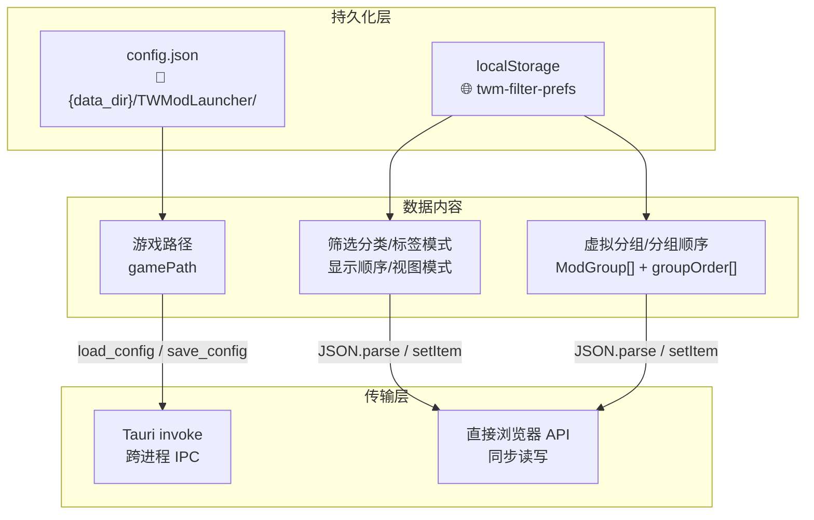
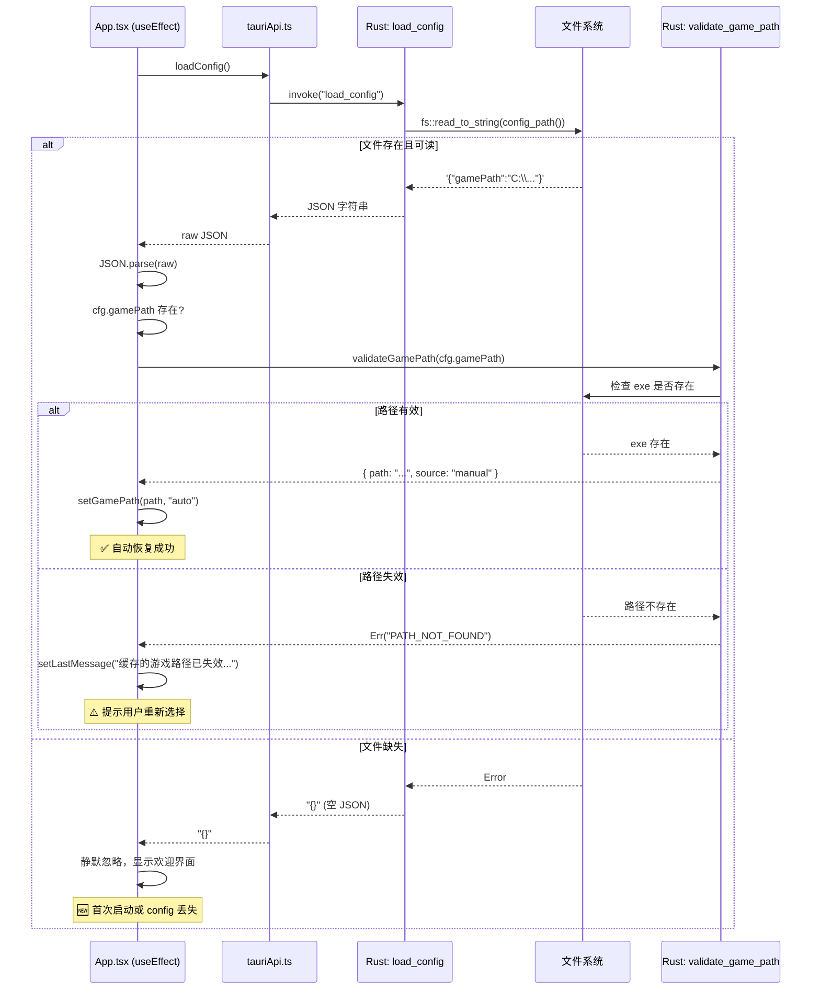
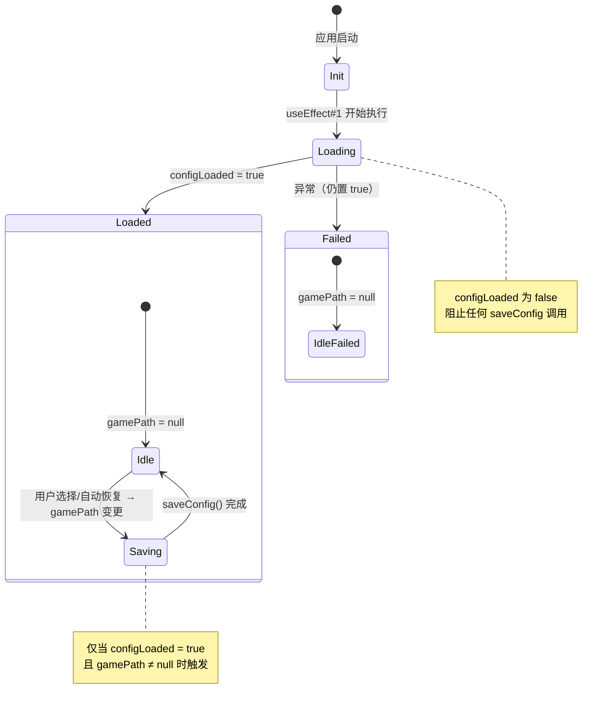
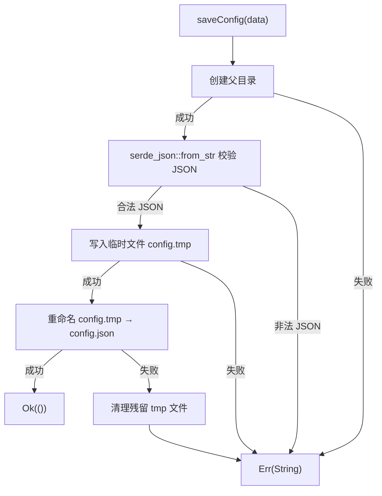
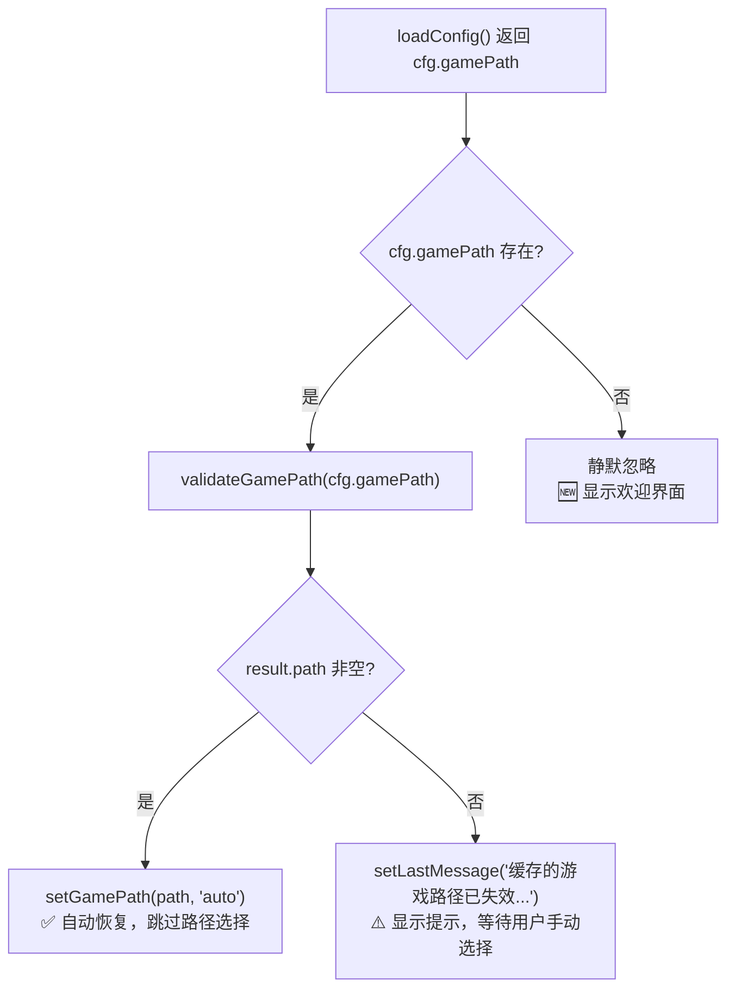
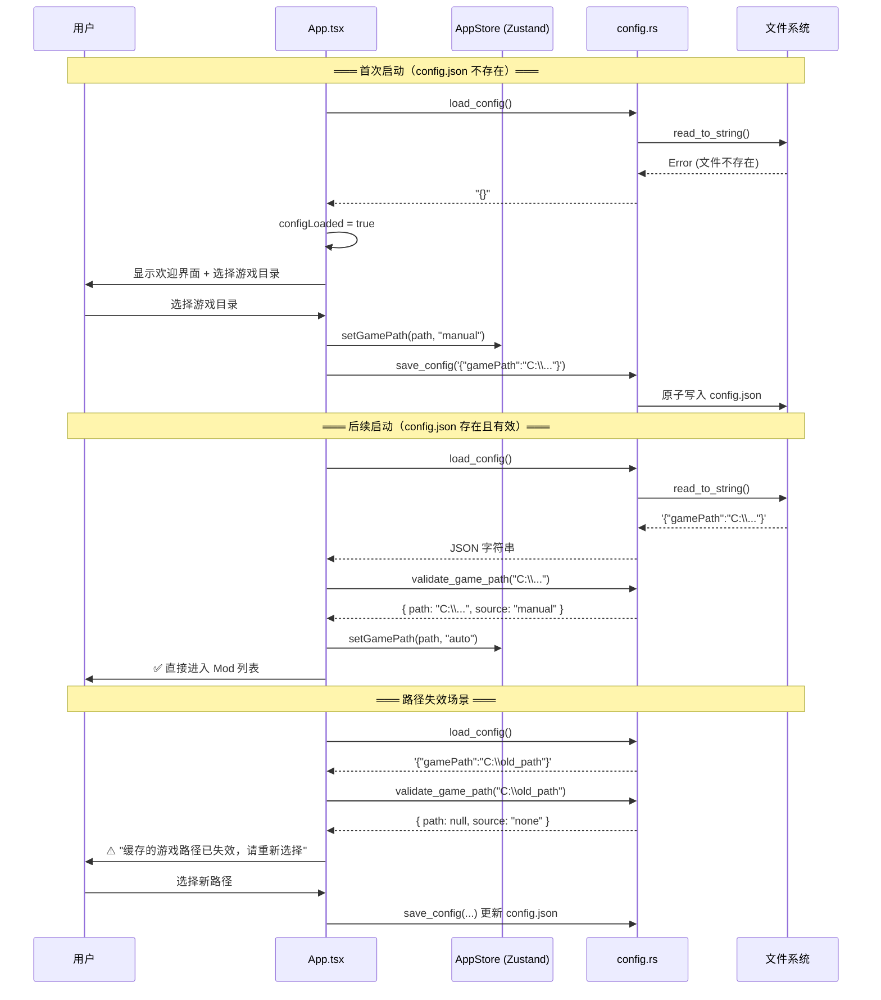

本文档剖析 TWModLauncher 中 `config.json` 的完整生命周期——从文件定位、自动加载、验证恢复，到原子写入和失效保护。该机制是用户启动器"记住上次选择的游戏目录"这一核心体验的基石，确保每次启动无需重复选择路径。

## 存储架构：双轨制持久化

TWModLauncher 采用 **双轨制持久化策略**，将应用级配置（游戏路径）与 UI 级偏好（筛选状态、显示顺序）分流到不同存储层。理解这一分工是理解 config.json 职责范围的前提。



**设计原则**：config.json 只存储**必须跨平台访问且需要操作系统级路径校验**的数据。游戏路径涉及文件系统验证（调用 Rust 端 `validate_game_path`），天然适合放在后端管理。筛选偏好、分组状态等纯 UI 状态则留在 localStorage，无需 IPC 往返，读写延迟为零。

> 关于 localStorage 侧筛选持久化的完整机制，参见 [筛选状态持久化：localStorage 缓存与启动恢复](15-shai-xuan-zhuang-tai-chi-jiu-hua-localstorage-huan-cun-yu-qi-dong-hui-fu)。关于原子写入的通用实现模式，参见 [原子写入策略：临时文件 + 重命名 + 写入验证 + 自动备份](25-yuan-zi-xie-ru-ce-lue-lin-shi-wen-jian-zhong-ming-ming-xie-ru-yan-zheng-zi-dong-bei-fen)。

Sources: [config.rs](src-tauri/src/commands/config.rs#L5-L10), [useModListState.ts](src/components/ModList/useModListState.ts#L14-L35), [useAppStore.ts](src/store/useAppStore.ts#L4-L39)

## config.json 的文件定位

Rust 后端通过 `config_path()` 函数确定文件路径，核心逻辑为：

| 步骤 | 操作 | 说明 |
|------|------|------|
| 1 | `dirs::data_dir()` | 获取操作系统标准应用数据目录（Windows: `%APPDATA%`，macOS: `~/Library/Application Support`，Linux: `$XDG_DATA_HOME`） |
| 2 | `.join("TWModLauncher")` | 附加应用专属子目录 |
| 3 | `.join("config.json")` | 指定配置文件名 |

如果 `dirs::data_dir()` 返回 `None`（极端异常情况），回退到当前工作目录 `"."`，确保不会因路径解析失败而 panic。


Sources: [config.rs](src-tauri/src/commands/config.rs#L4-L10)

## 读取路径：启动时的自动加载与验证

应用启动时，前端执行一个 **一次性 useEffect**，构成完整的"加载→解析→验证→恢复/失效"流程。



### 关键实现细节

加载逻辑位于 `App.tsx` 的启动 Effect 中，依赖数组为 `[setGamePath, setLastMessage]`，确保只在挂载时执行一次。

**容错设计的三层防护**：

| 防护层 | 场景 | 行为 |
|--------|------|------|
| Rust 层 `load_config` | 文件不存在或不可读 | 返回 `"{}"`，不抛出异常 |
| 前端层 JSON.parse | JSON 格式损坏 | 被外层 `try/catch` 捕获，静默忽略 |
| 验证层 `validate_game_path` | 路径存在但游戏已卸载 | 返回空 path，触发失效提示 |

尤其值得注意：`load_config` 使用 `unwrap_or_else(|_| "{}".into())`，意味着**任何读取错误都等同于空配置**——这条简单的规则消除了所有异常分支，保证了启动流程的鲁棒性。

Sources: [config.rs](src-tauri/src/commands/config.rs#L13-L15), [App.tsx](src/App.tsx#L62-L80), [tauriApi.ts](src/lib/tauriApi.ts#L117-L119)

## 写入路径：变更触发的自动保存

### 触发时机

config.json 的写入不是手动触发的，而是**响应式自动保存**——由 `gamePath` 状态变更驱动。具体由第二个 useEffect 控制：

```
依赖: [gamePath, configLoaded]
条件: configLoaded === true AND gamePath !== null
动作: saveConfig(JSON.stringify({ gamePath }))
```



### `configLoaded` 守卫标志

`configLoaded` 是一个至关重要的**门控变量**。它初始值为 `false`，在 config 加载 Effect 的 `finally` 块中置为 `true`。这解决了一个微妙的竞态问题：

**如果没有这个守卫**，`setGamePath(result.path, "auto")` 在 Effect#1 中执行时会立即触发 Effect#2（因为 `gamePath` 变了），导致在 config 尚未完全加载时就尝试写入——虽然不会造成数据损坏，但会产生一次无意义的文件 I/O。

有了守卫后，Effect#2 的条件 `configLoaded && gamePath` 在初始加载阶段始终为 `false`，只有用户**之后手动选择新路径**时才会触发保存。

Sources: [App.tsx](src/App.tsx#L82-L88), [App.tsx](src/App.tsx#L62-L80)

### 写入的原子性保证

`save_config` 命令实现了三步原子写入策略：

| 步骤 | 操作 | 失败处理 |
|------|------|----------|
| 1. 目录创建 | `fs::create_dir_all(parent)` | 返回错误字符串 |
| 2. JSON 预校验 | `serde_json::from_str::<Value>(&data)` | 拒绝非 JSON 输入，防止写入垃圾数据 |
| 3. 原子写入 | `fs::write(&tmp, &data)` → `fs::rename(&tmp, &path)` | rename 失败时清理 tmp 文件 |

**为什么需要 JSON 预校验**：前端传递的 `data` 是任意字符串。如果前端因 bug 传入了非 JSON 内容，预校验在写入前捕获错误，避免磁盘上出现损坏的配置文件。这与 `load_config` 的容错读取形成对称——**写入严格，读取宽容**（be strict in what you send, be tolerant in what you accept）。



不同于 `write_mod_settings`（ModSettings.Lua 的写入）和 `write_settings_file`（单个 Mod 的 Settings.Lua 写入），`save_config` **没有备份步骤**——这是合理的设计选择，因为 config.json 的数据量极小（通常不到 100 字节），且丢失后唯一的代价是用户重新选择一次游戏路径，远不如 Mod 配置文件丢失那么严重。

Sources: [config.rs](src-tauri/src/commands/config.rs#L17-L32), [mod_settings.rs](src-tauri/src/commands/mod_settings.rs#L47-L73)

## 失效恢复：缓存的游戏路径不可用

失效恢复机制是整个持久化系统的**核心价值**。它处理一个现实场景：用户在上次使用后移动、删除或卸载了游戏，缓存路径不再有效。

### 恢复流程



### 验证策略：不只是路径存在性

`validate_game_path` 执行的验证远不止 `Path::exists()`：

| 验证步骤 | 检测内容 | 错误类型 |
|----------|----------|----------|
| `fs::metadata(&p)` | 路径可访问性 | `PERMISSION_DENIED` / `PATH_NOT_FOUND` |
| `meta.is_dir()` | 是否为目录（非文件） | `NOT_A_DIRECTORY` |
| `p.join("The Scroll of Taiwu.exe").exists()` | 游戏可执行文件存在 | 返回 `path: null`（非错误，仅表示无效） |

前两种错误（权限不足、路径不存在）会导致 Rust 命令返回 `Err`，前端据此显示针对性错误提示。第三种情况（路径是目录但没有游戏 exe）返回 `Ok` 但 `path` 字段为 `null`，触发的是"缓存的游戏路径已失效"提示——语义上的区分使得错误信息更加精准。

Sources: [game_path.rs](src-tauri/src/commands/game_path.rs#L11-L43), [App.tsx](src/App.tsx#L76-L78)

## 生命周期全景

将上述读取、写入、失效恢复串联起来，config.json 的完整生命周期如下：



## 与其他系统的交互

config.json 虽然体量最小，但在应用启动序列中处于**关键路径**上。以下是它与其他系统的耦合点：

| 关联系统 | 交互方式 | 时序 |
|----------|----------|------|
| [状态管理](7-zhuang-tai-guan-li-zustand-shuang-store-she-ji-appstore-yu-modstore) | `setGamePath()` 写入 AppStore，触发 React 重渲染 | config 加载后立即执行 |
| [Tauri 命令注册体系](6-tauri-ming-ling-zhu-ce-ti-xi-invoke_handler-yu-qian-hou-duan-tong-xin) | `load_config` / `save_config` 注册于 `invoke_handler` | 编译时注册 |
| [应用主流程](4-ying-yong-zhu-liu-cheng-cong-lu-jing-xuan-ze-dao-mod-guan-li) | 决定是否跳过路径选择界面 | 启动阶段 |
| [前后端统一日志管线](22-qian-hou-duan-tong-ri-zhi-guan-xian-qian-duan-ri-zhi-qiao-jie-zhi-rust-tracing-zi-xi-tong) | config 目录位于 log 目录的父级 `TWModLauncher/` | 共享数据目录 |
| [原子写入策略](25-yuan-zi-xie-ru-ce-lue-lin-shi-wen-jian-zhong-ming-ming-xie-ru-yan-zheng-zi-dong-bei-fen) | 复用 temp-file + rename 模式 | 写入时 |

特别注意：`saveConfig` 使用的是简化版原子写入（无备份、无写入验证），而 ModSettings 和 Settings.Lua 的写入使用完整版原子写入（含备份 `.bak` + 内容验证）。这种差异化设计反映了数据重要性的分层——config.json 可轻松重建，Mod 配置则不可。

## 设计总结：显式非缓存的"缓存"

一个有趣的设计悖论：config.json 本质上是一个"缓存"——它缓存了用户上次的游戏路径以避免重复询问。但代码中**没有任何缓存失效时间、版本号或校验和机制**。这并非疏漏，而是刻意的简化：

1. **数据量极小**：单个 key-value 对，不会膨胀
2. **可重建性**：丢失后用户只需重新选择一次路径，零数据损失
3. **验证优于信任**：不依赖时间戳或版本号，每次启动都用真实文件系统验证路径有效性
4. **失效即提示**：路径失效不是静默的，用户会看到明确的引导信息

这种"缓存"本质上是**带验证的持久化**，而非传统意义上的性能缓存。它不追求命中率，而是追求减少用户重复操作——这是一个面向体验而非性能的设计决策。