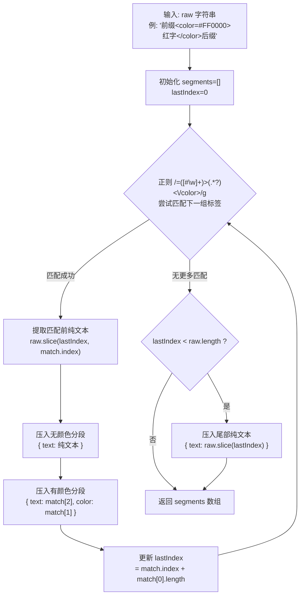
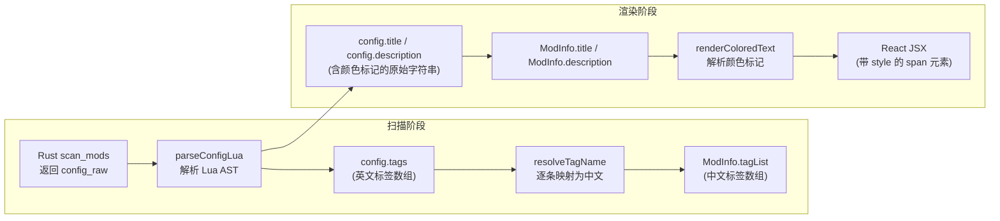

本文聚焦于项目中两个紧密相关但职责不同的文本转换工具：**颜色标签解析渲染系统**（`renderColoredText.tsx`）负责将游戏 Mod 标题中嵌入的 `<color=#RRGGBB>text</color>` 标记转换为 React 带色 JSX 元素；**标签中英文映射系统**（`tagMapping.ts`）负责将 Mod 分类标签从英文原文翻译为中文显示名。两者共同保证了 Mod 列表界面中文本信息的正确渲染与本土化呈现。

Sources: [renderColoredText.tsx](src/utils/renderColoredText.tsx#L1-L51), [tagMapping.ts](src/utils/tagMapping.ts#L1-L18)

## 数据来源：游戏 Config.lua 中的颜色标记

在 Total War 系列游戏中，每个 Mod 包含一个 `Config.lua` 文件，其中 `Title` 字段可包含形如 `<color=#FF5733>Mod 名称</color>` 的颜色标记语法。这是游戏引擎自身支持的富文本格式，允许 Mod 作者为标题段落指定前景色。项目在 Rust 后端扫描阶段原样读取这些原始文本，不做任何解析或转换，将纯字符串通过 `ModScanEntry.config_raw` 传递给前端进行 Lua 解析。

Sources: [luaParser.ts](src/lib/luaParser.ts#L177-L211), [types.ts](src/lib/types.ts#L10-L18)

前端通过 `parseConfigLua` 解析后，`title` 和 `description` 字段保留原始颜色标记字符串。也就是说，`ModInfo.title` 在进入 React 渲染层之前仍然包含 `<color=...>...</color>` 语法，必须经过 `renderColoredText` 才能转化为视觉上正确的彩色文本。

Sources: [luaParser.ts](src/lib/luaParser.ts#L194-L202)

## parseColorTags：正则驱动的分段解析

`parseColorTags` 是整个颜色渲染系统的核心算法，它接收一个包含颜色标记的原始字符串，输出一个**分段数组**（`Segment[]`），每个分段要么是纯文本，要么是带有颜色属性的文本片段。

```typescript
interface Segment {
  text: string;
  color?: string;  // 存在时表示该段需以指定颜色渲染
}
```

算法的执行流程如下：



正则表达式 `/&#60;color=([#\w]+)>(.*?)&#60;\/color>/g` 的三个关键组件：**`([#\w]+)`** 捕获颜色值（支持 `#RRGGBB` 格式和 CSS 颜色名），**`(.*?)`** 以非贪婪模式捕获标签内的文本内容，**`g` 标志**配合 `while (match = re.exec(raw))` 循环实现全局多次匹配，利用 `RegExp.lastIndex` 状态自动推进扫描位置。

Sources: [renderColoredText.tsx](src/utils/renderColoredText.tsx#L12-L28)

**边界情况处理**：当字符串中不包含任何颜色标签时，正则一次都不匹配，`lastIndex` 保持为 0，尾部分支将整个原始字符串作为单一无颜色分段压入数组。当字符串以颜色标签开头时，`match.index` 为 0，`match.index > lastIndex` 条件为 false，跳过纯文本插入。当连续两个颜色标签紧邻时，二者之间没有纯文本，`match.index === lastIndex`，中间段被正确省略。

## renderColoredText：分段数组到 React 元素的转换

`renderColoredText` 将 `parseColorTags` 的输出转化为 React 可渲染的节点树。该函数有三个快速路径优化：

| 条件 | 返回值 | 原因 |
|------|--------|------|
| `!text`（falsy 值） | 原值直接返回 | 空字符串/undefined/null 无需处理 |
| `segments.length === 0` | 原值直接返回 | 解析失败时避免空 Fragment |
| `segments.length === 1 && !segments[0].color` | 原值直接返回 | 纯文本无需包裹任何 JSX 元素 |

Sources: [renderColoredText.tsx](src/utils/renderColoredText.tsx#L30-L38)

通过快速路径后，函数遍历 `segments` 数组：有色分段渲染为 `<span style={{ color: seg.color }}>{seg.text}</span>`，无色分段渲染为 `<Fragment>{seg.text}</Fragment>`，全部包裹在顶层 `<Fragment>` 中。使用 `React.Fragment` 而非 `<div>` 避免了在 inline 布局（如 `<h3>` 标题）中引入额外的块级包裹。

Sources: [renderColoredText.tsx](src/utils/renderColoredText.tsx#L40-L50)

## 在 ModCard 中的两处使用场景

`renderColoredText` 在 `ModCard.tsx` 中有两个调用点，分别覆盖了 Mod 标题和 Mod 描述两种不同的 UI 上下文：

**标题渲染（紧凑模式 + 详细模式）**：两种视图模式下，Mod 名称的 `<h3>` 元素均使用 `{renderColoredText(mod.title)}` 渲染。紧凑模式下标题被限制在 `maxWidth: 200` 像素并配合 `truncate` 截断，详细模式下则不限制宽度。`title` 属性始终传递原始字符串以确保 tooltip 中显示完整信息。

Sources: [ModCard.tsx](src/components/ModList/ModCard.tsx#L116-L127), [ModCard.tsx](src/components/ModList/ModCard.tsx#L286-L292)

**描述渲染（仅详细模式）**：当 `viewMode === "detailed"` 且 `mod.description` 非空时，描述文本同样通过 `renderColoredText` 渲染，显示在封面图下方，带有 `line-clamp-2` 限制最多两行。

Sources: [ModCard.tsx](src/components/ModList/ModCard.tsx#L314-L320)

## tagMapping：独立的标签国际化映射

与颜色渲染不同，**`tagMapping.ts` 解决的是另一种文本转换需求**：Mod 的 `Config.lua` 中 `Tags` 字段存储的是英文标签名（如 `"Arts"`、`"Frameworks"`、`"Stories"`），在扫描阶段需要转换为中文显示名。

映射表定义如下：

| 英文标签 | 中文显示名 | 含义 |
|----------|-----------|------|
| Arts | 美化 | 美术资源类 Mod |
| Compatible Mods | 适配版本 | 兼容性补丁 |
| Frameworks | 框架 | 框架/前置 Mod |
| Stories | 剧情 | 剧情内容 Mod |
| Extensions | 拓展 | 功能扩展 |
| Modifications | 修改 | 游戏机制修改 |
| Optimizations | 优化 | 性能优化 |
| Display | 显示 | 显示/UI 相关 |
| Configurations | 配置 | 配置工具类 |

`resolveTagName` 函数执行简单的字典查找——如果能找到映射则返回中文名，否则原样返回英文原文（fallback 策略）。这种设计保证了新增未知标签不会导致崩溃，只是在界面上以英文形式展示。

Sources: [tagMapping.ts](src/utils/tagMapping.ts#L1-L18)

## 两条管线的集成点

两条转换管线在数据流中的位置不同，承担的角色也截然不同：



**关键区别**：`resolveTagName` 在 `useModScanner` 的数据处理阶段执行——解析 `Config.lua` 后立即将标签数组转为中文，存入 Zustand Store。此后整个应用中 `tagList` 始终是中文形式，无需再次转换。而 `renderColoredText` 在 React 渲染阶段执行——每次组件渲染时对 `title`/`description` 字符串进行实时解析，因为颜色标记需要转化为 DOM 节点的 inline style，无法提前"预处理"为纯数据。

Sources: [useModScanner.ts](src/hooks/useModScanner.ts#L84), [ModCard.tsx](src/components/ModList/ModCard.tsx#L291-L292)

## 设计权衡与注意事项

**正则解析 vs AST 解析**：颜色标记使用正则而非 AST 解析，是因为 `<color=...>...</color>` 语法极其简单——只有一层嵌套，无属性嵌套、无转义规则。正则方案仅需 16 行代码即可完整实现，且 `RegExp.exec` 的 `lastIndex` 机制天然适合顺序扫描。如果未来需要支持嵌套标签或更多属性，则应考虑迁移至有限状态机或手写递归下降解析器。

**不可嵌套性**：当前实现不支持 `<color=#F00>外层<color=#0F0>内层</color></color>` 的嵌套语法。正则的 `.*?` 非贪婪匹配在遇到第一个 `</color>` 时即终止，嵌套场景会产生错误的分段结果。不过，游戏引擎自身的颜色标记语法是否支持嵌套尚无定论，当前设计覆盖了所有已知的实际用例。

**性能考量**：`renderColoredText` 在每次组件渲染时被调用，对于包含数百个 Mod 的列表，会产生数百次正则扫描。但由于每个标题通常只有几十个字符且颜色标签数量极少（通常是 0 或 1 个），实际性能开销可忽略不计。快速路径优化（纯文本直接返回原值）进一步降低了无标签场景的开销。

---

> **阅读建议**：颜色标记的原始数据来源于 [Lua 配置解析](9-lua-pei-zhi-jie-xi-luaparse-qu-dong-de-config-lua-modsettings-lua-settings-lua-jie-xi)，解析后的 Mod 对象由 [渲染模型](12-xuan-ran-mo-xing-displayorder-modgroup-qu-dong-de-buildrenderitems-suan-fa) 编排为可视化列表，最终在 [筛选系统](14-shai-xuan-xi-tong-fuse-js-mo-hu-sou-suo-fen-lei-biao-qian-qi-yong-zhuang-tai-duo-tiao-jian-guo-lu) 中与标签映射联动完成分类过滤。