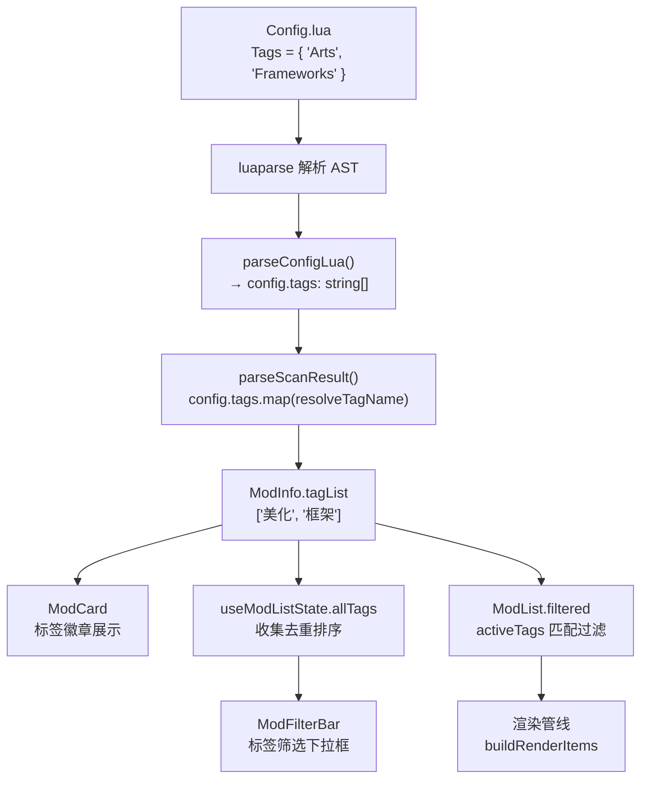

本文档解析 `tagMapping.ts` 的设计意图、数据流路径、映射表的维护方式，以及标签在整个应用生命周期中从 Lua 原始文本到 UI 展示的完整转换链路。

## 核心问题：为什么需要标签映射

Mod 的 `Config.lua` 文件中，标签字段（`Tags` / `TagList`）由 Mod 作者以英文撰写——这是《战争艺术：赤潮》Mod 社区的约定俗成。但面向中文用户的启动器界面，直接展示 `"Arts"`、`"Frameworks"` 远不如展示 `"美化"`、`"框架"` 直观。`tagMapping.ts` 的存在就是为了填补这一中英文鸿沟，在数据流入 Store 之前完成一次性转换，使得后续所有组件（卡片展示、标签筛选下拉框、Fuse.js 搜索）都在中文语境下运作。

Sources: [tagMapping.ts](src/utils/tagMapping.ts#L1-L18)

## 映射表定义

映射表是一个静态的 `Record<string, string>` 字典，键为 Config.lua 中出现的英文字面量，值为对应的中文显示名：

| 英文原值（Config.lua） | 中文映射值（界面展示） | 语义说明 |
|---|---|---|
| `Arts` | 美化 | 美术资源类 Mod（贴图、模型、UI 皮肤等） |
| `Compatible Mods` | 适配版本 | 针对特定游戏版本的兼容性补丁 |
| `Frameworks` | 框架 | 为其他 Mod 提供基础能力的框架性 Mod |
| `Stories` | 剧情 | 剧情 / 战役类 Mod |
| `Extensions` | 拓展 | 在原有系统上的功能性拓展 |
| `Modifications` | 修改 | 对游戏机制的直接修改 |
| `Optimizations` | 优化 | 性能优化类 Mod |
| `Display` | 显示 | 显示相关设置（分辨率、UI 布局等） |
| `Configurations` | 配置 | 配置调整类 Mod |

表中 9 个条目覆盖了该游戏 Mod 社区的主流分类体系。映射表当前不包含繁体中文或英文回退——`resolveTagName` 在查不到映射时直接返回原始值，这意味着未知标签会以英文原文透出到界面。

Sources: [tagMapping.ts](src/utils/tagMapping.ts#L1-L18)

## 转换函数：resolveTagName

```typescript
export function resolveTagName(raw: string): string {
  return TAG_MAP[raw] ?? raw;
}
```

这是整个映射系统的唯一对外接口。逻辑极简：查字典命中则返回中文，未命中则原样返回（fallback）。这种设计有两个隐含优势：

1. **向前兼容**：Mod 作者随时可能使用映射表中不存在的新标签，此时界面至少能展示原文，而非空白或报错。
2. **零副作用**：纯函数，无状态、无异步，可以在扫描循环中安全地逐条调用。

Sources: [tagMapping.ts](src/utils/tagMapping.ts#L16-L18)

## 完整数据流：从 Config.lua 到 UI 渲染

下面的流程图展示了标签从原始 Lua 文件到最终界面展示所经历的全部转换环节：



关键环节逐一说明：

### 第一步：Lua 解析提取原始标签

`parseConfigLua()` 在解析 Config.lua 的 AST 后，调用 `parseTags()` 提取标签数组。`parseTags()` 兼容两种 Lua 数据结构——纯数组（`{"Arts", "Frameworks"}`）和以数字为键的表（`{[1]="Arts", [2]="Frameworks"}`），统一输出 `string[]`。此时标签值仍为英文原文。

Sources: [luaParser.ts](src/lib/luaParser.ts#L155-L200), [luaParser.ts](src/lib/luaParser.ts#L323-L329)

### 第二步：扫描管线中的映射调用

在 `useModScanner.ts` 的 `parseScanResult()` 函数中，每个扫描条目被解析为 `ModInfo` 时，标签数组通过 `.map(resolveTagName)` 完成批量转换。这是整个应用中**唯一调用 `resolveTagName` 的位置**——所有标签的中英文转换集中在此处完成，确保了数据一致性。

```typescript
// useModScanner.ts, parseScanResult() 内部
tagList: config.tags.map(resolveTagName),
```

Sources: [useModScanner.ts](src/hooks/useModScanner.ts#L14), [useModScanner.ts](src/hooks/useModScanner.ts#L86)

### 第三步：标签在 Zustand Store 中的存储

转换后的中文标签存储在 `ModInfo.tagList` 字段中，经由 `useModStore.setMods()` 写入 Zustand Store。此后所有消费 `mods` 的组件拿到的都是中文标签，无需再关心原始英文值。

Sources: [types.ts](src/lib/types.ts#L56), [useModStore.ts](src/store/useModStore.ts#L1-L10)

### 第四步：标签在 UI 中的三处消费

**ModCard 标签徽章**：在卡片视图（详细/紧凑模式）中，`mod.tagList` 的前三个标签以徽章样式渲染，超出部分显示 `+N`。展示的是已转换的中文文本。

Sources: [ModCard.tsx](src/components/ModList/ModCard.tsx#L147-L158)

**ModFilterBar 筛选下拉框**：`useModListState` 中的 `allTags` 通过遍历所有 Mod 的 `tagList` 去重并排序得到，传递给 `ModFilterBar` 渲染为可勾选的标签列表，支持 OR/AND 两种匹配模式。

Sources: [useModListState.ts](src/components/ModList/useModListState.ts#L111-L115), [ModFilterBar.tsx](src/components/ModList/ModFilterBar.tsx#L144-L210)

**ModList 过滤逻辑**：在 `filtered` 计算中，`activeTags`（用户勾选的中文标签集合）与 `m.tagList`（中文标签数组）进行匹配——OR 模式下 `some()`，AND 模式下 `every()`。整个匹配链路完全在中文空间内完成。

Sources: [ModList.tsx](src/components/ModList/ModList.tsx#L676-L680)

## 架构设计：单点转换 vs 多点转换

本项目的设计选择是将映射**集中在数据流入点**（扫描解析阶段），而非在 UI 渲染层按需转换。这一决策的利弊分析：

| 维度 | 单点转换（当前方案） | 多点转换（替代方案） |
|---|---|---|
| **一致性** | ✅ 转换一次，全局统一 | ❌ 每个消费点需独立调用，容易遗漏 |
| **性能** | ✅ 扫描时 O(n) 一次性开销 | ⚠️ 每次渲染可能重复查表，但在现代框架中影响可忽略 |
| **可调试性** | ⚠️ Store 中的值与源文件不一致，排查问题时需记得映射层的存在 | ✅ Store 保留原始值，界面层转换，数据溯源清晰 |
| **扩展性** | ⚠️ 若未来需要支持多语言（英文/繁体），需重构为运行时语言切换 | ✅ 渲染层可按当前语言动态选择映射表 |

当前方案适合这个阶段的项目——用户群体为简体中文玩家，一次性转换足够满足需求，且避免了 UI 层重复调用带来的代码分散问题。

## 与筛选系统的衔接

标签映射与筛选系统的关系值得特别说明：`[筛选系统：Fuse.js 模糊搜索 + 分类/标签/启用状态多条件过滤](14-shai-xuan-xi-tong-fuse-js-mo-hu-sou-suo-fen-lei-biao-qian-qi-yong-zhuang-tai-duo-tiao-jian-guo-lu)` 中描述的标签筛选逻辑，其匹配目标 `m.tagList` 已经是中文标签。这意味着用户在标签下拉框中看到和勾选的都是中文标签名，匹配也是在中文标签名之间进行的。Fuse.js 模糊搜索是独立的路径——它搜索 `title`、`author`、`description` 字段，不涉及 `tagList`，因此标签映射对搜索无影响。

同时，`[筛选状态持久化：localStorage 缓存与启动恢复](15-shai-xuan-zhuang-tai-chi-jiu-hua-localstorage-huan-cun-yu-qi-dong-hui-fu)` 中缓存的 `activeCategories`、`tagMode`、`viewMode` 等筛选偏好，不包含 `activeTags`——标签勾选状态在每次刷新后重置为空。这是有意为之：扫描后标签集合可能变化（Mod 增删导致某些标签不再存在），持久化已失效的标签勾选会产生静默空结果，不利于用户体验。

## 映射表的维护指南

当需要添加新的标签映射时，只需在 `TAG_MAP` 对象中追加一行：

```typescript
const TAG_MAP: Record<string, string> = {
  // ...现有映射...
  "NewTag": "新标签",
};
```

注意事项：
- **键名必须与 Config.lua 中的英文标签完全匹配**（大小写敏感）。如果 Mod 作者使用了 `"frameworks"`（小写）而非 `"Frameworks"`（首字母大写），则需要额外添加对应条目，或在 `resolveTagName` 中引入大小写不敏感的查找逻辑。当前实现未做大小写规范化。
- **无需修改任何组件代码**——映射自动通过 `resolveTagName` 在扫描阶段生效。
- 添加映射后，已缓存的标签数据不会自动更新。用户需要重新扫描（触发 `scan()` 或 `rescan()`）才能看到新映射生效。

## 阅读下一步

理解了标签映射的单点转换机制后，建议继续阅读以下相关页面：

- **[筛选系统：Fuse.js 模糊搜索 + 分类/标签/启用状态多条件过滤](14-shai-xuan-xi-tong-fuse-js-mo-hu-sou-suo-fen-lei-biao-qian-qi-yong-zhuang-tai-duo-tiao-jian-guo-lu)** — 深入了解标签如何在筛选管线中与 OR/AND 模式协同工作。
- **[useModScanner 钩子：扫描、增量刷新与错误恢复](11-usemodscanner-gou-zi-sao-miao-zeng-liang-shua-xin-yu-cuo-wu-hui-fu)** — 查看 `resolveTagName` 被调用的完整扫描上下文，理解标签转换在整个扫描管线中的位置。
- **[Lua 配置解析：luaparse 驱动的 Config.lua / ModSettings.Lua / Settings.Lua 解析](9-lua-pei-zhi-jie-xi-luaparse-qu-dong-de-config-lua-modsettings-lua-settings-lua-jie-xi)** — 追溯标签的源头：`parseTags()` 如何从 Lua AST 中提取原始标签数组。
- **[颜色标签文本渲染：parseColorTags 与 renderColoredText](27-yan-se-biao-qian-wen-ben-xuan-ran-parsecolortags-yu-rendercoloredtext)** — 了解标签文本在卡片标题中的颜色标记渲染机制（与 tagMapping 是独立的文本处理管线）。