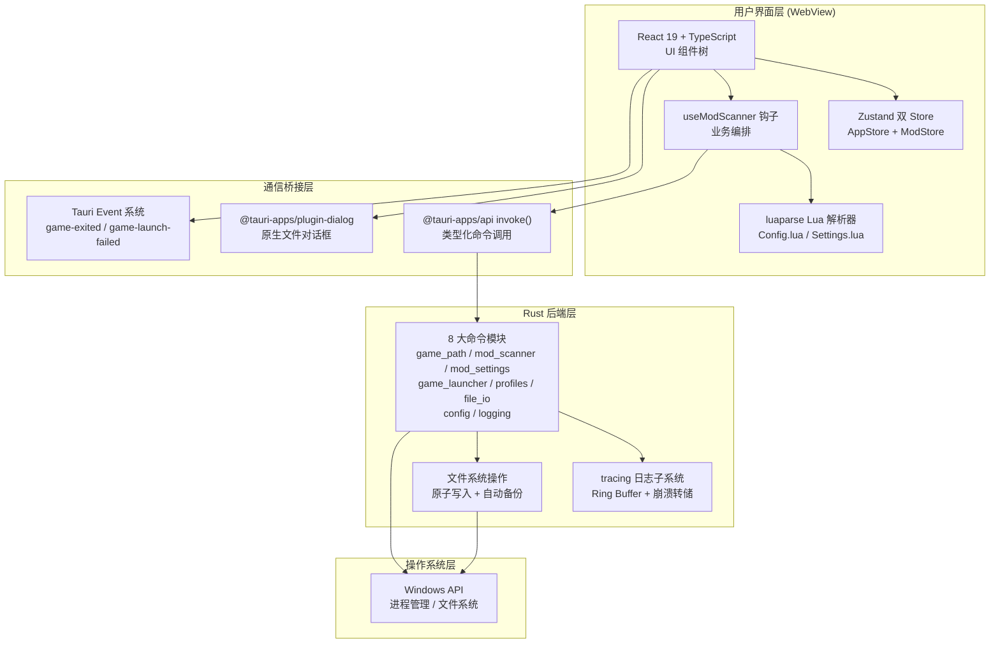
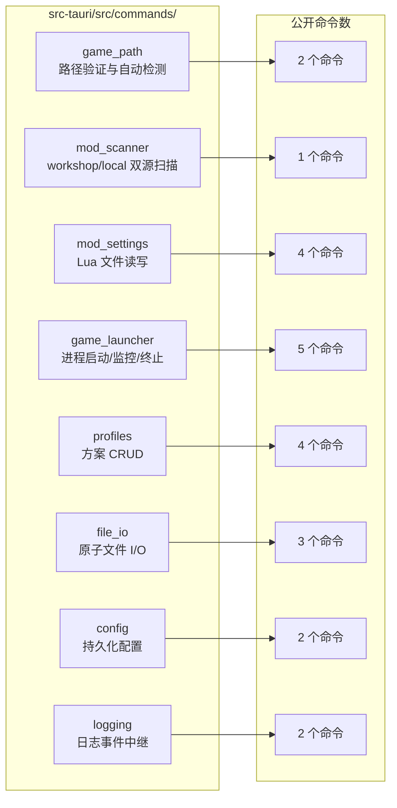
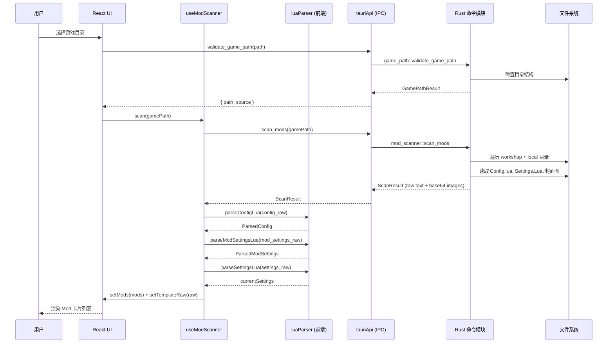

本文档为 TWModLauncher 项目的技术栈全景概述，涵盖前端、后端、构建工具链和关键依赖库。阅读本文后，你将理解项目的分层架构、各技术选型的职责划分以及它们之间的协作关系。建议在深入各模块文档前先阅读本文，建立整体技术视野。

## 整体架构

TWModLauncher 是一个基于 **Tauri v2** 构建的桌面应用程序。Tauri 是一个使用 Web 前端技术构建轻量级桌面应用的框架——它用系统原生 WebView 渲染界面，用 Rust 编写后端逻辑，两者通过基于 IPC（进程间通信）的命令调用机制通信。下图展示了项目的分层架构：



核心技术原则：**前端负责解析与展示，后端负责 I/O 与系统调用**。Lua 文件的 AST 解析在浏览器端由 luaparse 库完成，Rust 端仅做原始文本的读取与写入。这一分工最大化了前端在数据处理上的灵活性，同时让 Rust 专注于其擅长的系统级操作。

Sources: [package.json](package.json#L1-L42), [Cargo.toml](src-tauri/Cargo.toml#L1-L34), [lib.rs](src-tauri/src/lib.rs#L1-L55)

## 前端技术栈

前端使用 **React 19.2** 作为 UI 框架，**TypeScript ~6.0** 提供全链路类型安全，**Vite 8.0** 负责开发服务器与生产构建。样式方案采用 **TailwindCSS 4.3**（通过 `@tailwindcss/vite` 插件集成），以原子化 CSS 类替代传统样式表。

| 技术 | 版本 | 用途 | 关键特征 |
|------|------|------|----------|
| React | ^19.2.6 | UI 渲染框架 | 函数组件 + Hooks，单一 App 根组件 |
| TypeScript | ~6.0.2 | 类型系统 | 严格模式，Project References 拆分 app/node |
| Vite | ^8.0.12 | 构建工具 | HMR 热更新，固定端口 5173（Tauri 要求） |
| TailwindCSS | ^4.3.1 | 样式方案 | Vite 插件集成，零运行时 |
| Zustand | ^5.0.14 | 状态管理 | 双 Store 模式，无 Provider 包裹 |
| Fuse.js | ^7.4.2 | 模糊搜索 | Mod 列表筛选的核心引擎 |
| luaparse | ^0.3.1 | Lua AST 解析 | 浏览器端解析 Config.lua / Settings.lua |
| @tauri-apps/api | ^2.11.1 | Tauri 前端绑定 | invoke() 调用 Rust 命令，事件监听 |
| @tauri-apps/plugin-dialog | ^2.7.1 | 原生对话框 | 文件夹选择、确认弹窗 |

Zustand 是状态管理的核心——项目使用**双 Store 设计**：`useAppStore` 管理应用级全局状态（游戏路径、脏状态、模板数据、分组），`useModStore` 管理 Mod 列表数据（扫描结果、启用状态、多选）。两者职责严格分离，分别定义在 `src/store/` 目录下。

Sources: [package.json](package.json#L15-L22), [vite.config.ts](vite.config.ts#L1-L16), [useAppStore.ts](src/store/useAppStore.ts#L1-L117), [useModStore.ts](src/store/useModStore.ts#L1-L109)

代码质量控制方面，项目配置了 **ESLint 10** 的扁平化配置（`eslint.config.js`），整合了 `@eslint/js` 推荐规则、`typescript-eslint` 类型检查、`react-hooks` 规则和 `react-refresh` 插件。TypeScript 通过三个 `tsconfig` 文件分层管理：根配置 `tsconfig.json` 仅做项目引用声明，`tsconfig.app.json` 负责应用源码编译，`tsconfig.node.json` 负责 Vite/Node 配置文件的类型检查。

Sources: [eslint.config.js](eslint.config.js#L1-L22), [tsconfig.json](tsconfig.json#L1-L8)

## Rust 后端技术栈

Rust 后端使用 **Tauri 2.11.3** 作为桌面框架，Rust 最低版本要求 **1.77.2**（edition 2021）。后端被编译为静态库（`staticlib`）、动态库（`cdylib`）和 Rust 库（`rlib`）三种形式，由 `build.rs` 调用 `tauri_build::build()` 完成构建时代码生成。

| 依赖 | 版本 | 用途 |
|------|------|------|
| tauri | 2.11.3 | 桌面框架核心 |
| serde / serde_json | 1.0 | JSON 序列化/反序列化 |
| tracing | 0.1 | 结构化日志框架 |
| tracing-subscriber | 0.3 | 日志订阅器（支持 env-filter、local-time） |
| tracing-appender | 0.2 | 非阻塞文件日志写入 |
| tracing-log | 0.2 | 桥接 log 宏到 tracing |
| chrono | 0.4 | 时间戳格式化 |
| base64 | 0.22 | 封面图片 Base64 编码 |
| dirs | 6.0 | 标准系统目录路径 |

项目使用 **rust-lld** 作为 Windows MSVC 目标的链接器（配置于 `.cargo/config.toml`），相比默认的 MSVC link.exe，lld 具有更快的链接速度。

Sources: [Cargo.toml](src-tauri/Cargo.toml#L1-L34), [build.rs](src-tauri/build.rs#L1-L3), [config.toml](src-tauri/.cargo/config.toml#L1-L2)

## 命令模块体系

Rust 后端通过 **Tauri 命令（`#[tauri::command]`）** 暴露接口给前端。所有命令在 `lib.rs` 的 `invoke_handler` 中集中注册，按功能划分为 8 个模块：



共计 **23 个 Tauri 命令**，覆盖了从路径检测、Mod 扫描、配置读写、游戏启停到方案管理的全部后端操作。前端通过 `src/lib/tauriApi.ts` 中类型化的 `invoke()` 封装调用这些命令，每个函数都明确标注了参数类型和返回值类型。

Sources: [lib.rs](src-tauri/src/lib.rs#L26-L51), [mod.rs](src-tauri/src/commands/mod.rs#L1-L8), [tauriApi.ts](src/lib/tauriApi.ts#L1-L133)

## 日志系统

日志系统是该项目最具特色的基础设施之一。它采用**前后端统一日志管线**：

- **前端**：`src/lib/logger.ts` 提供 `createLogger(target)` 工厂函数，通过 `invoke("log_event", ...)` 将日志异步发送至 Rust 后端。Error 级别日志额外备份到 `sessionStorage`，供崩溃恢复使用。
- **后端**：`src-tauri/src/logging.rs` 基于 tracing 生态构建了三层日志架构——控制台输出（stderr、始终开启）、Ring Buffer（内存环形缓冲区，保留最近约 128KB）、错误触发写入（首个 ERROR 事件或 panic 时，将 Ring Buffer 内容转储到 `logs/crash-{timestamp}.log`）。

日志文件自动清理策略：最多保留 15 个崩溃日志文件，超出时删除最旧的。

Sources: [logger.ts](src/lib/logger.ts#L1-L92), [logging.rs](src-tauri/src/logging.rs#L1-L210)

## 项目目录结构

```
twm-launcher/
├── index.html                    # Vite 入口 HTML
├── package.json                  # 前端依赖与脚本
├── vite.config.ts                # Vite 配置（React + TailwindCSS 插件）
├── tsconfig.json                 # TypeScript 项目引用根配置
├── eslint.config.js              # ESLint 扁平化配置
│
├── src/                          # ── 前端源码 ──
│   ├── main.tsx                  # 应用入口：错误处理注册 + ReactDOM 挂载
│   ├── App.tsx                   # 根组件：状态编排、生命周期、用户交互
│   ├── index.css                 # TailwindCSS 入口样式
│   ├── assets/                   # 静态资源（图片等）
│   ├── components/
│   │   ├── ErrorBoundary.tsx     # React 错误边界
│   │   ├── ModList/              # Mod 列表（含卡片、拖拽、筛选、右键菜单）
│   │   ├── ProfileManager/       # 方案管理面板
│   │   └── SettingsEditor/       # Mod 设置编辑器
│   ├── hooks/
│   │   └── useModScanner.ts      # 扫描、解析、增量刷新业务编排
│   ├── lib/
│   │   ├── types.ts              # 共享类型定义
│   │   ├── tauriApi.ts           # Tauri 命令的类型封装
│   │   ├── luaParser.ts          # Lua AST 解析器
│   │   └── logger.ts             # 前端日志工具
│   ├── store/
│   │   ├── useAppStore.ts        # 应用级状态
│   │   └── useModStore.ts        # Mod 数据状态
│   ├── types/
│   │   └── luaparse.d.ts         # luaparse 库类型声明
│   └── utils/
│       ├── generateModSettings.ts # ModSettings.Lua 生成与补丁
│       ├── renderColoredText.tsx  # 颜色标签文本渲染
│       └── tagMapping.ts         # 标签中英文映射
│
├── src-tauri/                    # ── Rust 后端源码 ──
│   ├── Cargo.toml                # Rust 依赖配置
│   ├── build.rs                  # Tauri 构建脚本
│   ├── tauri.conf.json           # Tauri 应用配置（窗口、打包、安全策略）
│   ├── capabilities/default.json # 权限声明
│   ├── .cargo/config.toml        # Rust 编译配置（rust-lld 链接器）
│   ├── icons/                    # 应用图标（多尺寸）
│   └── src/
│       ├── main.rs               # Rust 入口（调用 lib::run）
│       ├── lib.rs                 # Tauri Builder 配置与命令注册
│       ├── logging.rs            # tracing 日志子系统
│       └── commands/             # 8 个命令模块
│           ├── mod.rs
│           ├── game_path.rs
│           ├── mod_scanner.rs
│           ├── mod_settings.rs
│           ├── game_launcher.rs
│           ├── profiles.rs
│           ├── file_io.rs
│           ├── config.rs
│           └── logging.rs
│
├── scripts/
│   └── env.bat                   # Windows 环境变量脚本（Tauri 开发/构建用）
└── public/                       # Vite 公共资源目录
```

Sources: [lib.rs](src-tauri/src/lib.rs#L1-L55), [App.tsx](src/App.tsx#L1-L48), [main.tsx](src/main.tsx#L1-L33)

## 数据流全景

下面这张数据流图展示了从用户选择游戏目录到 Mod 卡片渲染的完整数据链路：



数据流向的核心原则：**重数据在 Rust 端读取（文件 I/O），轻数据在前端解析（Lua AST）**。这样 Lua 解析可以利用 JavaScript 的灵活性（luaparse 是纯 JS 库），而文件系统遍历、图片读取等重 I/O 操作则由 Rust 高效处理。

Sources: [useModScanner.ts](src/hooks/useModScanner.ts#L118-L155), [mod_scanner.rs](src-tauri/src/commands/mod_scanner.rs#L171-L216), [luaParser.ts](src/lib/luaParser.ts#L170-L200)

## 打包与分发

应用通过 **NSIS 安装包** 分发，配置如下：

| 配置项 | 值 |
|--------|-----|
| 产品名 | TWModLauncher |
| 版本号 | 1.9.2 |
| 应用标识 | com.twmodlauncher.app |
| 安装模式 | currentUser（仅当前用户） |
| 语言支持 | 简体中文、English |
| 窗口尺寸 | 1200×800，可调整大小 |
| 安全策略 | CSP 设为 null（允许内联脚本与样式） |

构建流程：`npm run tauri:build` → 执行 `scripts/env.bat` 设置环境变量 → `tauri build` → Vite 生产构建（`tsc -b && vite build`）→ Cargo release 编译 → NSIS 打包。开发模式则使用 `npm run tauri:dev`，Vite 开发服务器运行在 `localhost:5173`，Tauri WebView 连接该地址实现 HMR 热更新。

Sources: [tauri.conf.json](src-tauri/tauri.conf.json#L1-L43), [package.json](package.json#L6-L13)

## 阅读建议

本文档提供了技术栈的全景视图。建议按以下顺序深入阅读：

1. **[Tauri v2 双端架构：Rust 后端与 React 前端的职责划分](5-tauri-v2-shuang-duan-jia-gou-rust-hou-duan-yu-react-qian-duan-de-zhi-ze-hua-fen)** — 理解前后端如何通过命令调用协作
2. **[状态管理：Zustand 双 Store 设计（AppStore 与 ModStore）](7-zhuang-tai-guan-li-zustand-shuang-store-she-ji-appstore-yu-modstore)** — 掌握数据模型的核心
3. **[应用主流程：从路径选择到 Mod 管理](4-ying-yong-zhu-liu-cheng-cong-lu-jing-xuan-ze-dao-mod-guan-li)** — 端到端理解用户操作流程
4. 后续可根据兴趣深入 **Mod 扫描与解析**、**Mod 列表交互**、**方案管理** 等专题文档