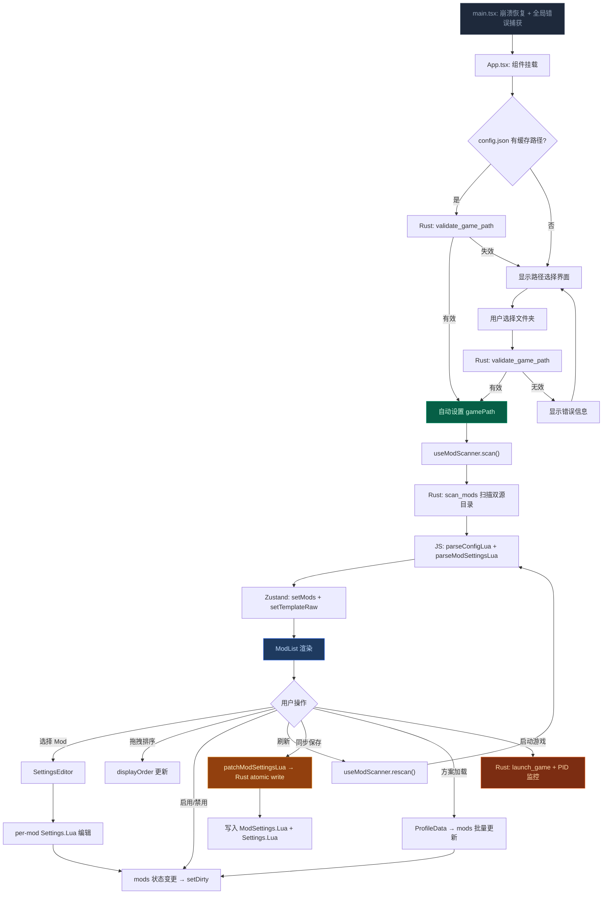
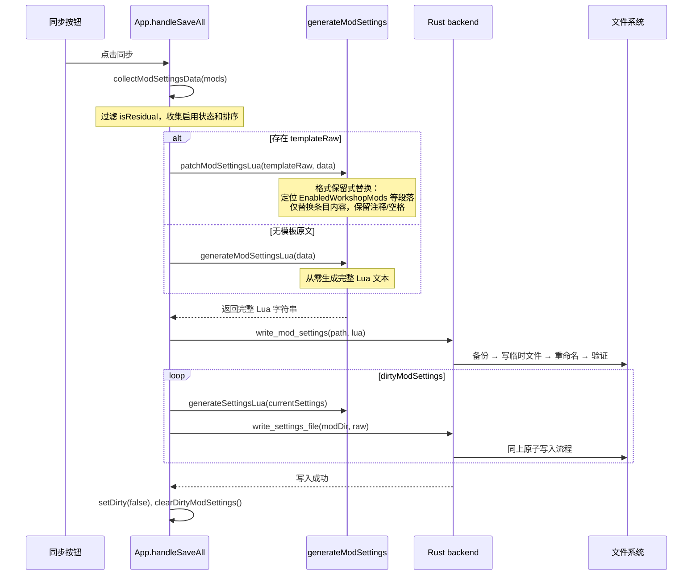

本文档以时间线视角完整覆盖应用从启动到 Mod 管理的全部生命周期，包括启动初始化、游戏路径验证、Mod 扫描解析、列表交互、设置编辑、方案加载与保存同步六大阶段。每个阶段均标注前后端协作方式与关键数据流。

## 流程全景

上图涵盖了从 `main.tsx` 入口到 `ModList` 渲染后所有用户交互路径的完整分支。下面按阶段逐一展开。

## 第一阶段：应用入口与崩溃恢复

应用入口 `main.tsx` 承担三项启动前置任务。首先是崩溃日志恢复：调用 `flushCrashBackup()` 检查上一次会话是否异常退出，若有则从 Ring Buffer 中将崩溃前日志写入磁盘。其次是全局未捕获异常注册：`window.onerror` 和 `window.onunhandledrejection` 将 JS 级别的未处理错误通过 Logger 桥接到 Rust tracing 子系统。最后以 `<ErrorBoundary>` 包裹 `<App />` 渲染整个 React 树，确保任何组件树内的渲染异常不会导致白屏。

Sources: [main.tsx](src/main.tsx#L1-L34)

## 第二阶段：启动时路径自动恢复

`App` 组件挂载后立即进入 `configLoaded` 状态机。首先调用 Rust 命令 `load_config` 读取 `{data_dir}/TWModLauncher/config.json`，若其中包含 `gamePath` 字段，则调用 `validateGamePath` 进行二次验证——Rust 端会检查目录是否存在、是否可读、是否包含 `The Scroll of Taiwu.exe`。验证通过则自动设置路径（`pathSource = "auto"`）并触发后续扫描；验证失败则显示提示信息并回退到手动选择界面。这个 `useEffect` 仅在组件挂载时执行一次。

`configLoaded` 置为 `true` 后，另一个 `useEffect` 监听 `gamePath` 变化：每当路径变更且已完成初始加载，自动调用 `saveConfig` 将新路径持久化到 `config.json`。Rust 端的 `save_config` 采用 JSON 验证 → 临时文件写入 → 重命名的原子写入策略。

Sources: [App.tsx](src/App.tsx#L64-L83), [config.rs](src-tauri/src/commands/config.rs#L1-L33), [game_path.rs](src-tauri/src/commands/game_path.rs#L13-L43)

## 第三阶段：手动路径选择与错误分类

当无缓存路径或缓存失效时，UI 展示欢迎界面与「选择游戏目录」按钮。点击触发 Tauri `dialog.open()` 目录选择器（标题固定为"选择《太吾绘卷》游戏根目录"），选择后调用 `validateGamePath`。前端根据 Rust 返回的**语义化错误码**进行中文提示分类：

| Rust 错误码 | 触发条件 | 前端提示 |
|---|---|---|
| `PERMISSION_DENIED` | 目录无读取权限 | "所选目录无读取权限，请选择其他目录或检查权限设置" |
| `PATH_NOT_FOUND` | 路径不存在 | "所选目录不可用，可能磁盘已断开或目录已删除" |
| `NOT_A_DIRECTORY` | 路径不是目录 | "所选路径不是有效的目录" |
| 其他异常 | 未知 I/O 错误 | "验证失败: {msg}" |

验证成功则将 `pathSource` 标记为 `"manual"`，路径写入 AppStore 后自动触发第三阶段中的扫描流程。

重新选择路径时，App 会先检查 `isDirty` 状态：若有未保存更改，弹出确认对话框；确认后调用 `clearMods()` 清空 ModStore 并 `clearPath()` 重置 AppStore。

Sources: [App.tsx](src/App.tsx#L200-L240), [game_path.rs](src-tauri/src/commands/game_path.rs#L22-L36)

## 第四阶段：Mod 目录扫描（Rust → 前端双阶段解析）

这是整个流程中数据转换最密集的环节，分为 Rust 端 I/O 扫描和前端 Lua 解析两个阶段。

### 4.1 Rust 端：双源目录遍历

`scan_mods` 命令以游戏根目录为起点，推导出三个关键路径：

- **Workshop 目录**：`{steamapps}/workshop/content/838350/`（通过 `game.parent().parent()` 向上两级推算）
- **本地 Mod 目录**：`{game_path}/Mod/`
- **ModSettings.Lua**：`{game_path}/SaveGames/ModSettings.Lua`

对每个子目录（`source=1` 为 Workshop，`source=0` 为本地），Rust 端读取：
1. `Config.lua` → 原始文本（可能为空）
2. `Settings.Lua` → 原始文本（可能为空）
3. 封面图片：先尝试 `Cover.jpg` / `Cover.png`，再回退到目录中首个匹配图像扩展名的文件，读取后转为 Base64 Data URL
4. 目录修改时间：`fs::metadata().modified()` 转为 Unix 时间戳字符串

权限问题（`PermissionDenied`）会产生非致命警告；如果两个目录均为权限错误且条目数为零，则直接返回错误。ModSettings.Lua 存在但读取失败时也会添加警告。

Sources: [mod_scanner.rs](src-tauri/src/commands/mod_scanner.rs#L1-L216)

### 4.2 前端：Lua AST 解析与 ModInfo 构建

`useModScanner.scan()` 接收 Rust 返回的 `ScanResult`，依次执行：

1. **解析 ModSettings.Lua**：`parseModSettingsSafe()` 使用 `luaparse` 解析，提取 `EnabledWorkshopMods`、`EnabledLocalMods` 和 `ModOrder`。解析失败时回退到空数组/空对象，并标记 `msParseFailed = true`

2. **逐条目解析 Config.lua**：`parseConfigLua()` 使用 `luaparse.parse()` 生成 AST，定位 `ReturnStatement` 中的 `TableConstructorExpression`，递归提取所有字段。对于 `DefaultSettings` 数组，解析出 `settingType`（Toggle/Slider/Dropdown）、`key`、`displayName` 等设置项定义。解析异常标记 `parseError = true`

3. **解析 Settings.Lua**：`parseSettingsLua()` 对每个 Mod 的当前设置值进行 AST 提取，未设置时回退到 `defaultValue`

4. **构建 ModInfo**：将 `source_fileId` 拼接为唯一键，判定启用状态（Workshop 源匹配 `enabledWorkshopMods`，本地源匹配 `enabledLocalMods`），标记 `isResidual`（Config.lua 缺失或为空），通过 `resolveTagName` 进行标签中英文映射

`scan` 完成后自动调用 `setTemplateRaw` 将 ModSettings.Lua 原文存入 AppStore——这是后续保存时进行**格式保留式补丁**的关键依据。

Sources: [useModScanner.ts](src/hooks/useModScanner.ts#L1-L233), [luaParser.ts](src/lib/luaParser.ts#L1-L200), [tagMapping.ts](src/utils/tagMapping.ts)

## 第五阶段：Mod 列表渲染与交互

当 `gamePath` 非空时，主界面渲染 `<ModList>` 组件。ModList 内部使用 `buildRenderItems` 算法将 `mods` 数组与 `displayOrder`（由 `order` 字段排序）、`ModGroup` 分组信息融合为渲染项列表。每条渲染项对应一个 Mod 卡片或分组头部。

用户可在此阶段执行以下核心操作：

- **启用/禁用 Mod**：`toggleMod(fileId, enabled)` 直接修改 ModStore 中的 `enabled` 字段，同时将 `isDirty` 标记为 `true`
- **拖拽排序**：三套独立的拖拽系统——卡片拖拽（调整 displayOrder）、分组头部拖拽（调整 groupOrder）、分组创建拖拽（将卡片拖入分组区域）
- **筛选搜索**：Fuse.js 模糊搜索 + 分类/标签/启用状态多条件过滤，筛选状态自动持久化到 localStorage
- **选中 Mod**：点击卡片触发 `handleSelectMod(key)`，若当前有未保存更改会先触发自动保存，然后设置 `selectedModKey`

Sources: [App.tsx](src/App.tsx#L560-L599), [useModStore.ts](src/store/useModStore.ts#L50-L55)

## 第六阶段：Mod 设置编辑

当 `selectedModKey` 非空时，ModList 被隐藏，`<SettingsEditor>` 全屏覆盖。SettingsEditor 根据 Mod 的 `settingGroups` 进行分组导航，为每个 `ModSettingDef` 渲染对应的表单控件：

- **Toggle**：开关按钮
- **Slider**：带最小/最大/步长的数值滑块
- **Dropdown**：选项下拉菜单

编辑过程中通过 `onSettingsSaved` 回调将新的设置值写回 ModStore（`updateModSettings`），同时将 Mod key 加入 `dirtyModSettings` 数组并标记 `isDirty`。这种即时脏状态跟踪确保跨 Mod 切换时不会丢失未保存变更。

关闭编辑器时调用 `selectMod(null)`，回到 ModList 视图。所有视图切换采用 CSS `hidden` 而非条件卸载，以保留滚动位置和组件状态。

Sources: [App.tsx](src/App.tsx#L580-L599), [useModStore.ts](src/store/useModStore.ts#L63-L68), [useAppStore.ts](src/store/useAppStore.ts#L95-L99)

## 第七阶段：同步保存

点击「同步」按钮触发 `handleSaveAll`，这是从内存状态到磁盘文件的最终持久化流程：

保存策略的核心是**格式保留式补丁**（`patchModSettingsLua`）：当 Rust 扫描阶段返回的 ModSettings.Lua 原文（`templateRaw`）非空时，不会重新生成整个文件，而是通过正则匹配定位 `EnabledWorkshopMods`、`EnabledLocalMods`、`ModOrder` 三个段落，仅替换花括号内的条目列表，完整保留注释、空行和文件末尾的任何非标准内容。这避免了覆盖用户手动添加的注释或其他工具生成的额外字段。

如果原文为空（首次启动或文件不存在），则回退到 `generateModSettingsLua` 从零生成。两者在生成后均通过 `luaparse.parse()` 做语法校验。

Rust 端的写入统一采用**原子写入策略**：先备份（`.Lua.bak`），再写入临时文件（`.tmp`），然后重命名为目标文件，最后读取验证内容一致性。

Sources: [App.tsx](src/App.tsx#L310-L365), [generateModSettings.ts](src/utils/generateModSettings.ts#L1-L251), [mod_settings.rs](src-tauri/src/commands/mod_settings.rs#L1-L75)

## 第八阶段：增量刷新

「刷新」按钮调用 `useModScanner.rescan()`，其逻辑与全量扫描不同——它执行的是**增量合并**：

1. 重新调用 `scanMods` 获取当前磁盘状态
2. 重新解析 ModSettings.Lua（更新 `templateRaw`）
3. 将新扫描结果与现有 `mods` 做集合差运算：
   - **新增**：`freshMods` 中存在但 `existing` 中不存在的条目直接追加
   - **移除**：`existing` 中存在但 `freshMods` 中不存在的条目被过滤掉
   - **保留**：仍然存在的条目保留用户在内存中的修改（如 `currentSettings`），仅更新磁盘侧的 `enabled` 和 `order`
4. 若所有 Mod 消失（`removed > 0` 且 `mods.length === 0`），触发路径有效性二次验证

这种设计确保刷新不会丢失用户当前的设置编辑状态，同时能检测到新增和删除的 Mod。

Sources: [useModScanner.ts](src/hooks/useModScanner.ts#L141-L227)

## 第九阶段：方案加载

`ProfileManager` 组件提供方案的保存、加载、导入、导出功能。当用户加载一个方案（`ProfileData`）时，`handleProfileLoad` 执行批量状态更新：

1. 构建 `enabledSet`（Set）、`orderMap`、`settingsMap`（三张查找表）
2. 遍历所有 `mods`，根据方案数据覆盖 `enabled`、`order`、`currentSettings`
3. 若方案版本 ≥ 1，恢复 `groups` 和 `groupOrder`（分组信息），但清除 `anchorBefore`/`anchorAfter`——跨客户端迁移时卡片锚点无意义
4. 标记 `isDirty = true`，提示用户点击同步保存以将方案写入磁盘

方案加载不会自动执行保存——这是有意设计，让用户在确认方案内容后再决定是否持久化。

Sources: [App.tsx](src/App.tsx#L367-L399), [types.ts](src/lib/types.ts#L85-L124)

## 第十阶段：游戏启动与进程监控

工具栏根据 `gameRunning` 状态在「启动」与「停止」之间切换。两种启动方式：

| 启动方式 | Rust 命令 | 机制 |
|---|---|---|
| 本地启动 | `launch_game` | 直接 `Command::new(exe).current_dir(gamePath).spawn()` |
| Steam 启动 | `launch_game_steam` | `cmd /C start steam://rungameid/838350` |

本地启动后，Rust 端通过 `powershell Get-Process -Name '*Taiwu*'` 轮询发现 PID（最多重试 5 次，每次间隔 2 秒），获取后存储到 `GameProcess` 状态并启动后台监控线程——每 1.5 秒通过 `tasklist /FI "PID eq {pid}"` 检查进程存活，退出时发射 `game-exited` 事件。

Steam 启动则采用不同的监控策略：先等待 6 秒让 Steam 拉起游戏，然后轮询发现 PID（最多 12 次，每次 2 秒），发现后切换到同上 PID 监控模式。若 30 秒内未发现进程，发射 `game-launch-failed` 事件。

前端通过 `listen("game-exited")` 和 `listen("game-launch-failed")` 监听这些事件，更新 `gameRunning` 状态和错误提示。启动时也会调用 `checkGameRunning` 检测是否已有游戏进程在运行。

Sources: [App.tsx](src/App.tsx#L120-L180), [game_launcher.rs](src-tauri/src/commands/game_launcher.rs#L1-L251)

## 数据流汇总

下表列出主流程中所有 Tauri 命令及其数据流向：

| 命令 | 方向 | 触发时机 | 关键数据 |
|---|---|---|---|
| `load_config` | Rust → JS | 启动时 | `{ gamePath }` JSON |
| `save_config` | JS → Rust | gamePath 变更 | JSON 字符串 |
| `validate_game_path` | JS ↔ Rust | 路径选择 | 路径字符串 → `GamePathResult` |
| `scan_mods` | JS ↔ Rust | 路径确认 / 刷新 | gamePath → `ScanResult` |
| `write_mod_settings` | JS → Rust | 同步保存 | gamePath + Lua 字符串 |
| `write_settings_file` | JS → Rust | 同步保存（per-mod） | modDir + Lua 字符串 |
| `launch_game` | JS → Rust | 启动游戏 | gamePath |
| `launch_game_steam` | JS → Rust | Steam 启动 | 无参数 |
| `check_game_running` | Rust → JS | 启动时 | `bool` |
| `game-exited` 事件 | Rust → JS | 进程退出 | 无数据 |
| `game-launch-failed` 事件 | Rust → JS | 启动失败 | 错误信息字符串 |
| `list_profiles / load_profile / save_profile` | JS ↔ Rust | 方案管理 | JSON 数据 |

Sources: [tauriApi.ts](src/lib/tauriApi.ts#L1-L133), [lib.rs](src-tauri/src/lib.rs#L1-L55)

## 阅读指引

主流程文档覆盖了从启动到退出的完整生命周期。以下页面深入解析各环节的实现细节：

- 架构基础：[Tauri v2 双端架构：Rust 后端与 React 前端的职责划分](5-tauri-v2-shuang-duan-jia-gou-rust-hou-duan-yu-react-qian-duan-de-zhi-ze-hua-fen) 与 [Tauri 命令注册体系](6-tauri-ming-ling-zhu-ce-ti-xi-invoke_handler-yu-qian-hou-duan-tong-xin)
- 状态管理：[Zustand 双 Store 设计（AppStore 与 ModStore）](7-zhuang-tai-guan-li-zustand-shuang-store-she-ji-appstore-yu-modstore)
- 扫描解析：[Rust 端 Mod 目录扫描](8-rust-duan-mod-mu-lu-sao-miao-workshop-yu-ben-di-shuang-yuan-jie-gou)、[Lua 配置解析](9-lua-pei-zhi-jie-xi-luaparse-qu-dong-de-config-lua-modsettings-lua-settings-lua-jie-xi)、[useModScanner 钩子](11-usemodscanner-gou-zi-sao-miao-zeng-liang-shua-xin-yu-cuo-wu-hui-fu)
- 保存机制：[ModSettings.Lua 的格式保留式补丁](10-modsettings-lua-de-ge-shi-bao-liu-shi-bu-ding-patchmodsettingslua)、[原子写入策略](25-yuan-zi-xie-ru-ce-lue-lin-shi-wen-jian-zhong-ming-ming-xie-ru-yan-zheng-zi-dong-bei-fen)
- 进程管理：[游戏启动与进程监控](20-you-xi-qi-dong-yu-jin-cheng-jian-kong-pid-lun-xun-tauri-shi-jian-tui-song)、[强制终止双阶段策略](21-qiang-zhi-zhong-zhi-de-shuang-jie-duan-ce-lue-wm_close-you-ya-guan-bi-taskkill-qiang-sha)
- 方案系统：[Profile 数据结构](18-profile-shu-ju-jie-gou-ban-ben-hua-json-fang-an-yu-mod-que-shi-jian-ce)、[方案导入/导出](19-fang-an-dao-ru-dao-chu-wen-jian-ji-du-xie-yu-kua-huan-jing-qian-yi)