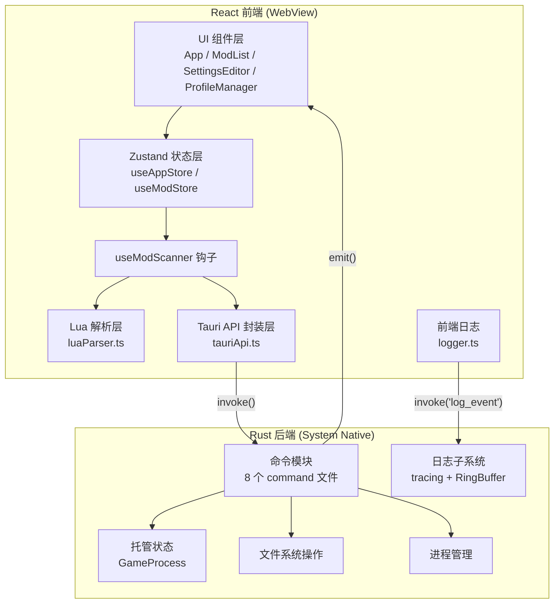
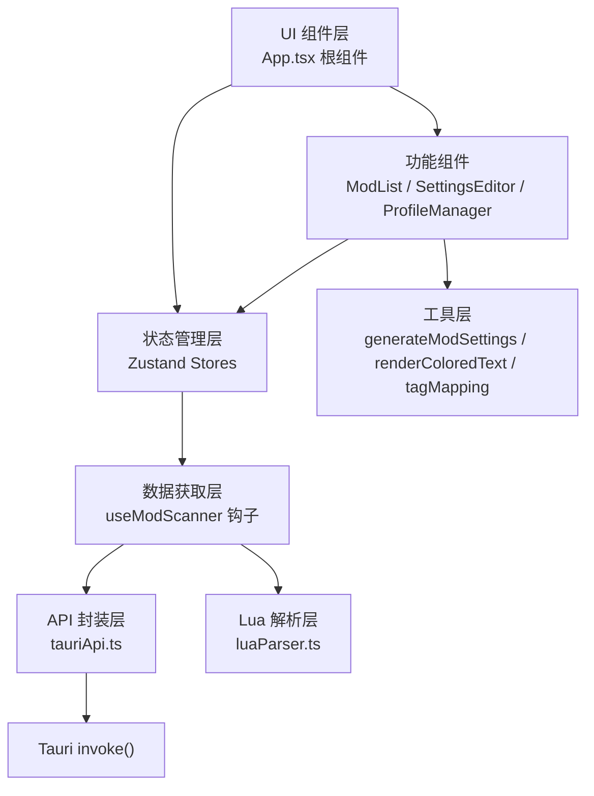
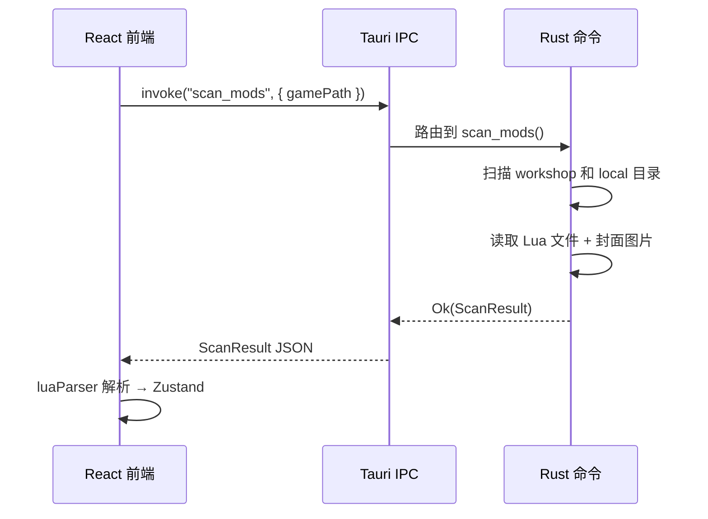

本文档从架构层面剖析 TWModLauncher 中 Rust 后端与 React 前端各自的职责边界、通信机制和数据流转路径，帮助开发者理解双端协作的全貌。

## 架构概览

TWModLauncher 采用 **Tauri v2** 框架构建，其核心架构由两层组成：**Rust 后端**负责与操作系统交互的系统级操作（文件 I/O、进程管理、目录扫描），**React 前端**负责用户界面渲染、Lua 配置解析和交互状态管理。两层之间通过 Tauri 的 **invoke/command** 机制进行 RPC 式通信，并通过 **event 系统**实现后端到前端的异步推送。



Sources: [lib.rs](src-tauri/src/lib.rs#L11-L55) | [App.tsx](src/App.tsx#L1-L26) | [tauriApi.ts](src/lib/tauriApi.ts#L1-L133)

## Rust 后端：系统能力的守护者

Rust 后端承担所有需要直接与操作系统交互的任务。它通过 `tauri::command` 属性宏将函数注册为可供前端调用的命令，所有命令在 `lib.rs` 的 `invoke_handler` 中统一注册。

### 命令模块体系

后端代码组织在 `src-tauri/src/commands/` 下，共 8 个模块，每个模块承担一组内聚的职责：

| 模块 | 文件 | 核心命令数 | 职责 |
|------|------|-----------|------|
| **mod_scanner** | [mod_scanner.rs](src-tauri/src/commands/mod_scanner.rs) | 1 | 扫描 workshop 和本地 Mod 目录，读取 Config.lua / Settings.Lua 原始文本，提取封面图片并 Base64 编码 |
| **mod_settings** | [mod_settings.rs](src-tauri/src/commands/mod_settings.rs) | 4 | 读取/写入 ModSettings.Lua 全局文件和单个 Mod 的 Settings.Lua，均采用原子写入 + 备份 + 验证 |
| **game_launcher** | [game_launcher.rs](src-tauri/src/commands/game_launcher.rs) | 5 | 启动游戏（本地 exe 或 Steam 协议）、进程 PID 监控、强制终止（双阶段策略） |
| **game_path** | [game_path.rs](src-tauri/src/commands/game_path.rs) | 2 | 验证用户选择的游戏目录合法性，区分权限不足/路径不存在/非目录等错误类型 |
| **profiles** | [profiles.rs](src-tauri/src/commands/profiles.rs) | 4 | 方案（Profile）的 CRUD 操作，JSON 文件存储于 `{app_data}/TWModLauncher/profiles/` |
| **config** | [config.rs](src-tauri/src/commands/config.rs) | 2 | 持久化应用配置（如缓存的游戏路径），原子写入 + JSON 验证 |
| **file_io** | [file_io.rs](src-tauri/src/commands/file_io.rs) | 3 | 通用文件读写和系统资源管理器打开（用于方案导入导出） |
| **logging** | [logging.rs](src-tauri/src/commands/logging.rs) | 2 | 接收前端日志事件并路由至 Rust tracing 子系统；打开日志目录 |

所有命令通过 `mod.rs` 的 `pub mod` 声明汇集，最终在 `lib.rs` 的 `tauri::generate_handler![]` 宏中统一注册。

Sources: [mod.rs](src-tauri/src/commands/mod.rs#L1-L9) | [lib.rs](src-tauri/src/commands/mod.rs#L26-L51)

### 托管状态：GameProcess

Rust 后端维护唯一的跨命令共享状态——`GameProcess` 结构体，通过 Tauri 的 `.manage()` 注入：

```rust
pub struct GameProcess {
    pub child: Mutex<Option<Child>>,
    pub pid: Mutex<Option<u32>>,
}
```

`child` 保存子进程句柄用于优雅终止，`pid` 保存进程 ID 用于 `tasklist` 轮询检测和 `taskkill` 强杀。两者均包裹在 `Mutex` 中以实现线程安全的跨命令访问。`GameProcess` 的初始值均为 `None`，在游戏成功启动后被填充，在进程终止或强杀后被重置。

Sources: [game_launcher.rs](src-tauri/src/commands/game_launcher.rs#L28-L32) | [lib.rs](src-tauri/src/lib.rs#L13-L16)

### 后端日志子系统

Rust 后端拥有一套独立的日志基础设施（详见 `logging.rs`），其核心是一个 **Ring Buffer 内存缓冲区**（128KB，约 300-500 行）。日志同时输出到 stderr 控制台和 ring buffer。当检测到首个 ERROR 级别事件或发生 panic 时，缓冲区内容自动转储到 `{app_data}/TWModLauncher/logs/crash-{timestamp}.log` 文件。这种设计确保崩溃前的上下文日志不会丢失，同时避免常态下产生大量日志文件。

Sources: [logging.rs](src-tauri/src/logging.rs#L1-L65)

### 关键设计模式：原子写入

多个命令模块（`mod_settings`、`config`、`profiles`）均采用相同的原子写入模式：先将内容写入 `.tmp` 临时文件，再通过 `rename` 原子性地替换目标文件。如果 rename 失败，清理临时文件，原始文件保持完整。`mod_settings` 模块进一步在写入后回读验证内容一致性，确保数据完整性。

Sources: [mod_settings.rs](src-tauri/src/commands/mod_settings.rs#L36-L48) | [config.rs](src-tauri/src/commands/config.rs#L22-L32)

## React 前端：用户界面与数据编排

React 前端运行在 Tauri 的 WebView 中，负责所有用户可见的交互逻辑，同时承担 Lua 配置解析这一计算密集型任务。

### 前端分层架构



Sources: [App.tsx](src/App.tsx#L1-L26) | [tauriApi.ts](src/lib/tauriApi.ts#L1-L133) | [useModScanner.ts](src/hooks/useModScanner.ts#L1-L16)

### API 封装层：tauriApi.ts

`tauriApi.ts` 是对 Tauri `invoke()` 的薄封装层，为每个 Rust 命令提供类型安全的 TypeScript 函数签名。每个函数都是一一对应一个 Rust 命令：

| 前端函数 | 对应 Rust 命令 | 参数 | 返回 |
|----------|---------------|------|------|
| `validateGamePath` | `validate_game_path` | `path: string` | `GamePathResult` |
| `scanMods` | `scan_mods` | `gamePath: string` | `ScanResult` |
| `writeModSettings` | `write_mod_settings` | `gamePath, raw` | `void` |
| `readSettingsFile` | `read_settings_file` | `modDir: string` | `string` |
| `writeSettingsFile` | `write_settings_file` | `modDir, raw` | `void` |
| `launchGame` | `launch_game` | `gamePath: string` | `void` |
| `launchGameSteam` | `launch_game_steam` | — | `void` |
| `checkGameRunning` | `check_game_running` | — | `boolean` |
| `killGame` | `kill_game` | — | `void` |
| `listProfiles` | `list_profiles` | — | `ProfileMeta[]` |
| `saveProfile` / `loadProfile` / `deleteProfile` | 对应命令 | `name, data` | 对应返回 |
| `writeFile` / `readFile` | 对应命令 | `path, content` | 对应返回 |
| `loadConfig` / `saveConfig` | 对应命令 | `data?` | 对应返回 |
| `openInExplorer` | `open_in_explorer` | `path: string` | `void` |
| `openSteamWorkshop` / `openWorkshopUrl` | 对应命令 | `fileId: number` | `void` |
| `openLogDir` | `open_log_dir` | — | `void` |

这种一一映射的设计使得前后端职责边界清晰：前端不需要知道 Rust 内部实现细节，只需调用类型安全的函数；Rust 命令也不需要了解前端状态管理。

Sources: [tauriApi.ts](src/lib/tauriApi.ts#L1-L133) | [lib.rs](src-tauri/src/lib.rs#L26-L51)

### 状态管理：双 Store 设计

前端采用 Zustand 管理全局状态，核心划分为两个 Store：

**useAppStore** 管理应用级状态——游戏路径、脏状态标记、虚拟分组（ModGroup）、模板原始文本（ModSettings.Lua 的原始内容，用于格式保留式补丁）。脏状态细分为两个维度：`isDirty` 标记全局启用状态的变更，`dirtyModSettings` 数组跟踪具体哪些 Mod 的 Settings.Lua 有未保存变更。

**useModStore** 管理 Mod 数据——解析后的 `ModInfo[]` 列表、扫描状态、当前选中的 Mod（用于设置编辑）、以及多选状态（`selectedModKeys`、`lastClickedKey` 配合 Shift 范围选择）。

Sources: [useAppStore.ts](src/store/useAppStore.ts#L1-L118) | [useModStore.ts](src/store/useModStore.ts#L1-L110)

### Lua 解析：前端承担的计算核心

Lua 配置文件的解析被完全放在前端执行。Rust 后端只负责读取文件的原始文本，不做任何解析。前端使用 `luaparse` 库对 Config.lua、ModSettings.Lua 和 Settings.Lua 进行 AST 级别的解析：

- **parseConfigLua**：解析单个 Mod 的 Config.lua，提取元数据（标题、作者、版本、标签）和设置定义（Toggle/Slider/Dropdown）
- **parseModSettingsLua**：解析全局 ModSettings.Lua，提取启用状态列表和加载顺序映射
- **parseSettingsLua**：解析单个 Mod 的 Settings.Lua，提取当前设置值

这种设计将解析复杂度隔离在前端，Rust 后端保持"只做文件读写"的简单职责。当需要在反向操作（保存）中生成 Lua 代码时，同样由前端的 `generateModSettings.ts` 工具模块完成。

Sources: [luaParser.ts](src/lib/luaParser.ts#L1-L80) | [mod_scanner.rs](src-tauri/src/commands/mod_scanner.rs#L154-L216)

### useModScanner：扫描编排中心

`useModScanner` 钩子是前端数据流的编排枢纽。它封装了"调用 Rust 扫描 → 解析 Lua → 注入 Zustand"的完整流程：

1. 调用 `scanMods(gamePath)` 获取原始数据
2. 调用 `parseModSettingsSafe` 解析全局 ModSettings.Lua
3. 调用 `parseScanResult` 遍历每个条目，分别解析 Config.lua 和 Settings.Lua
4. 将解析后的 `ModInfo[]` 写入 `useModStore`
5. 将 ModSettings.Lua 原始文本写入 `useAppStore.templateRaw`（供后续格式保留式补丁使用）
6. 返回 `ScanMeta` 摘要供 UI 显示

`rescan` 方法在此基础上增加了增量合并逻辑：对比新旧 Mod 列表，保留已存在 Mod 的用户修改状态，仅替换启用状态和加载顺序，然后合并新增条目并移除已删除条目。

Sources: [useModScanner.ts](src/hooks/useModScanner.ts#L114-L233)

## 通信机制：invoke 与 event 双向通道

Tauri v2 提供了两条通信通道，本项目同时使用：

### 前端 → 后端：invoke（请求-响应）

所有前端发起的操作都通过 `invoke("command_name", { params })` 调用。这是同步语义的异步调用——前端 `await` 等待 Rust 命令返回 `Result<T, String>`。Rust 端的错误通过 `Err(String)` 返回，前端捕获后展示给用户。



Sources: [tauriApi.ts](src/lib/tauriApi.ts#L18-L20) | [mod_scanner.rs](src-tauri/src/commands/mod_scanner.rs#L156-L215)

### 后端 → 前端：emit（事件推送）

当 Rust 后端需要主动通知前端状态变化时（如游戏进程退出），使用 Tauri 的 event 系统。`app_handle.emit("event_name", payload)` 从 Rust 端推送事件，前端通过 `listen("event_name", callback)` 订阅。

本项目中的关键事件：

| 事件名 | 触发时机 | Payload |
|--------|---------|---------|
| `game-exited` | PID 监控线程检测到游戏进程退出（每 1.5 秒轮询 `tasklist`） | `()` |
| `game-launch-failed` | Steam 启动超时（等待 30 秒后仍未检测到游戏 PID） | `string` 错误信息 |

前端在 `App.tsx` 的 `useEffect` 中订阅这些事件，当收到 `game-exited` 时将 UI 中的 `gameRunning` 状态设为 `false`，按钮从"游戏运行中"恢复为"启动游戏"。

Sources: [game_launcher.rs](src-tauri/src/commands/game_launcher.rs#L57-L63) | [App.tsx](src/App.tsx#L103-L114)

## 前后端日志统一管线

前端日志通过 `logger.ts` 中的 `log_event` 命令桥接到 Rust 的 tracing 子系统。每次前端调用 `logger.error("msg")` 时，会同时做两件事：

1. **Fire-and-forget invoke**：将日志事件发送到 Rust 后端的 `log_event` 命令，后者调用 `log::error!` 宏，经由 tracing subscriber 写入 ring buffer 和 stderr
2. **Crash backup**：ERROR 级别的日志额外保存到 `sessionStorage`，若 WebView 在 invoke 返回前崩溃，下次启动时可通过 `flushCrashBackup()` 恢复这些日志

这种双保险设计确保即使前端崩溃，关键的错误日志也不会丢失。

Sources: [logger.ts](src/lib/logger.ts#L1-L92) | [logging.rs](src-tauri/src/commands/logging.rs#L1-L7)

## 职责边界总结

下面以表格形式总结前后端的职责划分：

| 职责域 | Rust 后端 | React 前端 | 边界说明 |
|--------|----------|-----------|---------|
| **文件系统访问** | ✅ 全部 | ❌ | 前端只能通过 Rust 命令间接读写文件 |
| **Mod 目录扫描** | ✅ 遍历目录、读取原始文本、Base64 编码封面 | ❌ | 前端接收 `ScanResult` 后自行解析 |
| **Lua 解析** | ❌ | ✅ luaparse 库 | 解析复杂度留前端，后端保持简单 |
| **Lua 生成** | ❌ | ✅ generateModSettings.ts | 格式保留式补丁由前端实现 |
| **游戏进程管理** | ✅ spawn/kill/monitor | ❌ | 前端只触发启动/终止，实际由 Rust 执行 |
| **PID 监控** | ✅ 后台线程轮询 | ❌ | 退出检测通过 event 推送给前端 |
| **UI 状态管理** | ❌ | ✅ Zustand | Rust 无界面概念 |
| **用户交互** | ❌ | ✅ React 组件 | 表单、拖拽、筛选均在 WebView 中 |
| **系统对话框** | ✅ tauri-plugin-dialog | 通过 `@tauri-apps/plugin-dialog` 调用 | 前端调 API，Rust 执行 |
| **应用配置持久化** | ✅ JSON 读写 + 原子写入 | 前端决定何时读/写 | 协作完成 |
| **日志基础设施** | ✅ tracing + RingBuffer | ✅ logger.ts 桥接 | 前端日志最终汇入 Rust 管线 |

Sources: [lib.rs](src-tauri/src/lib.rs#L1-L55) | [App.tsx](src/App.tsx#L1-L26) | [tauriApi.ts](src/lib/tauriApi.ts#L1-L133)

## 阅读建议

本文档提供了双端架构的宏观视图。若要深入理解各子系统，建议按以下顺序阅读：

- **[Tauri 命令注册体系](6-tauri-ming-ling-zhu-ce-ti-xi-invoke_handler-yu-qian-hou-duan-tong-xin)**：了解 invoke_handler 的注册机制和命令路由细节
- **[状态管理：Zustand 双 Store 设计](7-zhuang-tai-guan-li-zustand-shuang-store-she-ji-appstore-yu-modstore)**：深入理解 AppStore 与 ModStore 的数据结构和状态流转
- **[Rust 端 Mod 目录扫描](8-rust-duan-mod-mu-lu-sao-miao-workshop-yu-ben-di-shuang-yuan-jie-gou)**：理解 workshop 与本地双源扫描的目录推导逻辑
- **[前后端统一日志管线](22-qian-hou-duan-tong-ri-zhi-guan-xian-qian-duan-ri-zhi-qiao-jie-zhi-rust-tracing-zi-xi-tong)**：理解日志从 WebView 到磁盘的完整路径