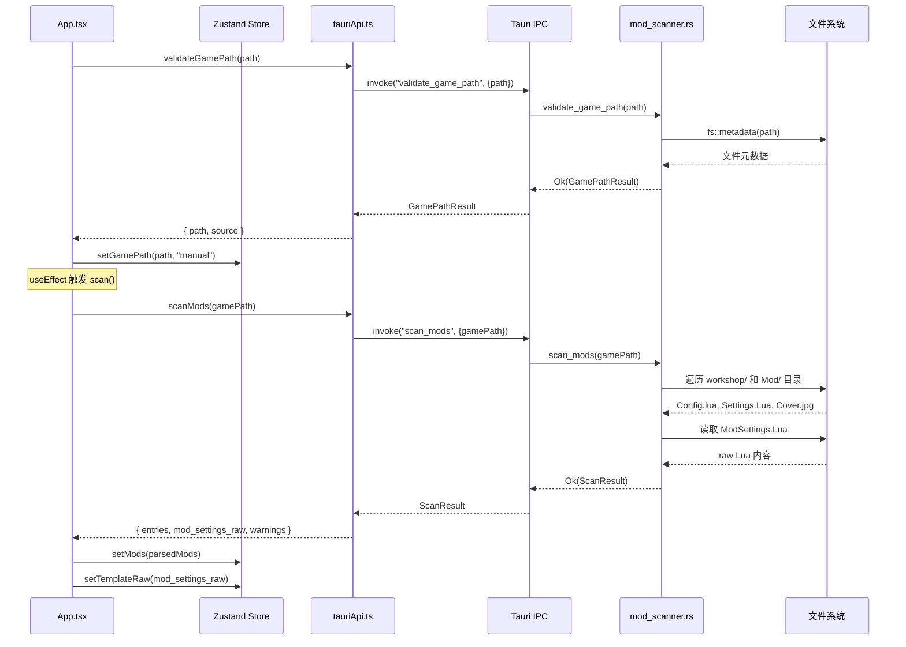

本文深入解析 TWModLauncher 中 Tauri v2 的命令注册与分发机制——从 Rust 后端的 `#[tauri::command]` 宏标注、`generate_handler![]` 集中注册，到前端 `invoke()` 调用的完整通信链路。同时涵盖托管状态（Managed State）的依赖注入、事件推送（Event Emit）的逆向通知，以及类型安全的错误传播模式。

## 整体架构

Tauri v2 基于 IPC（进程间通信）连接 Rust 后端与 WebView 前端。后端将函数标注为 `#[tauri::command]` 后，通过 `generate_handler![]` 宏一次性注册到 Tauri Builder 中；前端使用 `@tauri-apps/api/core` 的 `invoke()` 函数按命令名调用。这一体系的核心特征在于：**命令函数签名决定了参数反序列化方式**——Tauri 在运行时自动将前端传来的 JSON 参数映射到 Rust 函数的具名参数，返回值也会自动序列化为 JSON 回传前端。

```mermaid
graph TD
    subgraph "Rust 后端 (src-tauri/src)"
        MAIN["main.rs / lib.rs<br/>tauri::Builder"]
        GH["generate_handler![]<br/>24 条命令集中注册"]
        MANAGE[".manage()<br/>托管状态注入"]
        C1["commands/game_path.rs<br/>2 条命令"]
        C2["commands/mod_scanner.rs<br/>1 条命令"]
        C3["commands/mod_settings.rs<br/>4 条命令"]
        C4["commands/game_launcher.rs<br/>6 条命令"]
        C5["commands/profiles.rs<br/>4 条命令"]
        C6["commands/file_io.rs<br/>3 条命令"]
        C7["commands/config.rs<br/>2 条命令"]
        C8["commands/logging.rs<br/>2 条命令"]
        GS["GameProcess<br/>Mutex&lt;Option&lt;Child&gt;&gt;<br/>Mutex&lt;Option&lt;u32&gt;&gt;"]

        MAIN --> GH
        MAIN --> MANAGE
        MANAGE --> GS
        GH --> C1
        GH --> C2
        GH --> C3
        GH --> C4
        GH --> C5
        GH --> C6
        GH --> C7
        GH --> C8
        C4 -.->|State 注入| GS
    end

    subgraph "TypeScript 前端 (src/lib)"
        API["tauriApi.ts<br/>24 个类型安全包装函数"]
        LOG["logger.ts<br/>log_event 桥接"]
        INVOKE["invoke() from @tauri-apps/api/core"]
    end

    subgraph "Tauri IPC 层"
        IPC{{"JSON 序列化 / 反序列化<br/>基于命令名路由"}}
    end

    C1 --> IPC
    C2 --> IPC
    C3 --> IPC
    C4 --> IPC
    C5 --> IPC
    C6 --> IPC
    C7 --> IPC
    C8 --> IPC
    IPC --> INVOKE
    INVOKE --> API
    INVOKE --> LOG

    C4 -.->|"emit(\"game-exited\")<br/>事件逆向推送"| IPC
    IPC -.->|"listen()"| FRONT["App.tsx<br/>事件监听"]
```

Sources: [lib.rs](src-tauri/src/lib.rs#L1-L55), [tauriApi.ts](src/lib/tauriApi.ts#L1-L133)

## 命令注册机制：generate_handler![] 宏

Tauri v2 要求所有命令在 `Builder` 构建阶段显式声明。本项目将所有 24 条命令以**模块前缀路径**的形式聚合在 `generate_handler![]` 宏中，形成扁平的命令表。宏在编译期生成路由代码，将每个函数名（snake_case）映射为前端可调用的命令名。

```rust
.invoke_handler(tauri::generate_handler![
    commands::game_path::validate_game_path,
    commands::game_path::get_app_data_dir,
    commands::mod_scanner::scan_mods,
    commands::mod_settings::read_mod_settings,
    commands::mod_settings::write_mod_settings,
    commands::mod_settings::read_settings_file,
    commands::mod_settings::write_settings_file,
    commands::game_launcher::launch_game,
    commands::game_launcher::launch_game_steam,
    commands::game_launcher::check_game_running,
    commands::game_launcher::kill_game,
    commands::game_launcher::open_steam_workshop,
    commands::game_launcher::open_workshop_url,
    commands::profiles::list_profiles,
    commands::profiles::save_profile,
    commands::profiles::load_profile,
    commands::profiles::delete_profile,
    commands::file_io::write_file,
    commands::file_io::read_file,
    commands::config::load_config,
    commands::config::save_config,
    commands::file_io::open_in_explorer,
    commands::logging::log_event,
    commands::logging::open_log_dir,
])
```

Sources: [lib.rs](src-tauri/src/lib.rs#L28-L52)

这 24 条命令按功能域可划分为以下八个模块：

| 模块文件 | 命令数 | 职责域 |
|---|---|---|
| `commands/game_path.rs` | 2 | 游戏路径验证与应用数据目录 |
| `commands/mod_scanner.rs` | 1 | Workshop + 本地 Mod 目录扫描 |
| `commands/mod_settings.rs` | 4 | ModSettings.Lua 与 Settings.Lua 读写 |
| `commands/game_launcher.rs` | 6 | 游戏启动、进程监控、终止、Steam 集成 |
| `commands/profiles.rs` | 4 | 方案（Profile）CRUD |
| `commands/file_io.rs` | 3 | 通用文件读写与资源管理器打开 |
| `commands/config.rs` | 2 | 持久化配置 JSON 读写 |
| `commands/logging.rs` | 2 | 前端日志桥接与日志目录打开 |

模块通过 `commands/mod.rs` 声明为公共子模块，再由 `lib.rs` 的 `mod commands;` 引入。

Sources: [mod.rs](src-tauri/src/commands/mod.rs#L1-L9), [lib.rs](src-tauri/src/lib.rs#L1)

## `#[tauri::command]` 属性宏：签名决定行为

每个命令函数使用 `#[tauri::command]` 过程宏标注。Tauri 在编译期解析函数签名，自动推导参数来源和返回值的序列化策略。本项目中的命令遵循三种典型模式：

### 模式一：纯参数命令

前端参数按名称匹配 Rust 函数参数，Tauri 自动完成 JSON → Rust 类型的反序列化。返回值实现 `Serialize` 即可。

```rust
#[tauri::command]
pub fn validate_game_path(path: String) -> Result<GamePathResult, String> {
    // path 由前端 { path: "C:\\..." } 自动反序列化
    // 返回 Result<T, String>：Ok → 序列化为 JSON，Err → 前端 catch
}
```

所有简单参数命令（`scan_mods`、`write_mod_settings`、`save_profile` 等）均采用此模式。Tauri 支持 `String`、`bool`、数值等基础类型以及实现了 `Serialize` / `Deserialize` 的自定义结构体。

Sources: [game_path.rs](src-tauri/src/commands/game_path.rs#L12-L41), [mod_scanner.rs](src-tauri/src/commands/mod_scanner.rs#L163-L215)

### 模式二：托管状态注入（State 参数）

当命令需要访问跨请求的共享状态时，在函数签名中声明 `tauri::State<T>` 参数，Tauri 会自动从 `Builder` 的 `.manage()` 注入实例。

```rust
pub struct GameProcess {
    pub child: Mutex<Option<Child>>,
    pub pid: Mutex<Option<u32>>,
}

// 在 Builder 中注册
.manage(commands::game_launcher::GameProcess {
    child: Mutex::new(None),
    pid: Mutex::new(None),
})

// 命令中通过 State 访问
#[tauri::command]
pub fn launch_game(
    game_path: String,
    state: tauri::State<GameProcess>,  // ← 自动注入
    app_handle: tauri::AppHandle,
) -> Result<(), String> { ... }
```

`GameProcess` 使用 `Mutex<Option<T>>` 包装，因为 Tauri 在多线程环境中并发处理命令请求，必须通过锁保证线程安全。子进程句柄 (`Child`) 用于后续 `kill()` 操作，PID 用于进程存活检测。

Sources: [lib.rs](src-tauri/src/lib.rs#L17-L20), [game_launcher.rs](src-tauri/src/commands/game_launcher.rs#L28-L32)

### 模式三：AppHandle 注入与事件推送

`tauri::AppHandle` 是 Tauri 应用句柄，可在命令中注入以访问全局功能。本项目主要用于**事件推送**——后端主动向前端发送通知：

```rust
#[tauri::command]
pub fn launch_game(
    game_path: String,
    state: tauri::State<GameProcess>,
    app_handle: tauri::AppHandle,  // ← 注入句柄
) -> Result<(), String> {
    // ...启动游戏，获取 PID...
    start_pid_monitor(app_handle, pid);  // 传递句柄给监控线程
    Ok(())
}

fn start_pid_monitor(app_handle: tauri::AppHandle, pid: u32) {
    thread::spawn(move || loop {
        thread::sleep(Duration::from_millis(1500));
        if !pid_alive(pid) {
            let _ = app_handle.emit("game-exited", ());  // ← 事件推送
            break;
        }
    });
}
```

这里体现了前后端通信的双向性：**invoke 是前端→后端的请求/响应模式**，而 **emit 是后端→前端的事件推送模式**。两者互补——invoke 用于前端主动调用后端功能，emit 用于后端异步通知前端状态变化（如游戏进程退出）。

Sources: [game_launcher.rs](src-tauri/src/commands/game_launcher.rs#L59-L75), [game_launcher.rs](src-tauri/src/commands/game_launcher.rs#L103-L118)

## 前端调用层：tauriApi.ts 的类型安全封装

前端通过 `@tauri-apps/api/core` 的 `invoke()` 函数发起命令调用。本项目将所有调用集中封装在 `src/lib/tauriApi.ts` 中，形成 24 个类型安全的异步函数，每一条都严格对应后端的一条命令：

```typescript
import { invoke } from "@tauri-apps/api/core";
import type { GamePathResult, ScanResult, ProfileMeta } from "./types";

export async function validateGamePath(path: string): Promise<GamePathResult> {
  return invoke<GamePathResult>("validate_game_path", { path });
}

export async function scanMods(gamePath: string): Promise<ScanResult> {
  return invoke<ScanResult>("scan_mods", { gamePath });
}
```

这个封装层提供了三个关键价值：

1. **类型安全**：通过泛型 `invoke<T>()` 显式标注返回类型，与 `src/lib/types.ts` 中定义的 TypeScript 接口对齐，编译期即可捕获类型不匹配。
2. **参数命名一致性**：确保前端传入的参数名（如 `{ gamePath }`）与 Rust 端函数参数名完全一致，避免运行时反序列化失败。
3. **调用点隔离**：业务代码（App.tsx、useModScanner 等）只需导入 `tauriApi.ts` 的具名函数，无需直接接触 `invoke()` 和命令名字符串。

Sources: [tauriApi.ts](src/lib/tauriApi.ts#L1-L133), [types.ts](src/lib/types.ts#L1-L24)

### 特殊调用：logger.ts 的直接 invoke

日志桥接是唯一直接使用 `invoke()` 的场景。`logger.ts` 绕过 `tauriApi.ts` 封装，以**Fire-and-Forget** 模式调用 `log_event`——不等待返回值，不处理异常，避免日志写入阻塞 UI 线程：

```typescript
function send(level: LogLevel, target: string, message: string) {
  invoke("log_event", { level, target, message }).catch(() => {});
}
```

这种设计确保了日志系统的零性能影响：即使 Rust 后端因某种原因无法接收日志，前端也不会因此抛出未捕获异常。

Sources: [logger.ts](src/lib/logger.ts#L27-L30)

## 事件监听：后端推送的前端接收

对于后端通过 `app_handle.emit()` 推送的事件，前端使用 `@tauri-apps/api/event` 的 `listen()` 进行订阅。本项目在 `App.tsx` 中注册两个事件监听器：

```typescript
const p = listen("game-exited", () => {
  setGameRunning(false);
});
const p2 = listen<string>("game-launch-failed", (event) => {
  setGameRunning(false);
  setLaunchError(event.payload);
});
```

`game-exited` 是无负载事件，由 PID 监控线程在检测到进程退出时触发。`game-launch-failed` 携带字符串负载，由 Steam 启动超时逻辑触发。两者均用于驱动前端 UI 状态更新（按钮状态、错误提示），实现了后端→前端的单向数据推送。

Sources: [App.tsx](src/lib/../App.tsx#L113-L126), [game_launcher.rs](src-tauri/src/commands/game_launcher.rs#L86-L99)

## 错误传播：Result<T, String> 统一模式

所有可能失败的命令统一返回 `Result<T, String>`，其中 `String` 作为错误消息。这种设计的优势在于：

- **简单可序列化**：`String` 天然实现 `Serialize`，无需定义复杂错误枚举。
- **前后端一致**：前端 `catch` 捕获的异常直接就是可读的错误消息字符串。
- **语义化错误码**：关键路径使用约定前缀（`PERMISSION_DENIED`、`PATH_NOT_FOUND`、`NOT_A_DIRECTORY`）作为错误消息，前端据此进行分支处理。

```typescript
// 前端根据错误消息内容做分支处理
try {
  const result = await validateGamePath(selected as string);
} catch (e) {
  const msg = String(e);
  if (msg.includes("PERMISSION_DENIED"))
    setError("所选目录无读取权限...");
  else if (msg.includes("PATH_NOT_FOUND"))
    setError("所选目录不可用...");
  else if (msg.includes("NOT_A_DIRECTORY"))
    setError("所选路径不是有效的目录...");
}
```

Sources: [game_path.rs](src-tauri/src/commands/game_path.rs#L19-L25), [App.tsx](src/lib/../App.tsx#L212-L222)

## 能力声明（Capabilities）

Tauri v2 引入了能力（Capabilities）系统来控制权限。本项目的 `src-tauri/capabilities/default.json` 声明了主窗口所需的最小权限集：

```json
{
  "identifier": "default",
  "windows": ["main"],
  "permissions": [
    "core:default",
    "dialog:default",
    "core:window:allow-destroy"
  ]
}
```

- **`core:default`** 包含 invoke 命令调用、事件监听等核心 IPC 功能的默认权限。
- **`dialog:default`** 启用 `tauri-plugin-dialog` 插件，为前端 `open()` 和 `ask()` 提供文件选择与确认对话框能力。
- **`core:window:allow-destroy`** 允许前端通过 `getCurrentWindow().destroy()` 程序化关闭窗口（用于未保存更改的确认退出流程）。

值得注意的是，`#[tauri::command]` 注册的命令**默认对所有声明了 `core:default` 的窗口开放**，无需为每条命令单独声明权限。Tauri v2 的命令权限模型是窗口级别的，而非命令级别的。

Sources: [default.json](src-tauri/capabilities/default.json#L1-L14)

## 完整通信序列：以"扫描 Mod"为例

以下时序图展示了从用户选择游戏路径到 Mod 列表渲染完成的全链路：



每一步 invoke 调用都是异步的（返回 Promise），前端通过 `await` 等待 Rust 端完成 I/O 密集型操作。整个序列中，Rust 端负责所有文件系统访问，前端仅处理解析后的结构化数据。

Sources: [App.tsx](src/lib/../App.tsx#L78-L110), [useModScanner.ts](src/hooks/useModScanner.ts#L120-L138), [mod_scanner.rs](src-tauri/src/commands/mod_scanner.rs#L163-L215)

## 阅读建议

- 要理解前端如何消费命令返回值并驱动 UI 更新，继续阅读 [状态管理：Zustand 双 Store 设计（AppStore 与 ModStore）](7-zhuang-tai-guan-li-zustand-shuang-store-she-ji-appstore-yu-modstore)。
- 要深入 `scan_mods` 命令的目录遍历与文件读取逻辑，继续阅读 [Rust 端 Mod 目录扫描：workshop 与本地双源结构](8-rust-duan-mod-mu-lu-sao-miao-workshop-yu-ben-di-shuang-yuan-jie-gou)。
- 要了解 `log_event` 命令桥接后的日志子系统全貌，继续阅读 [前后端统一日志管线：前端日志桥接至 Rust tracing 子系统](22-qian-hou-duan-tong-ri-zhi-guan-xian-qian-duan-ri-zhi-qiao-jie-zhi-rust-tracing-zi-xi-tong)。