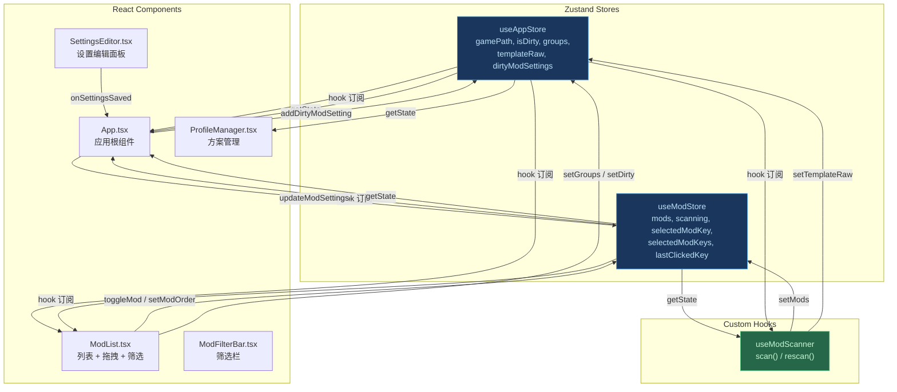
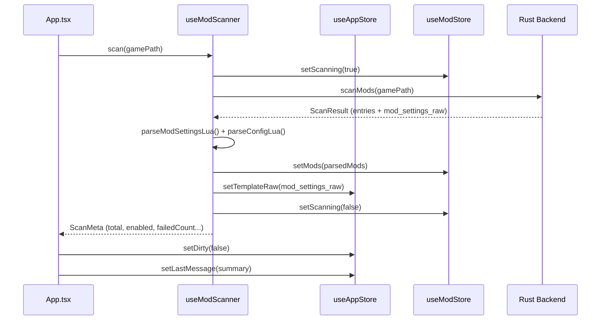

本文档剖析 TW Mod Launcher 前端的状态管理架构：以 Zustand 为核心的 **双 Store 设计**。通过将应用级状态与 Mod 领域状态解耦为 `useAppStore` 和 `useModStore`，实现了关注点分离、最小化不必要重渲染、以及**钩子订阅**与 **`getState()` 快照读取**两种访问模式的灵活组合。

## Store 职责边界

两个 Store 的分割遵循一条清晰的**领域边界**：`useAppStore` 管理"应用本身的运行环境与元状态"，`useModStore` 管理"Mod 实体集合及其交互状态"。下表汇总了各自的管辖范围：

| 维度 | useAppStore | useModStore |
|---|---|---|
| **核心实体** | 游戏路径、模板原始内容、虚拟分组 | Mod 列表（`ModInfo[]`）、扫描状态 |
| **脏状态追踪** | `isDirty`（全局）+ `dirtyModSettings`（按 Mod Key） | — |
| **选择状态** | — | `selectedModKey`（单选）+ `selectedModKeys`（多选） |
| **分组管理** | `groups: ModGroup[]` + `groupOrder: string[]` | — |
| **UI 过渡态** | `detecting`（路径检测中） | `scanning`（扫描进行中） |
| **消息/错误** | `error`、`lastMessage` | `error`（扫描级） |
| **初始化** | 从 localStorage 水合分组数据 | 空数组，由 `scan()` 注入 |

Sources: [useAppStore.ts](src/store/useAppStore.ts#L47-L81), [useModStore.ts](src/store/useModStore.ts#L4-L39)

这种分割并非随意而为——`useAppStore` 中的状态通常在应用生命周期内持续存在（如 gamePath、templateRaw 是跨会话的基础设施），而 `useModStore` 中的状态会随着扫描和刷新操作被整体替换或增量更新。

## 架构全景：Store 与消费者关系图

下面的 Mermaid 图展示了两个 Store 与核心消费组件之间的数据流向。箭头方向表示"读取/订阅"关系，红色虚线表示通过 `getState()` 的非响应式读取。



图中揭示了一个关键架构决策：**`useModScanner` 是唯一同时写入两个 Store 的模块**——它在扫描完成后调用 `useModStore.setMods()` 写入 Mod 列表，同时调用 `useAppStore.setTemplateRaw()` 缓存 ModSettings.Lua 原始内容。其余组件只读取或更新各自职责范围内的 Store 字段。

## useAppStore 深度解析

`useAppStore` 是整个应用的"应用上下文容器"，它回答以下问题：游戏在哪？当前是否有未保存变更？Mod 虚拟分组是什么样的？

### 初始化与水合策略

Store 创建时（模块加载阶段）即从 `localStorage` 中读取缓存的分组数据：

```typescript
const initialGroups = loadInitialGroups(); // 模块顶层执行

export const useAppStore = create<AppState>((set) => ({
    groups: initialGroups.groups,
    groupOrder: initialGroups.groupOrder,
    // ...
}));
```

`loadInitialGroups()` 执行了**两级去重**：首先在每组内部通过 `Set` 去重 `modKeys`，然后**跨组去重**——如果一个 modKey 出现在多个分组中，只保留在 `groupOrder` 中最早出现的那个分组里。这防止了因数据损坏或竞态导致的同一 Mod 出现在多个分组的异常状态。

Sources: [useAppStore.ts](src/store/useAppStore.ts#L4-L43)

### Updater 函数模式

`setGroups` 和 `setGroupOrder` 是两个支持 **updater 函数**的 setter——调用者可以传入新值，也可以传入 `(prev: T) => T` 函数来基于当前状态计算新值：

```typescript
setGroups: (groups) =>
    set((state) => ({
        groups: typeof groups === "function" ? groups(state.groups) : groups
    })),
```

这种模式使组件中的不可变更新变得简洁：`setGroups((prev) => prev.map(...))` 无需在组件侧通过 `useAppStore.getState().groups` 读取当前值即可完成基于旧状态的计算，消除了闭包过期（stale closure）的风险。

Sources: [useAppStore.ts](src/store/useAppStore.ts#L101-L102)

### 脏状态双重追踪

`useAppStore` 维护两个紧密协作的脏状态字段：

- **`isDirty: boolean`** — 全局脏标记，任何影响 `ModSettings.Lua` 的操作（启用/禁用 Mod、调整排序、修改设置）都应将其设为 `true`。在 `handleSaveAll` 成功后复位为 `false`。
- **`dirtyModSettings: string[]`** — 记录了哪些 Mod 的独立 `Settings.Lua` 文件有未保存变更。保存时遍历此列表，逐个写入各 Mod 目录下的 Settings.Lua，成功后将对应 key 从列表中移除。

这种双层设计是必要的，因为全局保存 (`writeModSettings` 写入 `ModSettings.Lua`) 和按 Mod 保存 (`writeSettingsFile` 写入各 Mod 的 `Settings.Lua`) 是两个独立的 I/O 操作，需要分开追踪。

Sources: [useAppStore.ts](src/store/useAppStore.ts#L65-L67), [App.tsx](src/App.tsx#L308-L339)

对于 `dirtyModSettings`，`addDirtyModSetting` 采用幂等插入（已存在则跳过），`removeDirtyModSettings` 批量移除成功条目——这种设计允许保存失败时在 UI 上保留脏标记，让用户知道哪些 Mod 的设置尚未持久化。

Sources: [useAppStore.ts](src/store/useAppStore.ts#L106-L116)

## useModStore 深度解析

`useModStore` 是 Mod 实体层的唯一数据源。它维护完整的 `ModInfo[]` 数组以及所有针对 Mod 的突变操作。

### 不可变更新模式

所有修改 `mods` 数组的操作都采用 **`map` + 浅比较** 的不可变更新策略。以 `toggleMod` 为例：

```typescript
toggleMod: (fileId: number, enabled: boolean) =>
    set((s) => ({
        mods: s.mods.map((m) =>
            m.fileId === fileId ? { ...m, enabled } : m
        ),
    })),
```

只有被匹配的 Mod 对象被浅拷贝替换，其余引用保持不变。这意味着下游使用 `useModStore((s) => s.mods)` 订阅整个数组的组件会触发重渲染，但使用选择器订阅特定 Mod 子字段的组件可以借助 React 的引用相等性跳过不必要的渲染——前提是选择器足够精确。

Sources: [useModStore.ts](src/store/useModStore.ts#L54-L59)

### Mod Key 约定

整个代码库中，Mod 的唯一标识采用 `"${source}_${fileId}"` 格式（如 `"1_123456789"` 表示 Workshop 来源的某个 Mod）。`source` 的取值为 `0`（本地）或 `1`（创意工坊），与 Rust 后端的 `ModSource` 枚举对应。这个 key 格式在以下场景中一致使用：

- `updateModSettings` 和 `setModOrder` 的内部匹配
- 虚拟分组 `ModGroup.modKeys` 的元素
- `displayOrder` 数组的元素
- `dirtyModSettings` 数组的元素
- Profile 数据中的 `enabledMods`、`modOrder` 和 `modSettings` key

Sources: [useModStore.ts](src/store/useModStore.ts#L60-L75), [types.ts](src/lib/types.ts#L78-L89)

### 多选状态机

`useModStore` 维护一个轻量的多选状态机，包含三个字段：

| 字段 | 类型 | 职责 |
|---|---|---|
| `selectedModKeys` | `string[]` | 当前选中的 Mod key 列表 |
| `lastClickedKey` | `string \| null` | Shift 范围选择的锚点 key |
| `selectedModKey` | `string \| null` | 单选/设置编辑的目标 Mod |

四个 action 覆盖了多选交互的全部场景：

- **`selectModOnly(key)`** — 清除所有选择，仅选中一个 Mod（单击卡片）
- **`toggleSelectMod(key)`** — 切换单个 Mod 的选中状态（Ctrl+单击）
- **`addModsToSelection(keys)`** — 批量添加 Mod 到选中集合（Shift 范围选择），使用 `Set` 去重
- **`clearSelection()`** — 清空所有多选状态

这些 action 被 `ModList.tsx` 中的点击处理器调用，配合 `lastClickedKey` 实现标准的文件管理器式多选交互。

Sources: [useModStore.ts](src/store/useModStore.ts#L80-L108)

## 两种访问模式：Hook 订阅 vs getState() 快照

这是 Zustand 双 Store 设计中最关键的架构模式——根据使用场景选择不同的状态读取方式：

### Hook 订阅（响应式）

```typescript
const gamePath = useAppStore((s) => s.gamePath);
const scanning = useModStore((s) => s.scanning);
```

组件通过选择器 hook 订阅 Store 中的特定字段。当且仅当选中的字段值发生浅比较变化时，组件才会重渲染。这是 React 的标准用法，适用于需要**实时反映状态变化**的 UI 渲染场景。`ModList.tsx` 中大量使用此模式订阅 `mods`、`scanning`、`groups` 等字段。

### getState() 快照（非响应式）

```typescript
const currentMods = useModStore.getState().mods;
const dirtyKeys = useAppStore.getState().dirtyModSettings;
```

`getState()` 返回当前 Store 的快照，**不会建立订阅关系**。它适用于以下场景：

1. **事件回调与异步函数内部**（如 `handleSaveAll`）——这些函数在触发时需要的只是那一刻的最新状态，不需要响应式更新
2. **`onCloseRequested` 等非 React 生命周期钩子**——在这些场景中没有组件上下文来使用 hook
3. **跨 Store 的条件读取**——在 `useModScanner.rescan()` 中读取 `useModStore.getState().mods` 来与新扫描结果做增量对比

最关键的是，`getState()` **不会触发重渲染**，因此在高频操作（如拖拽移动期间的坐标更新）或批处理循环中使用它是安全的。

Sources: [App.tsx](src/App.tsx#L307-L339) 中的 `handleSaveAll` 同时使用两种模式：hook 订阅 `gamePath` 和 `templateRaw`（响应式），内部通过 `getState()` 读取 `mods` 和 `dirtyModSettings`（快照式）

## 跨 Store 协作流程

### 扫描流程：双 Store 同时写入



`useModScanner` 是这个流程的指挥中心——它从 Rust 获取原始数据，解析为前端类型，然后**同时写入两个 Store**：`ModInfo[]` 进 `useModStore`，原始 Lua 模板字符串进 `useAppStore`。这种分离使得后续的保存操作（`handleSaveAll`）只需从 `useAppStore` 读取模板、从 `useModStore` 读取当前 `mods` 即可完成补丁生成，无需再次访问后端。

Sources: [useModScanner.ts](src/hooks/useModScanner.ts#L114-L146)

### 保存流程：跨 Store 聚合数据

`App.tsx` 中的 `handleSaveAll` 是跨 Store 协调的典范。它从 `useAppStore` 读取 `templateRaw`（通过 hook 订阅），从 `useModStore` 读取 `mods`（通过 `getState()`），调用 `collectModSettingsData` + `patchModSettingsLua` 生成最终的 Lua 内容写入磁盘，然后处理 `dirtyModSettings` 中每个 Mod 的独立 Settings.Lua 写入，最终分别更新两个 Store 中的脏标记。

Sources: [App.tsx](src/App.tsx#L306-L356)

### 方案加载流程：从 Profile 回灌双 Store

`handleProfileLoad` 展示了从持久化数据恢复应用状态的完整路径：

1. **Mod 层面**：遍历当前 `mods`，根据 Profile 中的 `enabledMods`、`modOrder`、`modSettings` 更新每个 Mod 的对应字段
2. **分组层面**：通过 `useAppStore.getState().setGroups()` 恢复虚拟分组，同时清除跨环境无意义的 `anchorBefore`/`anchorAfter`
3. **脏标记**：将所有恢复的设置项标记为"脏"，提示用户同步保存

这种跨 Store 恢复确保了 Profile 数据的完整性——它不仅仅是 Mod 启用状态的快照，还包含了用户的分组组织结构和每个 Mod 的微调设置。

Sources: [App.tsx](src/App.tsx#L358-L397)

## 设计原则总结

下表归纳了双 Store 设计背后的架构原则：

| 原则 | 实现方式 | 收益 |
|---|---|---|
| **单一职责** | AppStore 管应用环境，ModStore 管 Mod 实体 | 修改游戏路径不会触发 Mod 列表的重渲染链 |
| **最小订阅面** | 组件通过精确选择器只订阅需要的字段 | `ModFilterBar` 不关心 `mods` 变化，`ModCard` 不关心 `gamePath` 变化 |
| **读写分离** | Hook 订阅用于 UI 渲染，`getState()` 用于回调/命令 | 事件处理中的批量操作不会引发级联重渲染 |
| **初始化水合** | Store 创建时从 localStorage 恢复分组 | 应用启动即可显示上次的分组布局，无闪烁 |
| **immutable 更新** | 所有 mutation 通过 `set()` + 不可变模式 | Zustand 的浅比较机制能精确判断是否需要通知订阅者 |

这些原则共同确保了在 Mod 数量达到数百个时，UI 操作（拖拽排序、批量选择、筛选切换）依然保持流畅——因为只有真正受影响的组件子集才会被通知更新。

## 阅读建议

在理解双 Store 设计后，建议按以下顺序继续阅读：

1. [useModScanner 钩子：扫描、增量刷新与错误恢复](11-usemodscanner-gou-zi-sao-miao-zeng-liang-shua-xin-yu-cuo-wu-hui-fu) — 深入理解 `useModStore` 中 `mods` 数据的来源与增量合并策略
2. [渲染模型：displayOrder + ModGroup 驱动的 buildRenderItems 算法](12-xuan-ran-mo-xing-displayorder-modgroup-qu-dong-de-buildrenderitems-suan-fa) — 了解 `groups`/`groupOrder` 如何驱动最终的可视化渲染列表
3. [即时脏状态跟踪：跨 Mod 的未保存变更检测](17-ji-shi-zang-zhuang-tai-gen-zong-kua-mod-de-wei-bao-cun-bian-geng-jian-ce) — 深入 `isDirty` 与 `dirtyModSettings` 的协作机制
4. [筛选状态持久化：localStorage 缓存与启动恢复](15-shai-xuan-zhuang-tai-chi-jiu-hua-localstorage-huan-cun-yu-qi-dong-hui-fu) — 了解 Store 外部（localStorage）的辅助状态缓存策略