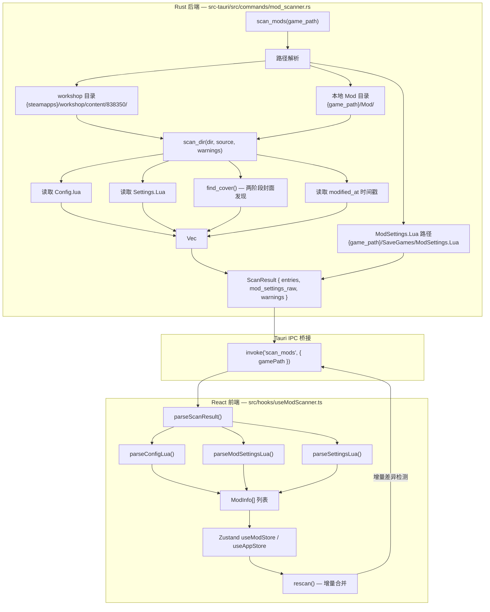
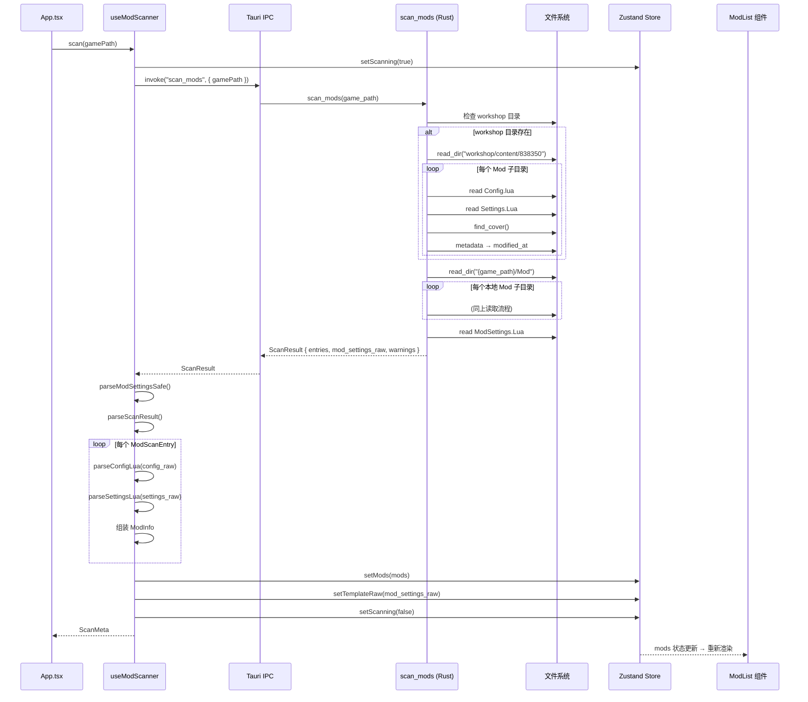

本文档深入剖析 `scan_mods` Tauri 命令的完整实现：从 Rust 端如何解析双源 Mod 目录（Steam Workshop 与本地安装）、递归提取每个 Mod 的原始 Lua 配置与封面图像，到前端 `useModScanner` 钩子如何消费扫描结果并执行增量刷新（rescan）的全链路数据流。

## 架构总览：Rust 扫描器 → 前端消费管线

整个扫描系统遵循"**Rust 负责 I/O 密集型目录遍历与文件读取，TypeScript 负责 Lua 解析与状态装配**"的职责划分。Rust 端暴露单一命令 `scan_mods` 作为入口，前端通过 `useModScanner` 钩子封装两次调用模式（全量 `scan` 与增量 `rescan`）。



## 数据结构：`ModScanEntry` 与 `ScanResult`

Rust 端定义了两种核心结构体，它们通过 `#[derive(Serialize)]` 被 Tauri 自动序列化为 JSON 传输至前端。前端在 `src/lib/types.ts` 中维护了对应的 TypeScript 接口，两者保持严格的结构镜像。

| 字段 | 类型 (Rust) | 类型 (TS) | 含义 |
|---|---|---|---|
| `file_id` | `String` | `string` | Mod 目录名，Steam Workshop 中为纯数字 ID，本地为任意目录名 |
| `source` | `u8` | `number` | `1` = Steam Workshop，`0` = 本地 |
| `dir_path` | `String` | `string` | Mod 目录的完整文件系统路径 |
| `cover_path` | `String` | `string` | 封面图像文件的完整路径（可能为空字符串） |
| `cover_data` | `String` | `string` | Base64 编码的 Data URL（如 `data:image/jpeg;base64,...`），用于前端 `` 直接渲染 |
| `config_raw` | `String` | `string` | `Config.lua` 文件的原始文本内容（读取失败时为空字符串） |
| `settings_raw` | `String` | `string` | `Settings.Lua` 文件的原始文本内容（读取失败时为空字符串） |
| `modified_at` | `String` | `string` | Mod 目录最后修改时间的 Unix 时间戳（秒），用于 UI 展示"更新于"信息 |

`ScanResult` 则包装了三个聚合字段：

| 字段 | 含义 |
|---|---|
| `entries: Vec<ModScanEntry>` | 两个源合并后的全部 Mod 条目 |
| `mod_settings_raw: String` | `ModSettings.Lua` 原始文本，作为前端 `patchModSettingsLua` 的格式模板 |
| `warnings: Vec<String>` | 非致命警告列表（权限问题、文件读取失败等） |

Sources: [mod_scanner.rs](src-tauri/src/commands/mod_scanner.rs#L8-L29), [types.ts](src/lib/types.ts#L12-L20)

## 双源目录路径解析

`scan_mods` 接收一个参数 `game_path`（游戏根目录绝对路径），然后**通过路径推算**而非用户配置来定位两个 Mod 源目录。这种设计消除了额外的配置步骤，用户只需选择游戏目录即可。

**Workshop 路径推导链**（以 Windows 典型安装为例）：

```
game_path = "C:\Program Files (x86)\Steam\steamapps\common\The Scroll Of Taiwu"
    → .parent() → "C:\Program Files (x86)\Steam\steamapps\common"
    → .parent() → "C:\Program Files (x86)\Steam\steamapps"
    → .join("workshop").join("content").join("838350")
    = "C:\Program Files (x86)\Steam\steamapps\workshop\content\838350"
```

这里的 `838350` 是《太吾绘卷》在 Steam 上的 App ID，硬编码在扫描逻辑中。如果 `game_path` 的父级结构不符合 Steam 标准目录布局，`steamapps` 变量将为 `None`，此时 workshop 扫描**静默跳过**——不会报错，仅不产生 workshop 条目。

**本地 Mod 路径**：简单拼接 `game_path.join("Mod")`，即 `{game_path}/Mod/`。

**ModSettings.Lua 路径**：`game_path.join("SaveGames").join("ModSettings.Lua")`。

这种路径推导假设了游戏的固定目录结构，是专门针对《太吾绘卷》的硬编码设计。

Sources: [mod_scanner.rs](src-tauri/src/commands/mod_scanner.rs#L163-L175)

## `scan_dir` 核心遍历逻辑

`scan_dir` 是扫描系统的工作马，它接收一个目录路径、一个 `source` 标识（1 或 0）和一个可变的 `warnings` 向量引用，返回 `Vec<ModScanEntry>`。

### 入口防御层

函数首先检查目录是否存在。若不存在，直接返回空 `Vec`——这是正常情况（例如未订阅任何 Workshop Mod 或未安装本地 Mod）。若存在但 `fs::read_dir` 失败：

- **`PermissionDenied`**：将人类可读的中文警告推入 `warnings` 向量，格式为 `"Mod 目录无读取权限: {路径}"`。这是唯一被分类记录的目录级错误。
- **其他 I/O 错误**（如路径不存在）：静默跳过，不产生任何输出。

Sources: [mod_scanner.rs](src-tauri/src/commands/mod_scanner.rs#L97-L116)

### 逐子目录处理

遍历目录中的每个条目时，严格遵循以下过滤规则：

1. **跳过非目录条目**：如果 `entry.path().is_dir()` 为 `false`，直接 `continue`。这意味着 Mod 目录根下的任何文件（如 `README.txt`）被忽略。
2. **跳过 I/O 错误条目**：单个条目的读取失败（如权限不足读取某个子目录）被静默跳过，不会中断整个扫描流程。
3. **目录名即 `file_id`**：使用 `path.file_name()` 作为 Mod 的唯一标识符。对于 Workshop Mod，这是 Steam 分配的数字 ID；对于本地 Mod，这是用户命名的目录名。

Sources: [mod_scanner.rs](src-tauri/src/commands/mod_scanner.rs#L118-L131)

### 文件读取策略

对每个 Mod 子目录，依次执行：

1. **读取 `Config.lua`**：调用 `fs::read_to_string(path.join("Config.lua"))`。如果文件存在但读取失败，记录警告 `"Config.lua 读取失败: {source}/{file_id}"`。**注意区分**：文件不存在（正常的新 Mod 或残留目录）不会触发警告——仅当文件存在于磁盘上但却无法读取时才记录。

2. **读取 `Settings.Lua`**：同样使用 `unwrap_or_default()`，但**不记录警告**——这与 Config.lua 的处理不对称，Settings.Lua 的读取失败被静默忽略。

3. **封面发现**：调用 `find_cover(&path)`（见下一节）。

4. **时间戳提取**：通过 `fs::metadata(&path)` → `.modified()` → `.duration_since(UNIX_EPOCH)` 获取目录最后修改时间，转换为 Unix 秒级时间戳字符串。

Sources: [mod_scanner.rs](src-tauri/src/commands/mod_scanner.rs#L133-L157)

## 封面图像发现：两阶段降级策略

`find_cover` 函数实现了优雅的降级发现策略，确保在大多数情况下都能为 Mod 卡片提供视觉预览。

**阶段一：约定俗成的文件名**。优先检查 `Cover.jpg` 和 `Cover.png`。这两个文件名是 Mod 社区的常见做法，命中率最高。返回结果是 `(cover_path, cover_data)` 元组——路径用于调试，Data URL 用于直接在 `` 标签中渲染。

**阶段二：首个匹配扩展名的文件**。如果阶段一未命中，遍历目录中的所有文件，返回第一个扩展名匹配 `COVER_EXTENSIONS` 列表（`jpg, jpeg, png, gif, webp, bmp`）的文件。

两个阶段均未命中时，返回空字符串对 `("", "")`。

Sources: [mod_scanner.rs](src-tauri/src/commands/mod_scanner.rs#L63-L92)

### `read_cover_as_data_url`：Base64 编码管线

此函数是封面数据传输的核心机制——不使用文件路径引用（Tauri 的 asset protocol 可能受限于权限），而是将图像文件**内联**为 Base64 Data URL：

1. 读取原始字节（失败则返回空字符串）
2. 根据扩展名推断 MIME 类型：`png` → `image/png`，`gif` → `image/gif`，`webp` → `image/webp`，`bmp` → `image/bmp`，其他默认 `image/jpeg`
3. 使用 `base64` crate（版本 0.22）的 `general_purpose::STANDARD` 编码器生成 Base64 字符串
4. 拼接为标准 Data URL 格式：`"data:{mime};base64,{encoded}"`

这种设计意味着**封面数据随扫描结果一次性传输完成**，前端无需额外的异步图像加载步骤。代价是 JSON 负载体积增大——对于较大（>1MB）的封面图像，这可能成为性能瓶颈，但实践中 Mod 封面通常不超过数百 KB。

Sources: [mod_scanner.rs](src-tauri/src/commands/mod_scanner.rs#L39-L61)

## 错误处理与边界条件

扫描器采用**分级错误处理**策略，区分致命错误与非致命警告：

| 场景 | 处理方式 | 对前端的影响 |
|---|---|---|
| workshop 目录不存在（非 Steam 安装） | `steamapps` 为 `None`，静默跳过 workshop 扫描 | 仅产生本地 Mod 条目 |
| 任一源目录无读取权限 | 记录 `warnings`，返回空 entries | 若两个源都权限不足且 entries 为空，返回 `Err` |
| 单个 Mod 子目录读取失败 | 静默 `continue` | 该 Mod 不出现在结果中 |
| Config.lua 存在但无法读取 | 记录 `warnings`，`config_raw` 为空 | 前端标记 `isResidual = true` |
| Config.lua 不存在 | 不记录警告，`config_raw` 为空 | 前端标记 `isResidual = true` |
| ModSettings.Lua 存在但无法读取 | 记录 `warnings`，`mod_settings_raw` 为空 | 前端无法获取启用状态基准 |
| ModSettings.Lua 不存在（首次启动） | 不记录警告，`mod_settings_raw` 为空 | 前端正常启动，启用状态全部初始化为 `false` |

最关键的防御性检查位于扫描流程末尾：

```rust
if entries.is_empty() && warnings.iter().any(|w| w.contains("无读取权限")) {
    return Err("权限不足，无法读取 Mod 目录".into());
}
```

这在两个源目录都存在且都因权限问题而返回零条目时，将整个扫描操作标记为**失败**（`Err` 而非 `Ok`），使前端能展示明确的权限错误提示，而非显示空列表误导用户。

Sources: [mod_scanner.rs](src-tauri/src/commands/mod_scanner.rs#L195-L200), [mod_scanner.rs](src-tauri/src/commands/mod_scanner.rs#L204-L208)

## 前端消费：`useModScanner` 钩子

前端通过 `useModScanner` 自定义钩子封装了对 `scan_mods` 的调用，暴露两个函数：

### `scan(gamePath)` — 全量扫描

这是应用启动或切换游戏路径时使用的一次性全量扫描。流程如下：

1. 设置 `scanning = true`，清空旧错误
2. 调用 `scanMods(gamePath)` → 获得 `ScanResult`
3. 调用 `parseModSettingsSafe(result.mod_settings_raw)` 解析 ModSettings.Lua 获取启用/排序基准
4. 调用 `parseScanResult(result, msParsed)` 逐条解析每个 Mod 的 Config.lua 和 Settings.Lua
5. 调用 `setMods(mods)` 全量替换 Zustand 中的 mod 列表
6. 调用 `setTemplateRaw(result.mod_settings_raw)` 缓存 ModSettings.Lua 模板，供后续 `patchModSettingsLua` 使用

Sources: [useModScanner.ts](src/hooks/useModScanner.ts#L121-L148)

### `rescan(gamePath)` — 增量刷新

这是用户在应用运行期间手动触发的刷新操作。与 `scan` 的全量替换不同，`rescan` 通过 **集合差集运算** 识别新增和移除的 Mod，保留现有 Mod 的状态（如用户手动调整的启用状态）：

1. 重新调用 `scanMods(gamePath)` 获取当前磁盘状态
2. 构建 `existingKeys`（当前 Store 中的 Mod 键集合）和 `freshKeys`（新扫描结果中的 Mod 键集合）
3. **新增**：`freshKeys - existingKeys` → 添加到列表
4. **移除**：`existingKeys - freshKeys` → 从列表中移除
5. **保留**：交集内的 Mod 保持原有状态，仅更新 `enabled` 和 `order`（这些来自 ModSettings.Lua，可能在外部被修改）
6. 更新 `templateRaw`，确保后续保存使用最新的 ModSettings.Lua 模板

这种增量策略避免了全量替换时的 UI 闪烁，同时正确响应外部文件系统变更。

Sources: [useModScanner.ts](src/hooks/useModScanner.ts#L152-L212)

### `parseScanResult` — Rust 条目 → `ModInfo` 的转换

此函数将 Rust 的 `ModScanEntry` 转换为前端可用的 `ModInfo` 对象。核心转换步骤：

- **`fileId` 去歧义**：Workshop Mod 的 `file_id` 是数字字符串，可直接 `Number(fid)`；本地 Mod 的目录名可能包含非数字字符（如中文），此时通过 `hashStr(fid)` 生成一个 32-bit 数值哈希作为 `fileId`。
- **`prefixedId`**：格式为 `"{source}_{fileId}"`，用于在 ModSettings.Lua 中作为唯一键标识 Mod。
- **启用状态判定**：根据 `source` 在 `enabledWorkshopMods` 或 `enabledLocalMods` 中查找 `prefixedId`。
- **`isResidual` 标记**：当 `config.parseError` 为 `true` 或 `config_raw` 为空时标记。Residual Mod（残留目录）会在后续的 `collectModSettingsData` 中被排除，避免在 ModSettings.Lua 中写入无效条目。
- **`tagList` 本地化**：通过 `resolveTagName` 将 Config.lua 中的标签映射为中文本地化名称。

Sources: [useModScanner.ts](src/hooks/useModScanner.ts#L39-L120)

## 完整数据流：从文件系统到 UI 状态

下面以 Mermaid 时序图概括一次完整的扫描交互：



## 与相邻模块的交互

扫描系统是整个 Mod 管理管线的数据源头，它与以下模块紧密协作：

- **[Lua 配置解析](9-lua-pei-zhi-jie-xi-luaparse-qu-dong-de-config-lua-modsettings-lua-settings-lua-jie-xi)**：`scan` 返回的 `config_raw` 和 `settings_raw` 被送入 `parseConfigLua` / `parseSettingsLua` 进行 AST 级解析，提取标题、作者、设置项等结构化数据。
- **[ModSettings.Lua 的格式保留式补丁](10-modsettings-lua-de-ge-shi-bao-liu-shi-bu-ding-patchmodsettingslua)**：`scan` 返回的 `mod_settings_raw` 作为模板被缓存到 `AppStore.templateRaw`，后续 `patchModSettingsLua` 基于此模板进行最小化修改。
- **[useModScanner 钩子](11-usemodscanner-gou-zi-sao-miao-zeng-liang-shua-xin-yu-cuo-wu-hui-fu)**：本文档已详述该钩子，其 `scan` 和 `rescan` 是前端调用扫描的直接入口。
- **[状态管理：双 Store 设计](7-zhuang-tai-guan-li-zustand-shuang-store-she-ji-appstore-yu-modstore)**：扫描结果写入 `useModStore.mods`（Mod 列表），模板写入 `useAppStore.templateRaw`（全局模板缓存）。

对于希望深入理解 Mod 列表渲染机制的读者，建议按以下顺序继续阅读：[渲染模型：displayOrder + ModGroup 驱动的 buildRenderItems 算法](12-xuan-ran-mo-xing-displayorder-modgroup-qu-dong-de-buildrenderitems-suan-fa) 展示了扫描结果如何被组装为可拖拽、可分组的可视化列表结构。