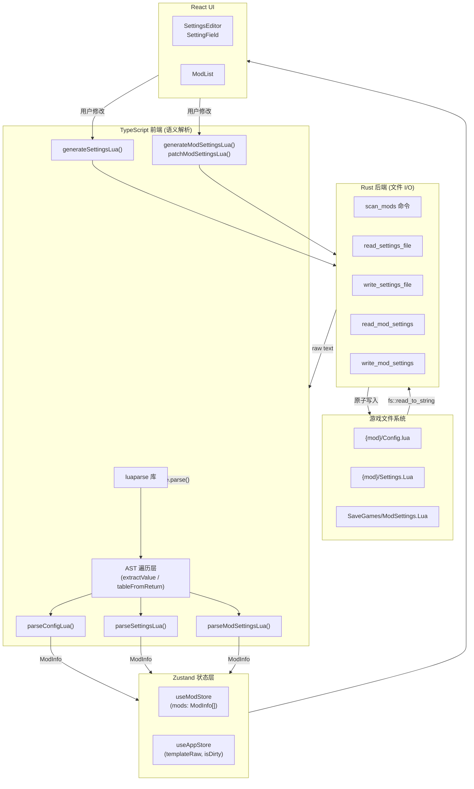
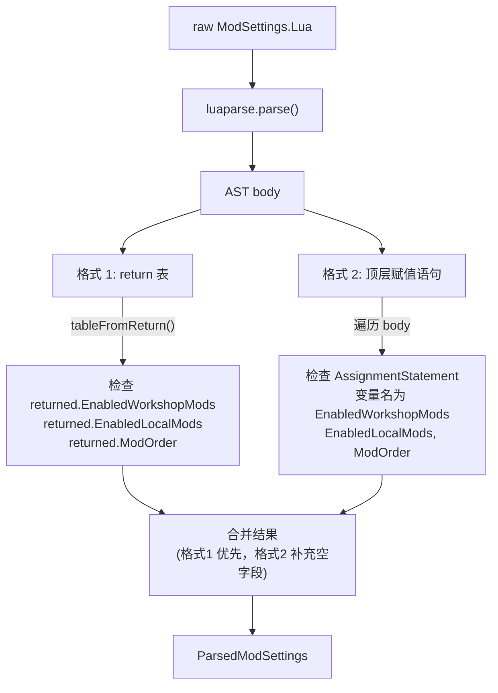

本文档深入剖析 TWModLauncher 中三类 Lua 配置文件的完整解析管线：从 Rust 端原始文件读取，到前端 `luaparse` 库的 AST 解析与值提取，最终汇入 Zustand 状态层供 UI 消费。核心论点是：**所有 Lua 语义解析完全发生在 TypeScript 前端，Rust 后端仅负责纯粹的字节读取与原子写入，形成"Rust 搬运数据、JS 理解语义"的清晰分层**。



Sources: [mod_scanner.rs](src-tauri/src/commands/mod_scanner.rs#L132-L144), [mod_settings.rs](src-tauri/src/commands/mod_settings.rs#L20-L74), [luaParser.ts](src/lib/luaParser.ts#L1-L2)

## 三类 Lua 文件的角色与物理位置

项目中涉及三种 Lua 配置文件，它们在游戏 Mod 系统中各自承担不同的职责。理解其物理路径和语义角色是解析管线的基础。

| 文件 | 物理路径 | 语义角色 | 解析方向 |
|------|----------|----------|----------|
| **Config.lua** | `{workshop 或 Mod}/{数字ID}/Config.lua` | 定义 Mod 元数据：标题、作者、版本、标签、默认设置项定义 | 只读（Rust→TS） |
| **Settings.Lua** | `{workshop 或 Mod}/{数字ID}/Settings.Lua` | 存储单个 Mod 的当前设置值（键值对） | 读写（Rust→TS 解析，TS→Rust 写入） |
| **ModSettings.Lua** | `{游戏根目录}/SaveGames/ModSettings.Lua` | 全局注册表：已启用的 Workshop Mod ID 列表、已启用的本地 Mod 列表、加载顺序映射 | 读写 |

Rust 端的 `scan_mods` 命令遍历两个 Mod 来源目录（Steam Workshop 的 `steamapps/workshop/content/838350/` 和游戏本地 `Mod/` 目录），对每个子目录读取 `Config.lua` 和 `Settings.Lua` 的原始文本，同时从 `SaveGames/` 读取全局 `ModSettings.Lua`。**Rust 端不执行任何 Lua 语法分析**——它只做 `fs::read_to_string` 并将原始字符串通过 JSON 序列化传递给前端。

Sources: [mod_scanner.rs](src-tauri/src/commands/mod_scanner.rs#L132-L144), [mod_scanner.rs](src-tauri/src/commands/mod_scanner.rs#L171-L215), [types.ts](src/lib/types.ts#L8-L17)

## luaparse 类型定义与 AST 节点模型

由于 `luaparse`（npm 包版本 0.3.1）没有官方 TypeScript 类型声明，项目在 `src/types/luaparse.d.ts` 中提供了最小化的模块声明，暴露 `parse(code, options?)` 函数和 `LuaAST` 接口。

Sources: [luaparse.d.ts](src/types/luaparse.d.ts#L1-L10)

在 `luaParser.ts` 内部，定义了一个更细粒度的 `LuaNode` 接口用于 AST 遍历。该接口采用宽泛类型（`value?: unknown`、`fields?: unknown` 等），覆盖 luaparse 产出的所有节点类型：

| luaparse 节点类型 | 核心字段 | 对应的 Lua 语法 |
|-------------------|---------|----------------|
| `StringLiteral` | `value: string \| null`, `raw: string` | `"hello"`、`'world'` |
| `NumericLiteral` | `value: number` | `42`、`3.14` |
| `BooleanLiteral` | `value: boolean` | `true`、`false` |
| `NilLiteral` | —（无特殊字段） | `nil` |
| `Identifier` | `name: string` | 变量名、键名 |
| `TableConstructorExpression` | `fields: LuaNode[]` | `{ ... }` |
| `TableKeyString` | `key: LuaNode`, `value: LuaNode` | `Name = "value"` |
| `TableKey` | `key: LuaNode`, `value: LuaNode` | `[1] = "value"` |
| `TableValue` | `value: LuaNode` | 数组式无键条目 |
| `ReturnStatement` | `arguments: LuaNode[]` | `return { ... }` |
| `AssignmentStatement` | `variables: LuaNode[]`, `init: LuaNode[]` | `X = { ... }` |
| `UnaryExpression` | `operator: string`, `argument: LuaNode` | `-42` |

Sources: [luaParser.ts](src/lib/luaParser.ts#L5-L18)

## AST 值提取核心引擎

`extractValue()` 是解析管线的核心递归函数，它接收任意 AST 节点并返回其 JavaScript 原生值表示。其设计遵循 **Lua 类型到 JS 类型的直映射** 原则。

```mermaid
flowchart TD
    EV["extractValue(node)"]
    EV -->|"StringLiteral"| S["extractString() → string"]
    EV -->|"NumericLiteral"| N["node.value → number"]
    EV -->|"BooleanLiteral"| B["node.value → boolean"]
    EV -->|"NilLiteral"| NL["→ null"]
    EV -->|"UnaryExpression"| UE{"operator == '-'<br/>&& arg 是 number?"}
    UE -->|是| NEG["→ -arg"]
    UE -->|否| PASS["→ arg 原值"]
    EV -->|"TableConstructorExpression"| TBL{"fields 全为<br/>数值键或无键？"}
    TBL -->|是(纯数组)| ARR["→ unknown[]"]
    TBL -->|否(有字符串键)| OBJ["→ Record&lt;string, unknown&gt;"]
    EV -->|"其他"| DEF["→ null"]
```

`extractString()` 有一个值得注意的容错策略：优先使用 `node.value`（luaparse 解码后的字符串），当 `value` 为 `null` 时回退到 `raw` 字段并手动剥离首尾引号。这种双路径设计应对了 luaparse 在某些边缘情况下 `value` 字段为 `null` 的行为。

Table 的数组/对象判别逻辑（`isPureArray`）遍历所有 fields：如果遇到任何 `TableKeyString` 节点或键不是 `NumericLiteral` 的 `TableKey` 节点，则判定为对象表；否则为纯数组。对于混合表（同时包含数组式条目和命名键），数组条目会被赋予递增的字符串数字键（`"1"`, `"2"`, ...）。

Sources: [luaParser.ts](src/lib/luaParser.ts#L47-L120), [luaParser.ts](src/lib/luaParser.ts#L40-L45)

`tableFromReturn()` 是一个便捷封装，它从 AST body 中定位 `ReturnStatement` 节点，取出第一个参数（期望是 `TableConstructorExpression`），然后委托给 `extractValue()`。这覆盖了 Lua 配置文件中最常见的 `return { ... }` 顶层模式。

Sources: [luaParser.ts](src/lib/luaParser.ts#L122-L131)

## Config.lua 解析：parseConfigLua

`parseConfigLua(raw)` 将 Mod 目录下的 `Config.lua` 原始文本解析为类型安全的 `ParsedConfig` 结构。其设计哲学是 **"永不返回 undefined"**——每个字段都提供默认值，即使原始 Lua 文件为空或格式错误，调用方也不会收到意外值。

```mermaid
sequenceDiagram
    participant R as raw: string
    participant P as parseConfigLua()
    participant LP as luaparse.parse()
    participant TR as tableFromReturn()
    participant O as ParsedConfig

    R->>P: raw text
    alt raw 为空
        P-->>O: 返回全部默认值
    else raw 非空
        P->>LP: 解析为 AST
        alt 语法错误
            LP-->>P: 抛出异常
            P-->>O: parseError: true + 默认值
        else 解析成功
            LP-->>P: AST
            P->>TR: 提取 return 表
            TR-->>P: Record&lt;string, unknown&gt;
            P->>P: 逐个字段映射
            P-->>O: ParsedConfig
        end
    end
```

字段映射表展示了从 Lua 表键到 `ParsedConfig` 属性的转换细节：

| ParsedConfig 属性 | Lua 表键（大小写兼容） | 转换逻辑 | 默认值 |
|-------------------|----------------------|---------|--------|
| `title` | `Title` \|\| `title` | `String(...)` | `""` |
| `author` | `Author` \|\| `author` | `String(...)` | `"未知"` |
| `version` | `Version` \|\| `version` | `String(...)` | `""` |
| `description` | `Description` \|\| `description` | `String(...)` | `""` |
| `gameVersion` | `GameVersion` \|\| `gameVersion` | `String(...)` | `""` |
| `tags` | `Tags` \|\| `tags` \|\| `TagList` \|\| `tagList` | `parseTags()` | `[]` |
| `needRestart` | `NeedRestart` \|\| `needRestart` | `Boolean(...)` | `false` |
| `defaultSettings` | `DefaultSettings` \|\| `defaultSettings` | `parseDefaultSettings()` | `[]` |

`parseTags()` 处理两种格式：数组（`["标签1", "标签2"]`）和对象表（`{[1]="标签1", [2]="标签2"}`），统一输出为 `string[]`。

Sources: [luaParser.ts](src/lib/luaParser.ts#L170-L211), [luaParser.ts](src/lib/luaParser.ts#L317-L323)

### DefaultSettings 解析：从 Lua 表到 ModSettingDef 数组

`parseDefaultSettings()` 是 Config.lua 解析中最复杂的子流程——它将 Lua 中定义的可编辑设置项数组转化为 TypeScript 中的 `ModSettingDef[]`。该函数同样兼容数组和对象表两种 Lua 表示形式。

Sources: [luaParser.ts](src/lib/luaParser.ts#L325-L332)

`parseOneSetting()` 对每个设置项条目进行类型判定和字段提取：

| ModSettingDef 属性 | Lua 键（大小写兼容） | 约束 |
|-------------------|---------------------|------|
| `settingType` | `SettingType` \|\| `settingType` | 必须是 `"Toggle"`、`"Slider"`、`"Dropdown"` 之一，否则整条被丢弃 |
| `key` | `Key` \|\| `key` | 必填，为空字符串的条目会被 filter 过滤 |
| `displayName` | `DisplayName` \|\| `displayName` | — |
| `description` | `Description` \|\| `description` | — |
| `groupName` | `GroupName` \|\| `groupName` | 用于 SettingsEditor 的侧边栏分组导航 |
| `defaultValue` | `DefaultValue` \|\| `defaultValue` | 任意 Lua 值 |
| `minValue` | `MinValue` \|\| `minValue` | 仅 Slider 类型使用，`asOptionalNumber()` 转换 |
| `maxValue` | `MaxValue` \|\| `maxValue` | 仅 Slider 类型使用 |
| `stepSize` | `StepSize` \|\| `stepSize` | 仅 Slider 类型使用 |
| `options` | `Options` \|\| `options` | 仅 Dropdown 类型使用，解析为 `Record<number, string>` |

`parseOptions()` 将 `{[0]="选项A", [1]="选项B"}` 形式的 Lua 表转换为 `Record<number, string>`，过滤掉非数字键的条目。

Sources: [luaParser.ts](src/lib/luaParser.ts#L334-L364), [luaParser.ts](src/lib/luaParser.ts#L355-L364), [luaParser.ts](src/lib/luaParser.ts#L366-L373)

## Settings.Lua 解析：parseSettingsLua

`parseSettingsLua(raw)` 是最简洁的解析函数——它直接将 `return { ... }` 表提取为扁平的 `Record<string, unknown>`，没有额外的类型转换或字段验证。这是因为 Settings.Lua 的结构完全由对应 Config.lua 的 DefaultSettings 定义决定，解析层不需要知道具体键名。

空输入和语法错误都返回空对象 `{}`，不会抛出异常，保证扫描流程的鲁棒性。

Sources: [luaParser.ts](src/lib/luaParser.ts#L214-L221)

## ModSettings.Lua 解析：parseModSettingsLua

`parseModSettingsLua(raw)` 解析全局 Mod 注册表，提取三类信息：**已启用的 Workshop Mod 列表**、**已启用的本地 Mod 列表**、**Mod 加载顺序映射**。输出类型为 `ParsedModSettings`。

该函数支持 **两种 Lua 语法格式**，分别对应不同的 ModSettings.Lua 写法：



格式 1（`return { EnabledWorkshopMods = {...}, ModOrder = {...} }`）通过 `tableFromReturn()` 提取后直接读取对应键。格式 2（顶层独立赋值语句 `EnabledWorkshopMods = {...}`）通过遍历 AST body 中的 `AssignmentStatement` 节点来识别。两种格式的结果合并时，格式 1 的 `return` 表具有优先级——只有当格式 1 中某个字段不存在时，才会回退到格式 2 的顶层赋值。

`EnabledWorkshopMods` 和 `EnabledLocalMods` 的值可以是以数字索引的数组表（`{[1]="1_123456", [2]="1_789012"}`），提取后过滤掉空字符串。`ModOrder` 则是字符串键到数字值的映射表。

Sources: [luaParser.ts](src/lib/luaParser.ts#L227-L313), [luaParser.ts](src/lib/luaParser.ts#L160-L164)

## 解析管线的集成点：useModScanner

`useModScanner` 钩子是所有 Lua 解析的协调中心。其 `scan()` 方法在一次调用中完成三个文件的解析串联：

```
Rust scan_mods → ScanResult { entries, mod_settings_raw }
    ├── 对每个 entry:
    │   ├── entry.config_raw → parseConfigLua() → ModInfo 元数据字段
    │   └── entry.settings_raw → parseSettingsLua() → ModInfo.currentSettings
    └── mod_settings_raw → parseModSettingsSafe() → ParsedModSettings
        └── 用于确定每个 Mod 的 enabled 状态和 order 值
```

每个 entry 的解析被 `try/catch` 包裹——单个 Mod 的 Config.lua 解析失败不会阻塞整体扫描，而是将该 Mod 标记为 `parseError: true` 和 `isResidual: true`（残余 Mod），并在扫描结果中累计 `failedCount`。

`isResidual` 标志有两个触发条件：`config.parseError === true`（Lua 语法错误）或 `config_raw` 为空字符串（文件缺失或空文件）。残余 Mod 会被排除在 ModSettings.Lua 的生成之外，避免游戏引擎因无效条目触发安全回退机制。

Sources: [useModScanner.ts](src/hooks/useModScanner.ts#L34-L114), [useModScanner.ts](src/hooks/useModScanner.ts#L225-L232), [useModScanner.ts](src/hooks/useModScanner.ts#L124-L155)

## 反向生成：从 JS 状态到 Lua 文本

解析是单向的（Lua→JS），但 Mod 管理需要反向写入。项目中提供了三种生成函数，均通过 `luaparse.parse()` 验证输出语法有效性。

### generateSettingsLua：单 Mod 设置值生成

`generateSettingsLua(values)` 将 `Record<string, unknown>` 序列化为 `return { key1 = value1, key2 = value2, ... }` 格式。`luaValue()` 辅助函数处理 JS 到 Lua 的类型映射：

| JS 类型 | Lua 表示 | 示例 |
|---------|---------|------|
| `boolean` | `true` / `false` | `true` |
| `number` | 数字字面量 | `42` |
| `string` | 双引号字符串 | `"hello"` |
| 其他（含 `null`、`undefined`） | `nil` | `nil` |

Sources: [generateModSettings.ts](src/utils/generateModSettings.ts#L234-L250)

### generateModSettingsLua 与 patchModSettingsLua：全局注册表生成

两种策略用于生成 ModSettings.Lua：

- **`generateModSettingsLua(data)`**：从零构建完整的 `return { ... }` 结构。仅在对应区段有内容时才输出该区段；空区段被省略以避免触发游戏的安全回退机制。

- **`patchModSettingsLua(raw, data)`**：在原有 ModSettings.Lua 模板上做**格式保留式补丁**——仅替换 `EnabledWorkshopMods`、`EnabledLocalMods`、`ModOrder` 三个区段的大括号内部内容，保持缩进、换行符风格和文件其余部分不变。这是默认策略，详细实现见 [ModSettings.Lua 的格式保留式补丁](10-modsettings-lua-de-ge-shi-bao-liu-shi-bu-ding-patchmodsettingslua)。

Sources: [generateModSettings.ts](src/utils/generateModSettings.ts#L183-L230), [generateModSettings.ts](src/utils/generateModSettings.ts#L38-L63)

## 从解析结果到 UI 渲染

解析管线产出的 `ModInfo.defaultSettings`（`ModSettingDef[]`）和 `ModInfo.currentSettings`（`Record<string, unknown>`）直接驱动 SettingsEditor 组件。

`SettingsEditor` 从 `defaultSettings` 中提取去重后的 `groupName` 列表构建左侧分组导航。每个 `ModSettingDef.settingType` 决定渲染哪种表单控件：

| settingType | 渲染组件 | 值类型 | 额外参数 |
|-------------|---------|--------|---------|
| `Toggle` | 开关切换（checkbox） | `boolean` | — |
| `Slider` | 范围滑块（range input） | `number` | `minValue`, `maxValue`, `stepSize` |
| `Dropdown` | 下拉选择（select） | `number`（选项键） | `options: Record<number, string>` |

`SettingField` 组件从 `currentSettings` 中读取当前值，若不存在则回退到 `defaultValue`。每次修改通过 `onSettingsSaved` 回调即时同步到 Zustand 的 `useModStore.updateModSettings()`，实现跨 Mod 的即时脏状态跟踪。

Sources: [SettingsEditor.tsx](src/components/SettingsEditor/SettingsEditor.tsx#L11-L117), [SettingField.tsx](src/components/SettingsEditor/SettingField.tsx#L1-L138)

## 容错策略全景

整个解析管线设计为**永不因单个文件错误而崩溃**。下表汇总各层的容错机制：

| 层级 | 故障场景 | 处理策略 |
|------|---------|---------|
| Rust 文件读取 | 文件不存在 | `unwrap_or_default()` → 空字符串 |
| Rust 文件读取 | 权限不足 | 记录 warning，返回空结果 |
| Rust 扫描 | 子目录读取失败 | 跳过该条目，继续扫描 |
| luaparse 解析 | Lua 语法错误 | `catch` → 默认值 / `parseError: true` |
| parseConfigLua | AST 中缺少字段 | 每个字段独立 `??` 回退到默认值 |
| parseOneSetting | settingType 不合法 | 返回 `null`，被 `filter` 过滤 |
| parseModSettingsLua | 未知格式 | 返回空 `ParsedModSettings` |
| useModScanner | 单个 entry 解析异常 | 标记为残余 Mod，继续处理其余 |
| 反向生成 | 生成的 Lua 语法无效 | `log.error` 警告，但不阻塞写入 |

Sources: [mod_scanner.rs](src-tauri/src/commands/mod_scanner.rs#L132-L141), [luaParser.ts](src/lib/luaParser.ts#L186-L210), [luaParser.ts](src/lib/luaParser.ts#L334-L339), [useModScanner.ts](src/hooks/useModScanner.ts#L84-L114), [generateModSettings.ts](src/utils/generateModSettings.ts#L54-L60)

## 阅读下一站

理解了解析管线后，建议继续阅读 [ModSettings.Lua 的格式保留式补丁（patchModSettingsLua）](10-modsettings-lua-de-ge-shi-bao-liu-shi-bu-ding-patchmodsettingslua)，深入了解 `replaceListSection()` 如何通过正则匹配和括号深度追踪实现格式无损的局部替换。若对解析结果如何进入 UI 感兴趣，可跳转至 [SettingsEditor：分组导航与 Toggle/Slider/Dropdown 表单控件](16-settingseditor-fen-zu-dao-hang-yu-toggle-slider-dropdown-biao-dan-kong-jian)。